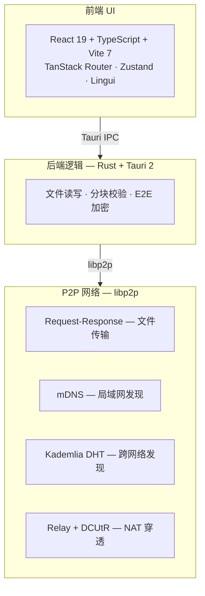

<div align="center">


# SwarmDrop

**去中心化、跨网络、端到端加密的文件传输工具**

*Drop files anywhere. No cloud. No limits.*

[](https://github.com/yexiyue/SwarmDrop/releases)
[](LICENSE)
[](https://tauri.app)
[](https://libp2p.io)

[下载安装](#下载安装) · [快速开始](#快速开始) · [功能特性](#功能特性) · [参与贡献](#参与贡献)

</div>

---

## 为什么选择 SwarmDrop？

SwarmDrop 是一款无需账号、无需服务器的**点对点文件传输工具**，定位为「**跨网络版 LocalSend**」。

<table>
<tr>
<td width="25%" align="center">
<h3>🌐</h3>
<b>跨网络传输</b><br>
<sub>不局限于局域网<br>通过互联网连接任意设备</sub>
</td>
<td width="25%" align="center">
<h3>🔒</h3>
<b>端到端加密</b><br>
<sub>XChaCha20-Poly1305 加密<br>中继节点无法解密内容</sub>
</td>
<td width="25%" align="center">
<h3>🚀</h3>
<b>零配置</b><br>
<sub>无需注册账号<br>无需中央服务器</sub>
</td>
<td width="25%" align="center">
<h3>📱</h3>
<b>全平台</b><br>
<sub>Windows · macOS<br>Linux · Android</sub>
</td>
</tr>
</table>

### 与同类工具对比

| | LocalSend | Send Anywhere | **SwarmDrop** |
|---|---|---|---|
| **网络范围** | 仅局域网 | 跨网络 (中转服务器) | **跨网络 (P2P)** |
| **服务器依赖** | 无 | 有中转服务器 | **无** (可选自建引导节点) |
| **隐私保护** | 本地传输 | 可能经服务器 | **端到端加密** |
| **开源** | 是 | 否 | **是** |
| **自托管** | 不需要 | 不支持 | **支持** |

## 下载安装

前往 [Releases](https://github.com/yexiyue/SwarmDrop/releases/latest) 下载最新版本：

| 平台 | 格式 | 架构 |
|------|------|------|
| **Windows** | `.msi` · `.exe` | x64 |
| **macOS** | `.dmg` | Apple Silicon · Intel |
| **Linux** | `.deb` · `.rpm` · `.AppImage` | x64 |
| **Android** | `.apk` | arm64 |

## 快速开始

```
 1. 启动应用 → 设置安全密码 → 启动 P2P 节点
 2. 添加设备 → 通过 6 位配对码或局域网发现配对
 3. 选择设备 → 拖拽文件发送
```

### 配对方式

- **配对码** — 一方生成 6 位数字码，另一方输入，适用于跨网络场景
- **局域网直连** — 自动发现同网络设备，点击即可配对

### 传输方式

SwarmDrop 会自动选择最优传输路径：

| 连接类型 | 延迟 | 场景 |
|----------|------|------|
| 局域网直连 | ~2ms | 同一 Wi-Fi / 有线网络 |
| NAT 打洞 | 10–100ms | 不同网络，DCUtR 穿透成功 |
| 中继转发 | 100–500ms | 打洞失败时自动兜底 |

## 功能特性

| 功能 | 状态 |
|------|------|
| P2P 网络 (mDNS + DHT + Relay + DCUtR) | ✅ |
| 6 位数字配对码 + 局域网直连 | ✅ |
| 端到端加密传输 | ✅ |
| 文件 / 文件夹传输 + 实时进度 | ✅ |
| 生物识别解锁 (FaceID / TouchID / Windows Hello) | ✅ |
| 自动更新 (桌面端 + Android) | ✅ |
| 多语言支持 (zh · en · zh-TW) | ✅ |
| Android 支持 | ✅ |
| 自定义引导节点 | ✅ |
| 断点续传 | 📋 计划中 |
| MCP 集成 (AI 助手发文件) | 📋 计划中 |

## 安全

- **设备身份** — Ed25519 密钥对，私钥存储于 [Stronghold](https://github.com/nicbarker/stronghold.rs) 加密保险库
- **传输加密** — 每次传输生成 256-bit 对称密钥，XChaCha20-Poly1305 加密
- **生物识别** — 支持 FaceID / TouchID / Windows Hello 解锁
- **零信任** — 引导节点和中继节点均无法解密传输内容
- **无遥测** — 不收集任何用户数据

## 技术架构



<details>
<summary><b>技术栈详情</b></summary>

| 层级 | 技术 |
|------|------|
| 前端 | React 19 · TypeScript 5.8 · Vite 7 · Tailwind CSS 4 |
| UI 组件 | shadcn/ui (new-york) · Lucide Icons |
| 状态管理 | Zustand 5 (4 个 Store) |
| 路由 | TanStack Router (文件系统路由) |
| 国际化 | Lingui 5 (zh · en · zh-TW) |
| 后端 | Rust 2021 · Tauri 2 |
| P2P | libp2p 0.56 via `swarm-p2p-core` |
| 加密 | Stronghold · Ed25519 · XChaCha20-Poly1305 |

</details>

<details>
<summary><b>项目结构</b></summary>

```
swarmdrop/
├── src/                    # 前端源码
│   ├── commands/           #   Tauri IPC 命令封装
│   ├── components/         #   React 组件
│   ├── routes/             #   TanStack Router 文件路由
│   ├── stores/             #   Zustand 状态管理
│   └── locales/            #   国际化翻译文件
├── src-tauri/              # Rust 后端
│   └── src/
│       ├── commands/       #   Tauri 命令处理器
│       ├── network/        #   P2P 网络管理
│       ├── pairing/        #   设备配对系统
│       ├── transfer/       #   文件传输引擎
│       └── device/         #   设备信息管理
├── libs/core/              # P2P 核心库 (Git 子模块)
└── docs/                   # Astro + Starlight 文档站
```

</details>

## 从源码构建

### 环境要求

- [Node.js](https://nodejs.org/) 18+ 和 [pnpm](https://pnpm.io/) 9+
- [Rust](https://rust-lang.org/) 1.80+
- [Android Studio](https://developer.android.com/studio) (仅 Android 构建需要)

### 构建步骤

```bash
# 克隆仓库 (含子模块)
git clone --recurse-submodules https://github.com/yexiyue/SwarmDrop.git
cd SwarmDrop

# 安装依赖
pnpm install

# 桌面端开发
pnpm tauri dev

# 桌面端构建
pnpm tauri build

# Android 开发 / 构建
pnpm android:dev
pnpm android:build
```

## 路线图

- [x] **Phase 1** — 网络层 (libp2p · mDNS · DHT · Relay · DCUtR)
- [x] **Phase 2** — 设备配对 (配对码 · 局域网直连 · 生物识别)
- [x] **Phase 3** — 文件传输 (端到端加密 · 进度显示 · 传输历史)
- [ ] **Phase 4** — 断点续传
- [ ] **Phase 5** — MCP 集成 (AI 助手发文件)

## 参与贡献

欢迎提交 Issue 和 Pull Request！

1. Fork 本仓库
2. 创建特性分支 `git checkout -b feature/amazing`
3. 提交更改并推送
4. 创建 Pull Request

## 许可证

[MIT](LICENSE) &copy; 2025 SwarmDrop Contributors

---

<div align="center">
<sub>Built with <a href="https://tauri.app">Tauri</a> and <a href="https://libp2p.io">libp2p</a></sub>
</div>
