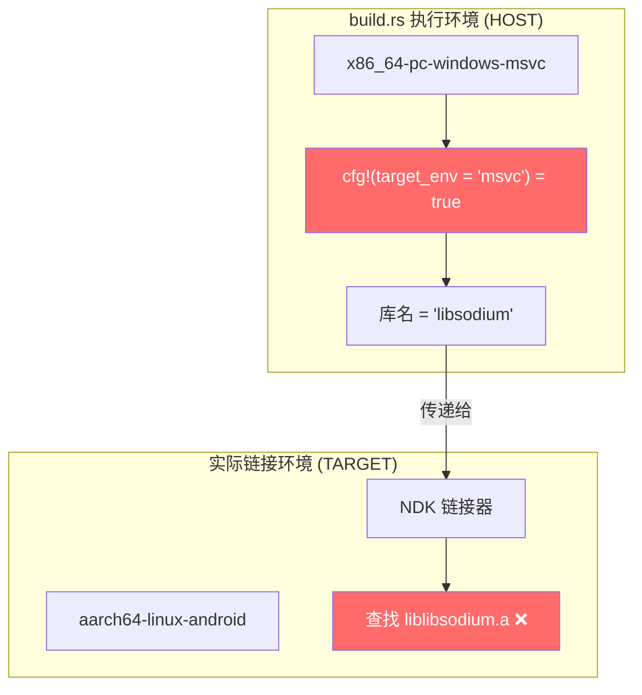

# Tauri v2 Android 构建踩坑全记录：从 libsodium 交叉编译到 Gradle 配置

在 Windows 上为 SwarmDrop 构建 Android 版本时，我们遭遇了一连串环环相扣的构建问题。从 libsodium 原生库无法在 Windows 上交叉编译，到 Rust build.rs 中的 HOST/TARGET 混淆 bug，再到 Kotlin 版本不兼容和 Maven 仓库网络问题——每解决一个问题都会暴露出下一个。本文完整记录了这些问题的排查思路和解决方案。

## 背景

SwarmDrop 使用 `tauri-plugin-stronghold` 来安全存储 libp2p 密钥对。Stronghold 的依赖链最终会引入 `libsodium-sys-stable`——一个 libsodium 加密库的 Rust FFI 绑定：


当执行 `tauri android dev` 时，Cargo 需要为 `aarch64-linux-android` 目标交叉编译整个依赖树，包括 libsodium 这个 C 语言原生库。问题就从这里开始。

## Bug 1：libsodium 的 `./configure` 无法在 Windows 上执行

### 现象

运行 `pnpm tauri android dev` 时，构建在编译 `libsodium-sys-stable v1.23.2` 时失败：

```
error: failed to run custom build command for `libsodium-sys-stable v1.23.2`
...
running: "sh" "-c" "cd /path/to/libsodium && ./configure ..."
%1 不是有效的 Win32 应用程序 (os error 193)
```

### 分析

`libsodium-sys-stable` 的 `build.rs` 在没有找到预编译库时，会尝试从源码编译 libsodium。编译过程依赖 Unix 标准的 autotools 工具链（`./configure` + `make`），这些是 Unix shell 脚本，无法直接在 Windows 上运行。

虽然 Windows 上有 Git Bash 和 MSYS2 可以运行部分 Unix 工具，但 `./configure` 脚本在处理 Windows 路径时也会出问题——特别是路径中包含空格（如 `C:/Program Files/`）时，会被错误地拆分为多个参数。

### 解决方案：Docker 交叉编译

最终方案是使用 Docker 容器（Ubuntu 22.04）+ Android NDK 来编译 libsodium。

**第一步：创建持久化容器**

```bash
docker create -it --name sodium-builder \
  -v D:/workspace/swarmdrop/src-tauri/vendor/libsodium-1.0.21:/src \
  ubuntu:22.04 bash
docker start sodium-builder
```

**第二步：在容器内编写构建脚本**

这里有个关键点：不能将 Windows 宿主机上的脚本挂载进容器。因为 Windows 的 CRLF 换行符（`\r\n`）会导致 Linux 中执行脚本时报 `\r': command not found` 错误。正确做法是在容器内部创建脚本：

```bash
MSYS_NO_PATHCONV=1 docker exec sodium-builder bash -c 'cat > /tmp/build.sh << '\''SCRIPT'\''
#!/bin/bash
set -e

# 安装依赖
apt-get update -qq
apt-get install -y -qq wget unzip make gcc > /dev/null 2>&1

# 下载 Android NDK
cd /tmp
wget -q https://dl.google.com/android/repository/android-ndk-r29-linux.zip
unzip -q android-ndk-r29-linux.zip

# 配置 NDK 工具链
export ANDROID_NDK_HOME=/tmp/android-ndk-r29
export NDK_BIN=$ANDROID_NDK_HOME/toolchains/llvm/prebuilt/linux-x86_64/bin
export CC=$NDK_BIN/aarch64-linux-android24-clang
export AR=$NDK_BIN/llvm-ar
export RANLIB=$NDK_BIN/llvm-ranlib
export STRIP=$NDK_BIN/llvm-strip
export PATH=$NDK_BIN:$PATH
export CFLAGS="-Os -march=armv8-a+crypto"
export LDFLAGS="-Wl,-z,max-page-size=16384"

# 编译 libsodium
cd /src
make clean > /dev/null 2>&1 || true
./configure \
  --disable-soname-versions \
  --disable-pie \
  --host=aarch64-linux-android \
  --prefix=/src/libsodium-android-armv8-a \
  --with-sysroot=$ANDROID_NDK_HOME/toolchains/llvm/prebuilt/linux-x86_64/sysroot \
  > /dev/null 2>&1

make -j$(nproc) install 2>&1
echo "=== Done ==="
ls -la /src/libsodium-android-armv8-a/lib/
SCRIPT
chmod +x /tmp/build.sh'
```

注意 `MSYS_NO_PATHCONV=1` 前缀——这是在 Git Bash 中运行 Docker 命令时的必需设置，否则 Git Bash 会把 `/tmp/build.sh` 这样的路径自动转换为 `C:/Users/.../AppData/Local/Temp/build.sh`。

**第三步：执行构建**

```bash
MSYS_NO_PATHCONV=1 docker exec sodium-builder bash /tmp/build.sh
```

构建完成后，`libsodium-android-armv8-a/lib/` 目录下会生成：
- `libsodium.a`（590KB，静态库）
- `libsodium.so`（383KB，动态库）

### Docker 交叉编译中的额外坑

在使用 Docker 的过程中，还踩到了几个 Windows + Git Bash + Docker 的组合坑：

| 问题 | 原因 | 解决 |
|------|------|------|
| `$PATH` 被展开 | Git Bash 在命令传给 Docker 前展开了 `$PATH` 变量 | 用单引号或 heredoc 避免变量展开 |
| CRLF 换行符 | Windows 编辑器保存的脚本带 `\r` | 在容器内部创建脚本 |
| 路径被转换 | Git Bash 把 `/tmp` 转为 Windows 路径 | 添加 `MSYS_NO_PATHCONV=1` |

## Bug 2：`SODIUM_LIB_DIR` 设置与 `cfg!(target_env)` 的 HOST/TARGET 混淆

### 现象

设置 `SODIUM_LIB_DIR` 指向编译好的 libsodium 后，构建报错：

```
error: could not find native static library `libsodium`, perhaps an -L flag is missing?
```

明明 `libsodium.a` 文件就在指定目录下，为什么找不到？

### 分析

深入 `libsodium-sys-stable` 的 [build.rs](https://github.com/nickel-org/libsodium-sys-stable/blob/main/build.rs) 源码，找到了问题所在：

```rust
fn find_libsodium_env() {
    let lib_dir = env::var("SODIUM_LIB_DIR").unwrap();
    println!("cargo:rustc-link-search=native={lib_dir}");

    let mode = if env::var("SODIUM_SHARED").is_ok() {
        "dylib"
    } else {
        "static"
    };

    // 问题在这里！
    let name = if cfg!(target_env = "msvc") {
        "libsodium"  // Windows MSVC: 直接使用 libsodium.lib
    } else {
        "sodium"     // Unix: 链接器会自动加 lib 前缀 → libsodium.a
    };

    println!("cargo:rustc-link-lib={mode}={name}");
}
```

关键问题：**`cfg!(target_env = "msvc")` 检查的是编译 build.rs 本身的环境（即 HOST），而不是最终的编译目标（TARGET）**。

在 Windows 上交叉编译 Android 时：
- **HOST** = `x86_64-pc-windows-msvc` → `cfg!(target_env = "msvc")` = `true`
- **TARGET** = `aarch64-linux-android` → 实际使用的是 Android NDK 的链接器



因为 `cfg!` 判断为 MSVC，库名被设置为 `libsodium`。但 Android NDK 的链接器遵循 Unix 惯例，会在库名前自动添加 `lib` 前缀，于是去查找 `liblibsodium.a`——文件当然不存在。

### 解决方案

最简单的 workaround：创建一个符号链接（或复制）：

```bash
cd src-tauri/vendor/libsodium-1.0.21/libsodium-android-armv8-a/lib/
cp libsodium.a liblibsodium.a
```

这样 Android 链接器查找 `liblibsodium.a` 时就能找到了。

> 这其实是 `libsodium-sys-stable` 的一个 bug——它应该使用 `env::var("CARGO_CFG_TARGET_ENV")` 来检查 TARGET 而非 HOST。

### 关于 `SODIUM_LIB_DIR` 的作用域

另一个需要注意的点是：`SODIUM_LIB_DIR` 只应在 Android 构建时设置，不能影响桌面端构建。

用户最初建议在 `.cargo/config.toml` 中设置这个环境变量，并指定 target 过滤：

```toml
# ❌ 这样不行！Cargo 的 [env] 不支持 per-target 过滤
[env]
SODIUM_LIB_DIR = "..."  # 会影响所有平台的构建
```

Cargo 的 `[env]` 部分是全局生效的，没有 `[target.aarch64-linux-android.env]` 这样的语法。最终方案是在 `package.json` 中使用 `cross-env`：

```json
{
  "scripts": {
    "dev": "vite",
    "android:dev": "cross-env SODIUM_LIB_DIR=D:\\workspace\\swarmdrop\\src-tauri\\vendor\\libsodium-1.0.21\\libsodium-android-armv8-a\\lib tauri android dev",
    "android:build": "cross-env SODIUM_LIB_DIR=D:\\workspace\\swarmdrop\\src-tauri\\vendor\\libsodium-1.0.21\\libsodium-android-armv8-a\\lib tauri android build"
  }
}
```

这样 `pnpm dev`（桌面开发）不会受影响，只有 `pnpm android:dev` 才会设置 `SODIUM_LIB_DIR`。

## Bug 3：Kotlin 版本不兼容

### 现象

Rust 编译通过后，Gradle 构建阶段报错：

```
e: /app/build/generated/source/kapt/arm64Debug/...
class 'kotlin.Unit' was compiled with an incompatible version of Kotlin.
The binary version of its metadata is 2.1.0,
expected version is 1.9.0.

The class is loaded from .../kotlin-stdlib-2.1.0.jar
```

### 分析

`tauri-plugin-biometry@0.2.6`（用于生物识别解锁）的 Android 端 Kotlin 代码依赖 Kotlin 2.1.0 的标准库。但 Tauri 自动生成的 Android 项目模板使用的是 Kotlin 1.9.25 编译器。


Kotlin 编译器 1.9.x 只能读取 metadata version ≤ 2.0.0 的类，而 kotlin-stdlib 2.1.0 的 metadata 版本是 2.1.0，超出了兼容范围。

### 解决方案

升级 `src-tauri/gen/android/build.gradle.kts` 中的 Kotlin 版本：

```kotlin
buildscript {
    dependencies {
        classpath("com.android.tools.build:gradle:8.11.0")
        // 从 1.9.25 升级到 2.1.0
        classpath("org.jetbrains.kotlin:kotlin-gradle-plugin:2.1.0")
    }
}
```

> **注意**：`src-tauri/gen/android/` 下的文件是 Tauri 自动生成的，但生成后可以手动修改。修改不会被覆盖（除非重新执行 `tauri android init`）。

## Bug 4：Maven 仓库 TLS 握手失败

### 现象

Kotlin 版本升级后，Gradle 需要下载新版本的 Kotlin 工具包，但下载时报错：

```
> Could not resolve org.jetbrains.kotlin:kotlin-build-tools-impl:2.1.0.
  > Could not get resource
    'https://repo.maven.apache.org/maven2/org/jetbrains/kotlin/...'
    > Could not GET '...'
      > Remote host terminated the handshake
```

### 分析

这是中国网络环境下的常见问题。`repo.maven.apache.org` 在国内访问不稳定，TLS 握手经常超时或被中断。

Gradle 的仓库解析顺序是按声明顺序的——它会依次尝试每个仓库，直到找到所需的依赖。如果第一个仓库就访问失败（不是 404，而是网络错误），Gradle 会直接报错而不是继续尝试下一个仓库。

### 解决方案

在所有 `repositories` 块中，将阿里云 Maven 镜像添加到 `google()` 和 `mavenCentral()` **之前**：

**`build.gradle.kts`（两处 repositories 块）：**

```kotlin
repositories {
    // 阿里云镜像放在前面，优先使用
    maven { url = uri("https://maven.aliyun.com/repository/google") }
    maven { url = uri("https://maven.aliyun.com/repository/central") }
    // 官方仓库作为 fallback
    google()
    mavenCentral()
}
```

**`buildSrc/build.gradle.kts`（容易遗漏！）：**

```kotlin
repositories {
    maven { url = uri("https://maven.aliyun.com/repository/google") }
    maven { url = uri("https://maven.aliyun.com/repository/central") }
    google()
    mavenCentral()
}
```

很多人只改了根目录的 `build.gradle.kts`，忘了 `buildSrc` 也有自己的 `repositories` 块。`buildSrc` 是 Gradle 的构建逻辑插件目录，它的依赖解析是独立的。

## Bug 总结


## 修改的文件清单

| 文件 | 修改内容 |
|------|----------|
| `package.json` | 添加 `android:dev` / `android:build` 脚本，使用 `cross-env` 设置 `SODIUM_LIB_DIR` |
| `src-tauri/gen/android/build.gradle.kts` | Kotlin 升级到 2.1.0 + 添加阿里云 Maven 镜像 |
| `src-tauri/gen/android/buildSrc/build.gradle.kts` | 添加阿里云 Maven 镜像 |
| `src-tauri/vendor/libsodium-1.0.21/libsodium-android-armv8-a/lib/` | Docker 编译产物：`libsodium.a`、`libsodium.so`、`liblibsodium.a` |
| `src-tauri/vendor/build-libsodium-android.sh` | Docker 构建脚本（备用参考） |

## 经验总结

1. **交叉编译 C 原生库时，优先使用 Docker** —— 不要试图在 Windows 上直接运行 Unix autotools，路径问题和工具兼容性会浪费大量时间。
2. **Windows + Git Bash + Docker 是个坑的组合** —— 注意 `MSYS_NO_PATHCONV`、变量展开时机、CRLF 换行符这三个常见问题。
3. **`cfg!()` 宏检查的是 HOST 而非 TARGET** —— 在 build.rs 中判断目标平台时，应该使用 `env::var("CARGO_CFG_TARGET_*")` 系列环境变量。
4. **Tauri 生成的 Android 项目模板可能过时** —— 插件更新后可能需要手动升级 Kotlin、Gradle 等版本。
5. **中国网络环境下，所有 Gradle 仓库都要配镜像** —— 不要忘记 `buildSrc` 目录下的 `build.gradle.kts`。
