# SwarmDrop 身份认证与生物识别解锁

本文介绍 SwarmDrop 如何实现安全的身份认证系统，包括主密码设置、生物识别解锁（指纹/面容）、以及跨平台的系统密钥链集成。这套系统确保用户的设备身份（libp2p 密钥对）得到妥善保护，同时提供便捷的解锁体验。

## 为什么需要认证系统？

在上一篇文章中，我们使用 Stronghold 加密存储密钥对，但使用的是硬编码密码。这存在安全隐患——任何能访问应用数据目录的人都可能提取密钥对。

**改进目标：**
- 用户自定义主密码保护 Stronghold
- 支持生物识别快捷解锁
- 首次启动引导设置流程
- 应用锁定与解锁状态管理

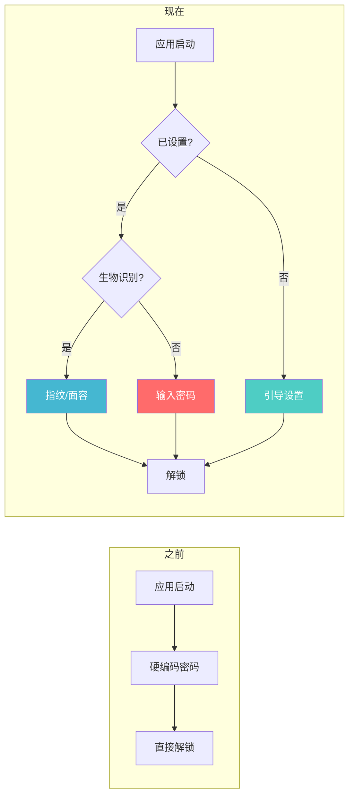

## 整体架构

认证系统采用分层设计，将 UI 流程、状态管理、安全存储分离：

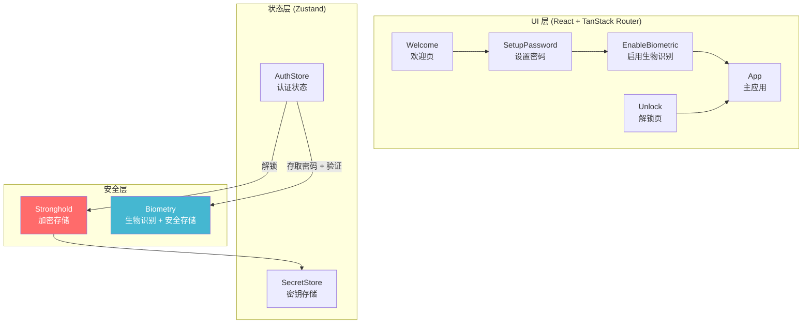

## 技术选型

| 组件 | 技术 | 选择理由 |
|------|------|----------|
| 路由 | TanStack Router | 文件路由、类型安全、路由守卫 |
| 状态管理 | Zustand + persist | 轻量、支持部分持久化 |
| 加密存储 | Stronghold | 用户密码保护的安全存储 |
| 生物识别 + 密钥存储 | tauri-plugin-biometry | 指纹/面容验证 + 安全数据存储 |
| UI | shadcn/ui + Aurora | 现代化设计语言 |
| 国际化 | Lingui | 编译时提取、类型安全 |

## 用户流程

### 首次启动流程

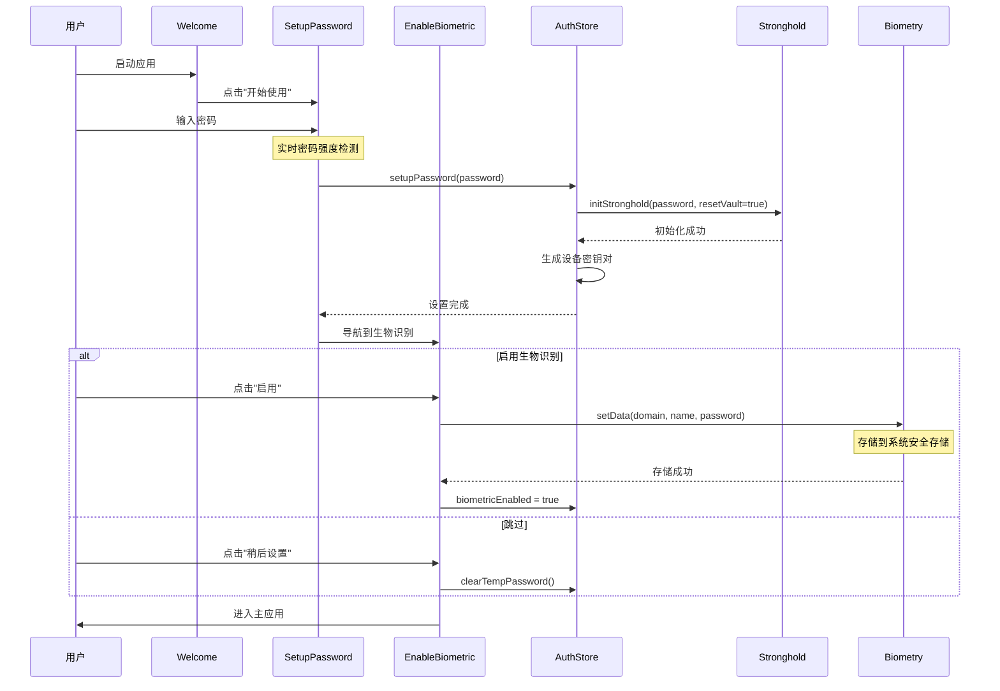

### 后续启动流程（密码解锁）

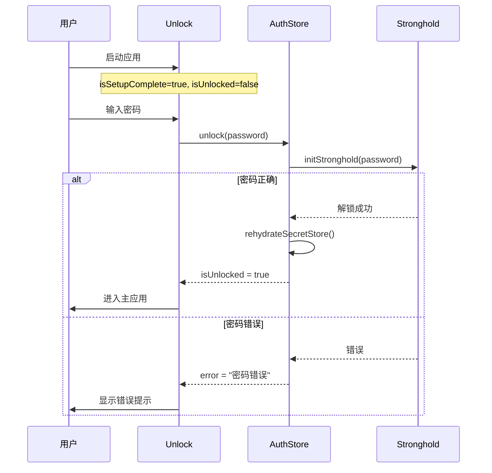

### 后续启动流程（生物识别解锁）

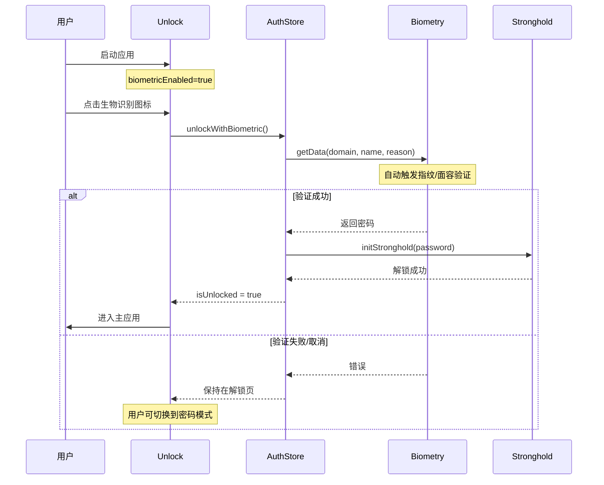

## 实现详解

### 第一步：路由结构设计

使用 TanStack Router 的文件路由，将认证页面和主应用页面分离：

```
src/routes/
├── __root.tsx          # 根布局（初始化检查）
├── _auth.tsx           # 认证布局（无侧边栏，Aurora 背景）
├── _auth/
│   ├── welcome.lazy.tsx        # 欢迎页
│   ├── setup-password.lazy.tsx # 设置密码
│   ├── enable-biometric.lazy.tsx # 启用生物识别
│   └── unlock.lazy.tsx         # 解锁页
├── _app.tsx            # 主应用布局（带侧边栏）
├── _app/
│   └── devices.lazy.tsx        # 设备列表
└── index.tsx           # 入口路由（重定向逻辑）
```

**布局嵌套关系：**

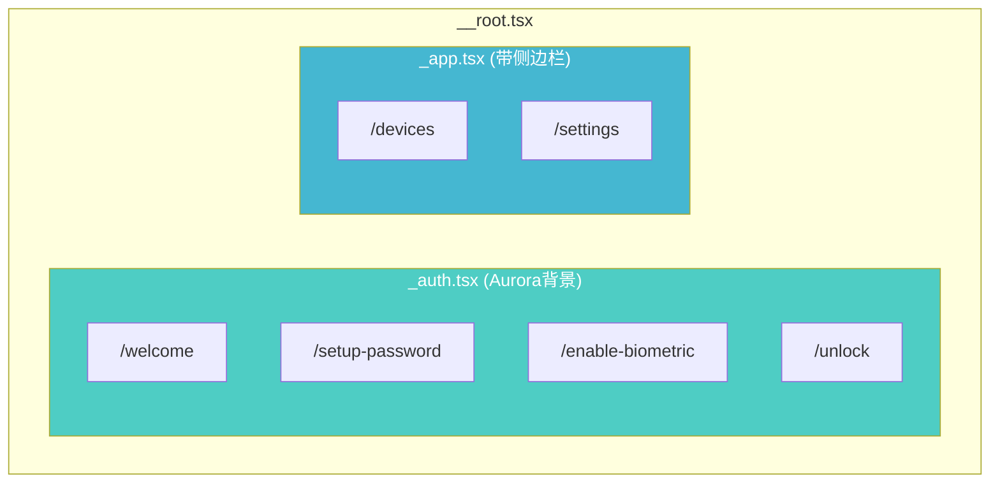

### 第二步：认证布局与路由守卫

`_auth.tsx` 定义认证相关页面的布局和访问控制：

```typescript
// src/routes/_auth.tsx
import { createFileRoute, Outlet, redirect } from "@tanstack/react-router";
import { useAuthStore } from "@/stores/auth-store";
import { AuroraBackground } from "@/components/ui/aurora-background";

export const Route = createFileRoute("/_auth")({
  beforeLoad: ({ location }) => {
    const { isSetupComplete, isUnlocked, _tempPassword } =
      useAuthStore.getState();

    // 如果正在设置流程中（有临时密码），允许访问 enable-biometric
    const isInSetupFlow = _tempPassword !== null;
    if (isInSetupFlow && location.pathname === "/enable-biometric") {
      return;
    }

    // 如果已设置且已解锁，重定向到首页
    if (isSetupComplete && isUnlocked) {
      throw redirect({ to: "/devices" });
    }
  },
  component: AuthLayout,
});

function AuthLayout() {
  return (
    <AuroraBackground className="min-h-svh p-4">
      <Outlet />
    </AuroraBackground>
  );
}
```

**路由守卫状态机：**

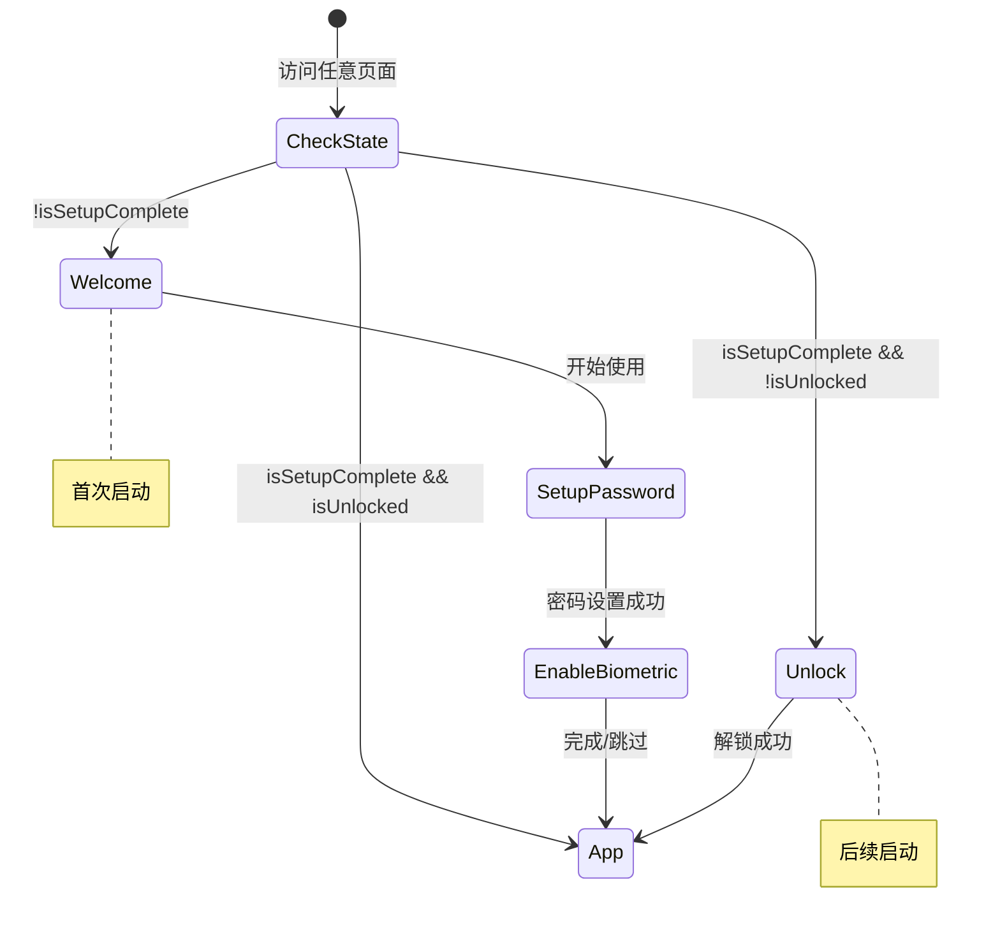

### 第三步：认证状态管理

`AuthStore` 是认证系统的核心，管理所有认证相关状态：

```typescript
// src/stores/auth-store.ts
import { create } from "zustand";
import { persist } from "zustand/middleware";
import { rehydrateSecretStore } from "@/stores/secret-store";
import {
  checkStatus,
  setData,
  getData,
  removeData,
  BiometryType,
} from "@choochmeque/tauri-plugin-biometry-api";

/** Biometry 数据存储配置 */
const BIOMETRY_DOMAIN = "com.gy.swarmdrop";
const STRONGHOLD_PASSWORD_KEY = "stronghold_password";

interface AuthState {
  /** 是否已完成初始设置 */
  isSetupComplete: boolean;
  /** 是否启用生物识别 */
  biometricEnabled: boolean;
  /** 生物识别是否可用 */
  biometricAvailable: boolean;
  /** 生物识别类型 */
  biometricType: BiometryType;
  /** 是否已解锁（运行时状态，不持久化） */
  isUnlocked: boolean;
  /** 临时密码（仅在设置流程中使用） */
  _tempPassword: string | null;
  // ... actions
}

export const useAuthStore = create<AuthState>()(
  persist(
    (set, get) => ({
      // 初始状态
      isSetupComplete: false,
      biometricEnabled: false,
      biometricAvailable: false,
      biometricType: BiometryType.None,
      isUnlocked: false,
      _tempPassword: null,

      // 设置密码
      async setupPassword(password: string) {
        set({ isLoading: true, loadingMessage: "正在初始化加密存储..." });

        const { initStronghold } = await import("@/lib/stronghold");
        // 首次设置时重置 vault
        await initStronghold(password, { resetVault: true });

        set({ loadingMessage: "正在生成设备密钥..." });
        await rehydrateSecretStore();

        set({
          isSetupComplete: true,
          isUnlocked: true,
          _tempPassword: password, // 临时保存供启用生物识别使用
        });
      },

      // 启用生物识别
      async enableBiometric(password?: string) {
        const pwd = password || get()._tempPassword;
        if (!pwd) throw new Error("无法获取密码");

        // 使用 biometry 插件将密码存储到系统安全存储
        await setData({
          domain: BIOMETRY_DOMAIN,
          name: STRONGHOLD_PASSWORD_KEY,
          data: pwd,
        });
        set({ biometricEnabled: true, _tempPassword: null });
      },

      // 密码解锁
      async unlock(password: string) {
        const { initStronghold } = await import("@/lib/stronghold");
        await initStronghold(password);
        await rehydrateSecretStore();
        set({ isUnlocked: true });
        return true;
      },

      // 生物识别解锁
      async unlockWithBiometric() {
        // 使用 biometry 插件获取密码（会自动触发生物识别验证）
        const response = await getData({
          domain: BIOMETRY_DOMAIN,
          name: STRONGHOLD_PASSWORD_KEY,
          reason: "Unlock SwarmDrop",
          cancelTitle: "Cancel",
        });

        const password = response.data;
        if (!password) throw new Error("未找到存储的密码");

        // 使用密码解锁
        const { initStronghold } = await import("@/lib/stronghold");
        await initStronghold(password);
        await rehydrateSecretStore();

        set({ isUnlocked: true });
        return true;
      },
    }),
    {
      name: "auth-store",
      // 只持久化配置状态，不持久化运行时状态
      partialize: (state) => ({
        isSetupComplete: state.isSetupComplete,
        biometricEnabled: state.biometricEnabled,
      }),
    }
  )
);
```

**状态持久化策略：**

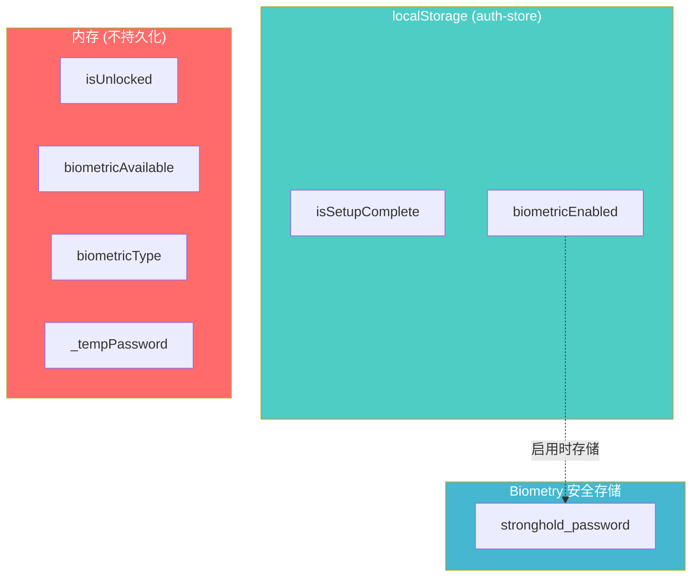

### 第四步：Biometry 插件的安全存储

`tauri-plugin-biometry` 插件提供了 `setData`/`getData`/`removeData` API，可以将敏感数据存储到系统安全存储中，并与生物识别验证绑定：

```typescript
import { setData, getData, removeData } from "@choochmeque/tauri-plugin-biometry-api";

// 存储数据到系统安全存储
await setData({
  domain: "com.gy.swarmdrop",
  name: "stronghold_password",
  data: password,
});

// 获取数据（会自动触发生物识别验证）
const response = await getData({
  domain: "com.gy.swarmdrop",
  name: "stronghold_password",
  reason: "Unlock SwarmDrop",
});
const password = response.data;

// 删除数据
await removeData({
  domain: "com.gy.swarmdrop",
  name: "stronghold_password",
});
```

**优势：**
- 无需自己实现跨平台密钥链代码
- `getData` 自动触发生物识别验证，无需分两步调用
- 插件内部使用各平台原生安全存储

**跨平台存储位置：**

| 平台 | 存储位置 | 安全特性 |
|------|----------|----------|
| macOS | Keychain Services | 硬件加密、ACL 控制 |
| iOS | Keychain Services | Secure Enclave 保护 |
| Windows | Windows Hello + Credential Manager | AES-256 加密 |
| Linux | Secret Service (GNOME Keyring/KWallet) | 会话密钥保护 |
| Android | Android Keystore | TEE/StrongBox |

### 第五步：设置密码页面

实现带密码强度检测的设置页面：

```typescript
// src/routes/_auth/setup-password.lazy.tsx
function calculatePasswordScore(password: string): number {
  let score = 0;
  if (password.length >= 8) score++;
  if (/[a-zA-Z]/.test(password) && /[0-9]/.test(password)) score++;
  if (/[^a-zA-Z0-9]/.test(password)) score++;
  return score;
}

const STRENGTH_LEVELS = [
  { score: 0, label: msg`弱`, color: "bg-destructive" },
  { score: 1, label: msg`一般`, color: "bg-orange-500" },
  { score: 2, label: msg`中等`, color: "bg-primary" },
  { score: 3, label: msg`强`, color: "bg-green-500" },
];

function SetupPasswordPage() {
  const [password, setPassword] = useState("");
  const [confirmPassword, setConfirmPassword] = useState("");
  const strengthScore = calculatePasswordScore(password);
  const strength = STRENGTH_LEVELS[strengthScore];

  const requirements = [
    { met: password.length >= 8, label: "至少 8 个字符" },
    { met: /[a-zA-Z]/.test(password) && /[0-9]/.test(password), label: "包含字母和数字" },
    { met: /[^a-zA-Z0-9]/.test(password), label: "推荐包含特殊字符" },
  ];

  return (
    <div className="w-full max-w-sm rounded-xl bg-card p-8 shadow-sm">
      {/* 密码输入框 */}
      <Input
        type={showPassword ? "text" : "password"}
        value={password}
        onChange={(e) => setPassword(e.target.value)}
      />

      {/* 密码强度指示器 */}
      {password && (
        <div className="flex gap-1">
          {[0, 1, 2].map((i) => (
            <div
              key={i}
              className={cn(
                "h-1 flex-1 rounded-full",
                i < strength.score ? strength.color : "bg-muted"
              )}
            />
          ))}
        </div>
      )}

      {/* 密码要求清单 */}
      <div className="rounded-lg bg-muted p-4">
        {requirements.map((req) => (
          <div key={req.label} className="flex items-center gap-2">
            {req.met ? <Check /> : <Circle />}
            <span>{req.label}</span>
          </div>
        ))}
      </div>
    </div>
  );
}
```

**密码强度计算：**

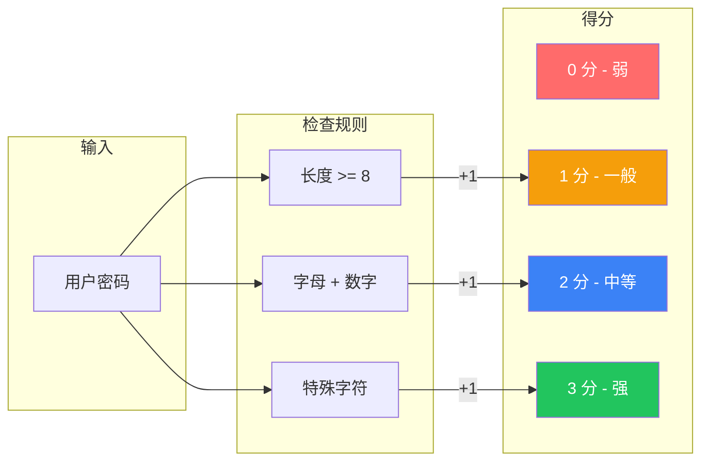

### 第六步：解锁页面

支持密码和生物识别两种解锁方式：

```typescript
// src/routes/_auth/unlock.lazy.tsx
function UnlockPage() {
  const {
    biometricEnabled,
    biometricType,
    unlock,
    unlockWithBiometric,
  } = useAuthStore(useShallow((state) => ({ ... })));

  const [showPasswordMode, setShowPasswordMode] = useState(false);

  // 根据生物识别类型选择图标
  const BiometricIcon =
    biometricType === BiometryType.FaceID ? ScanFace : Fingerprint;

  // 生物识别模式
  if (biometricEnabled && !showPasswordMode) {
    return (
      <div className="flex flex-col items-center gap-8">
        {/* Logo */}
        <div className="flex h-14 w-14 items-center justify-center rounded-xl bg-primary">
          <Send className="h-7 w-7 text-primary-foreground" />
        </div>

        {/* 生物识别图标 */}
        <div className="flex h-20 w-20 items-center justify-center rounded-full bg-secondary">
          <BiometricIcon className="h-10 w-10" />
        </div>

        {/* 解锁按钮 */}
        <Button onClick={handleBiometricUnlock}>解锁</Button>

        {/* 切换到密码模式 */}
        <button onClick={() => setShowPasswordMode(true)}>
          使用密码解锁
        </button>
      </div>
    );
  }

  // 密码模式
  return (
    <form onSubmit={handlePasswordUnlock}>
      <Input type="password" value={password} onChange={...} />
      <Button type="submit">解锁</Button>

      {biometricEnabled && (
        <button onClick={() => setShowPasswordMode(false)}>
          使用{biometricType === BiometryType.FaceID ? "面容" : "指纹"}解锁
        </button>
      )}
    </form>
  );
}
```

### 第七步：Aurora 背景动画

为认证页面添加优雅的 Aurora 背景效果：

```typescript
// src/components/ui/aurora-background.tsx
export const AuroraBackground = ({
  children,
  showRadialGradient = true,
}: AuroraBackgroundProps) => {
  return (
    <div className="relative flex flex-col items-center justify-center bg-background">
      <div
        className="pointer-events-none absolute inset-0 overflow-hidden"
        style={{
          "--aurora":
            "repeating-linear-gradient(100deg,#3b82f6_10%,#a5b4fc_15%,#93c5fd_20%,#ddd6fe_25%,#60a5fa_30%)",
        }}
      >
        <div
          className={cn(
            "after:animate-aurora pointer-events-none absolute -inset-[10px]",
            "[background-image:var(--white-gradient),var(--aurora)]",
            "[background-size:300%,_200%]",
            "opacity-50 blur-[10px] filter will-change-transform",
            showRadialGradient &&
              "[mask-image:radial-gradient(ellipse_at_100%_0%,black_10%,transparent_70%)]"
          )}
        />
      </div>
      {children}
    </div>
  );
};
```

需要在 CSS 中定义动画：

```css
/* src/index.css */
@keyframes aurora {
  from {
    background-position: 50% 50%, 50% 50%;
  }
  to {
    background-position: 350% 50%, 350% 50%;
  }
}

.animate-aurora {
  animation: aurora 60s linear infinite;
}
```

## 安全考量

### 密码存储安全

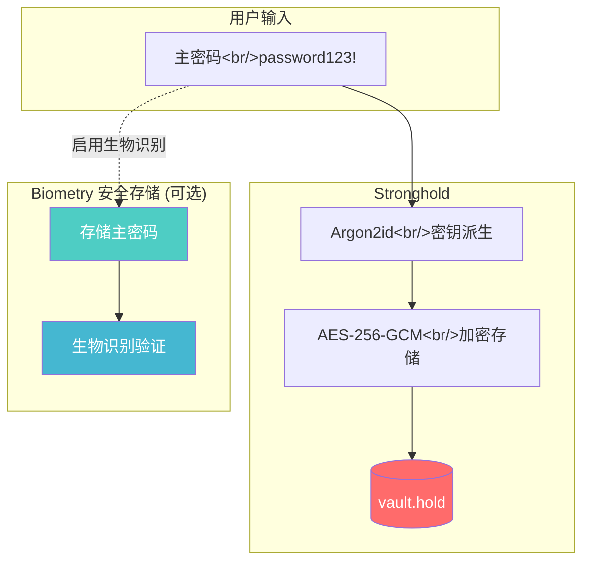

### 安全最佳实践

| 方面 | 实现方式 | 安全等级 |
|------|----------|----------|
| 密码存储 | Argon2id + Stronghold AES-256-GCM | 高 |
| 生物识别密码 | Biometry 插件安全存储 (Keychain/Windows Hello) | 高 |
| 运行时状态 | 内存中，不持久化 isUnlocked | 中 |
| 临时密码 | 设置完成后立即清除 | 中 |
| 密码强度 | 强制 8+ 字符 + 字母数字 | 中 |

### 威胁模型

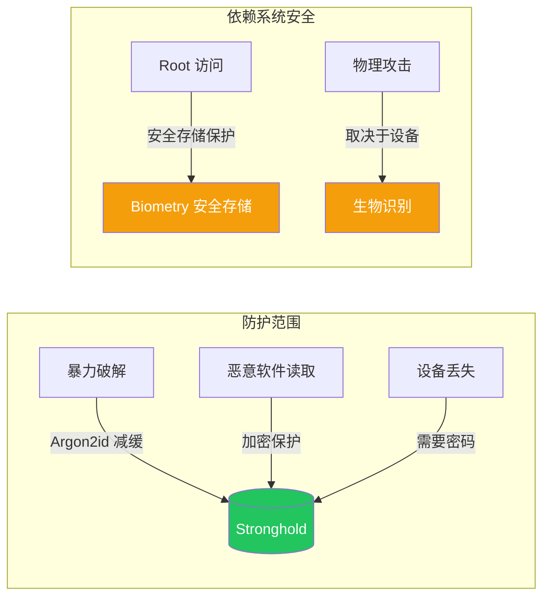

## 依赖配置

### Rust 依赖 (src-tauri/Cargo.toml)

```toml
[dependencies]
# 加密存储
tauri-plugin-stronghold = "2"
# 生物识别 + 安全存储
tauri-plugin-biometry = "0.2"
```

### 前端依赖 (package.json)

```bash
pnpm add @choochmeque/tauri-plugin-biometry-api
```

### Tauri 能力配置 (src-tauri/capabilities/default.json)

```json
{
  "permissions": [
    "stronghold:default",
    "stronghold:allow-initialize",
    "stronghold:allow-save",
    "biometry:default"
  ]
}
```

> **注意：** `biometry:default` 包含了 `authenticate`、`check-status`、`set-data`、`get-data`、`has-data`、`remove-data` 等所有权限。

## 文件结构总览

```text
swarmdrop/
├── src/
│   ├── routes/
│   │   ├── __root.tsx              # 根布局
│   │   ├── _auth.tsx               # 认证布局 (Aurora)
│   │   ├── _auth/
│   │   │   ├── welcome.lazy.tsx    # 欢迎页
│   │   │   ├── setup-password.lazy.tsx  # 设置密码
│   │   │   ├── enable-biometric.lazy.tsx # 启用生物识别
│   │   │   └── unlock.lazy.tsx     # 解锁页
│   │   ├── _app.tsx                # 主应用布局
│   │   └── _app/
│   │       └── devices.lazy.tsx    # 设备列表
│   ├── stores/
│   │   ├── auth-store.ts           # 认证状态管理（含 biometry 调用）
│   │   └── secret-store.ts         # 密钥存储
│   ├── lib/
│   │   └── stronghold.ts           # Stronghold 适配器
│   └── components/ui/
│       └── aurora-background.tsx   # Aurora 背景组件
│
└── src-tauri/src/
    ├── commands/
    │   ├── mod.rs
    │   └── identity.rs             # 身份命令
    └── lib.rs                      # Tauri 入口
```

## 调试技巧

### 重置应用状态

```bash
# 清除 localStorage (浏览器控制台)
localStorage.removeItem("auth-store")

# 删除 Stronghold 文件
# Windows: %APPDATA%/com.gy.swarmdrop/vault.hold
# macOS: ~/Library/Application Support/com.gy.swarmdrop/vault.hold
# Linux: ~/.local/share/com.gy.swarmdrop/vault.hold
```

### 查看认证状态

```typescript
// 浏览器控制台
const state = useAuthStore.getState();
console.log({
  isSetupComplete: state.isSetupComplete,
  isUnlocked: state.isUnlocked,
  biometricEnabled: state.biometricEnabled,
  biometricAvailable: state.biometricAvailable,
});
```

### 测试生物识别

在开发阶段，可以使用模拟器或设备的生物识别测试功能：

- **iOS 模拟器**：Features → Face ID → Enrolled
- **Android 模拟器**：Extended Controls → Fingerprint
- **macOS**：需要真实设备或 Touch Bar

## 参考资料

- [TanStack Router - File-based Routing](https://tanstack.com/router/latest/docs/framework/react/guide/file-based-routing)
- [Zustand - Persist Middleware](https://docs.pmnd.rs/zustand/integrations/persisting-store-data)
- [tauri-plugin-biometry](https://crates.io/crates/tauri-plugin-biometry) - Tauri 生物识别 + 安全存储插件
- [IOTA Stronghold](https://github.com/iotaledger/stronghold.rs) - 安全存储库
- [Aceternity UI - Aurora Background](https://ui.aceternity.com/components/aurora-background) - Aurora 背景组件
