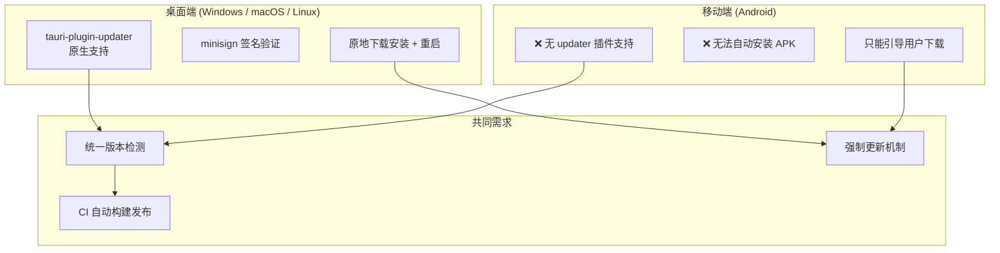
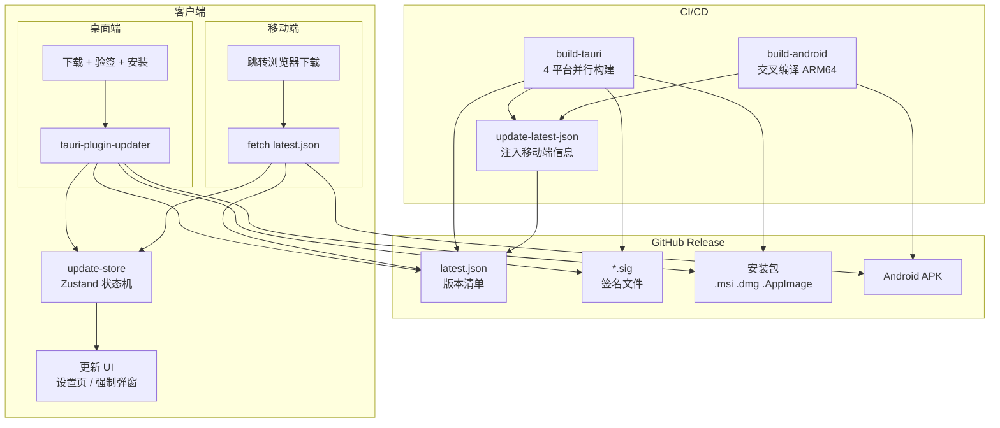
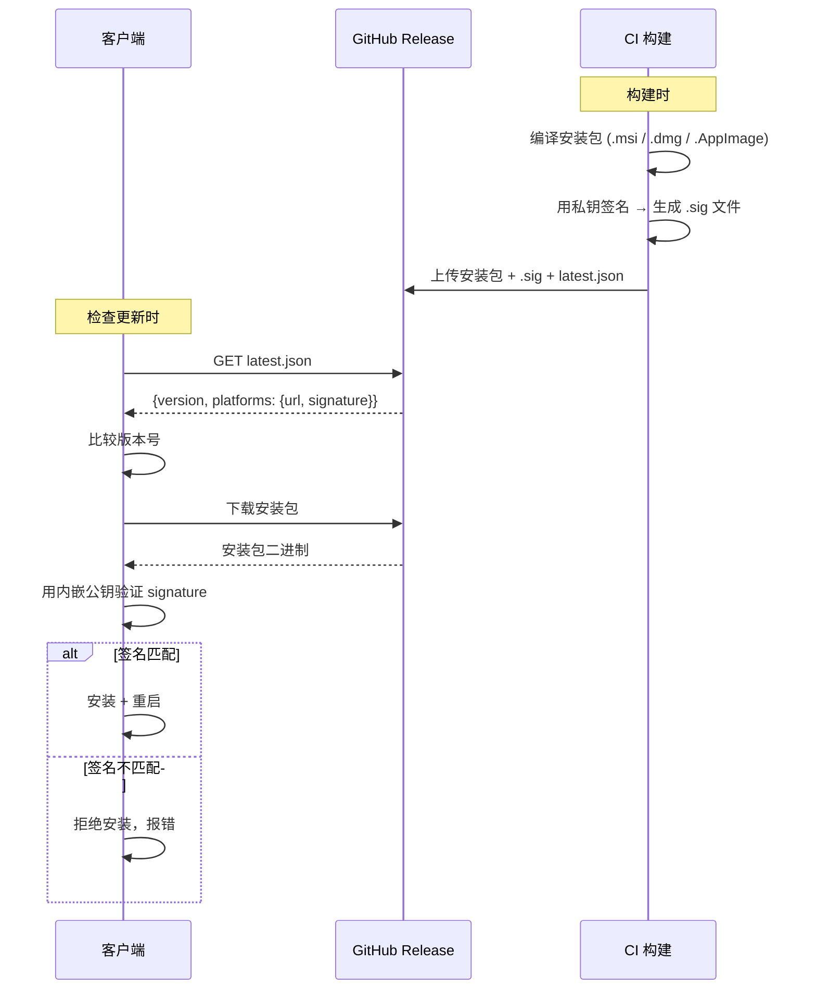
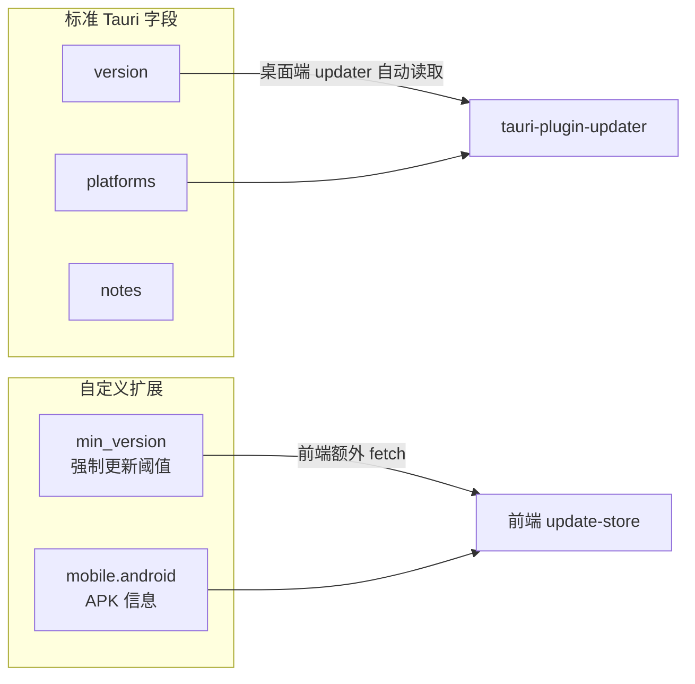
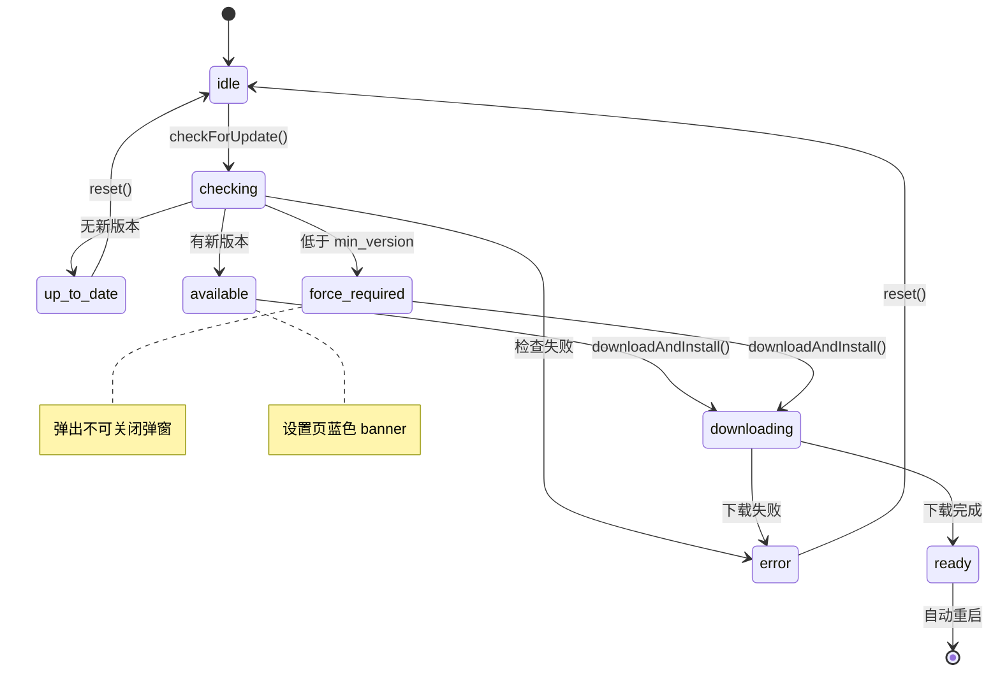
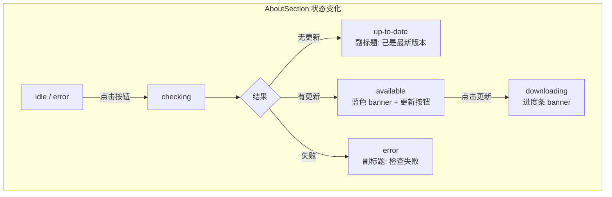
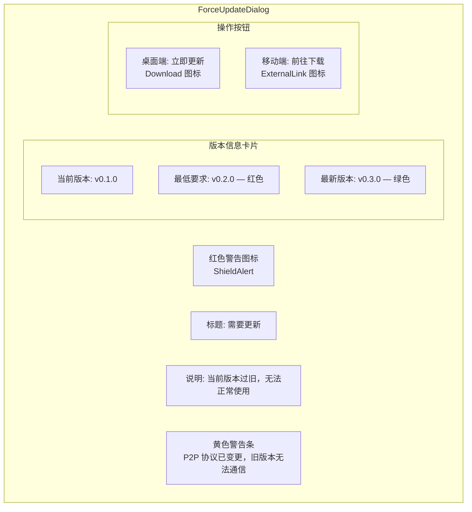
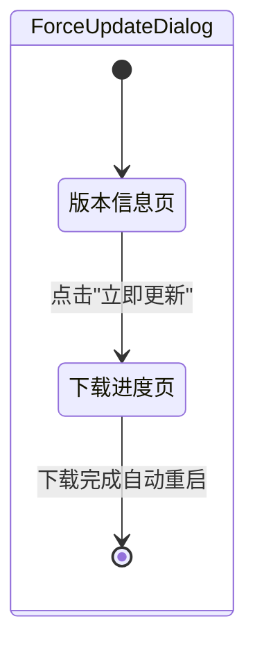
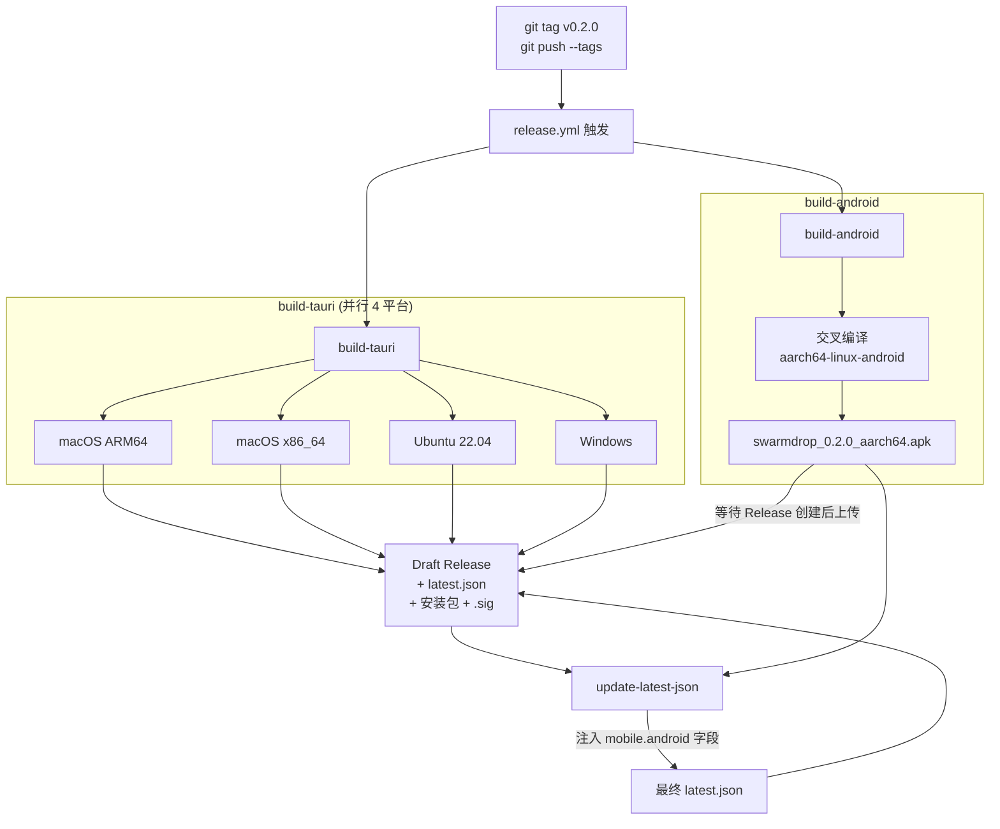
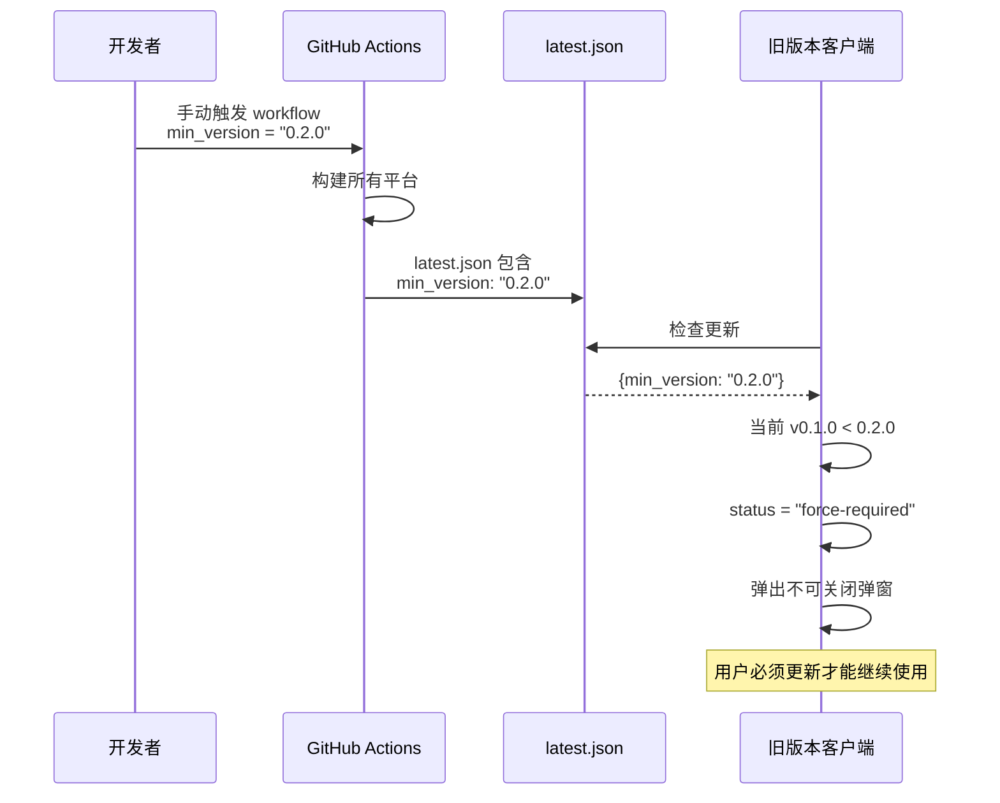

# Tauri v2 全平台自动更新：从签名到强制更新的完整实现

SwarmDrop 是一个基于 Tauri v2 的跨平台 P2P 文件传输工具，支持 Windows、macOS、Linux 和 Android。本文完整记录自动更新功能的实现过程——从 minisign 签名体系、桌面端静默更新、移动端引导下载，到强制更新弹窗和 CI/CD 自动发布。

## 面临的挑战

自动更新看似简单，但 Tauri 跨平台应用面临几个独特问题：



核心矛盾：**桌面端和移动端的更新能力完全不同，但需要统一的版本检测和用户体验**。

## 整体架构



## 第一步：依赖与插件注册

### Rust 端

在 `src-tauri/Cargo.toml` 添加两个插件：

```toml
tauri-plugin-updater = "2"    # 桌面端自动更新
tauri-plugin-process = "2"    # 重启应用
```

### 前端

```bash
pnpm add @tauri-apps/plugin-updater @tauri-apps/plugin-process
```

### 插件注册的"陷阱"

一般的 Tauri 插件在 Builder 链上注册：`.plugin(tauri_plugin_xxx::init())`。但 updater 插件有个问题——**在 Android 上会注册失败**（因为移动端不支持 updater），如果直接注册会导致应用崩溃。

解决方案：在 `setup` 回调中注册，catch 错误后优雅降级：

```rust
// src-tauri/src/lib.rs
tauri::Builder::default()
    .plugin(tauri_plugin_process::init())  // process 插件正常注册
    .setup(|app| {
        // updater 在 setup 中注册，移动端不支持时容错跳过
        if let Err(e) = app
            .handle()
            .plugin(tauri_plugin_updater::Builder::new().build())
        {
            tracing::warn!("Failed to initialize updater plugin: {e}");
        }
        Ok(())
    })
```

这样 Android 上 updater 注册失败也不会 panic，应用正常启动。

### 权限配置

`src-tauri/capabilities/default.json`：

```json
{
  "permissions": [
    "updater:default",
    "process:allow-restart"
  ]
}
```

## 第二步：签名体系

Tauri updater 使用 **minisign** 签名（而非 GPG），确保更新包没有被篡改。

### 生成密钥对

```bash
cargo tauri signer generate -w keys/swarmdrop.key
```

生成两个文件：

| 文件 | 用途 | 是否提交 |
|------|------|---------|
| `keys/swarmdrop.key` | 私钥，CI 签名用 | 否（.gitignore 排除） |
| `keys/swarmdrop.key.pub` | 公钥，客户端验证用 | 内嵌到 tauri.conf.json |

### 配置 tauri.conf.json

```json
{
  "bundle": {
    "createUpdaterArtifacts": true
  },
  "plugins": {
    "updater": {
      "pubkey": "<公钥的 base64 编码>",
      "endpoints": [
        "https://github.com/yexiyue/SwarmDrop/releases/latest/download/latest.json"
      ]
    }
  }
}
```

关键配置说明：

- **`createUpdaterArtifacts: true`** — 构建时自动为每个安装包生成 `.sig` 签名文件
- **`pubkey`** — 公钥嵌入客户端，用于验证下载的更新包。即使 GitHub 被中间人攻击，没有私钥也无法伪造签名
- **`endpoints`** — 指向 `latest.json` 的 URL，客户端从这里获取最新版本信息

### 签名验证流程



## 第三步：latest.json — 连接一切的枢纽

`latest.json` 是整个更新系统的核心清单。标准 Tauri 格式只包含桌面端信息，我们扩展了移动端和强制更新字段：

```json
{
  "version": "0.2.0",
  "notes": "新增设备配对功能",
  "pub_date": "2025-02-14T12:00:00Z",
  "platforms": {
    "windows-x86_64": {
      "url": "https://github.com/.../swarmdrop_0.2.0_x64-setup.msi.zip",
      "signature": "dW50cnVzdGVkIGNvbW1lbnQ6..."
    },
    "darwin-aarch64": {
      "url": "https://github.com/.../swarmdrop.app.tar.gz",
      "signature": "dW50cnVzdGVkIGNvbW1lbnQ6..."
    },
    "linux-x86_64": {
      "url": "https://github.com/.../swarmdrop_0.2.0_amd64.AppImage",
      "signature": "dW50cnVzdGVkIGNvbW1lbnQ6..."
    }
  },
  "min_version": "0.1.0",
  "mobile": {
    "android": {
      "version": "0.2.0",
      "download_url": "https://github.com/.../swarmdrop_0.2.0_aarch64.apk",
      "min_version": "0.1.0"
    }
  }
}
```



为什么需要"额外 fetch"？因为 `tauri-plugin-updater` 的 Update 对象只包含标准字段（version、body），不会暴露自定义的 `min_version`。所以桌面端也需要直接 fetch `latest.json` 来读取强制更新信息。

## 第四步：前端更新状态机

更新逻辑的核心是一个 Zustand store，管理 8 个状态的状态机：



### Store 实现

```typescript
// src/stores/update-store.ts
export type UpdateStatus =
  | "idle"           // 未检查
  | "checking"       // 检查中
  | "up-to-date"     // 已是最新
  | "available"      // 有更新可用
  | "downloading"    // 下载中（桌面端）
  | "ready"          // 下载完成待重启
  | "error"          // 检查/下载失败
  | "force-required"; // 需要强制更新
```

关键设计决策：

1. **桌面/移动自动分流** — `checkForUpdate()` 内部根据 `type()` 判断平台，调用不同逻辑
2. **进度回调在 store 外计算** — 速度计算变量放在模块级（避免 Zustand 高频更新引用问题）
3. **Update 对象缓存** — 桌面端的 `_pendingUpdate` 放在模块级变量，不进 store（不可序列化）

### 平台分流逻辑

```typescript
async checkForUpdate() {
  const currentVersion = await getVersion();

  if (isMobilePlatform()) {
    // 移动端：直接 fetch latest.json
    await checkMobileUpdate(currentVersion, set);
  } else {
    // 桌面端：调用 tauri-plugin-updater
    await checkDesktopUpdateFlow(currentVersion, set);
  }
}
```

### 桌面端流程

```typescript
// src/commands/updater.ts — 封装 updater API
export async function checkDesktopUpdate(): Promise<Update | null> {
  try {
    const { check } = await import("@tauri-apps/plugin-updater");
    const update = await check();
    return update ?? null;
  } catch (err) {
    console.error("[updater] checkDesktopUpdate failed:", err);
    return null;
  }
}
```

使用 **动态 import** 而非静态导入，这样移动端不会加载 updater 模块。

下载安装也经过封装，提供进度回调：

```typescript
export async function downloadAndInstallUpdate(
  update: Update,
  onProgress?: (downloaded: number, total: number | undefined) => void,
): Promise<void> {
  let downloaded = 0;

  await update.downloadAndInstall((event) => {
    switch (event.event) {
      case "Started":
        onProgress?.(0, event.data.contentLength);
        break;
      case "Progress":
        downloaded += event.data.chunkLength;
        onProgress?.(downloaded, undefined);
        break;
      case "Finished":
        break;
    }
  });
}
```

### 移动端流程

移动端没有 updater 插件，直接 fetch `latest.json` 解析 `mobile.android` 字段：

```typescript
async function checkMobileUpdate(currentVersion: string, set) {
  const res = await fetch(LATEST_JSON_ENDPOINTS[0]);
  const latestJson: LatestJson = await res.json();
  const android = latestJson?.mobile?.android;

  if (!android) {
    set({ status: "up-to-date" });
    return;
  }

  // 检查强制更新
  if (android.min_version && isVersionLessThan(currentVersion, android.min_version)) {
    set({ status: "force-required" });
    return;
  }

  // 检查普通更新
  if (isVersionLessThan(currentVersion, android.version)) {
    set({ status: "available", downloadUrl: android.download_url });
  } else {
    set({ status: "up-to-date" });
  }
}
```

用户点击"前往下载"时，调用 `@tauri-apps/plugin-opener` 跳转浏览器：

```typescript
async openDownloadPage() {
  const { downloadUrl } = get();
  if (!downloadUrl) return;
  await openUrl(downloadUrl);
}
```

## 第五步：版本比较工具

看似简单但有坑的 semver 比较：

```typescript
// src/lib/version.ts
function parseVersion(version: string): [number, number, number] {
  const clean = version.replace(/^v/, "").split("-")[0]; // 去掉 v 前缀和预发布标签
  const parts = clean.split(".").map(Number);
  return [parts[0] ?? 0, parts[1] ?? 0, parts[2] ?? 0];
}

export function compareVersions(a: string, b: string): -1 | 0 | 1 {
  const pa = parseVersion(a);
  const pb = parseVersion(b);

  for (let i = 0; i < 3; i++) {
    if (pa[i] < pb[i]) return -1;
    if (pa[i] > pb[i]) return 1;
  }

  // 有预发布标签的视为更低版本：1.0.0-beta < 1.0.0
  const aHasPrerelease = a.replace(/^v/, "").includes("-");
  const bHasPrerelease = b.replace(/^v/, "").includes("-");
  if (aHasPrerelease && !bHasPrerelease) return -1;
  if (!aHasPrerelease && bHasPrerelease) return 1;

  return 0;
}
```

为什么不用 `semver` npm 包？因为只需要简单的三段比较，一个 30 行的工具函数比引入一个依赖更合适。

## 第六步：更新 UI

### 设置页 — AboutSection

设置页底部展示应用信息和更新状态，根据 `UpdateStatus` 动态切换：



各状态对应的按钮：

| 状态 | 按钮文案 | 行为 |
|------|---------|------|
| idle / error / up-to-date | 检查更新 | 调用 `checkForUpdate()` |
| checking | 检查中... (禁用) | 等待 |
| available (桌面端) | 更新到 vX.X.X | 调用 `downloadAndInstall()` |
| available (移动端) | 前往下载 | 调用 `openDownloadPage()` |
| downloading | 下载中... (禁用) | 等待 |

下载进度 banner 展示四项信息：进度条、百分比、已下载/总大小、下载速度。

### 强制更新弹窗 — ForceUpdateDialog

当检测到 `min_version` 高于当前版本时，弹出**不可关闭的全屏模态弹窗**：



关键实现细节：

```tsx
export function ForceUpdateDialog() {
  const status = useUpdateStore((s) => s.status);
  const minVersion = useUpdateStore((s) => s.minVersion);

  // 仅在 force-required 或正在从强制更新下载时显示
  if (status !== "force-required" && status !== "downloading") return null;
  // 如果是普通下载（非强制更新触发），不显示弹窗
  if (status === "downloading" && !minVersion) return null;

  // ...渲染不可关闭的弹窗
}
```

弹窗在应用根层级渲染（`__root.tsx`），确保覆盖所有页面。`fixed inset-0 z-50` + 半透明遮罩层 `bg-slate-900/90` 实现不可关闭效果（没有关闭按钮，没有点击外部关闭）。

点击"立即更新"后，弹窗内容无缝切换为下载进度：



## 第七步：启动自动检查

在应用入口延迟 3 秒检查更新（避免影响首屏加载）：

```typescript
// 应用入口
setTimeout(() => {
  useUpdateStore.getState().checkForUpdate();
}, 3000);
```

如果检测到强制更新，`ForceUpdateDialog` 自动弹出，阻断应用使用。

## 第八步：CI/CD 自动发布

整个发布流程由一个 GitHub Actions workflow 完成：



### build-tauri：桌面端多平台构建

使用官方 `tauri-apps/tauri-action@v0`，一个 Action 完成编译、打包、签名、上传：

```yaml
- name: Build and publish
  uses: tauri-apps/tauri-action@v0
  env:
    GITHUB_TOKEN: ${{ secrets.GITHUB_TOKEN }}
    TAURI_SIGNING_PRIVATE_KEY: ${{ secrets.TAURI_SIGNING_PRIVATE_KEY }}
    TAURI_SIGNING_PRIVATE_KEY_PASSWORD: ${{ secrets.TAURI_SIGNING_PRIVATE_KEY_PASSWORD }}
  with:
    tagName: v__VERSION__
    releaseName: 'SwarmDrop v__VERSION__'
    releaseDraft: true
    prerelease: false
```

`__VERSION__` 是 tauri-action 的魔术变量，自动替换为 `tauri.conf.json` 中的 version。

### build-android：Android 交叉编译

Android 构建有几个特殊点：

1. **libsodium 依赖** — SwarmDrop 的 P2P 库依赖 libsodium，Android 交叉编译时需要预构建的 ARM64 静态库
2. **NDK 配置** — GitHub runner 自带 NDK，通过 `$ANDROID_NDK_LATEST_HOME` 引用即可
3. **APK 签名** — 从 Secrets 动态生成 `keystore.properties`

```yaml
- name: Setup Android signing
  run: |
    cd src-tauri/gen/android
    echo "keyAlias=${{ secrets.ANDROID_KEY_ALIAS }}" > keystore.properties
    echo "keyPassword=${{ secrets.ANDROID_KEY_PASSWORD }}" >> keystore.properties
    echo "storePassword=${{ secrets.ANDROID_KEY_PASSWORD }}" >> keystore.properties
    base64 -d <<< "${{ secrets.ANDROID_KEY_BASE64 }}" > $RUNNER_TEMP/keystore.jks
    echo "storeFile=$RUNNER_TEMP/keystore.jks" >> keystore.properties

- name: Build Android APK
  env:
    NDK_HOME: ${{ env.ANDROID_NDK_LATEST_HOME }}
    ANDROID_NDK_HOME: ${{ env.ANDROID_NDK_LATEST_HOME }}
    ANDROID_NDK_ROOT: ${{ env.ANDROID_NDK_LATEST_HOME }}
    SODIUM_LIB_DIR: ${{ github.workspace }}/src-tauri/vendor/prebuilt/android-aarch64
  run: pnpm tauri android build --apk
```

Android 构建与桌面端并行运行，但 Draft Release 由 `tauri-action` 创建。所以 APK 上传前需要轮询等待：

```bash
TAG="v${VERSION}"
for i in $(seq 1 30); do
  if gh release view "$TAG" &>/dev/null; then break; fi
  echo "Waiting for release $TAG... ($i/30)"
  sleep 10
done
gh release upload "$TAG" "$APK_NAME" --clobber
```

### update-latest-json：注入移动端信息

`tauri-action` 生成的 `latest.json` 只有桌面端信息。最后一个 job 用 `jq` 注入 Android 字段：

```bash
# 注入 mobile.android
jq --arg ver "$VERSION" --arg url "$APK_URL" \
  '.mobile.android = {version: $ver, download_url: $url}' \
  latest.json > tmp.json && mv tmp.json latest.json

# 注入 min_version（手动触发时可选）
if [[ -n "$MIN_VERSION" ]]; then
  jq --arg mv "$MIN_VERSION" \
    '.min_version = $mv | .mobile.android.min_version = $mv' \
    latest.json > tmp.json && mv tmp.json latest.json
fi
```

## 第九步：强制更新的触发方式

当 P2P 协议发生不兼容变更（比如消息格式改了），旧版本无法和新版本通信。这时需要强制更新。

在 GitHub Actions 页面手动触发 workflow，填入 `min_version`：



## GitHub Secrets 清单

整个系统需要配置 5 个 Secrets：

| Secret | 说明 |
|--------|------|
| `TAURI_SIGNING_PRIVATE_KEY` | minisign 私钥（`keys/swarmdrop.key` 文件内容） |
| `TAURI_SIGNING_PRIVATE_KEY_PASSWORD` | 私钥密码 |
| `ANDROID_KEY_ALIAS` | Android keystore 别名 |
| `ANDROID_KEY_PASSWORD` | Android keystore 密码 |
| `ANDROID_KEY_BASE64` | `.jks` 文件的 base64 编码 |

## 国际化

更新相关的所有文案都使用 Lingui 标记，支持 8 种语言（zh、zh-TW、en、ja、ko、es、fr、de）：

```tsx
// 使用 Trans 组件（JSX 内）
<Trans>需要更新</Trans>
<Trans>当前版本过旧，无法正常使用</Trans>

// 使用 t 标签模板（属性/变量）
{t`更新到 v${latestVersion ?? "?"}`}
{t`正在下载 v${latestVersion ?? "?"}`}
```

注意 Lingui 的 `t` 标签模板不接受 `null` 插值，需要 `?? "?"` 兜底。

## 踩过的坑

### 1. `@tauri-apps/plugin-opener` 的 `open` 不存在

文档和很多示例写的是 `import { open } from "@tauri-apps/plugin-opener"`，但实际导出的是 `openUrl`、`openPath`、`revealItemInDir`。TypeScript 类型检查帮我们抓住了这个问题。

### 2. MobileAndroidInfo.min_version 类型

最初把 `min_version` 定义为 `string`（必填），但 CI 只在手动触发时才设置这个字段。改为 `string?`（可选），并在使用处加 guard：

```typescript
if (android.min_version && isVersionLessThan(currentVersion, android.min_version)) {
  set({ status: "force-required" });
}
```

### 3. Android NDK 路径

最初硬编码了 NDK 路径 `/usr/local/lib/android/sdk/ndk/27.0.12077973`，但不同 runner 的 NDK 版本不一样。改用 GitHub runner 内置的环境变量 `$ANDROID_NDK_LATEST_HOME`，不需要手动安装 NDK。

### 4. 强制更新弹窗的状态切换

`ForceUpdateDialog` 需要同时处理 `force-required` 和 `downloading` 两个状态。但普通更新也会进入 `downloading`。通过检查 `minVersion` 是否存在来区分：

```tsx
if (status === "downloading" && !minVersion) return null; // 普通下载，不弹窗
```

## 完整文件结构

```
src/
├── commands/updater.ts              # 桌面端 updater API 封装（动态 import）
├── lib/version.ts                   # semver 比较 + latest.json 类型定义
├── stores/update-store.ts           # 更新状态机（8 个状态 + 4 个 action）
├── components/
│   ├── ForceUpdateDialog.tsx         # 强制更新弹窗（不可关闭）
│   └── settings/AboutSection.tsx     # 设置页更新 UI
src-tauri/
├── tauri.conf.json                  # updater 公钥 + endpoints
├── capabilities/default.json        # updater + process 权限
├── Cargo.toml                       # tauri-plugin-updater + process
├── src/lib.rs                       # 容错注册 updater 插件
keys/
├── swarmdrop.key                    # minisign 私钥（git-ignored）
├── swarmdrop.key.pub                # minisign 公钥
├── swarmdrop.jks                    # Android keystore（git-ignored）
.github/workflows/
└── release.yml                      # 多平台构建 + Android + latest.json 补丁
```

## 总结

Tauri v2 的 updater 插件为桌面端提供了开箱即用的自动更新，但跨平台（尤其是 Android）需要自己补齐。核心思路是：

1. **统一清单** — `latest.json` 同时承载桌面端标准字段和自定义移动端字段
2. **统一状态机** — 一个 Zustand store 管理所有平台的更新生命周期
3. **平台分流** — `checkForUpdate()` 内部自动分流，UI 层不感知差异
4. **强制更新** — `min_version` 字段 + 不可关闭弹窗，确保协议不兼容时用户必须升级
5. **CI 自动化** — tag push 触发全平台构建 + 签名 + 发布，无需手动操作
