# SwarmDrop 设备配对系统：基于 DHT 的去中心化配对码方案

SwarmDrop 的核心挑战之一是：两台从未通信过的设备，如何在没有中心服务器的情况下安全建立连接？本文详细介绍 SwarmDrop 设备配对系统的设计思路与实现细节——一个基于 Kademlia DHT 的去中心化配对码方案。

## 问题：去中心化世界里，如何"找到彼此"？

传统文件传输工具（如微信文件传输助手、AirDrop）依赖中心服务器或同一局域网来建立连接。SwarmDrop 需要同时支持两种场景：

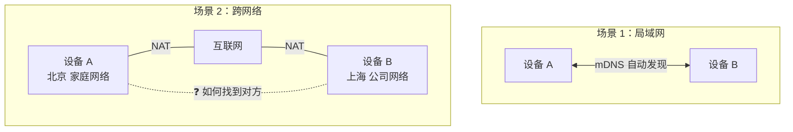

局域网场景通过 mDNS 协议自动发现，问题不大。但跨网络场景下，两台设备隔着 NAT，互相不知道对方的存在。我们需要一种"不依赖中心服务器"的方式让它们建立联系。

**解决方案：6 位配对码 + Kademlia DHT。**

## 整体架构

配对系统由以下模块组成：

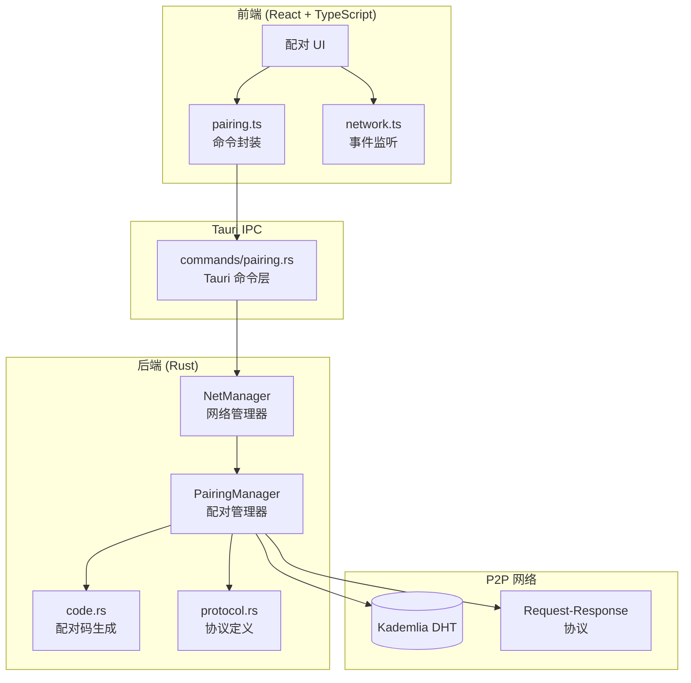

## 核心流程：配对码如何工作

整个配对过程分为两个角色：**分享方**（生成配对码的一方）和**接收方**（输入配对码的一方）。

### 完整时序图

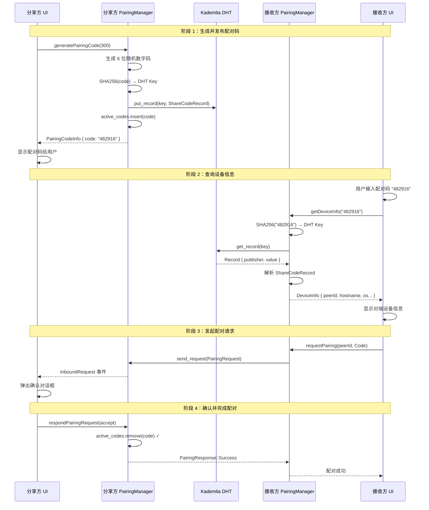

### 阶段详解

#### 阶段 1：生成配对码

分享方调用 `generate_pairing_code` 生成一个 6 位纯数字配对码，并将设备信息发布到 DHT。

```rust
// pairing/code.rs
const CHARSET: &[u8] = b"0123456789";
const CODE_LENGTH: usize = 6;

impl PairingCodeInfo {
    pub fn generate(expires_in_secs: u64) -> Self {
        let mut rng = rand::rng();
        let code: String = (0..CODE_LENGTH)
            .map(|_| *CHARSET.choose(&mut rng).unwrap() as char)
            .collect();
        let now = chrono::Utc::now().timestamp();
        Self {
            code,
            created_at: now,
            expires_at: now + expires_in_secs as i64,
        }
    }
}
```

**关键设计：配对码不直接作为 DHT Key。** 原始配对码经过 SHA-256 哈希后才作为 DHT 的 key 存储，这样即使有人扫描 DHT，也无法反推出配对码：

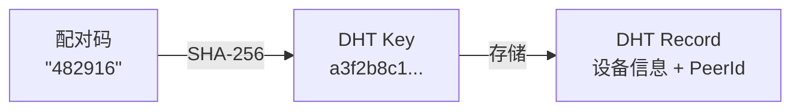

```rust
pub fn dht_key(&self) -> Vec<u8> {
    sha2::Sha256::digest(self.code.as_bytes()).to_vec()
}
```

发布到 DHT 的值是 `ShareCodeRecord`，包含分享方的设备信息：

```rust
// pairing/code.rs
pub struct ShareCodeRecord {
    pub os_info: OsInfo,   // hostname, os, platform, arch
    pub created_at: i64,
    pub expires_at: i64,
}
```

同时，配对码也保存在内存中的 `active_codes`（`DashMap`），用于后续验证：

```rust
// pairing/manager.rs
pub async fn generate_code(&self, expires_in_secs: u64) -> AppResult<PairingCodeInfo> {
    let code_info = PairingCodeInfo::generate(expires_in_secs);

    // 发布到 DHT
    self.client.put_record(Record {
        key: code_info.dht_key().into(),
        value: serde_json::to_vec(&ShareCodeRecord::from(&code_info))?,
        publisher: Some(self.peer_id),
        expires: Some(Instant::now() + Duration::from_secs(expires_in_secs)),
    }).await?;

    // 保存到本地，用于后续验证
    self.active_codes.insert(code_info.code.clone(), code_info.clone());

    Ok(code_info)
}
```

#### 阶段 2：查询设备信息

接收方输入配对码后，同样对配对码做 SHA-256 哈希，从 DHT 中查询对应的记录：

```rust
pub async fn get_device_info(&self, code: &str) -> AppResult<(PeerId, ShareCodeRecord)> {
    let record = self.client
        .get_record(sha2::Sha256::digest(code.as_bytes()).to_vec().into())
        .await?
        .record;

    // 检查是否过期
    if let Some(expires) = record.expires {
        if expires < Instant::now() {
            return Err(AppError::ExpiredCode);
        }
    }

    // 从 record.publisher 获取分享方的 PeerId
    let peer_id = record.publisher.ok_or(AppError::InvalidCode)?;
    let record = serde_json::from_slice::<ShareCodeRecord>(&record.value)?;

    Ok((peer_id, record))
}
```

这一步得到两个关键信息：
- **PeerId** — 分享方在 P2P 网络中的唯一标识，用于建立直接连接
- **ShareCodeRecord** — 分享方的设备信息（设备名、操作系统等），用于在 UI 上展示

#### 阶段 3：发起配对请求

获得 PeerId 后，接收方通过 libp2p 的 Request-Response 协议直接向分享方发送配对请求：

```rust
pub async fn request_pairing(
    &self,
    peer_id: PeerId,
    method: PairingMethod,
) -> AppResult<PairingResponse> {
    let res = self.client.send_request(
        peer_id,
        AppRequest::Pairing(PairingRequest {
            os_info: OsInfo::default(),
            method,
            timestamp: chrono::Utc::now().timestamp(),
        }),
    ).await?;

    match res {
        AppResponse::Pairing(pairing_res) => Ok(pairing_res),
    }
}
```

分享方收到请求后，前端会触发 `inboundRequest` 事件，弹出确认对话框：

```typescript
// 前端监听事件
start((event) => {
  if (event.type === "inboundRequest") {
    // event.peerId — 请求方 PeerId
    // event.pendingId — 请求标识，用于响应
    // event.request — PairingRequest 内容
    showPairingDialog(event);
  }
});
```

#### 阶段 4：确认并完成配对

分享方用户确认后，后端验证配对码并返回响应：

```rust
pub async fn handle_pairing_request(
    &self,
    pending_id: u64,
    method: &PairingMethod,
    response: PairingResponse,
) -> AppResult<()> {
    // Code 模式：验证并消耗配对码
    if let PairingMethod::Code { code } = method {
        let (_, info) = self.active_codes
            .remove(code.as_str())
            .ok_or(AppError::InvalidCode)?;

        if info.is_expired() {
            return Err(AppError::ExpiredCode);
        }
    }
    // Direct 模式（局域网）：无需配对码，用户确认即可

    self.client
        .send_response(pending_id, AppResponse::Pairing(response))
        .await?;
    Ok(())
}
```

注意 `remove` 而不是 `get`：**配对码是一次性的**，使用后立即从 `active_codes` 中删除，防止重放。

## 两种配对模式

系统支持两种配对方式，通过 `PairingMethod` 枚举区分：

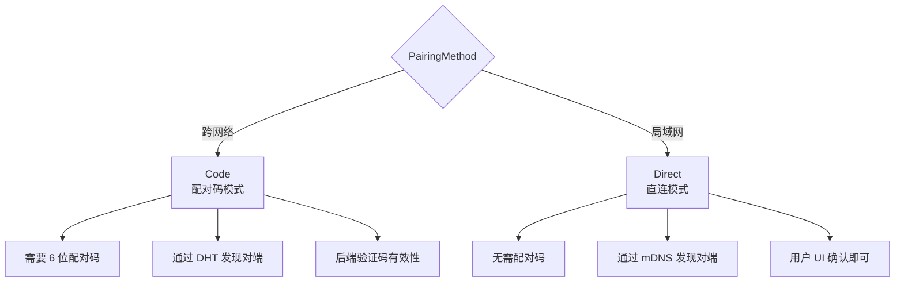

```rust
#[serde(rename_all = "camelCase", tag = "type")]
pub enum PairingMethod {
    Code { code: String },  // 跨网络：需要配对码
    Direct,                  // 局域网：直接发现
}
```

前端对应的 TypeScript 类型：

```typescript
export type PairingMethod =
  | { type: "code"; code: string }
  | { type: "direct" };
```

## 协议设计

所有 P2P 通信都通过统一的请求/响应协议：

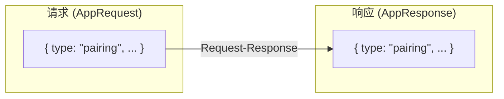

```rust
// 应用层请求 — 未来可扩展文件传输等
pub enum AppRequest {
    Pairing(PairingRequest),
    // Transfer(TransferRequest),  // 未来
}

// 应用层响应
pub enum AppResponse {
    Pairing(PairingResponse),
    // Transfer(TransferResponse),  // 未来
}

// 统一的网络客户端类型
pub type AppNetClient = NetClient<AppRequest, AppResponse>;
```

序列化使用 serde 的 **internally tagged** 策略，JSON 格式如下：

```json
// PairingMethod::Code
{ "type": "code", "code": "482916" }

// PairingMethod::Direct
{ "type": "direct" }

// PairingResponse::Success
{ "status": "success" }

// PairingResponse::Refused
{ "status": "refused", "reason": "用户拒绝" }
```

## 网络管理架构

所有网络功能通过 `NetManager` 统一管理，采用分层架构：

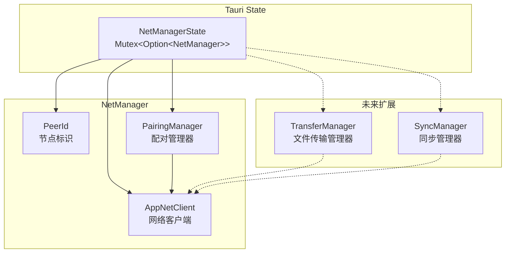

```rust
pub struct NetManager {
    pub client: AppNetClient,
    pub peer_id: PeerId,
    pub pairing: PairingManager,
    // pub transfer: TransferManager,  // 未来
}
```

生命周期管理很清晰——启动时宣布上线，关闭前宣布离线：

```rust
// 启动
let net_manager = NetManager::new(client, peer_id);
net_manager.pairing().announce_online().await?;  // DHT start_provide
app.manage(Mutex::new(Some(net_manager)));

// 关闭
let manager = guard.as_ref().unwrap();
manager.pairing().announce_offline().await?;  // DHT stop_provide
guard.take();  // drop 释放所有资源
```

## Tauri 命令层：前后端桥梁

Tauri 命令层是一层薄封装，负责从 `NetManagerState` 中获取 `PairingManager` 并调用其方法：

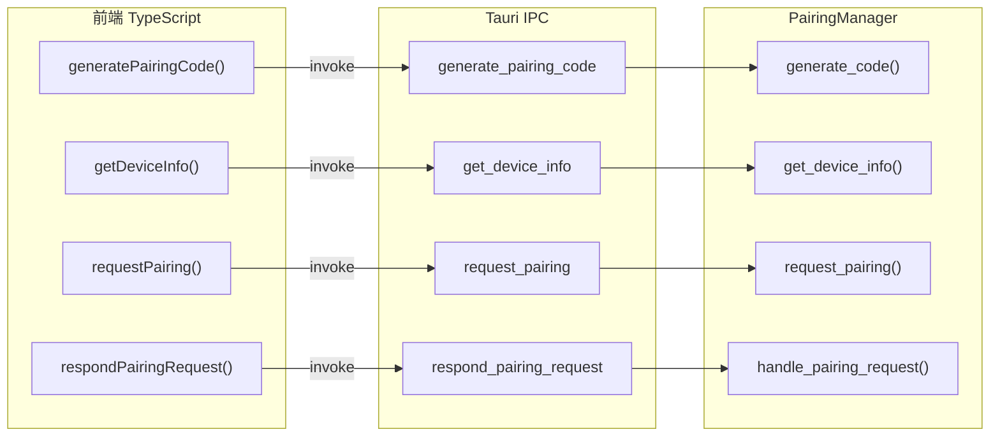

每个 Tauri 命令的模式一致：

```rust
#[tauri::command]
pub async fn generate_pairing_code(
    net: State<'_, NetManagerState>,
    expires_in_secs: Option<u64>,
) -> AppResult<PairingCodeInfo> {
    let guard = net.lock().await;
    let manager = guard.as_ref().ok_or_else(not_started)?;
    manager.pairing()
        .generate_code(expires_in_secs.unwrap_or(300))
        .await
}
```

前端封装同样简洁：

```typescript
export async function generatePairingCode(
  expiresInSecs?: number,
): Promise<PairingCodeInfo> {
  return invoke<PairingCodeInfo>("generate_pairing_code", { expiresInSecs });
}
```

## 数据流全景

从前端到 P2P 网络的完整数据流：

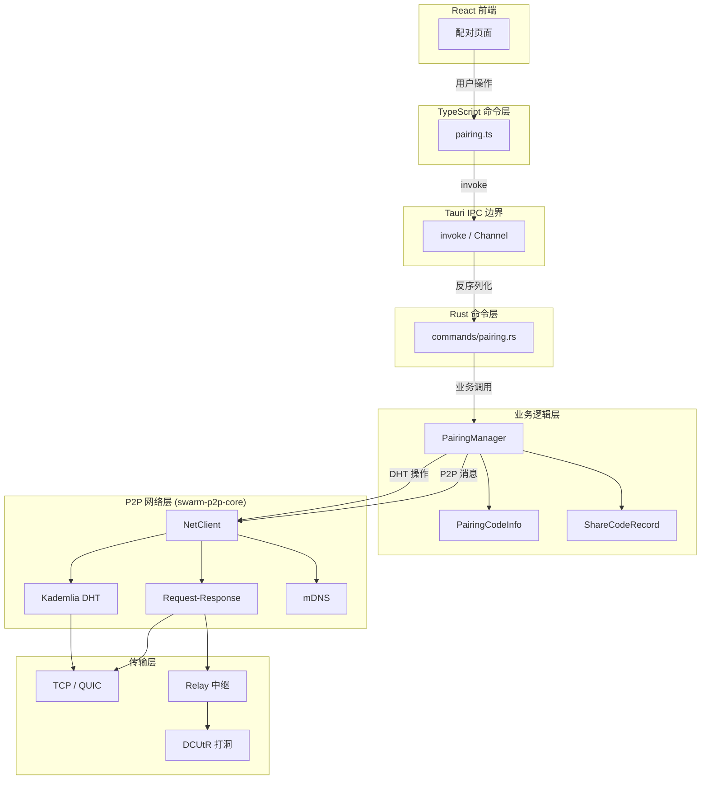

## 安全考量

### 配对码哈希

配对码经 SHA-256 哈希后存入 DHT，即使攻击者能遍历 DHT 中的所有 key，也无法从 hash 反推出配对码。

### 配对码一次性消耗

配对码在成功配对后立即从 `active_codes` 中删除（`remove` 而非 `get`），防止重放攻击。

### 配对码过期机制

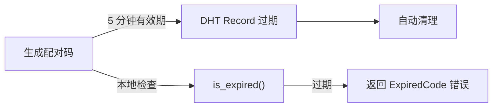

双重过期检查：
1. **DHT 层面**：`Record` 自带 `expires` 字段，DHT 会自动清理过期记录
2. **应用层面**：`PairingCodeInfo::is_expired()` 在验证时再次检查时间戳

### 局域网直连验证

Direct 模式不需要配对码，但要求用户在 UI 上手动确认对端设备信息。这种模式仅在 mDNS 发现的局域网设备之间使用，攻击面有限。

## 模块组织

```
src-tauri/src/
├── device.rs              # OsInfo — 设备信息（共享模块）
├── protocol.rs            # P2P 协议类型定义
├── error.rs               # 错误类型 (含 ExpiredCode, InvalidCode)
├── pairing/
│   ├── mod.rs
│   ├── code.rs            # 配对码生成、DHT Key 计算、ShareCodeRecord
│   └── manager.rs         # PairingManager 核心业务逻辑
├── commands/
│   ├── mod.rs             # NetManager、start/shutdown 命令
│   └── pairing.rs         # 配对相关 Tauri 命令
└── lib.rs                 # 模块声明 & 命令注册

src/commands/
├── network.ts             # 网络命令 & 事件类型
├── pairing.ts             # 配对命令 & 类型定义
└── index.ts               # 统一导出
```

`OsInfo` 被提取为独立的 `device.rs` 模块，因为它同时被 `pairing` 和 `commands` 两个模块使用：

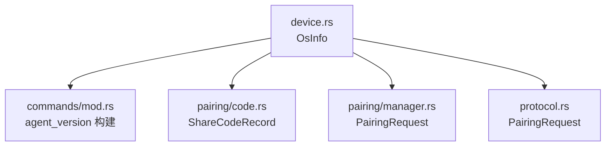

## 总结

SwarmDrop 的配对系统通过"配对码 + DHT"实现了去中心化的设备发现与连接建立：

| 组件 | 职责 |
|------|------|
| `PairingCodeInfo` | 生成 6 位随机码，计算 DHT Key |
| `ShareCodeRecord` | 存入 DHT 的设备信息 |
| `PairingManager` | 核心业务逻辑：生成、查询、请求、响应 |
| `NetManager` | 统一管理网络客户端和子模块 |
| `protocol.rs` | 定义 P2P 通信协议，支持未来扩展 |

这套方案的优势在于：

1. **完全去中心化** — 不依赖任何中心服务器，配对码通过 DHT 分布式存储
2. **用户友好** — 只需输入 6 位数字码，比交换 PeerId 简单得多
3. **安全** — 配对码哈希存储、一次性消耗、自动过期
4. **可扩展** — `AppRequest` / `AppResponse` 枚举和 `NetManager` 架构为文件传输等后续功能预留了空间
5. **双模式** — Code 模式用于跨网络，Direct 模式用于局域网，覆盖全场景
