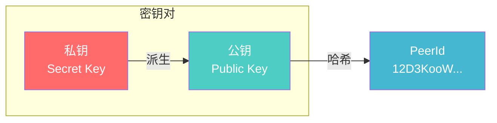
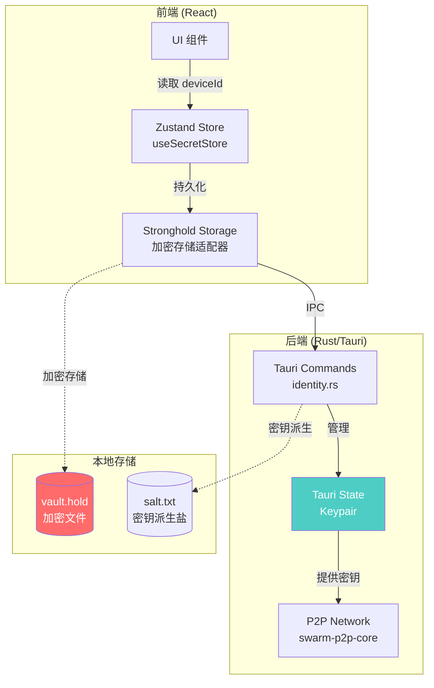
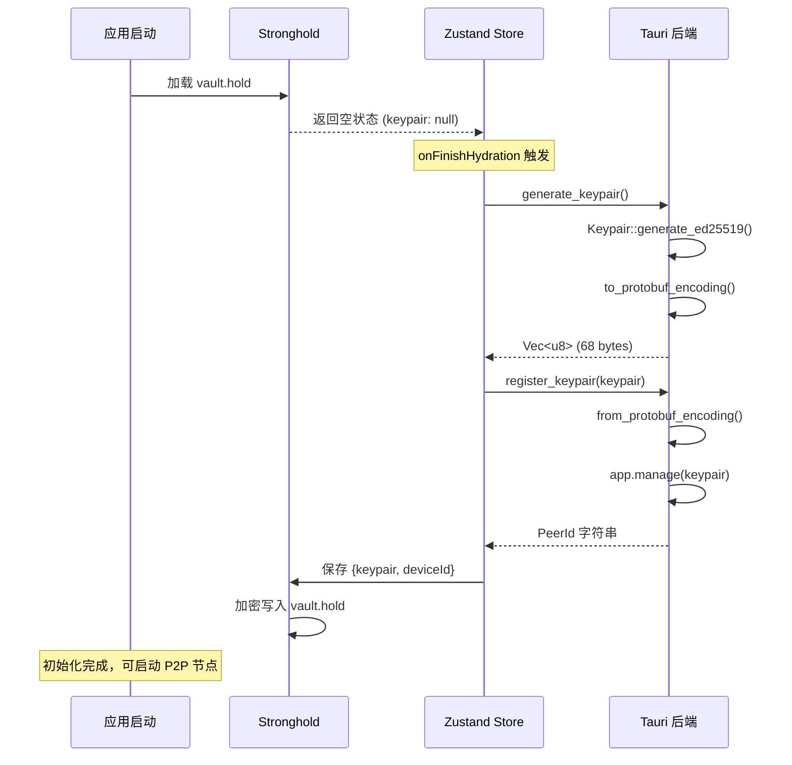
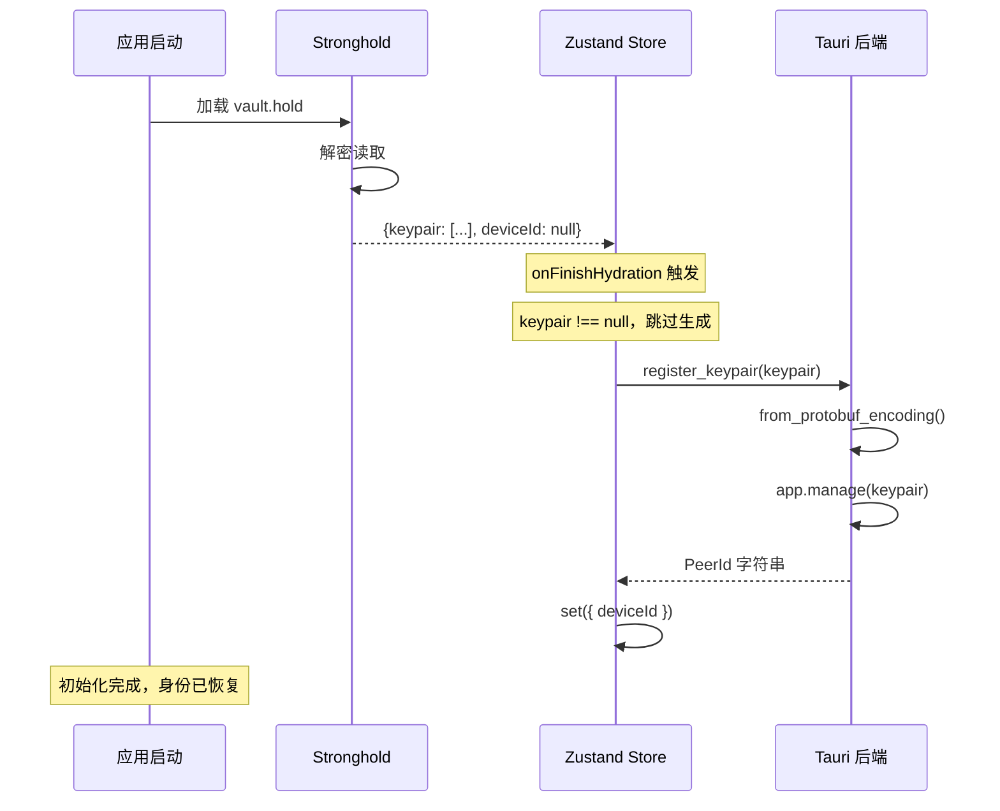
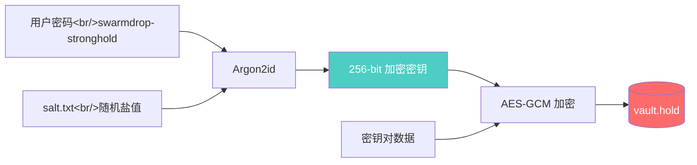
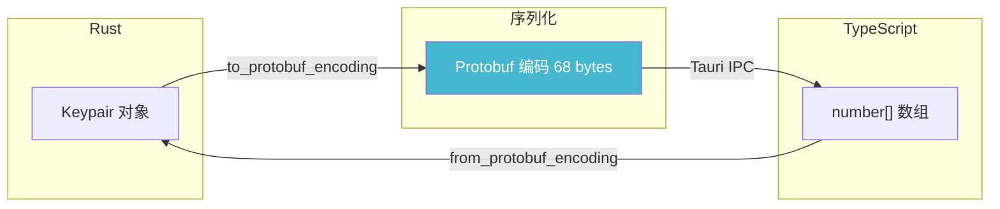
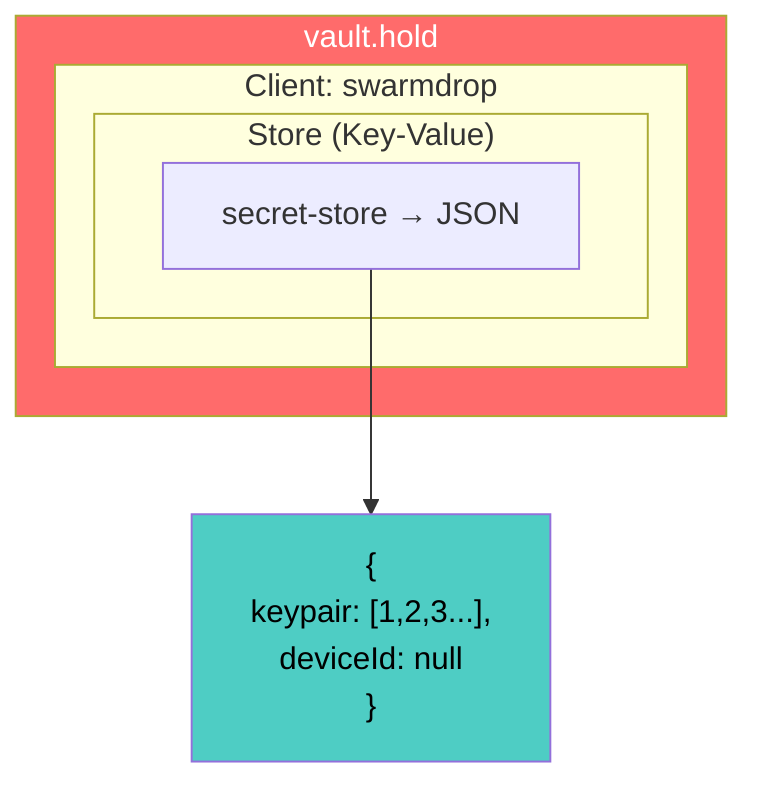
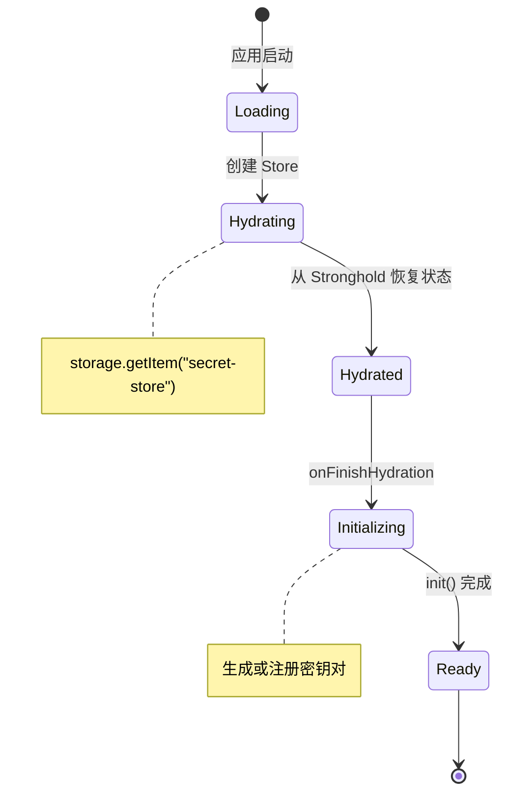
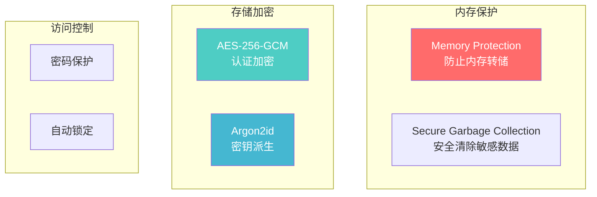
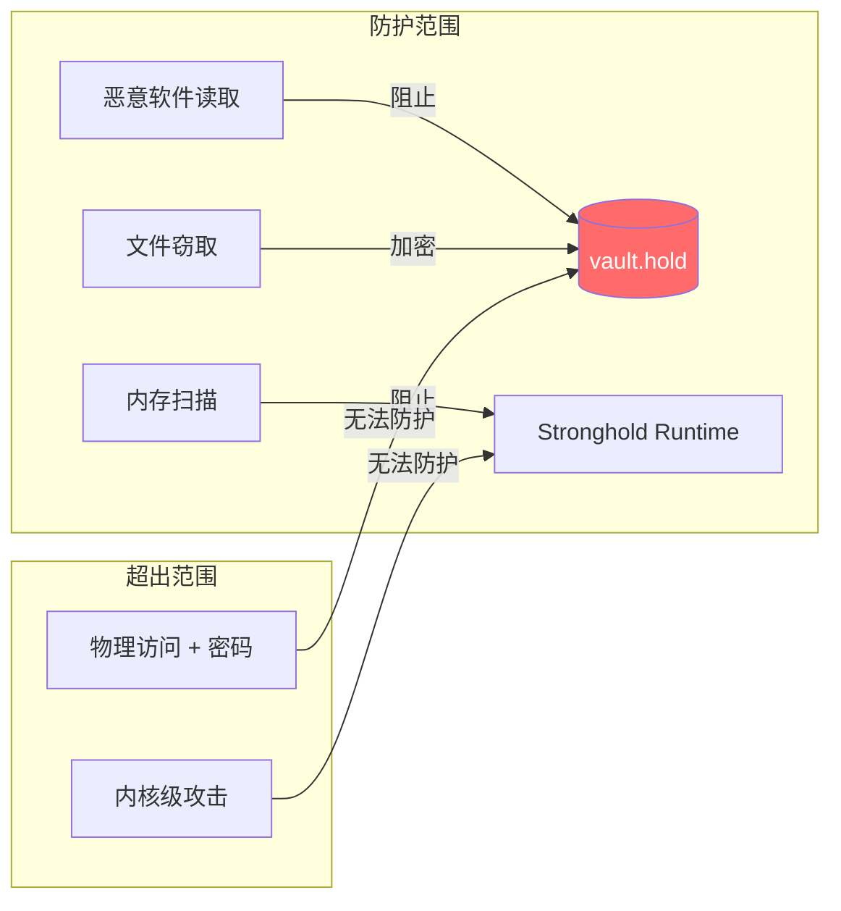

# SwarmDrop 密钥对安全存储方案

本文详细介绍 SwarmDrop 如何实现 libp2p 密钥对的安全存储。作为一个 P2P 文件传输应用，设备身份（密钥对）的安全存储至关重要——它决定了你在网络中的唯一标识。

## 为什么需要安全存储？

在 P2P 网络中，每个节点都有一个唯一的身份标识（PeerId），这个标识由密钥对的公钥派生而来。如果密钥对丢失，你将失去在网络中的身份；如果密钥对泄露，攻击者可以冒充你的身份。



**安全需求：**
- 🔒 密钥对需要加密存储，防止恶意软件读取
- 💾 持久化存储，应用重启后保持身份
- 🔄 跨平台兼容，支持 Windows/macOS/Linux/Mobile
- ⚡ 快速加载，不影响启动体验

## 整体架构

SwarmDrop 采用 **前端状态管理 + 后端安全存储** 的分层架构：



## 技术选型

| 层级 | 技术 | 选择理由 |
|------|------|----------|
| 状态管理 | Zustand + persist | 轻量、TypeScript 友好、支持自定义存储 |
| 加密存储 | tauri-plugin-stronghold | IOTA 基金会开发，专为密钥存储设计 |
| 密钥格式 | Protobuf 编码 | libp2p 标准格式，跨平台兼容 |
| 后端状态 | Tauri State | 类型安全的运行时状态管理 |
| 密钥派生 | Argon2id | 抗 GPU 攻击的密码哈希算法 |

## 数据流详解

### 首次启动流程



### 后续启动流程



## 实现详解

### 第一步：添加依赖

**Rust 依赖 (src-tauri/Cargo.toml):**

```toml
[dependencies]
tauri-plugin-stronghold = "2"
```

**前端依赖 (package.json):**

```bash
pnpm add @tauri-apps/plugin-stronghold zustand
```

### 第二步：配置 Stronghold 插件

Stronghold 需要在 Tauri 的 `setup` hook 中初始化，使用 Argon2id 算法派生加密密钥：

```rust
// src-tauri/src/lib.rs
use tauri::Manager;

#[cfg_attr(mobile, tauri::mobile_entry_point)]
pub fn run() {
    tauri::Builder::default()
        .plugin(tauri_plugin_opener::init())
        .setup(|app| {
            // salt.txt 用于 Argon2id 密钥派生
            let salt_path = app
                .path()
                .app_local_data_dir()?
                .join("salt.txt");

            // 使用 Argon2id 从用户密码派生加密密钥
            app.handle()
                .plugin(tauri_plugin_stronghold::Builder::with_argon2(&salt_path).build())?;

            Ok(())
        })
        .invoke_handler(tauri::generate_handler![
            commands::start,
            commands::shutdown,
            commands::generate_keypair,
            commands::register_keypair,
        ])
        .run(tauri::generate_context!())
        .expect("error while running tauri application");
}
```

**Argon2id 密钥派生流程：**



### 第三步：后端命令实现

创建 `src-tauri/src/commands/identity.rs`：

```rust
use swarm_p2p_core::libp2p::identity::Keypair;
use tauri::{AppHandle, Manager};

use crate::AppResult;

/// 生成新的 Ed25519 密钥对
/// 返回 protobuf 编码的字节数组，便于前端存储
#[tauri::command]
pub async fn generate_keypair() -> AppResult<Vec<u8>> {
    let keypair = Keypair::generate_ed25519();
    keypair
        .to_protobuf_encoding()
        .map_err(|e| crate::AppError::Identity(e.to_string()))
}

/// 注册密钥对到 Tauri 状态管理
/// 应用启动时调用，使后端可以访问密钥对
#[tauri::command]
pub async fn register_keypair(app: AppHandle, keypair: Vec<u8>) -> AppResult<String> {
    let keypair = Keypair::from_protobuf_encoding(&keypair)
        .map_err(|e| crate::AppError::Identity(e.to_string()))?;
    let peer_id = keypair.public().to_peer_id();

    // 存入 Tauri 全局状态，后续通过 State<'_, Keypair> 获取
    app.manage(keypair);

    Ok(peer_id.to_string())
}
```

**为什么用 Protobuf 编码？**

libp2p 的 `Keypair` 不能直接跨 IPC 边界传输，需要序列化：



Protobuf 编码后的 Ed25519 密钥对约 68 字节，包含：
- 密钥类型标识 (Ed25519)
- 32 字节私钥
- 32 字节公钥

### 第四步：前端命令封装

创建 `src/commands/identity.ts`：

```typescript
/**
 * Identity commands
 * 身份/密钥对相关命令
 */

import { invoke } from "@tauri-apps/api/core";

/**
 * 生成新的 Ed25519 密钥对
 * @returns protobuf 编码的密钥对字节数组
 */
export async function generateKeypair(): Promise<number[]> {
  return await invoke("generate_keypair");
}

/**
 * 注册密钥对到后端状态管理
 * @param keypair - protobuf 编码的密钥对字节数组
 * @returns PeerId 字符串
 */
export async function registerKeypair(keypair: number[]): Promise<string> {
  return await invoke("register_keypair", { keypair });
}
```

### 第五步：Stronghold 存储适配器

创建 `src/lib/stronghold.ts`，实现 Zustand 的 `StateStorage` 接口：

```typescript
/**
 * Stronghold Storage Adapter
 * 为 Zustand persist 提供加密存储后端
 */

import type { StateStorage } from "zustand/middleware";
import { Client, Stronghold } from "@tauri-apps/plugin-stronghold";
import { appDataDir } from "@tauri-apps/api/path";

class StrongholdStorage implements StateStorage {
  private store: Awaited<ReturnType<Client["getStore"]>>;
  private stronghold: Stronghold;

  private constructor(
    store: Awaited<ReturnType<Client["getStore"]>>,
    stronghold: Stronghold
  ) {
    this.store = store;
    this.stronghold = stronghold;
  }

  static async create(password: string, clientName = "swarmdrop") {
    const vaultPath = `${await appDataDir()}/vault.hold`;
    const stronghold = await Stronghold.load(vaultPath, password);

    let client: Client;
    try {
      client = await stronghold.loadClient(clientName);
    } catch {
      client = await stronghold.createClient(clientName);
    }

    return new StrongholdStorage(client.getStore(), stronghold);
  }

  getItem = async (name: string): Promise<string | null> => {
    const data = await this.store.get(name);
    if (!data) return null;
    return new TextDecoder().decode(new Uint8Array(data));
  };

  setItem = async (name: string, value: string): Promise<void> => {
    const data = Array.from(new TextEncoder().encode(value));
    await this.store.insert(name, data);
    await this.stronghold.save();
  };

  removeItem = async (name: string): Promise<void> => {
    await this.store.remove(name);
    await this.stronghold.save();
  };
}

// 使用 top-level await 初始化存储实例
export const strongholdStorage = await StrongholdStorage.create(
  "swarmdrop-stronghold"
);
```

**Stronghold 存储结构：**



### 第六步：Zustand 状态管理

创建 `src/stores/secret-store.ts`：

```typescript
/**
 * Secret Store
 * 使用 Zustand + Stronghold 安全存储密钥对
 */

import { create } from "zustand";
import { createJSONStorage, persist } from "zustand/middleware";
import { strongholdStorage } from "@/lib/stronghold";
import { generateKeypair, registerKeypair } from "@/commands/identity";

interface SecretState {
  /** protobuf 编码的密钥对 */
  keypair: number[] | null;
  /** 设备 ID (PeerId) */
  deviceId: string | null;
  /** 是否已完成 hydration */
  _hasHydrated: boolean;
  /** 设置 hydration 状态 */
  setHasHydrated: (state: boolean) => void;
  /** 初始化密钥对（生成或加载） */
  init: () => Promise<void>;
}

export const useSecretStore = create(
  persist<SecretState>(
    (set, get) => ({
      keypair: null,
      deviceId: null,
      _hasHydrated: false,

      setHasHydrated: (state) => set({ _hasHydrated: state }),

      async init() {
        const { keypair } = get();

        if (!keypair) {
          // 首次运行：生成新密钥对
          console.log("Generating new keypair...");
          const newKeypair = await generateKeypair();
          const deviceId = await registerKeypair(newKeypair);
          set({ keypair: newKeypair, deviceId });
          console.log("New keypair generated, deviceId:", deviceId);
        } else {
          // 已有密钥：注册到后端
          console.log("Loading existing keypair...");
          const deviceId = await registerKeypair(keypair);
          set({ deviceId });
          console.log("Keypair loaded, deviceId:", deviceId);
        }
      },
    }),
    {
      name: "secret-store",
      storage: createJSONStorage(() => strongholdStorage),
    }
  )
);

// 状态恢复完成后自动初始化
useSecretStore.persist.onFinishHydration((state) => {
  state.init();
  state.setHasHydrated(true);
});
```

**Zustand Hydration 流程：**



### 第七步：在组件中使用

**检查初始化状态：**

```typescript
// 在需要使用网络功能的地方
import { useSecretStore } from "@/stores/secret-store";

function NetworkButton() {
  const { deviceId, _hasHydrated } = useSecretStore();

  if (!_hasHydrated || !deviceId) {
    return <Button disabled>正在初始化...</Button>;
  }

  return <Button onClick={startNetwork}>启动网络</Button>;
}
```

**启动 P2P 网络：**

```typescript
// src/contexts/network-context.tsx
import { useSecretStore } from "@/stores/secret-store";

const startNode = useCallback(async () => {
  // 检查密钥对是否已注册
  const { deviceId } = useSecretStore.getState();
  if (!deviceId) {
    throw new Error("Keypair not initialized");
  }

  // 启动网络节点
  await start(handleNodeEvent);
}, [handleNodeEvent]);
```

### 第八步：后端获取密钥对

在其他 Tauri 命令中通过 `State` 获取密钥对：

```rust
// src-tauri/src/commands/mod.rs
use swarm_p2p_core::{libp2p::identity::Keypair, NetClient, NodeConfig, NodeEvent};
use tauri::{ipc::Channel, AppHandle, Manager, State};

#[tauri::command]
pub async fn start(
    app: AppHandle,
    keypair: State<'_, Keypair>,  // 从状态中获取
    channel: Channel<NodeEvent>,
) -> crate::AppResult<()> {
    // 使用 keypair 启动 libp2p 节点
    let (client, mut receiver) = swarm_p2p_core::start(&keypair, NodeConfig::default())?;

    // ...事件转发逻辑
    Ok(())
}
```

## 安全考量

### Stronghold 安全特性



### 安全最佳实践

| 方面 | 当前实现 | 生产建议 |
|------|----------|----------|
| 密码 | 硬编码 "swarmdrop-stronghold" | 用户自定义或硬件派生 |
| 盐值 | 自动生成 salt.txt | 考虑备份策略 |
| 内存 | Stronghold 内置保护 | 启用完整内存保护 |
| 备份 | 未实现 | 导出助记词/二维码 |

### 威胁模型



## 文件结构总览

```
swarmdrop/
├── src/
│   ├── commands/
│   │   └── identity.ts          # 前端命令封装
│   ├── stores/
│   │   └── secret-store.ts      # Zustand 状态管理
│   ├── lib/
│   │   └── stronghold.ts        # Stronghold 存储适配器
│   └── contexts/
│       └── network-context.tsx  # 网络上下文（使用 deviceId）
│
├── src-tauri/
│   └── src/
│       ├── lib.rs               # Stronghold 插件配置
│       ├── commands/
│       │   ├── mod.rs           # 命令导出
│       │   └── identity.rs      # 密钥对命令
│       └── error.rs             # 错误类型定义
│
└── AppData/Local/com.gy.swarmdrop/  # 运行时数据目录
    ├── vault.hold               # 加密存储文件
    └── salt.txt                 # Argon2id 盐值
```

## 调试技巧

### 查看 PeerId

```typescript
// 在浏览器控制台
const state = useSecretStore.getState();
console.log("Device ID:", state.deviceId);
// 输出: 12D3KooWxxxxxx...
```

### 重置密钥对

删除以下文件后重启应用：
- `%APPDATA%/com.gy.swarmdrop/vault.hold` (Windows)
- `~/Library/Application Support/com.gy.swarmdrop/vault.hold` (macOS)
- `~/.local/share/com.gy.swarmdrop/vault.hold` (Linux)

### 查看 Rust 日志

```bash
RUST_LOG=swarmdrop=debug pnpm tauri dev
```

## 参考资料

- [tauri-plugin-stronghold](https://github.com/tauri-apps/plugins-workspace/tree/v2/plugins/stronghold) - Tauri Stronghold 插件
- [IOTA Stronghold](https://github.com/iotaledger/stronghold.rs) - Stronghold 底层实现
- [Zustand persist](https://docs.pmnd.rs/zustand/integrations/persisting-store-data) - Zustand 持久化文档
- [libp2p identity](https://docs.rs/libp2p/latest/libp2p/identity/index.html) - libp2p 身份模块
- [Argon2](https://www.password-hashing.net/) - Argon2 密码哈希算法
