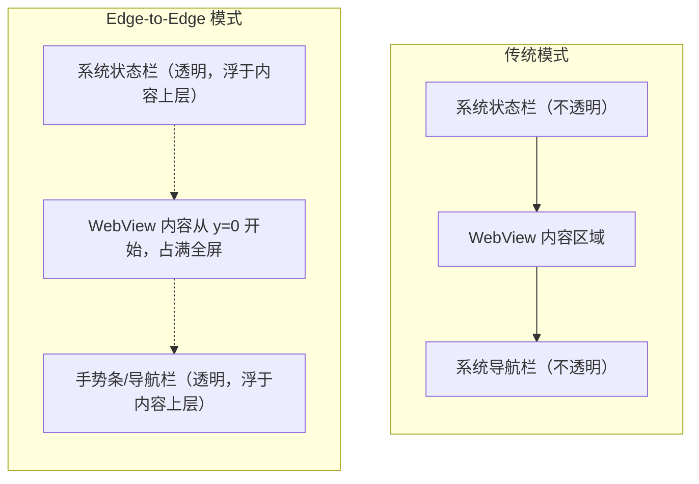
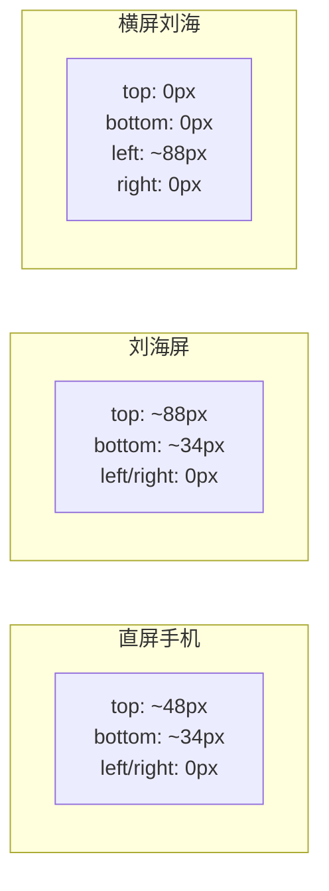
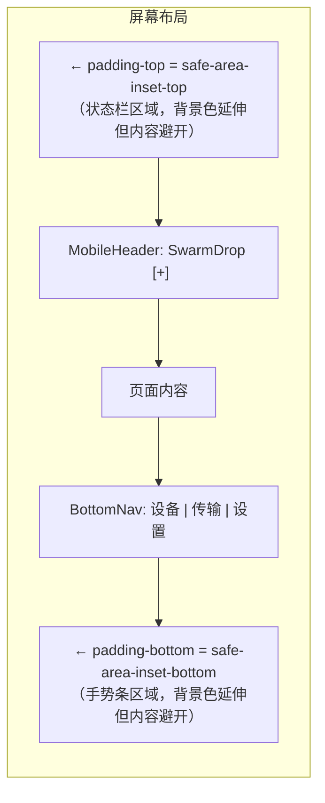
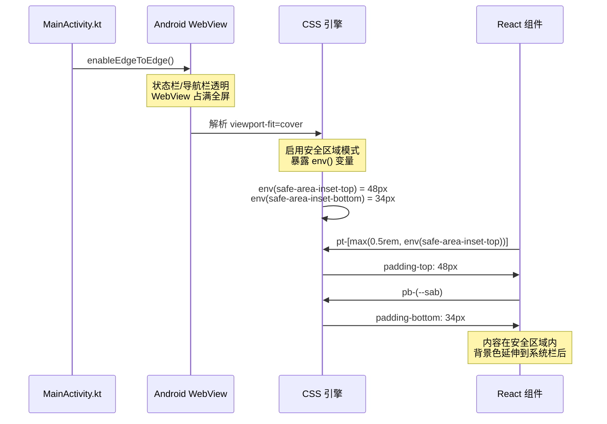

# 移动端安全区域（Safe Area）适配指南

## 背景

SwarmDrop 使用 Tauri v2 构建，Android 端在 `MainActivity.kt` 中调用了 `enableEdgeToEdge()`，使 WebView 内容延伸到系统状态栏和导航栏后面（Edge-to-Edge 模式）。这带来了沉浸式的视觉体验，但也意味着**前端需要自行处理内容避让**，否则顶部内容会被状态栏遮挡，底部内容会被手势条覆盖。

## 核心概念

### Edge-to-Edge 模式



传统模式下系统会自动给 WebView 一个偏移量，内容不会与系统栏重叠。Edge-to-Edge 模式取消了这个偏移，内容占满整个屏幕。

### 安全区域（Safe Area）

安全区域是屏幕上**不被系统 UI 遮挡**的矩形区域。不同设备的安全区域不同：



## 实现机制（三层）

### 第一层：viewport-fit=cover

```html
<!-- index.html -->
<meta name="viewport" content="width=device-width, initial-scale=1.0, viewport-fit=cover" />
```

这个声明告诉 WebView：「我的页面要占满整个屏幕，包括刘海、圆角、手势条区域」。

**这是前提条件。** 没有 `viewport-fit=cover`，浏览器/WebView 会：
1. 自动将内容缩进到安全区域内（相当于传统模式）
2. `env(safe-area-inset-*)` 全部返回 `0px`

`viewport-fit` 有三个值：

| 值 | 行为 |
|---|---|
| `auto` | 默认值，等同于 `contain` |
| `contain` | 内容限制在安全区域内，不会被遮挡 |
| `cover` | 内容占满整个视口，需要手动处理避让 |

### 第二层：CSS 环境变量

浏览器在 `viewport-fit=cover` 模式下暴露 4 个 CSS 环境变量：

```css
env(safe-area-inset-top)    /* 顶部：状态栏高度 */
env(safe-area-inset-bottom) /* 底部：手势条/虚拟按键高度 */
env(safe-area-inset-left)   /* 左侧：横屏刘海 */
env(safe-area-inset-right)  /* 右侧：横屏刘海 */
```

这些值由系统动态提供，**不同设备值不同**，不能硬编码。

为了方便在 Tailwind 中使用，我们在 `index.css` 中定义了短名变量：

```css
:root {
  --sat: env(safe-area-inset-top, 0px);
  --sab: env(safe-area-inset-bottom, 0px);
  --sal: env(safe-area-inset-left, 0px);
  --sar: env(safe-area-inset-right, 0px);
}
```

第二个参数 `0px` 是回退值，用于不支持 `env()` 的环境（桌面浏览器）。

### 第三层：在关键位置应用 padding



## 项目中的具体实现

### MobileHeader（顶部标题栏）

```tsx
// src/routes/_app.tsx
<header className="... pt-[max(0.5rem,env(safe-area-inset-top))]">
```

- `max()` 确保在桌面端（`env()` 返回 `0px`）至少有 `0.5rem` 基础间距
- 在 Android 端，`env(safe-area-inset-top)` 通常是 `48px` 左右，`max()` 取较大值

### BottomNav（底部导航栏）

```tsx
// src/components/layout/bottom-nav.tsx
<nav className="... pb-(--sab)">
```

- `pb-(--sab)` 是 Tailwind v4 语法，等同于 `padding-bottom: var(--sab)`
- `--sab` 即 `env(safe-area-inset-bottom, 0px)`
- 底部导航的背景色自然延伸到手势条后面，但导航图标和文字在安全区域内

### AuthLayout（认证页面）

```tsx
// src/routes/_auth.tsx
<AuroraBackground className="... pt-[max(1rem,env(safe-area-inset-top))] pb-[max(1rem,env(safe-area-inset-bottom))]">
```

- 认证页面没有 MobileHeader 和 BottomNav，直接在外层容器处理顶底避让
- 基础间距 `1rem`，有安全区域时取较大值

### ForceUpdateDialog（强制更新弹窗）

```tsx
// src/components/ForceUpdateDialog.tsx
<div className="fixed inset-0 z-50 flex items-center justify-center ... p-6">
```

- 全屏遮罩 + 居中弹窗，`p-6` 提供了足够的内边距
- 弹窗内容不会贴边，无需额外处理安全区域

## 为什么不在全局 body 上加 padding？

因为不同区域需要**不同的避让策略**：

| 区域 | 策略 |
|---|---|
| MobileHeader | **背景色延伸**到状态栏后面，**内容**避让到安全区域内 |
| BottomNav | **背景色延伸**到手势条后面，**导航项**避让到安全区域内 |
| 桌面端侧边栏 | 不需要任何避让 |
| 全屏弹窗 | 自带足够 padding，无需额外处理 |

如果在 `body` 上统一加 padding：
- 背景色无法延伸到系统栏后面（失去沉浸效果）
- 桌面端会多出不必要的空白
- 不同页面无法灵活控制

## Android 端的完整链路



## 开发注意事项

### 新增页面时

1. **如果页面在 `_app` 布局内**：MobileHeader 和 BottomNav 已处理安全区域，页面内容无需额外处理
2. **如果是独立全屏页面**（如认证页面）：需要自行添加 `pt-[max(...,env(safe-area-inset-top))]` 和 `pb-[max(...,env(safe-area-inset-bottom))]`
3. **如果是 `fixed` 定位的元素**：需要根据位置添加对应方向的安全区域 padding

### 调试方法

Chrome DevTools 不支持模拟 `env(safe-area-inset-*)`。调试方式：

1. **Android 真机**：`pnpm android:dev`，直接在设备上查看
2. **临时硬编码**：开发时可临时将 `--sat` 设为固定值来模拟

```css
/* 临时调试用，提交前删除 */
:root {
  --sat: 48px;
  --sab: 34px;
}
```

### 常见陷阱

- `env()` 在不支持的浏览器中整个声明会失效，所以要用 CSS 变量 + 回退值的方式
- `max()` 中不能有空格在逗号后面以外的地方（Tailwind 任意值语法限制）
- Tailwind v4 的 `pb-(--sab)` 语法等同于 `pb-[var(--sab)]`，前者更简洁
