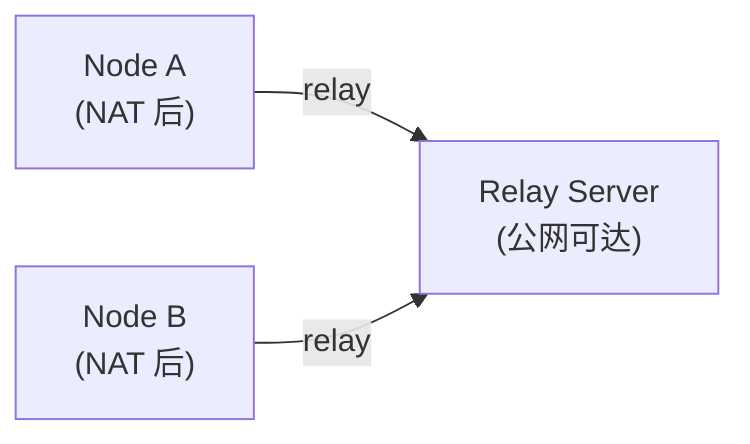
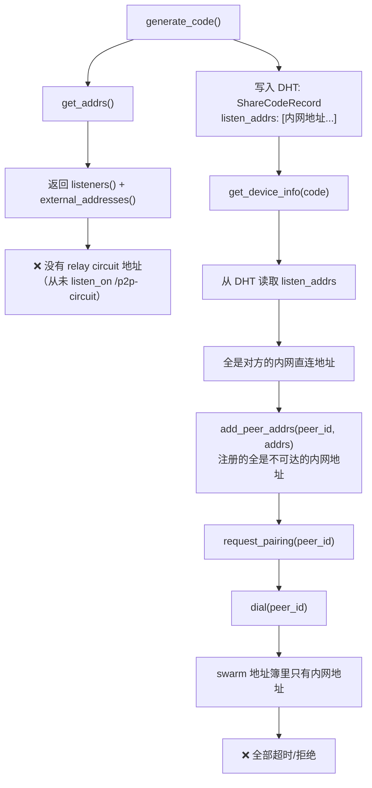
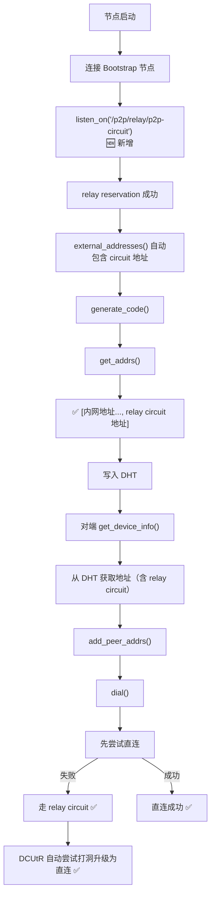

# 修复 libp2p 跨网络 Dial 失败：缺失 Relay Circuit 地址

## 问题现象

SwarmDrop 在局域网内配对正常，但跨网络配对时 dial 对端节点必定失败，错误日志如下：

```log
Dial error: Failed to negotiate transport protocol(s): [
  (/ip4/127.0.0.1/tcp/57083/p2p/12D3KooW...: Connection refused)
  (/ip4/100.100.200.77/tcp/57083/p2p/12D3KooW...: Timeout)
  (/ip4/172.25.192.1/tcp/57083/p2p/12D3KooW...: Timeout)
  (/ip4/192.168.0.111/tcp/57083/p2p/12D3KooW...: Timeout)
]
```

关键观察：**所有尝试的地址都是直连地址（loopback、内网 IP），没有任何 relay circuit 地址。**

## 背景知识

### libp2p Relay 的工作原理

当两个节点都在 NAT 后面无法直连时，需要通过一个公网可达的 relay 节点中转流量：



relay circuit 地址的格式为：

```text
/ip4/<relay_ip>/tcp/<port>/p2p/<relay_peer_id>/p2p-circuit/p2p/<target_peer_id>
```

### Relay Client 的两个层面

libp2p 的 relay client 有两个独立的功能：

1. **主动通过 relay 连接别人** — 在 `SwarmBuilder` 中 `.with_relay_client()` 启用，这部分我们已经有了
2. **让别人通过 relay 连接自己** — 需要主动向 relay server 申请 **reservation（预约）**，通过 `swarm.listen_on("<relay_addr>/p2p-circuit")` 触发

我们只做了第 1 步，漏掉了第 2 步。

## 根因分析

### 配对流程中的地址传递链路



### 为什么 `get_addrs()` 不包含 relay 地址？

`get_addrs()` 的实现（`libs/core/src/command/get_listen_addrs.rs`）：

```rust
let mut addrs: Vec<Multiaddr> = swarm.listeners().cloned().collect();
addrs.extend(swarm.external_addresses().cloned());
```

relay circuit 地址只有在成功申请 reservation 后才会出现在 `listeners()` 和 `external_addresses()` 中。而申请 reservation 需要显式调用 `swarm.listen_on()`。

## 修复方案

在 `connect_bootstrap_peers()` 中，dial bootstrap 节点的同时，向其申请 relay reservation：

```rust
// libs/core/src/runtime/event_loop.rs

pub fn connect_bootstrap_peers(&mut self, peers: &[(PeerId, Multiaddr)]) {
    for (peer_id, addr) in peers {
        // ... 原有的 kad.add_address + dial 逻辑 ...

        // 【新增】向 bootstrap 节点申请 relay reservation
        let base = if addr.iter().any(|p| matches!(p, Protocol::P2p(_))) {
            addr.clone()
        } else {
            addr.clone().with(Protocol::P2p(*peer_id))
        };
        let relay_addr = base.with(Protocol::P2pCircuit);
        match self.swarm.listen_on(relay_addr.clone()) {
            Ok(_) => info!("Requesting relay reservation via {}", relay_addr),
            Err(e) => warn!("Failed to listen on relay circuit {}: {}", relay_addr, e),
        }
    }
}
```

### 为什么选择在这里实现？

- **时机正确**：bootstrap 节点就是 relay server，连接它的同时申请 reservation 是最自然的时机
- **改动最小**：只需在一个方法里加几行代码，不需要新增 Command 或 Client API
- **自动生效**：reservation 成功后，libp2p 自动将 circuit 地址加入 `external_addresses()`，下游的 `get_addrs()` → DHT 发布 → 对端 dial 整条链路无需改动

### 修复后的连接流程



## 注意事项

### 地址构造的细节

bootstrap 地址在 `parse_bootstrap_peers()` 中解析后已经包含 `/p2p/<peer_id>` 后缀：

```text
/ip4/47.115.172.218/tcp/4001/p2p/12D3KooWCq8x...
```

直接追加 `/p2p/<peer_id>` 会导致重复，所以代码中先检查是否已包含 `/p2p/` 协议段。

### Reservation 的生命周期

- libp2p relay v2 的 reservation 默认有效期为 **1 小时**
- relay client 会在到期前**自动续约**，无需手动管理
- 如果 relay server 断开连接，reservation 失效，需要重新连接后再次 `listen_on`

### 单点风险

目前只有一台 bootstrap/relay 节点（`47.115.172.218`）。如果该节点不可用，跨网络连接就无法建立。后续可以考虑：

- 增加多个 relay 节点
- 实现 relay 节点的健康检查和自动切换
