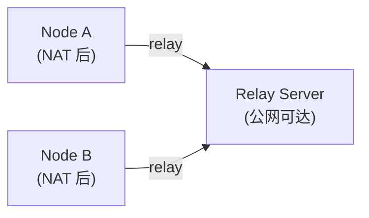
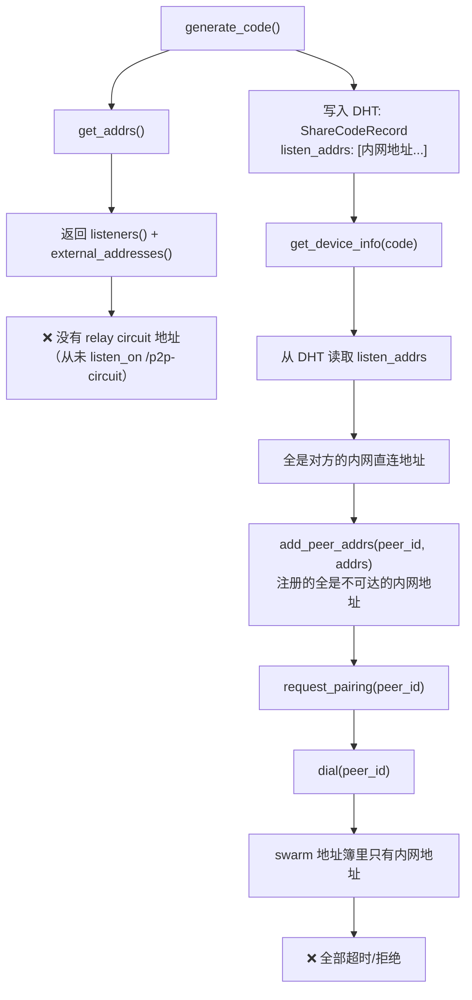
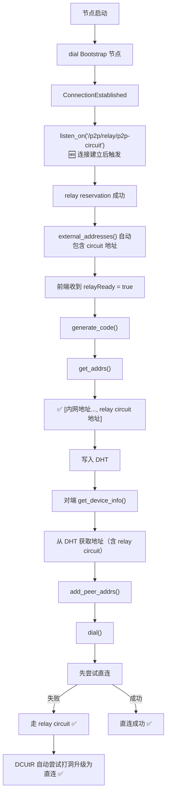

# 修复 libp2p 跨网络 Dial 失败：缺失 Relay Circuit 地址

## 问题现象

SwarmDrop 在局域网内配对正常，但跨网络配对时 dial 对端节点必定失败，错误日志如下：

```log
Dial error: Failed to negotiate transport protocol(s): [
  (/ip4/127.0.0.1/tcp/57083/p2p/12D3KooW...: Connection refused)
  (/ip4/100.100.200.77/tcp/57083/p2p/12D3KooW...: Timeout)
  (/ip4/172.25.192.1/tcp/57083/p2p/12D3KooW...: Timeout)
  (/ip4/192.168.0.111/tcp/57083/p2p/12D3KooW...: Timeout)
]
```

关键观察：**所有尝试的地址都是直连地址（loopback、内网 IP），没有任何 relay circuit 地址。**

## 背景知识

### libp2p Relay 的工作原理

当两个节点都在 NAT 后面无法直连时，需要通过一个公网可达的 relay 节点中转流量：



relay circuit 地址的格式为：

```text
/ip4/<relay_ip>/tcp/<port>/p2p/<relay_peer_id>/p2p-circuit/p2p/<target_peer_id>
```

### Relay Client 的两个层面

libp2p 的 relay client 有两个独立的功能：

1. **主动通过 relay 连接别人** — 在 `SwarmBuilder` 中 `.with_relay_client()` 启用，这部分我们已经有了
2. **让别人通过 relay 连接自己** — 需要主动向 relay server 申请 **reservation（预约）**，通过 `swarm.listen_on("<relay_addr>/p2p-circuit")` 触发

我们只做了第 1 步，漏掉了第 2 步。

### Relay Client 事件

`libp2p::relay::client::Event` 有三个变体，对应 relay 连接生命周期的三个阶段：

- **`ReservationReqAccepted`** — relay server 接受了 reservation 请求。收到后 swarm 自动将 circuit 地址注册为监听地址。`renewal` 字段区分首次预约和续约。
- **`OutboundCircuitEstablished`** — 本节点主动通过 relay 连接到别人时触发。
- **`InboundCircuitEstablished`** — 别人通过 relay 连接到本节点时触发（前提是有有效 reservation）。

## 根因分析

### 配对流程中的地址传递链路



### 为什么 `get_addrs()` 不包含 relay 地址？

`get_addrs()` 的实现（`libs/core/src/command/get_listen_addrs.rs`）：

```rust
let mut addrs: Vec<Multiaddr> = swarm.listeners().cloned().collect();
addrs.extend(swarm.external_addresses().cloned());
```

relay circuit 地址只有在成功申请 reservation 后才会出现在 `listeners()` 和 `external_addresses()` 中。而申请 reservation 需要显式调用 `swarm.listen_on()`。

## 修复方案

修复涉及两个问题：

### 问题 1：Client 端 — reservation 时机不对

最初的方案是在 `connect_bootstrap_peers()` 中 dial 的同时调用 `listen_on(p2p-circuit)`。但 `dial()` 是异步的，调用时连接还没建立，relay client transport 找不到已建立的连接，listener 立即关闭：

```log
Listener ListenerId(7) closed (addresses: []): Ok(())
```

**修复**：将 relay reservation 延迟到 `ConnectionEstablished` 事件中触发。在 `EventLoop` 中用 `bootstrap_peers: HashMap<PeerId, Vec<Multiaddr>>` 记录 bootstrap 节点地址，连接建立后再申请：

```rust
// libs/core/src/runtime/event_loop.rs

// connect_bootstrap_peers() 中只记录，不 listen_on
self.bootstrap_peers
    .entry(*peer_id)
    .or_default()
    .push(addr.clone());

// ConnectionEstablished 事件中触发 reservation
SwarmEvent::ConnectionEstablished { peer_id, num_established, .. }
    if num_established.get() == 1 =>
{
    if let Some(addrs) = self.bootstrap_peers.remove(&peer_id) {
        for addr in addrs {
            let relay_addr = ensure_p2p_suffix(addr, peer_id)
                .with(Protocol::P2pCircuit);
            self.swarm.listen_on(relay_addr);
        }
    }
    Some(NodeEvent::PeerConnected { peer_id })
}
```

### 问题 2：Server 端 — reservation 响应不含地址

连接建立后 reservation 请求成功发出，但 relay server 响应中不包含任何地址，client 报错：

```log
Listener closed: Err(Reservation(Protocol(NoAddressesInReservation)))
```

原因是 relay server（bootstrap 节点）没有注册外部地址。libp2p relay v2 在发送 reservation 响应时，会把 server 的 `external_addresses()` 附带给 client。如果 server 没有外部地址，响应就是空的。

**修复**：在 bootstrap server 启动时通过 `--external-ip` 参数注册公网地址：

```rust
// libs/bootstrap/src/lib.rs

pub async fn run(
    keypair: Keypair,
    tcp_addr: Multiaddr,
    quic_addr: Multiaddr,
    idle_timeout: Duration,
    external_addrs: Vec<Multiaddr>,  // 新增
) -> Result<()> {
    let mut swarm = /* ... */;

    // 注册公网地址，relay reservation 响应会携带这些地址给 client
    for addr in &external_addrs {
        swarm.add_external_address(addr.clone());
    }
    // ...
}
```

部署时：

```bash
swarm-bootstrap --external-ip 47.115.172.218
```

### 前端感知 relay 状态

新增 `NodeEvent::RelayReservationAccepted` 事件，通过 `NetworkStatus.relayReady` 字段暴露给前端：

- `libs/core/src/event.rs` — 新增 `RelayReservationAccepted` 变体
- `libs/core/src/runtime/event_loop.rs` — 将 `RelayClient::ReservationReqAccepted` 转为 `NodeEvent`
- `src-tauri/src/network/mod.rs` — `NetworkStatus` 新增 `relay_ready: bool`
- `src-tauri/src/network/manager.rs` — `SharedNetRefs` 新增 `relay_ready` 状态
- `src-tauri/src/network/event_loop.rs` — 收到事件时设置 `relay_ready = true` 并推送 `network-status-changed`
- `src/commands/network.ts` — `NetworkStatus` 类型新增 `relayReady: boolean`

### 修复后的连接流程



## 注意事项

### 地址构造的细节

bootstrap 地址在 `parse_bootstrap_peers()` 中解析后已经包含 `/p2p/<peer_id>` 后缀：

```text
/ip4/47.115.172.218/tcp/4001/p2p/12D3KooWCq8x...
```

直接追加 `/p2p/<peer_id>` 会导致重复，所以代码中先检查是否已包含 `/p2p/` 协议段。

### Reservation 的生命周期

- libp2p relay v2 的 reservation 默认有效期为 **1 小时**
- relay client 会在到期前**自动续约**，无需手动管理
- 如果 relay server 断开连接，reservation 失效，需要重新连接后再次 `listen_on`

### 单点风险

目前只有一台 bootstrap/relay 节点（`47.115.172.218`）。如果该节点不可用，跨网络连接就无法建立。后续可以考虑：

- 增加多个 relay 节点
- 实现 relay 节点的健康检查和自动切换

## 踩坑记录

### 坑 1：listen_on 时机过早

在 `connect_bootstrap_peers()` 中 dial 后立即 `listen_on(p2p-circuit)`，此时 TCP 连接还没建立，relay client transport 找不到到 relay server 的连接，listener 静默关闭（`addresses: []`）。

**教训**：relay reservation 必须在到 relay server 的连接建立之后才能发起。

### 坑 2：Listener 关闭被 `_ => None` 吞掉

`convert_to_node_event` 的 catch-all 分支 `_ => None` 会吞掉 `ListenerClosed`、`ListenerError` 等重要诊断事件，导致 reservation 失败时没有任何日志。

**教训**：对 `ListenerClosed` 和 `ListenerError` 事件应该打 WARN 日志，方便排查问题。

### 坑 3：Relay Server 没有外部地址

relay server 在公网上运行，但没有调用 `swarm.add_external_address()`。libp2p relay v2 的 reservation 响应会携带 server 的外部地址列表，如果为空则 client 报 `NoAddressesInReservation` 错误。

**教训**：公网部署的 relay server 必须显式注册外部地址。
