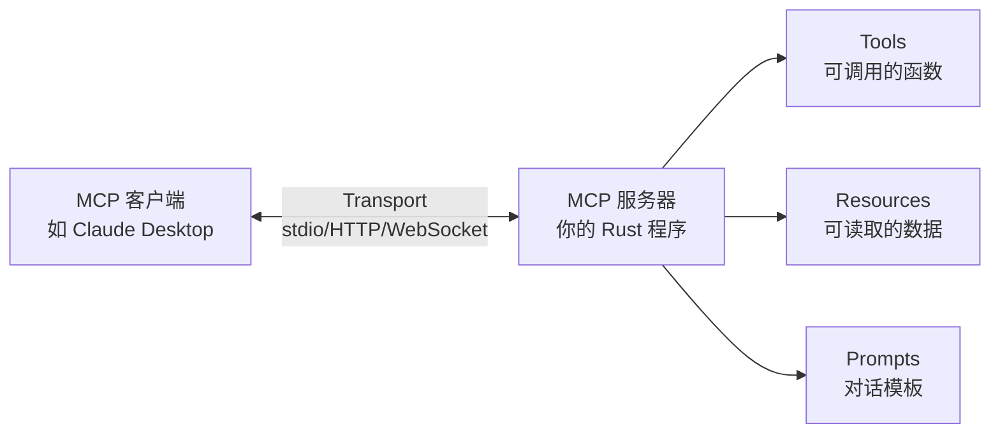

# RMCP 教程：用 Rust 构建 MCP 服务器与客户端

> RMCP 是 Model Context Protocol (MCP) 的官方 Rust 实现，提供了类型安全、异步优先的 API，让你可以用 Rust 快速构建 MCP 服务器和客户端。

## 目录

- [什么是 MCP](#什么是-mcp)
- [快速开始](#快速开始)
- [核心概念](#核心概念)
- [构建 MCP 服务器](#构建-mcp-服务器)
- [构建 MCP 客户端](#构建-mcp-客户端)
- [传输层](#传输层)
- [高级功能](#高级功能)
- [实战：构建一个文件管理 MCP 服务器](#实战构建一个文件管理-mcp-服务器)
- [总结](#总结)

---

## 什么是 MCP

MCP (Model Context Protocol) 是一个开放协议，标准化了 AI 应用与外部工具、数据源之间的通信方式。你可以把它理解为 AI 世界的"USB 接口"——只要实现了 MCP 协议，任何工具都能被 AI 调用。

MCP 的核心能力包括：

- **Tools（工具）**：AI 可以调用的函数，比如查询数据库、发送邮件
- **Resources（资源）**：AI 可以读取的数据源，比如文件内容、配置信息
- **Prompts（提示）**：预定义的对话模板，帮助 AI 更好地完成特定任务

## 快速开始

### 环境要求

- Rust 2024 edition（rustc 1.85+）
- Tokio 异步运行时

### 添加依赖

```toml
[dependencies]
rmcp = { version = "1.1", features = ["server", "transport-io", "macros"] }
tokio = { version = "1", features = ["full"] }
serde = { version = "1", features = ["derive"] }
schemars = "0.8"
```

Feature flags 说明：

| Feature | 用途 |
|---------|------|
| `server` | 服务器功能 |
| `client` | 客户端功能 |
| `macros` | 过程宏（`#[tool]`、`#[prompt]` 等） |
| `transport-io` | stdio 传输（服务器端） |
| `transport-child-process` | stdio 传输（客户端，通过子进程连接） |
| `transport-streamable-http-server` | HTTP 服务器传输 |
| `transport-streamable-http-client` | HTTP 客户端传输 |
| `auth` | OAuth 2.0 认证 |

### 30 秒写一个 MCP 服务器

```rust
use rmcp::{ServerHandler, ServiceExt, model::*, tool::*, transport::stdio};
use std::sync::Arc;
use tokio::sync::Mutex;

#[derive(Clone)]
struct HelloServer;

#[tool_router]
impl HelloServer {
    /// 打个招呼
    #[tool(description = "Say hello to someone")]
    fn hello(
        &self,
        #[tool(param, description = "Name of the person")] name: String,
    ) -> Result<CallToolResult, McpError> {
        Ok(CallToolResult::success(vec![
            Content::text(format!("Hello, {name}!"))
        ]))
    }
}

#[tool_handler]
impl ServerHandler for HelloServer {
    fn get_info(&self) -> ServerInfo {
        ServerInfo {
            instructions: Some("A simple hello server".into()),
            capabilities: ServerCapabilities::builder()
                .enable_tools()
                .build(),
            ..Default::default()
        }
    }
}

#[tokio::main]
async fn main() -> anyhow::Result<()> {
    let server = HelloServer.serve(stdio()).await?;
    server.waiting().await?;
    Ok(())
}
```

这就是一个完整的 MCP 服务器！它通过 stdio 传输，提供了一个 `hello` 工具。任何 MCP 客户端（比如 Claude Desktop）都可以连接并调用这个工具。

---

## 核心概念

### 架构总览



### 两种角色

RMCP 有两种角色：

- **RoleServer**：服务器端，提供工具/资源/提示
- **RoleClient**：客户端端，调用服务器的工具/资源/提示

### Service trait

所有 MCP 通信都通过 `Service` trait 驱动：

```rust
pub trait Service<R: ServiceRole>: Send + Sync + 'static {
    // 处理对方发来的请求
    async fn handle_request(&self, request: R::PeerReq, context: RequestContext<R>)
        -> Result<R::Resp, McpError>;

    // 处理对方发来的通知
    async fn handle_notification(&self, notification: R::PeerNot, context: NotificationContext<R>)
        -> Result<(), McpError>;

    // 返回自身信息
    fn get_info(&self) -> R::Info;
}
```

你不需要直接实现这个 trait。RMCP 提供了更高层的 `ServerHandler` 和 `ClientHandler`，让你只需关注业务逻辑。

### Peer - 与对方通信

在处理请求时，你可以通过 `context.peer` 与对方通信：

```rust
// 服务器可以向客户端发送通知
context.peer.notify_progress(ProgressNotificationParam { ... }).await?;

// 服务器可以请求客户端执行采样（LLM 调用）
context.peer.create_message(CreateMessageRequestParams { ... }).await?;
```

### RunningService - 启动与等待

调用 `.serve(transport)` 后返回 `RunningService`，它管理服务的生命周期：

```rust
let server = my_service.serve(stdio()).await?;

// 等待服务结束
server.waiting().await?;

// 或者主动取消
server.cancel().await?;

// 访问底层 service 和 peer
server.service();  // &MyService
server.peer();     // &Peer<RoleServer>
```

---

## 构建 MCP 服务器

### 方式一：使用宏（推荐）

RMCP 提供了三组宏，大幅简化服务器开发：

#### 定义工具：`#[tool]` + `#[tool_router]`

```rust
use rmcp::{ServerHandler, model::*, tool::*};
use serde::Deserialize;
use schemars::JsonSchema;

#[derive(Clone)]
struct Calculator {
    tool_router: ToolRouter<Calculator>,
}

#[tool_router]
impl Calculator {
    /// 加法运算
    #[tool(description = "Add two numbers")]
    fn add(
        &self,
        #[tool(param, description = "First number")] a: f64,
        #[tool(param, description = "Second number")] b: f64,
    ) -> Result<CallToolResult, McpError> {
        Ok(CallToolResult::success(vec![
            Content::text(format!("{}", a + b))
        ]))
    }

    /// 使用结构体参数
    #[tool(description = "Multiply two numbers")]
    fn multiply(
        &self,
        Parameters(args): Parameters<MultiplyArgs>,
    ) -> Result<CallToolResult, McpError> {
        Ok(CallToolResult::success(vec![
            Content::text(format!("{}", args.a * args.b))
        ]))
    }

    /// 异步工具，可访问请求上下文
    #[tool(description = "A slow computation")]
    async fn slow_compute(
        &self,
        #[tool(param, description = "Input value")] input: i32,
        ctx: RequestContext<RoleServer>,
    ) -> Result<CallToolResult, McpError> {
        // 发送进度通知
        ctx.peer.notify_progress(ProgressNotificationParam {
            progress_token: ProgressToken::number(1),
            progress: 0.5,
            total: Some(1.0),
            message: Some("Computing...".into()),
        }).await.ok();

        tokio::time::sleep(std::time::Duration::from_secs(1)).await;

        Ok(CallToolResult::success(vec![
            Content::text(format!("Result: {}", input * 2))
        ]))
    }
}

#[derive(Deserialize, JsonSchema)]
struct MultiplyArgs {
    /// First number
    a: f64,
    /// Second number
    b: f64,
}
```

`#[tool]` 宏支持的属性：

| 属性 | 说明 |
|------|------|
| `name = "..."` | 自定义工具名（默认使用函数名） |
| `description = "..."` | 工具描述 |
| `annotations(...)` | 元数据注解 |
| `execution(task_support = "...")` | 任务支持级别 |

`#[tool(param)]` 用于标注内联参数，会自动生成 JSON Schema。

#### 挂载路由：`#[tool_handler]`

```rust
#[tool_handler]
impl ServerHandler for Calculator {
    fn get_info(&self) -> ServerInfo {
        ServerInfo {
            instructions: Some("A calculator MCP server".into()),
            capabilities: ServerCapabilities::builder()
                .enable_tools()
                .build(),
            ..Default::default()
        }
    }
}
```

`#[tool_handler]` 会自动生成 `call_tool()` 和 `list_tools()` 方法的实现，将请求路由到 `ToolRouter`。

#### 定义提示：`#[prompt]` + `#[prompt_router]` + `#[prompt_handler]`

```rust
#[derive(Clone)]
struct MyServer {
    tool_router: ToolRouter<MyServer>,
    prompt_router: PromptRouter<MyServer>,
}

#[prompt_router]
impl MyServer {
    #[prompt(name = "code_review", description = "Review code for quality")]
    async fn code_review(
        &self,
        #[prompt(param, description = "Code to review")] code: String,
        #[prompt(param, description = "Programming language")] language: Option<String>,
    ) -> Result<GetPromptResult, McpError> {
        let lang = language.unwrap_or_else(|| "unknown".into());
        Ok(GetPromptResult {
            description: Some("Code review prompt".into()),
            messages: vec![
                PromptMessage::new_text(
                    PromptMessageRole::User,
                    format!("Please review the following {lang} code:\n\n```{lang}\n{code}\n```"),
                ),
            ],
        })
    }
}

#[tool_handler]
#[prompt_handler]
impl ServerHandler for MyServer {
    fn get_info(&self) -> ServerInfo {
        ServerInfo {
            capabilities: ServerCapabilities::builder()
                .enable_tools()
                .enable_prompts()
                .build(),
            ..Default::default()
        }
    }
}
```

### 方式二：手动实现

如果你不想使用宏，也可以直接实现 `ServerHandler`：

```rust
#[derive(Clone)]
struct ManualServer;

impl ServerHandler for ManualServer {
    fn get_info(&self) -> ServerInfo {
        ServerInfo {
            capabilities: ServerCapabilities::builder()
                .enable_tools()
                .build(),
            ..Default::default()
        }
    }

    async fn list_tools(
        &self,
        _request: Option<PaginatedRequestParams>,
        _context: RequestContext<RoleServer>,
    ) -> Result<ListToolsResult, McpError> {
        Ok(ListToolsResult {
            tools: vec![
                Tool::new("greet", "Greet someone", json!({
                    "type": "object",
                    "properties": {
                        "name": { "type": "string", "description": "Name" }
                    },
                    "required": ["name"]
                })),
            ],
            next_cursor: None,
        })
    }

    async fn call_tool(
        &self,
        request: CallToolRequestParams,
        _context: RequestContext<RoleServer>,
    ) -> Result<CallToolResult, McpError> {
        match request.name.as_ref() {
            "greet" => {
                let name = request.arguments
                    .as_ref()
                    .and_then(|a| a.get("name"))
                    .and_then(|v| v.as_str())
                    .unwrap_or("World");
                Ok(CallToolResult::success(vec![
                    Content::text(format!("Hello, {name}!"))
                ]))
            }
            _ => Err(McpError::tool_not_found(&request.name)),
        }
    }
}
```

### 提供资源 (Resources)

> **为什么没有 `#[resource]` 宏？** Tool 和 Prompt 的模式统一（一个函数 = 一个工具/提示），非常适合宏抽象。但 Resource 的模式差异较大——URI 可能是静态的或动态模板、列表可能需要运行时生成（如扫描文件系统）、还涉及订阅/取消订阅等复杂行为——所以 rmcp 目前只提供手动实现的方式。

```rust
#[tool_handler]
impl ServerHandler for MyServer {
    fn get_info(&self) -> ServerInfo {
        ServerInfo {
            capabilities: ServerCapabilities::builder()
                .enable_tools()
                .enable_resources()
                .build(),
            ..Default::default()
        }
    }

    async fn list_resources(
        &self,
        _request: Option<PaginatedRequestParams>,
        _context: RequestContext<RoleServer>,
    ) -> Result<ListResourcesResult, McpError> {
        Ok(ListResourcesResult {
            resources: vec![
                RawResource::new("file:///config.json", "Application Config")
                    .with_description("Main configuration file")
                    .with_mime_type("application/json")
                    .no_annotation(),
            ],
            next_cursor: None,
            meta: None,
        })
    }

    async fn read_resource(
        &self,
        request: ReadResourceRequestParams,
        _context: RequestContext<RoleServer>,
    ) -> Result<ReadResourceResult, McpError> {
        match request.uri.as_str() {
            "file:///config.json" => {
                let content = r#"{"debug": true, "port": 8080}"#;
                Ok(ReadResourceResult {
                    contents: vec![
                        ResourceContents::text(content, &request.uri)
                    ],
                })
            }
            _ => Err(McpError::resource_not_found(&request.uri)),
        }
    }
}
```

---

## 构建 MCP 客户端

### 添加客户端依赖

```toml
[dependencies]
rmcp = { version = "1.1", features = ["client", "transport-child-process"] }
tokio = { version = "1", features = ["full"] }
```

### 最简客户端

```rust
use rmcp::{ServiceExt, model::*, transport::child_process::TokioChildProcess};
use tokio::process::Command;

#[tokio::main]
async fn main() -> anyhow::Result<()> {
    // 启动子进程并连接
    let client = ()
        .serve(TokioChildProcess::new(
            Command::new("./my-mcp-server")
        )?)
        .await?;

    // 获取服务器信息
    let info = client.peer_info();
    println!("Connected to: {info:#?}");

    // 列出所有工具
    let tools = client.list_all_tools().await?;
    for tool in &tools {
        println!("Tool: {} - {}", tool.name, tool.description.as_deref().unwrap_or(""));
    }

    // 调用工具
    let result = client.call_tool(CallToolRequestParams {
        name: "hello".into(),
        arguments: Some(serde_json::json!({"name": "World"}).as_object().unwrap().clone()),
        meta: None,
    }).await?;

    println!("Result: {result:#?}");

    // 关闭连接
    client.cancel().await?;
    Ok(())
}
```

### 自定义客户端处理器

如果服务器需要向客户端发请求（比如采样），你需要实现 `ClientHandler`：

```rust
use rmcp::handler::client::ClientHandler;

#[derive(Clone)]
struct MyClient;

impl ClientHandler for MyClient {
    fn get_info(&self) -> ClientInfo {
        ClientInfo {
            capabilities: ClientCapabilities {
                sampling: Some(Default::default()),
                ..Default::default()
            },
            implementation: Implementation::new("my-client", "1.0.0"),
        }
    }

    // 处理服务器发来的采样请求
    async fn create_message(
        &self,
        params: CreateMessageRequestParams,
        _context: RequestContext<RoleClient>,
    ) -> Result<CreateMessageResult, ErrorData> {
        // 这里可以调用你自己的 LLM
        Ok(CreateMessageResult {
            message: SamplingMessage::assistant_text("I processed your request"),
            model: "my-model".into(),
            stop_reason: Some("end_turn".into()),
        })
    }

    // 处理进度通知
    async fn on_progress(
        &self,
        params: ProgressNotificationParam,
        _context: NotificationContext<RoleClient>,
    ) {
        println!("Progress: {}/{}", params.progress, params.total.unwrap_or(0.0));
    }
}

#[tokio::main]
async fn main() -> anyhow::Result<()> {
    let client = MyClient
        .serve(TokioChildProcess::new(Command::new("./server"))?)
        .await?;

    // 使用 client...
    client.waiting().await?;
    Ok(())
}
```

---

## 传输层

RMCP 支持多种传输方式，且 API 完全一致——只需换 transport，业务代码不变。

### stdio 传输

最常用的传输方式，用于本地进程间通信。

```rust
// 服务器端
let server = my_service.serve(stdio()).await?;

// 客户端端（通过子进程）
let client = ().serve(TokioChildProcess::new(
    Command::new("./my-server")
)?).await?;
```

### Streamable HTTP 传输

适合远程部署的 MCP 服务器。

**服务器端**（需要 `transport-streamable-http-server` feature）：

```toml
[dependencies]
rmcp = { version = "1.1", features = ["server", "transport-streamable-http-server", "macros"] }
axum = "0.8"
tokio = { version = "1", features = ["full"] }
```

```rust
use rmcp::transport::streamable_http_server::{
    StreamableHttpService, LocalSessionManager, StreamableHttpServerConfig
};
use axum::Router;
use tokio_util::sync::CancellationToken;

#[tokio::main]
async fn main() -> anyhow::Result<()> {
    let ct = CancellationToken::new();

    let service = StreamableHttpService::new(
        || Ok(MyServer::new()),        // 工厂函数，每个 session 创建一个实例
        LocalSessionManager::default().into(),
        StreamableHttpServerConfig {
            cancellation_token: ct.child_token(),
            ..Default::default()
        },
    );

    let router = Router::new().nest_service("/mcp", service);
    let listener = tokio::net::TcpListener::bind("0.0.0.0:8000").await?;

    println!("MCP server listening on http://0.0.0.0:8000/mcp");
    axum::serve(listener, router)
        .with_graceful_shutdown(ct.cancelled_owned())
        .await?;

    Ok(())
}
```

**客户端端**（需要 `transport-streamable-http-client` feature）：

```rust
use rmcp::transport::streamable_http_client::StreamableHttpClientTransport;

let client = ()
    .serve(StreamableHttpClientTransport::new("http://127.0.0.1:8000/mcp")?)
    .await?;

let tools = client.list_all_tools().await?;
```

### 自定义传输

任何实现了 `AsyncRead + AsyncWrite` 的类型都可以作为传输：

```rust
// TCP
let stream = tokio::net::TcpStream::connect("127.0.0.1:9000").await?;
let client = ().serve(stream).await?;

// Unix Socket
let stream = tokio::net::UnixStream::connect("/tmp/mcp.sock").await?;
let client = ().serve(stream).await?;
```

---

## 高级功能

### 工具注解 (Annotations)

告诉客户端关于工具的行为特征：

```rust
#[tool(
    description = "Delete a file",
    annotations(
        title = "Delete File",
        read_only_hint = false,       // 会修改状态
        destructive_hint = true,      // 是破坏性操作
        idempotent_hint = true,       // 多次执行结果相同
        open_world_hint = false       // 不访问外部世界
    )
)]
async fn delete_file(&self, #[tool(param)] path: String) -> Result<CallToolResult, McpError> {
    // ...
}
```

### 采样 (Sampling)

服务器可以请求客户端调用 LLM，实现"AI 调用 AI"：

```rust
#[tool(description = "Analyze text using LLM")]
async fn analyze(
    &self,
    #[tool(param)] text: String,
    ctx: RequestContext<RoleServer>,
) -> Result<CallToolResult, McpError> {
    let response = ctx.peer.create_message(CreateMessageRequestParams {
        messages: vec![SamplingMessage::user_text(
            format!("Analyze: {text}")
        )],
        max_tokens: 500,
        ..Default::default()
    }).await.map_err(|e| McpError::internal(e.to_string()))?;

    Ok(CallToolResult::success(vec![
        Content::text(format!("Analysis: {}", response.message.content))
    ]))
}
```

### 日志 (Logging)

向客户端发送日志消息：

```rust
// 在工具实现中
ctx.peer.notify_logging_message(LoggingMessageNotificationParam {
    level: LoggingLevel::Info,
    logger: Some("my-server".into()),
    data: serde_json::json!({
        "message": "Processing started",
        "item_count": 42
    }),
}).await.ok();
```

### 资源订阅

让客户端订阅资源变更通知：

```rust
impl ServerHandler for MyServer {
    fn get_info(&self) -> ServerInfo {
        ServerInfo {
            capabilities: ServerCapabilities::builder()
                .enable_resources()
                .enable_resources_subscribe()
                .build(),
            ..Default::default()
        }
    }

    async fn subscribe(
        &self,
        request: SubscribeRequestParams,
        _context: RequestContext<RoleServer>,
    ) -> Result<(), McpError> {
        // 记录订阅
        self.subscriptions.lock().await.insert(request.uri.clone());
        Ok(())
    }
}

// 当资源变更时通知
peer.notify_resource_updated(ResourceUpdatedNotificationParam {
    uri: "file:///config.json".into(),
}).await?;
```

---

## 实战：构建一个文件管理 MCP 服务器

下面我们构建一个实用的文件管理服务器，支持列目录、读文件、写文件。

```rust
use rmcp::{ServerHandler, ServiceExt, model::*, tool::*, transport::stdio};
use std::path::{Path, PathBuf};

#[derive(Clone)]
struct FileServer {
    root: PathBuf,
    tool_router: ToolRouter<FileServer>,
}

impl FileServer {
    fn new(root: impl AsRef<Path>) -> Self {
        Self {
            root: root.as_ref().to_path_buf(),
            tool_router: Self::tool_router(),
        }
    }

    /// 确保路径不会逃逸出 root 目录
    fn safe_path(&self, rel: &str) -> Result<PathBuf, McpError> {
        let path = self.root.join(rel).canonicalize()
            .map_err(|e| McpError::invalid_params(format!("Invalid path: {e}")))?;
        if !path.starts_with(&self.root) {
            return Err(McpError::invalid_params("Path traversal not allowed"));
        }
        Ok(path)
    }
}

#[tool_router]
impl FileServer {
    /// 列出目录内容
    #[tool(
        description = "List files and directories in a path",
        annotations(read_only_hint = true)
    )]
    async fn list_dir(
        &self,
        #[tool(param, description = "Relative path to list (default: root)")]
        path: Option<String>,
    ) -> Result<CallToolResult, McpError> {
        let dir = match &path {
            Some(p) => self.safe_path(p)?,
            None => self.root.clone(),
        };

        let mut entries = Vec::new();
        let mut reader = tokio::fs::read_dir(&dir).await
            .map_err(|e| McpError::internal(format!("Failed to read dir: {e}")))?;

        while let Some(entry) = reader.next_entry().await
            .map_err(|e| McpError::internal(e.to_string()))?
        {
            let metadata = entry.metadata().await.ok();
            let is_dir = metadata.as_ref().map(|m| m.is_dir()).unwrap_or(false);
            let size = metadata.as_ref().map(|m| m.len()).unwrap_or(0);
            let name = entry.file_name().to_string_lossy().to_string();

            entries.push(format!(
                "{} {} {}",
                if is_dir { "📁" } else { "📄" },
                name,
                if is_dir { String::new() } else { format!("({size} bytes)") }
            ));
        }

        Ok(CallToolResult::success(vec![
            Content::text(entries.join("\n"))
        ]))
    }

    /// 读取文件内容
    #[tool(
        description = "Read the content of a file",
        annotations(read_only_hint = true)
    )]
    async fn read_file(
        &self,
        #[tool(param, description = "Relative path to the file")] path: String,
    ) -> Result<CallToolResult, McpError> {
        let file_path = self.safe_path(&path)?;
        let content = tokio::fs::read_to_string(&file_path).await
            .map_err(|e| McpError::internal(format!("Failed to read: {e}")))?;

        Ok(CallToolResult::success(vec![Content::text(content)]))
    }

    /// 写入文件
    #[tool(
        description = "Write content to a file (creates or overwrites)",
        annotations(
            read_only_hint = false,
            destructive_hint = true
        )
    )]
    async fn write_file(
        &self,
        #[tool(param, description = "Relative path to the file")] path: String,
        #[tool(param, description = "Content to write")] content: String,
    ) -> Result<CallToolResult, McpError> {
        let file_path = self.root.join(&path);

        // 确保父目录存在
        if let Some(parent) = file_path.parent() {
            tokio::fs::create_dir_all(parent).await
                .map_err(|e| McpError::internal(format!("Failed to create dirs: {e}")))?;
        }

        tokio::fs::write(&file_path, &content).await
            .map_err(|e| McpError::internal(format!("Failed to write: {e}")))?;

        Ok(CallToolResult::success(vec![
            Content::text(format!("Written {} bytes to {path}", content.len()))
        ]))
    }
}

#[tool_handler]
impl ServerHandler for FileServer {
    fn get_info(&self) -> ServerInfo {
        ServerInfo {
            instructions: Some(
                "File management server. Provides tools to list, read, and write files.".into()
            ),
            capabilities: ServerCapabilities::builder()
                .enable_tools()
                .build(),
            ..Default::default()
        }
    }
}

#[tokio::main]
async fn main() -> anyhow::Result<()> {
    // 以当前目录作为根目录
    let server = FileServer::new(".").serve(stdio()).await?;
    server.waiting().await?;
    Ok(())
}
```

### 在 Claude Desktop 中使用

将你的服务器编译后，在 Claude Desktop 配置中添加：

```json
{
  "mcpServers": {
    "file-manager": {
      "command": "/path/to/your/file-server",
      "args": []
    }
  }
}
```

然后你就可以在 Claude 对话中使用文件管理功能了。

---

## 总结

### RMCP 的核心优势

1. **类型安全**：充分利用 Rust 类型系统，编译期捕获错误
2. **宏驱动开发**：`#[tool]`、`#[prompt]` 等宏大幅减少样板代码
3. **传输无关**：同一套业务代码，可以运行在 stdio、HTTP、WebSocket 等多种传输上
4. **异步优先**：基于 Tokio，天然支持高并发
5. **功能完整**：工具、资源、提示、采样、日志、进度、订阅全部支持

### 快速参考

```rust
// 创建服务器三步走：
// 1. 定义工具
#[tool_router]
impl MyServer {
    #[tool(description = "...")]
    fn my_tool(&self) -> Result<CallToolResult, McpError> { ... }
}

// 2. 实现 ServerHandler
#[tool_handler]
impl ServerHandler for MyServer {
    fn get_info(&self) -> ServerInfo { ... }
}

// 3. 启动服务
let server = MyServer::new().serve(stdio()).await?;
server.waiting().await?;
```

### 参考资料

- [RMCP GitHub 仓库](https://github.com/anthropics/rust-sdk)
- [MCP 规范](https://spec.modelcontextprotocol.io/)
- [MCP 官方网站](https://modelcontextprotocol.io/)
