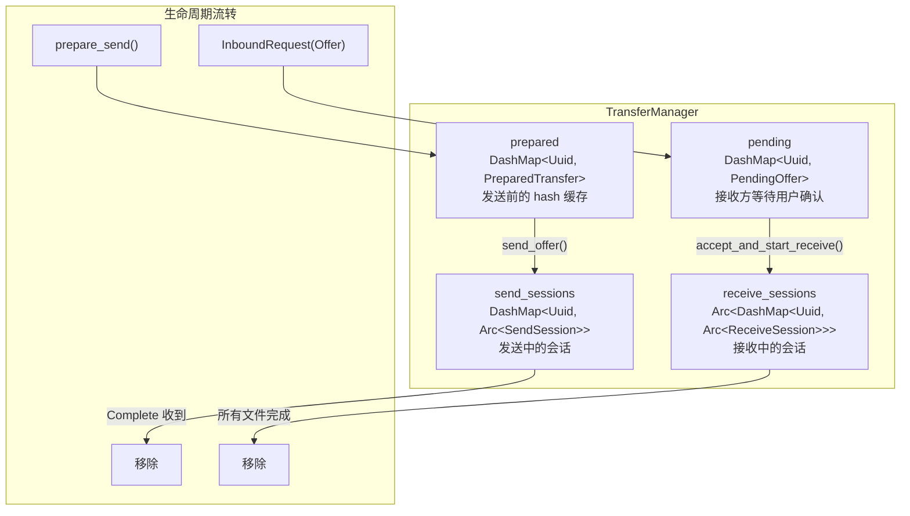
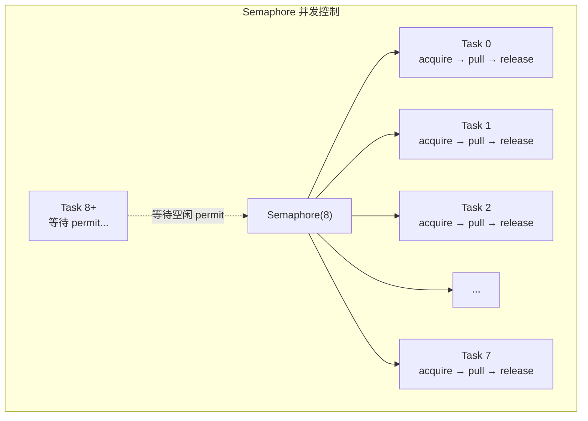
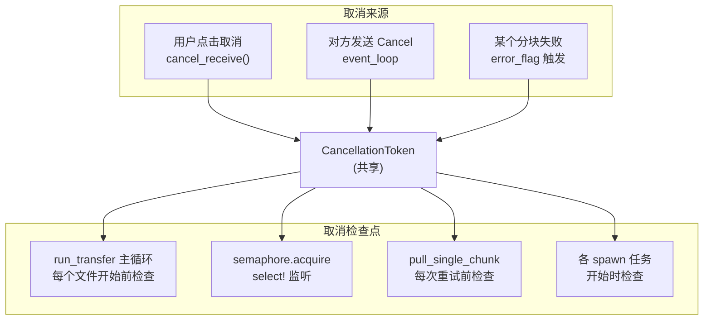
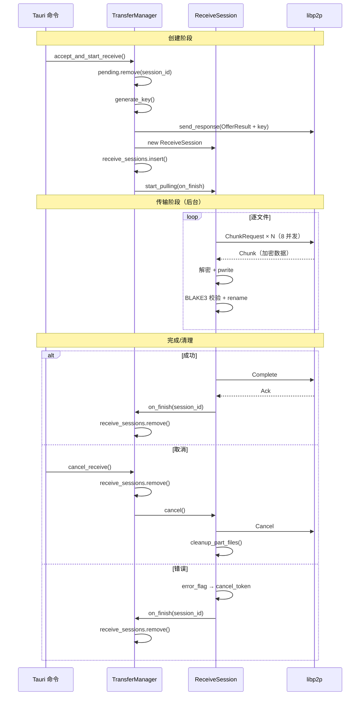

# 并发拉取与会话管理：Semaphore、CancellationToken 和 DashMap 的实战

SwarmDrop 的接收方需要同时管理多个传输会话，每个会话内部又有 8 路并发分块拉取。这涉及到几个经典的并发问题：如何控制并发度？如何优雅取消？如何在无锁数据结构中管理会话生命周期？

本文从 TransferManager（会话管理器）和 ReceiveSession（接收会话）两个核心组件切入，讲解 SwarmDrop 如何使用 Tokio 的并发原语解决这些问题。

## 整体会话架构



### 为什么用 DashMap？

TransferManager 的四个 map 会被多个 tokio 任务并发访问：

- 事件循环任务写入 `pending`（入站 Offer）和读取 `send_sessions`（响应 ChunkRequest）
- Tauri 命令处理读取 `pending`（accept/reject）和写入 `receive_sessions`（启动接收）
- ReceiveSession 的后台任务完成后需要从 `receive_sessions` 中移除自己

标准 `HashMap` + `Mutex` 会导致粗粒度锁竞争。`DashMap` 使用分片锁（默认 CPU 核数的 4 倍分片），不同 session_id 的操作几乎不会互相阻塞：

```rust
pub struct TransferManager {
    client: AppNetClient,
    prepared: DashMap<Uuid, PreparedTransfer>,
    pending: DashMap<Uuid, PendingOffer>,
    send_sessions: DashMap<Uuid, Arc<SendSession>>,
    receive_sessions: Arc<DashMap<Uuid, Arc<ReceiveSession>>>,
}
```

`receive_sessions` 外面多包了一层 `Arc`——因为 ReceiveSession 完成后需要在回调中自行清理，回调需要持有 map 的引用：

```rust
pub async fn accept_and_start_receive(&self, session_id: &Uuid, ...) -> AppResult<()> {
    // ...创建 ReceiveSession...

    // Arc clone，让回调可以持有 map 引用
    let sessions_map = self.receive_sessions.clone();
    receive_session.start_pulling(move |session_id| {
        sessions_map.remove(session_id);  // 传输结束后自动清理
    });

    Ok(())
}
```

## SendSession：无状态的被动响应

发送方的会话设计刻意简单——它不主动做任何事，只被动响应接收方的 ChunkRequest：

```rust
pub struct SendSession {
    pub session_id: Uuid,
    files: Vec<PreparedFile>,
    crypto: TransferCrypto,
    app: AppHandle,
    cancel_token: CancellationToken,
    created_at: Instant,
    bytes_sent: AtomicU64,
}
```

核心方法只有一个：

```rust
pub async fn handle_chunk_request(&self, file_id: u32, chunk_index: u32) -> AppResult<TransferResponse> {
    if self.cancel_token.is_cancelled() {
        return Err(AppError::Transfer("传输已取消".into()));
    }

    let file = self.files.iter().find(|f| f.file_id == file_id)?;

    // 1. 通过 FileSource 异步读取分块
    let plaintext = file.source.read_chunk(file.size, chunk_index, &self.app).await?;

    // 2. 统计已发送字节数
    self.bytes_sent.fetch_add(plaintext.len() as u64, Ordering::Relaxed);

    // 3. XChaCha20-Poly1305 加密
    let data = self.crypto.encrypt_chunk(&self.session_id, file_id, chunk_index, &plaintext)?;

    // 4. 返回加密分块
    Ok(TransferResponse::Chunk { session_id: self.session_id, file_id, chunk_index, data, is_last })
}
```

`bytes_sent` 使用 `AtomicU64` 而非 Mutex——因为只需要累加操作，原子指令比锁高效几个数量级。`Ordering::Relaxed` 足够，我们不需要和其他操作建立 happens-before 关系。

### 事件循环中的分派

每个 ChunkRequest 在事件循环中被 spawn 为独立的 tokio 任务，实现真正的并发响应：

```rust
// event_loop.rs
AppRequest::Transfer(TransferRequest::ChunkRequest { session_id, file_id, chunk_index }) => {
    let session = shared.transfer.get_send_session(&session_id);
    let client = shared.client.clone();

    tokio::spawn(async move {
        let response = match session {
            Some(s) => match s.handle_chunk_request(file_id, chunk_index).await {
                Ok(resp) => AppResponse::Transfer(resp),
                Err(e) => AppResponse::Transfer(TransferResponse::Ack { session_id }),
            },
            None => AppResponse::Transfer(TransferResponse::Ack { session_id }),
        };
        let _ = client.send_response(pending_id, response).await;
    });
}
```

注意：即使 session 不存在或处理失败，也要回复一个 `Ack`。否则接收方的 `send_request` 会一直等待直到超时。

## ReceiveSession：复杂的主动拉取

接收方的逻辑远比发送方复杂——它需要管理并发度、处理重试、跟踪进度、支持取消。

```rust
pub struct ReceiveSession {
    session_id: Uuid,
    peer_id: PeerId,
    files: Vec<FileInfo>,
    total_size: u64,
    sink: FileSink,
    app: AppHandle,
    crypto: Arc<TransferCrypto>,
    client: AppNetClient,
    cancel_token: CancellationToken,
    created_parts: Mutex<Vec<Arc<PartFile>>>,
}
```

### start_pulling：后台任务启动

```rust
pub fn start_pulling<F>(self: Arc<Self>, on_finish: F)
where
    F: FnOnce(&Uuid) + Send + 'static,
{
    let session = self;
    tokio::spawn(async move {
        let result = session.run_transfer().await;
        // 无论成功还是失败，都通知外部清理会话
        on_finish(&session.session_id);
    });
}
```

`on_finish` 回调的设计很巧妙：它接收 `&Uuid` 而非 `Arc<ReceiveSession>`，避免循环引用。TransferManager 传入一个闭包来从 DashMap 中移除自己：

```rust
let sessions_map = self.receive_sessions.clone();
receive_session.start_pulling(move |session_id| {
    sessions_map.remove(session_id);
});
```

### run_transfer：逐文件主循环

```rust
async fn run_transfer(self: &Arc<Self>) -> AppResult<()> {
    self.sink.ensure_permission(&self.app).await?;  // Android 端请求存储权限

    let progress = Arc::new(Mutex::new(ProgressTracker::new(...)));
    let mut file_uris: Vec<serde_json::Value> = Vec::new();

    for file_info in &self.files {
        if self.cancel_token.is_cancelled() {
            // 取消检查点
            return Ok(());
        }

        // 1. 创建 .part 临时文件
        let part_file = Arc::new(self.sink.create_part_file(&file_info.relative_path, file_info.size, &self.app).await?);
        self.created_parts.lock().await.push(part_file.clone());

        // 2. 并发拉取所有分块
        self.pull_file_chunks(file_info, total_chunks, &part_file, &progress).await?;

        // 3. BLAKE3 校验 + 最终化（rename .part → 最终路径）
        part_file.verify_and_finalize(&file_info.checksum, &self.app).await?;

        // 4. 从跟踪列表移除（清理时不会再删这个文件）
        self.remove_created_part(&part_file).await;
    }

    // 5. 发送 Complete 消息给发送方
    self.client.send_request(self.peer_id, AppRequest::Transfer(TransferRequest::Complete { session_id: self.session_id })).await;

    // 6. 发射完成事件到前端
    progress.lock().await.emit_complete(&self.app, save_path, file_uris, save_dir_uri);
    Ok(())
}
```

注意文件是**顺序**处理的（`for file_info in &self.files`），但每个文件内部的分块是**并发**拉取的。为什么不并行处理多个文件？

1. **磁盘友好**——顺序处理避免多文件随机写入导致的磁盘抖动
2. **内存可控**——每次只有一个文件的 .part 在写入，内存峰值 = 单文件大小
3. **进度清晰**——前端可以展示"正在传输第 3/12 个文件"

### pull_file_chunks：Semaphore 控制并发

这是整个接收逻辑中最复杂的方法。核心是用 `Semaphore` 控制并发度为 8：



```rust
const MAX_CONCURRENT_CHUNKS: usize = 8;

async fn pull_file_chunks(self: &Arc<Self>, file_info: &FileInfo, total_chunks: u32, part_file: &Arc<PartFile>, progress: &Arc<Mutex<ProgressTracker>>) -> AppResult<()> {
    let semaphore = Arc::new(Semaphore::new(MAX_CONCURRENT_CHUNKS));
    let error_flag = Arc::new(tokio::sync::Mutex::new(None::<AppError>));
    let mut handles = Vec::with_capacity(total_chunks as usize);

    for chunk_index in 0..total_chunks {
        // 等待 permit 时同时监听取消
        let permit = tokio::select! {
            p = semaphore.clone().acquire_owned() => p?,
            _ = self.cancel_token.cancelled() => { break; }
        };

        let session = self.clone();
        let err_flag = error_flag.clone();
        let cancel = self.cancel_token.clone();
        // ... clone 其他共享状态

        let handle = tokio::spawn(async move {
            let _permit = permit;  // permit 在 task 完成时自动释放

            if cancel.is_cancelled() || err_flag.lock().await.is_some() {
                return;  // 快速退出
            }

            match session.pull_single_chunk(file_id, chunk_index, &part_file).await {
                Ok(chunk_size) => {
                    // 更新进度
                    progress.lock().await.add_bytes(chunk_size as u64);
                }
                Err(e) => {
                    // 首个错误设置 flag + 取消所有其他任务
                    let mut flag = err_flag.lock().await;
                    if flag.is_none() {
                        *flag = Some(e);
                    }
                    cancel.cancel();
                }
            }
        });

        handles.push(handle);
    }

    // 等待所有任务完成
    for handle in handles {
        let _ = handle.await;
    }

    // 检查错误
    if let Some(e) = error_flag.lock().await.take() {
        return Err(e);
    }
    Ok(())
}
```

### 关键设计点解析

#### 1. `select!` 避免取消死锁

```rust
let permit = tokio::select! {
    p = semaphore.clone().acquire_owned() => p?,
    _ = self.cancel_token.cancelled() => { break; }
};
```

如果不用 `select!`，取消时主循环可能阻塞在 `semaphore.acquire()` 上——8 个 permit 都被已取消但还在等待网络超时的任务持有。`select!` 让取消信号可以立即打断 acquire 等待。

#### 2. `acquire_owned` 而非 `acquire`

`Semaphore::acquire()` 返回 `SemaphorePermit<'_>`，绑定到 Semaphore 的生命周期，不能 move 到 `tokio::spawn` 中。`acquire_owned()` 返回 `OwnedSemaphorePermit`，可以自由 move。

#### 3. error_flag：一个错误取消全部

```rust
Err(e) => {
    let mut flag = err_flag.lock().await;
    if flag.is_none() {
        *flag = Some(e);
    }
    cancel.cancel();  // 取消所有其他分块拉取
}
```

第一个失败的分块设置 error_flag 并触发取消。后续分块在检查 `cancel.is_cancelled()` 后快速退出。最后主循环统一返回第一个错误。

为什么不用 `JoinSet` + `try_join_all`？因为我们需要在错误后**等待所有已 spawn 的任务完成**，而不是立即返回。如果不等待，正在执行 `pull_single_chunk` 的任务可能还在写入 PartFile，此时 caller 立即调用 `cleanup()` 会导致竞争。

#### 4. permit 作为 RAII guard

```rust
let handle = tokio::spawn(async move {
    let _permit = permit;  // 持有 permit 直到 task 结束
    // ... 拉取、解密、写入 ...
});
```

`_permit` 在 task 完成（无论成功还是失败）时自动 drop，释放 Semaphore 的一个 permit。

## 重试机制：指数退避

```rust
const MAX_CHUNK_RETRIES: u32 = 3;
const RETRY_DELAY_BASE_MS: u64 = 500;

async fn pull_single_chunk(&self, file_id: u32, chunk_index: u32, part_file: &Arc<PartFile>) -> AppResult<usize> {
    let mut last_error = None;

    for attempt in 0..MAX_CHUNK_RETRIES {
        if self.cancel_token.is_cancelled() {
            return Err(AppError::Transfer("传输已取消".into()));
        }

        // 指数退避：500ms, 1000ms, 2000ms（上限）
        if attempt > 0 {
            let delay_ms = RETRY_DELAY_BASE_MS * (1 << (attempt - 1));
            let delay = Duration::from_millis(delay_ms.min(2000));
            tokio::time::sleep(delay).await;
        }

        match self.client.send_request(self.peer_id, AppRequest::Transfer(
            TransferRequest::ChunkRequest { session_id: self.session_id, file_id, chunk_index }
        )).await {
            Ok(AppResponse::Transfer(TransferResponse::Chunk { data, .. })) => {
                // 解密
                let plaintext = self.crypto.decrypt_chunk(&self.session_id, file_id, chunk_index, &data)?;
                // 写入
                part_file.write_chunk(chunk_index, &plaintext).await?;
                return Ok(plaintext.len());
            }
            Ok(other) => last_error = Some(AppError::Transfer(format!("意外的响应类型: {other:?}"))),
            Err(e) => last_error = Some(AppError::Transfer(format!("ChunkRequest 失败: {e}"))),
        }
    }

    Err(last_error.unwrap())
}
```

重试策略的设计考量：

| 参数 | 值 | 理由 |
|---|---|---|
| 最大重试次数 | 3 | P2P 网络不稳定，但超过 3 次说明连接已断 |
| 基础延迟 | 500ms | 短暂的网络抖动通常在几百毫秒内恢复 |
| 延迟增长 | 指数（×2） | 500 → 1000 → 2000ms |
| 最大延迟 | 2000ms | 避免单个分块等待太久 |

重试是**安全的**——因为 nonce 从 `(session_id, file_id, chunk_index)` 确定性派生，重试请求产生的密文完全相同。pwrite 写入同一偏移也是幂等的。

## CancellationToken：协作式取消

SwarmDrop 使用 `tokio-util` 的 `CancellationToken`，它比 `broadcast` channel 更适合取消场景：



CancellationToken 的优势：

1. **零成本检查**——`is_cancelled()` 是一个原子读操作
2. **广播语义**——一次 `cancel()` 通知所有持有 clone 的任务
3. **与 select! 集成**——`cancelled()` 返回 Future，可以在 `select!` 中和其他 Future 竞争

### 取消后的清理顺序

```rust
pub async fn cancel_receive(&self, session_id: &Uuid) -> AppResult<()> {
    let (_, session) = self.receive_sessions.remove(session_id)?;

    session.cancel();                    // 1. 设置 CancellationToken
    session.send_cancel().await;         // 2. 通知发送方
    session.cleanup_part_files().await;  // 3. 删除临时文件

    Ok(())
}
```

顺序很重要：

1. **先 cancel**——阻止新的 ChunkRequest 发出
2. **再通知对方**——让发送方也清理资源
3. **最后清理文件**——此时所有 spawn 任务已经退出（因为 cancel 触发了快速退出），不会有竞争

## 会话生命周期总结



## 踩过的坑

### 1. Windows 上 rename 前必须关闭文件句柄

桌面端 `verify_and_finalize` 中，BLAKE3 校验通过后需要 `rename(.part → 最终路径)`。在 Windows 上，如果文件句柄未关闭，rename 会失败（`Permission denied`）。

解决方案：`close_write_handle()` 在校验前显式关闭：

```rust
pub async fn verify_and_finalize(&self, expected_checksum: &str, app: &AppHandle) -> AppResult<PathBuf> {
    self.close_write_handle();  // 先关闭！
    // ... BLAKE3 校验 + rename
}
```

### 2. Mutex 选型：std vs tokio

PartFile 的 `write_handle` 使用 `std::sync::Mutex` 而非 `tokio::Mutex`：

```rust
write_handle: StdMutex<Option<Arc<std::fs::File>>>
```

原因：锁持有时间极短（只是 clone 一个 Arc），不涉及任何 I/O 或 await。`tokio::Mutex` 在短暂持有时性能反而更差（多了一次 poll/wake 调度）。规则是：**如果锁内不 await，用 std::Mutex**。

### 3. Arc::ptr_eq 比较已清理的 PartFile

```rust
async fn remove_created_part(&self, part_file: &Arc<PartFile>) {
    let mut parts = self.created_parts.lock().await;
    parts.retain(|p| !Arc::ptr_eq(p, part_file));
}
```

不能用 `PartialEq` 比较（PartFile 没有实现也不应该实现 PartialEq），用 `Arc::ptr_eq` 按指针地址比较，确保移除的是同一个对象而非碰巧路径相同的另一个文件。

## 总结

SwarmDrop 的并发模型可以总结为：

1. **Semaphore 限制并发度**——8 路分块拉取，不过载接收方的磁盘和网络
2. **CancellationToken 协作式取消**——无锁、广播语义、与 `select!` 无缝集成
3. **DashMap 无锁会话管理**——分片锁避免了粗粒度的全局锁竞争
4. **error_flag 快速失败**——第一个错误取消全部，但等待所有任务退出后再返回
5. **指数退避重试**——应对 P2P 网络的不稳定性，幂等设计让重试安全无忧

整套并发模型建立在 Rust 的所有权系统之上——`Arc` 确保共享安全，`Send + 'static` 约束确保 `tokio::spawn` 的正确性，编译器在你犯错之前就拦住你。
