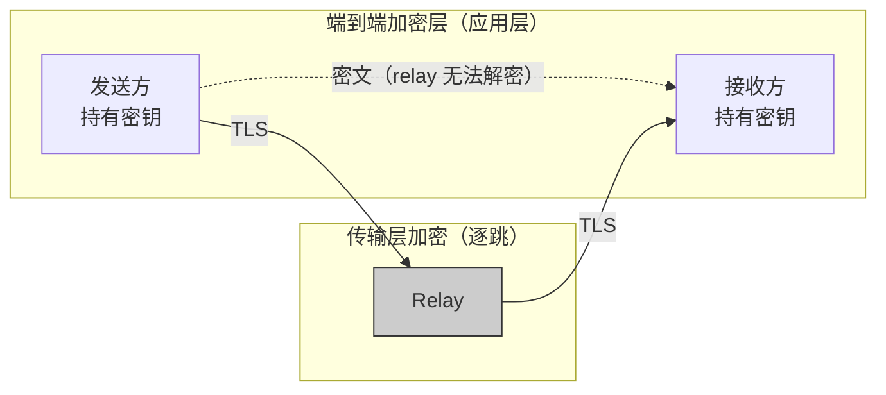
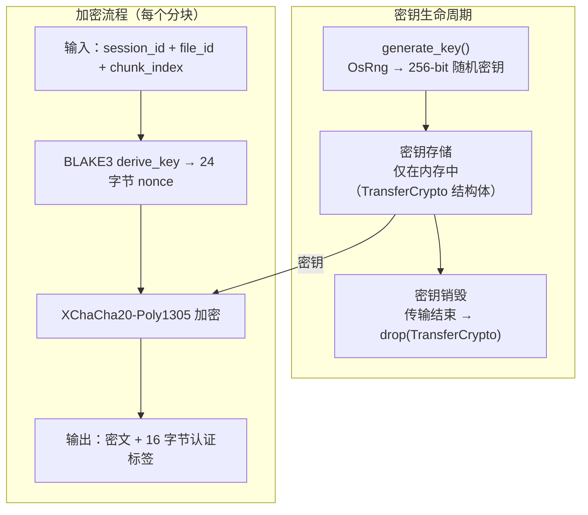
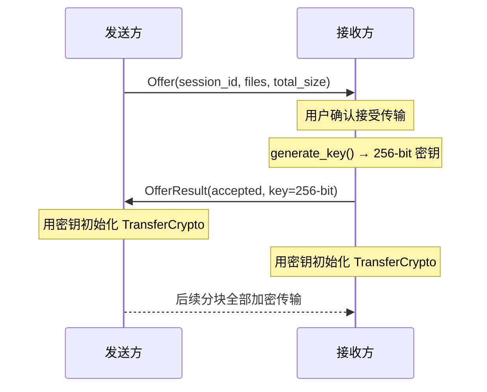
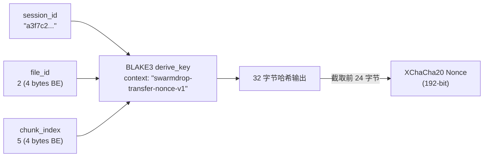
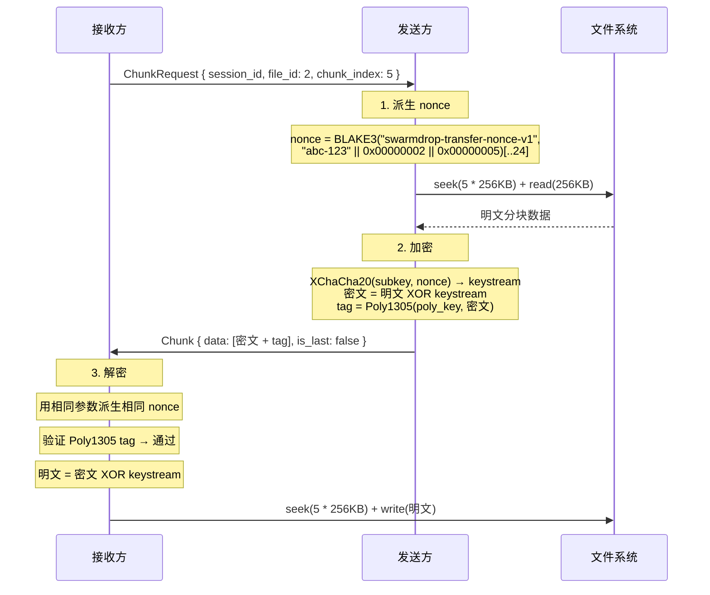
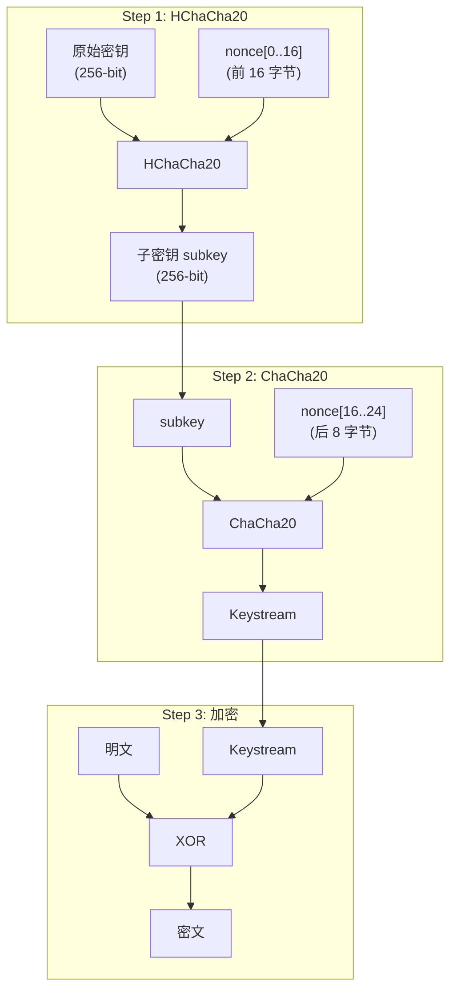
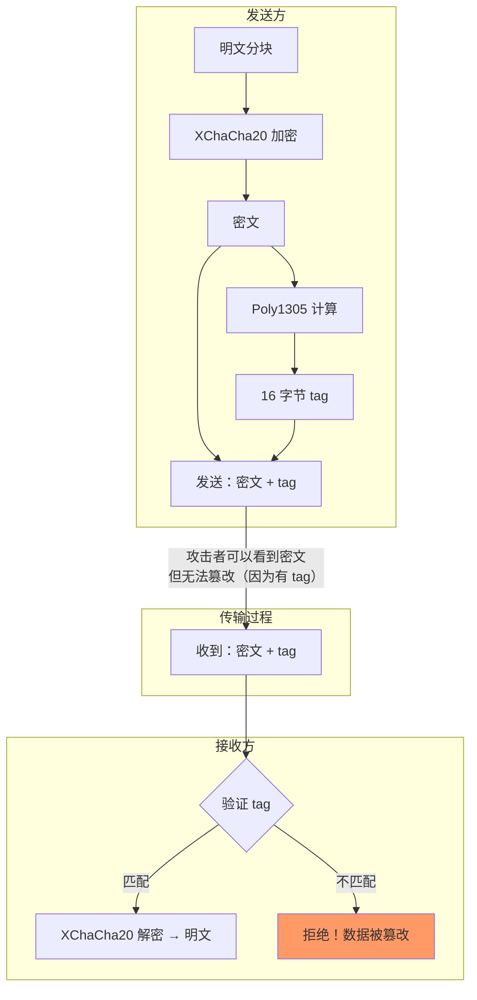
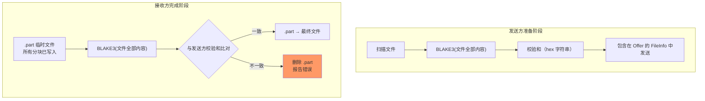

# SwarmDrop 端到端加密：XChaCha20-Poly1305 在 P2P 文件传输中的实践

SwarmDrop 是一个去中心化的文件传输工具——没有中心服务器，文件直接在两台设备之间传输。这意味着数据在 P2P 网络中"裸奔"，任何中继节点（relay）都有机会看到传输内容。端到端加密不是可选项，而是必选项。

本文详细讲解 SwarmDrop 如何使用 XChaCha20-Poly1305 实现文件分块的端到端加密，以及在工程实现中遇到的关键设计决策。

## 为什么需要端到端加密？


SwarmDrop 使用 libp2p 进行 P2P 通信。当两台设备处于不同 NAT 后面时，数据可能需要经过 relay 中继节点转发。虽然 libp2p 的传输层本身有 TLS/Noise 加密，但这只是**逐跳加密**（hop-by-hop）——relay 节点作为中间人，理论上可以解密并查看数据。

我们需要的是**端到端加密**（end-to-end）：只有发送方和接收方能解密数据，中继节点看到的是密文。



## 算法选择：为什么是 XChaCha20-Poly1305？

我们需要一个 AEAD（Authenticated Encryption with Associated Data）算法，同时提供**加密**（保密性）和**认证**（完整性）。主流选择有两个：

| | XChaCha20-Poly1305 | AES-256-GCM |
|---|---|---|
| 密钥长度 | 256-bit | 256-bit |
| Nonce 长度 | **192-bit** | 96-bit |
| 无硬件加速时的性能 | 快 | 慢 |
| 有 AES-NI 时的性能 | 快 | 更快 |
| 侧信道安全 | 天然安全（纯 ARX 运算） | 依赖硬件指令 |
| 跨平台一致性 | 表现一致 | 依赖 CPU 特性 |

选择 XChaCha20-Poly1305 的三个核心理由：

### 1. 192-bit Nonce 天然适合分布式场景

AES-GCM 的 96-bit nonce 在大量消息下有碰撞风险（生日攻击约 2^48 条消息后碰撞概率显著上升）。SwarmDrop 的场景中，一次传输可能包含数千个分块，多个并发传输会进一步增加 nonce 总量。192-bit nonce 的碰撞概率可以忽略不计。

### 2. 跨平台性能一致

SwarmDrop 需要在 Windows、macOS、Linux 和 Android 上运行。ChaCha20 使用纯 ARX（Add-Rotate-XOR）运算，不依赖任何硬件加速指令，在所有平台上性能表现一致。AES-GCM 在没有 AES-NI 指令的设备（如部分 Android 手机）上会显著变慢。

### 3. 天然抗侧信道攻击

ChaCha20 的所有操作（加法、旋转、异或）都是 constant-time 的，不涉及查表操作，因此不会因 cache timing 泄露密钥信息。AES 的 S-Box 查表在纯软件实现中容易受到 cache-timing 攻击。

## 加密架构总览



## 密钥协商：谁生成密钥？

SwarmDrop 采用了一个简洁的方案：**接收方生成密钥，在握手时传给发送方**。



为什么让接收方生成密钥？

- **安全前提已有保障**——配对系统确保双方已经互相验证身份，Offer 只接受来自已配对设备的请求
- **简化协议**——不需要 Diffie-Hellman 密钥交换，一次握手就搞定
- **密钥管理简单**——密钥只存在于内存中的 `TransferCrypto` 结构体里，传输结束后随 Rust 的所有权机制自动销毁

实现代码：

```rust
// transfer/crypto.rs
pub fn generate_key() -> [u8; 32] {
    use chacha20poly1305::aead::OsRng;
    XChaCha20Poly1305::generate_key(&mut OsRng).into()
}
```

`OsRng` 使用操作系统的密码学安全随机数生成器（Windows 上是 `BCryptGenRandom`，Linux 上是 `getrandom`），确保密钥的随机性。

## 什么是 Nonce？

在深入 SwarmDrop 的 nonce 派生方案之前，先解释一下 nonce 到底是什么。

Nonce 全称是 **Number used ONCE**（只用一次的数字）。它是加密时除密钥外的另一个必要输入。

### 为什么需要 Nonce

流密码（如 ChaCha20）的加密过程本质上是：

```
密文 = 明文 XOR keystream（伪随机字节流）
```

如果同一个密钥总是生成相同的 keystream，那就出问题了——两段不同的明文用同一个密钥加密后，攻击者只需要把两段密文 XOR 在一起，密钥流就抵消了：

```
密文A = 明文A XOR keystream
密文B = 明文B XOR keystream

密文A XOR 密文B = 明文A XOR 明文B    ← 密钥流消失了！
```

攻击者不需要知道密钥，就能获得两段明文的关系，进而推导出原文内容。

Nonce 就是为了解决这个问题——它和密钥一起作为输入，让每次加密产生**不同的 keystream**：

```
keystream_1 = ChaCha20(密钥, nonce_1)    ← 第一个分块
keystream_2 = ChaCha20(密钥, nonce_2)    ← 第二个分块
                              ↑
                        不同的 nonce → 不同的 keystream → 安全
```

### 类比

可以把加密想象成一把"万能锁"：

- **密钥** = 锁芯（整个传输过程固定不变）
- **Nonce** = 锁的"档位"（每个分块换一个档位）
- 同一个锁芯 + 不同档位 = 每次锁出来的效果都不同

### Nonce 的铁律

**同一个密钥下，绝不能用相同的 nonce 加密两段不同的明文。** 违反这条规则，等于把密钥流泄露给攻击者。这就是为什么叫 "Number used **ONCE**"。

在 SwarmDrop 中，一次传输的所有分块共享同一个密钥，但每个分块有不同的 `chunk_index`，因此会派生出不同的 nonce。这就引出了下面的核心设计问题：如何在并发场景下高效地生成唯一的 nonce？

## Nonce 派生：解决并发场景下的核心难题

### 问题：为什么不用计数器？

传统的 AEAD 使用方式是维护一个递增计数器作为 nonce。但 SwarmDrop 的分块传输是**并发**的——接收方同时拉取 8 个分块，而且分块可能**乱序**到达、**重试**发送。在这种场景下，维护一个全局计数器需要加锁同步，既复杂又影响性能。

### 解决方案：BLAKE3 确定性 Nonce 派生

SwarmDrop 采用了一个巧妙的设计：从每个分块的唯一标识 `(session_id, file_id, chunk_index)` 确定性地派生 nonce。



```rust
// transfer/crypto.rs
fn derive_nonce(session_id: &str, file_id: u32, chunk_index: u32) -> [u8; 24] {
    // 拼接输入：session_id 字节 + file_id (4 bytes BE) + chunk_index (4 bytes BE)
    let mut input = Vec::with_capacity(session_id.len() + 8);
    input.extend_from_slice(session_id.as_bytes());
    input.extend_from_slice(&file_id.to_be_bytes());
    input.extend_from_slice(&chunk_index.to_be_bytes());

    // BLAKE3 derive_key：带域分离的确定性哈希
    let hash = blake3::derive_key("swarmdrop-transfer-nonce-v1", &input);

    // 截取前 24 字节作为 XChaCha20 的 nonce
    let mut nonce = [0u8; 24];
    nonce.copy_from_slice(&hash[..24]);
    nonce
}
```

### 为什么选择 BLAKE3 derive_key？

BLAKE3 的 `derive_key` 模式专为密钥派生设计，提供三个关键特性：

1. **域分离（domain separation）**——context 字符串 `"swarmdrop-transfer-nonce-v1"` 确保即使输入相同，不同应用的输出也不同。未来如果需要从相同参数派生其他值（比如文件名混淆），只需更换 context 字符串
2. **确定性**——相同输入永远产出相同输出，支持重试（幂等安全）
3. **抗碰撞**——不同输入保证不同输出，满足 nonce 唯一性要求

### 这个方案解决了什么问题？

| 场景 | 计数器方案 | BLAKE3 派生方案 |
|---|---|---|
| 8 个分块并发加密 | 需要 Mutex 锁保护计数器 | 无锁，每个分块独立派生 |
| 分块传输失败重试 | 需要记住上次的计数器值 | 相同参数 → 相同 nonce（幂等） |
| 乱序到达 | 计数器间隔需要管理 | 无所谓顺序 |
| 多文件并行传输 | 每个文件需要独立计数器 | file_id 已包含在输入中 |

## 加密与解密流程

### TransferCrypto 结构体

```rust
// transfer/crypto.rs
pub struct TransferCrypto {
    cipher: XChaCha20Poly1305,
}

impl TransferCrypto {
    /// 从 256-bit 密钥创建加密器
    pub fn new(key: &[u8; 32]) -> Self {
        Self {
            cipher: XChaCha20Poly1305::new(key.into()),
        }
    }

    /// 加密分块（发送方调用）
    /// 输出 = 密文 + 16 字节 Poly1305 认证标签
    pub fn encrypt_chunk(
        &self,
        session_id: &str,
        file_id: u32,
        chunk_index: u32,
        plaintext: &[u8],
    ) -> aead::Result<Vec<u8>> {
        let nonce = derive_nonce(session_id, file_id, chunk_index);
        self.cipher.encrypt(XNonce::from_slice(&nonce), plaintext)
    }

    /// 解密分块（接收方调用）
    /// 先验证 Poly1305 认证标签，通过后再解密
    pub fn decrypt_chunk(
        &self,
        session_id: &str,
        file_id: u32,
        chunk_index: u32,
        ciphertext: &[u8],
    ) -> aead::Result<Vec<u8>> {
        let nonce = derive_nonce(session_id, file_id, chunk_index);
        self.cipher.decrypt(XNonce::from_slice(&nonce), ciphertext)
    }
}
```

### 数据格式

每个加密分块的格式：

```
┌─────────────────────────────────────────┬──────────────────┐
│            密文（与明文等长）             │  Poly1305 TAG    │
│          最大 256 KB                     │   16 字节        │
└─────────────────────────────────────────┴──────────────────┘
```

例如一个 256 KB 的分块，加密后为 256 KB + 16 字节 = 262160 字节。

空文件也会产生一个仅包含 16 字节认证标签的密文——这保证了即使文件为空，接收方也能验证数据未被篡改。

### 完整的单分块加密流程



## XChaCha20 内部原理

XChaCha20 并非独立的新算法，而是对 ChaCha20 的 nonce 扩展，分两步执行：



### ChaCha20 的核心：Quarter Round

ChaCha20 操作一个 4x4 的 32-bit 状态矩阵，反复执行 quarter-round 操作，共 20 轮：

```
初始状态矩阵 (4x4 uint32)：
┌──────────┬──────────┬──────────┬──────────┐
│ "expa"   │ "nd 3"   │ "2-by"   │ "te k"   │  ← 常量
├──────────┼──────────┼──────────┼──────────┤
│ key[0]   │ key[1]   │ key[2]   │ key[3]   │  ← 密钥
├──────────┼──────────┼──────────┼──────────┤
│ key[4]   │ key[5]   │ key[6]   │ key[7]   │  ← 密钥
├──────────┼──────────┼──────────┼──────────┤
│ counter  │ nonce[0] │ nonce[1] │ nonce[2] │  ← 计数器 + nonce
└──────────┴──────────┴──────────┴──────────┘
```

每个 quarter-round 对 4 个值 (a, b, c, d) 执行 ARX 操作：

```
a += b;  d ^= a;  d <<<= 16;
c += d;  b ^= c;  b <<<= 12;
a += b;  d ^= a;  d <<<= 8;
c += d;  b ^= c;  b <<<= 7;
```

只有三种运算：**Add（加法）、Rotate（旋转）、XOR（异或）**——全部是 constant-time 操作，没有查表，没有分支跳转，因此天然抗侧信道攻击。

## Poly1305：消息认证码

加密只解决了保密性问题。如果攻击者修改了密文的某些字节，XChaCha20 解密后会得到错误的明文——但不会报错。Poly1305 解决的就是这个**完整性**问题。

### 工作原理

Poly1305 本质上是一个**模素数多项式求值**：

给定消息分块 `c1, c2, ..., cn` 和密钥派生的参数 `r, s`：

```
tag = ((c1 * r^n + c2 * r^(n-1) + ... + cn * r) mod (2^130 - 5)) + s
```

`2^130 - 5` 是一个梅森素数，这是名字中 "1305" 的来源（130 位，减 5）。

### 关键特性

- **一次性密钥（one-time key）**：Poly1305 要求每个消息使用不同的密钥对 `(r, s)`。在 XChaCha20-Poly1305 AEAD 中，这个密钥对由 XChaCha20 的前 32 字节 keystream 自动派生，无需手动管理
- **16 字节 tag**：128-bit 的认证标签，伪造概率为 2^-128
- **极快**：只涉及模乘和模加运算

### 在 SwarmDrop 中的作用



如果攻击者修改了密文中的哪怕一个 bit：

```rust
// 模拟篡改
ciphertext[0] ^= 0xff;  // 翻转第一个字节

// 解密时 Poly1305 验证失败
let result = crypto.decrypt_chunk("session-1", 0, 0, &ciphertext);
assert!(result.is_err());  // DecryptionFailed!
```

## 文件级校验：BLAKE3 双重保障

除了分块级别的 Poly1305 认证，SwarmDrop 还在文件级别使用 BLAKE3 校验和进行二次验证：



为什么 Poly1305 已经认证了每个分块，还需要 BLAKE3 文件级校验？

1. **防御深度**——即使某个极端情况下分块认证被绕过，文件级校验仍能捕获问题
2. **检测编程错误**——如果代码 bug 导致分块写入了错误的 offset，Poly1305 无法检测到，但 BLAKE3 会发现最终文件与原文件不一致
3. **用户信心**——校验通过后用户可以确信收到的文件和发送的完全一致

## 安全性分析

### 密钥安全

| 属性 | 保证 |
|---|---|
| 密钥来源 | `OsRng`（操作系统 CSPRNG） |
| 密钥存储 | 仅在内存中（`TransferCrypto` 结构体） |
| 密钥传输 | 在 OfferResult 中传递（受 libp2p 传输层 TLS/Noise 保护） |
| 密钥销毁 | 传输结束后随 Rust 所有权机制自动 drop |
| 密钥隔离 | 每个传输会话独立密钥 |

### Nonce 安全

| 属性 | 保证 |
|---|---|
| 唯一性 | (session_id, file_id, chunk_index) 三元组全局唯一 |
| 不可预测性 | 192-bit，BLAKE3 输出近似随机 |
| 确定性 | 相同输入 → 相同 nonce（支持重试，幂等安全） |
| 域分离 | context 字符串防止与其他用途碰撞 |

### 攻击场景分析

| 攻击 | 防御 |
|---|---|
| **窃听**（relay 读取数据） | XChaCha20 加密，relay 只能看到密文 |
| **篡改**（修改传输中的密文） | Poly1305 认证标签检测，篡改立即拒绝 |
| **重放**（重发旧的分块） | Nonce 确定性派生，重放的分块解密结果相同（幂等），不会造成损坏 |
| **未配对设备发送** | 事件循环在收到 Offer 时检查发送方是否为已配对设备 |
| **密钥泄露** | 每个会话独立密钥，泄露一个不影响其他会话（前向安全） |

## 测试覆盖

加密模块的测试覆盖了所有关键场景：

```rust
#[test] fn encrypt_decrypt_roundtrip()           // 基本加解密往返
#[test] fn decrypt_with_wrong_key_fails()         // 错误密钥 → 解密失败
#[test] fn decrypt_with_wrong_nonce_params_fails() // 错误参数 → nonce 不同 → 失败
#[test] fn same_input_produces_same_ciphertext()  // 确定性：相同输入 → 相同密文
#[test] fn different_chunks_produce_different_ciphertext() // 不同分块 → 不同密文
#[test] fn tampered_ciphertext_rejected()         // 篡改检测
#[test] fn large_chunk_roundtrip()                // 256KB 大分块
#[test] fn empty_plaintext_roundtrip()            // 空文件处理
#[test] fn nonce_deterministic()                  // nonce 确定性
#[test] fn nonce_differs_on_any_input_change()    // nonce 唯一性
```

## 总结

SwarmDrop 的端到端加密方案可以用一句话概括：

> **接收方生成随机密钥，BLAKE3 从分块标识确定性派生 nonce，XChaCha20-Poly1305 对每个 256KB 分块加密并认证。**

这套方案的设计哲学是**简洁且正确**：

- **密钥管理**——一次性生成、内存存储、自动销毁，没有密钥轮换的复杂性
- **Nonce 派生**——确定性、无锁、天然支持并发和重试
- **双重校验**——分块级 Poly1305 + 文件级 BLAKE3，纵深防御
- **算法选择**——XChaCha20-Poly1305 在安全性、性能和跨平台一致性之间取得了最佳平衡

核心实现仅约 90 行 Rust 代码（含注释），体现了"最小必要复杂度"的工程原则。
