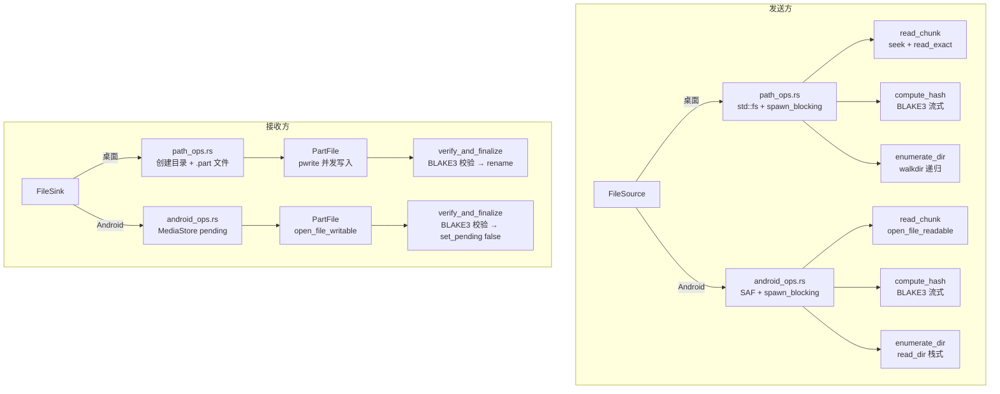
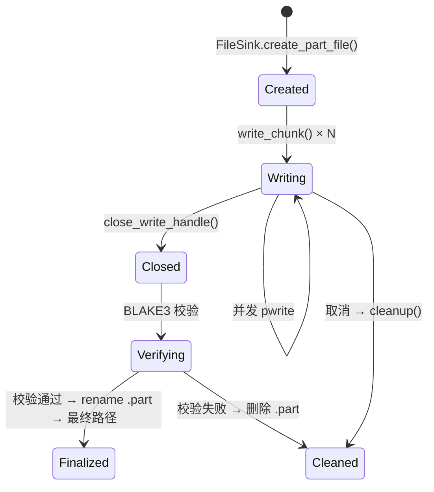
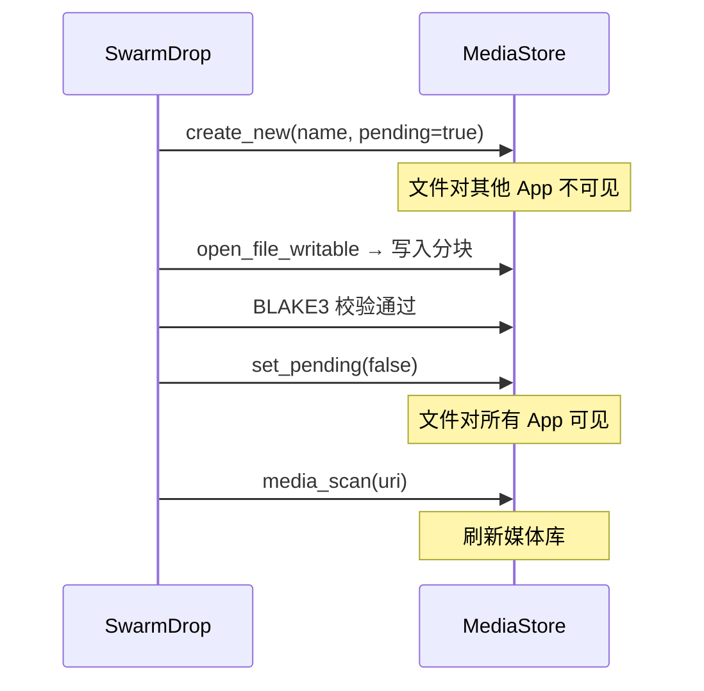

# 文件分块与跨平台 I/O：从桌面 pwrite 到 Android MediaStore

SwarmDrop 需要在 Windows、macOS、Linux 和 Android 四个平台上读写文件。桌面端用标准的文件系统 API，Android 端用 SAF (Storage Access Framework) 和 MediaStore——两套完全不同的 I/O 模型。

本文讲解 SwarmDrop 如何通过 `FileSource` / `FileSink` 抽象层统一跨平台文件操作，以及分块读写、并发安全 pwrite、.part 临时文件等关键工程细节。

## 整体架构



## 分块策略：256KB

SwarmDrop 的分块大小是 **256 KB**（`CHUNK_SIZE = 256 * 1024`）。

```rust
/// 分块大小：256 KB
pub const CHUNK_SIZE: usize = 256 * 1024;

/// 计算文件的总分块数
pub fn calc_total_chunks(file_size: u64) -> u32 {
    if file_size == 0 {
        return 1; // 空文件也算一个块
    }
    file_size.div_ceil(CHUNK_SIZE as u64) as u32
}
```

为什么是 256KB？

| 因素 | 太小 (4KB) | **256KB** | 太大 (4MB) |
|---|---|---|---|
| 请求-响应开销 | 海量请求，延迟累积 | **适中** | 请求少，但重试代价高 |
| 加密开销 | 每块 16 字节 tag 占比大 | **tag 占比 0.006%** | tag 占比可忽略 |
| 内存占用 | 低 | **每路 256KB，8 路 = 2MB** | 8 路 = 32MB |
| P2P 友好度 | 可能小于 MTU | **匹配大多数 RTT** | 单包太大，可能被分片 |

256KB 是一个经过权衡的选择：8 路并发只需 2MB 内存，重试时最多浪费 256KB 带宽，加密 tag 开销可忽略。

### 空文件处理

空文件（0 字节）算作 1 个分块。这确保了即使文件为空，也会走完整的 ChunkRequest → Chunk → 解密 → 校验流程。空分块经过 XChaCha20-Poly1305 加密后只有 16 字节（纯认证标签），确保即使空文件也能验证完整性。

## FileSource：读取来源抽象

### 枚举设计

```rust
#[derive(Debug, Clone, Serialize, Deserialize)]
#[serde(tag = "type", rename_all = "camelCase")]
pub enum FileSource {
    /// 标准文件系统路径（桌面 + Android 私有目录）
    Path { path: PathBuf },

    /// Android SAF/MediaStore URI
    #[cfg(target_os = "android")]
    AndroidUri(FileUri),
}
```

`#[cfg(target_os = "android")]` 确保桌面端不编译 Android 相关代码。`#[serde(tag = "type")]` 让前端可以通过 JSON 字段区分来源类型：

```typescript
// 前端类型定义
type FileSource =
  | { type: "path"; path: string }
  | ({ type: "androidUri" } & AndroidFsUri);
```

### 核心方法

FileSource 提供四个方法，每个方法内部根据枚举分支分派到对应的平台实现：

```rust
impl FileSource {
    /// 读取文件的指定分块
    pub async fn read_chunk(&self, file_size: u64, chunk_index: u32, app: &AppHandle) -> AppResult<Vec<u8>>;

    /// 流式计算 BLAKE3 hash
    pub async fn compute_hash(&self, app: &AppHandle) -> AppResult<String>;

    /// 流式计算 BLAKE3 hash（带进度回调）
    pub async fn compute_hash_with_progress(&self, app: &AppHandle, on_progress: impl Fn(u64)) -> AppResult<String>;

    /// 获取文件/目录的元数据
    pub async fn metadata(&self, app: &AppHandle) -> AppResult<FileSourceMetadata>;

    /// 递归遍历目录
    pub async fn enumerate_dir(&self, parent_path: &str, app: &AppHandle) -> AppResult<Vec<EnumeratedFile>>;
}
```

### 桌面端实现：spawn_blocking 包装

桌面端的文件 I/O 使用标准 `std::fs` API。所有阻塞操作通过 `tokio::task::spawn_blocking` 包装为异步，避免阻塞 tokio 运行时：

```rust
// file_source/path_ops.rs

/// 读取文件的指定分块
pub async fn read_chunk(path: &Path, file_size: u64, chunk_index: u32) -> AppResult<Vec<u8>> {
    let path = path.to_path_buf();
    tokio::task::spawn_blocking(move || read_chunk_sync(&path, file_size, chunk_index)).await?
}

fn read_chunk_sync(path: &Path, file_size: u64, chunk_index: u32) -> AppResult<Vec<u8>> {
    use std::io::{Read, Seek, SeekFrom};

    if file_size == 0 {
        return Ok(Vec::new());
    }

    let offset = chunk_index as u64 * CHUNK_SIZE as u64;
    let remaining = file_size - offset;
    let read_size = (remaining as usize).min(CHUNK_SIZE);

    let mut file = std::fs::File::open(path)?;
    file.seek(SeekFrom::Start(offset))?;

    let mut buf = vec![0u8; read_size];
    file.read_exact(&mut buf)?;
    Ok(buf)
}
```

注意 `read_chunk_sync` 每次都打开文件、seek 到指定偏移、读取固定大小。这种"无状态"的读取方式配合拉取式协议——发送方不需要维护文件句柄的状态。

### Android 端实现：async 获取句柄 + spawn_blocking 读取

Android 的文件操作分两步：先通过 JNI 异步获取文件句柄，再在 blocking 线程中执行重 I/O：

```rust
// file_source/android_ops.rs

pub async fn read_chunk(
    file_uri: &FileUri,
    file_size: u64,
    chunk_index: u32,
    app: &tauri::AppHandle,
) -> AppResult<Vec<u8>> {
    // 第一步：async — 通过 SAF 获取 File 句柄（轻量 JNI 调用）
    let mut file = app
        .android_fs_async()
        .open_file_readable(file_uri)
        .await?;

    // 第二步：spawn_blocking — 重 I/O
    tokio::task::spawn_blocking(move || {
        use std::io::{Read, Seek, SeekFrom};
        file.seek(SeekFrom::Start(offset))?;
        let mut buf = vec![0u8; read_size];
        file.read_exact(&mut buf)?;
        Ok(buf)
    }).await?
}
```

为什么要分两步？因为 Android 的 SAF 操作需要跨 JNI 调用 Java 层，这是一个异步操作（涉及 ContentResolver）。而 seek + read 是纯 I/O 操作，适合放在 blocking 线程中。

### 目录遍历：walkdir vs 手动栈

桌面端使用 `walkdir` crate 递归遍历目录，它处理了符号链接、权限错误等边界情况：

```rust
fn enumerate_dir_sync(path: &Path, parent_relative_path: &str) -> AppResult<Vec<EnumeratedFile>> {
    use walkdir::WalkDir;

    let mut files = Vec::new();
    for entry in WalkDir::new(path).follow_links(true).into_iter().filter_map(|e| e.ok()) {
        if entry.file_type().is_dir() { continue; }
        // ... 构建 EnumeratedFile
    }
    Ok(files)
}
```

Android 端没有 `walkdir`（它依赖 `std::fs::read_dir`，而 SAF URI 不是文件系统路径），所以手动用栈实现 BFS 遍历：

```rust
pub async fn enumerate_dir(file_uri: &FileUri, parent_path: &str, app: &AppHandle) -> AppResult<Vec<EnumeratedFile>> {
    let mut files = Vec::new();
    let mut stack: Vec<(FileUri, String)> = vec![(file_uri.clone(), parent_path.to_owned())];

    while let Some((uri, parent)) = stack.pop() {
        let entries = app.android_fs_async().read_dir(&uri).await?;
        for entry in entries {
            match entry {
                Entry::File { uri, name, len, .. } => {
                    files.push(EnumeratedFile { source: FileSource::AndroidUri(uri), .. });
                }
                Entry::Dir { uri, name, .. } => {
                    stack.push((uri, format!("{}/{}", parent, name)));
                }
            }
        }
    }
    Ok(files)
}
```

## FileSink：写入目标抽象

FileSink 与 FileSource 对称，负责接收端的文件写入：

```rust
pub enum FileSink {
    /// 桌面端：直接写到本地目录
    Path { save_dir: PathBuf },

    /// Android：保存到公共目录（SAF/MediaStore）
    #[cfg(target_os = "android")]
    AndroidPublicDir { subdir: String },
}
```

Android 端固定写入 `Download/SwarmDrop/` 目录，不让用户选择保存路径——这是因为 Android 10+ 的 Scoped Storage 限制，应用只能写入自己的沙箱和特定的公共目录。

## PartFile：临时文件的完整生命周期

PartFile 是接收端文件操作的核心抽象，管理一个文件从创建到最终化的完整生命周期。



### 结构体设计

```rust
pub struct PartFile {
    pub part_path: PathBuf,      // .part 临时文件路径
    pub final_path: PathBuf,     // 最终文件路径
    pub size: u64,               // 文件大小
    write_handle: StdMutex<Option<Arc<std::fs::File>>>,  // 缓存的写入句柄
    #[cfg(target_os = "android")]
    pub file_uri: Option<FileUri>,  // Android 文件 URI
}
```

几个设计决策：

1. **`StdMutex` 而非 `tokio::Mutex`**——写入句柄的锁持有时间极短（只是 clone 一个 Arc），用标准库的 Mutex 避免异步调度开销
2. **`Option<Arc<std::fs::File>>`**——Arc 包装让多个并发 spawn_blocking 任务可以共享同一个文件句柄；Option 支持显式关闭
3. **不可 Clone**——PartFile 持有写入句柄，多处共享时必须用 `Arc<PartFile>`

### .part 命名规则

```rust
/// readme.md → readme.md.part
/// Makefile  → Makefile.part
pub fn compute_part_path(final_path: &Path) -> PathBuf {
    final_path.with_extension(
        final_path
            .extension()
            .map(|e| format!("{}.part", e.to_string_lossy()))
            .unwrap_or_else(|| "part".into()),
    )
}
```

使用 `.part` 后缀而非临时目录，好处是用户可以在文件管理器中看到正在传输的文件。如果传输中断，用户可以手动删除 `.part` 文件。

### 创建过程：桌面端

```rust
// file_sink/path_ops.rs
pub async fn create_part_file(save_dir: &Path, relative_path: &str, file_size: u64) -> AppResult<PartFile> {
    let final_path = save_dir.join(relative_path);
    let part_path = compute_part_path(&final_path);

    // 确保父目录存在
    if let Some(parent) = part_path.parent() {
        tokio::fs::create_dir_all(parent).await?;
    }

    // 创建 .part 文件并预分配大小
    let file = tokio::task::spawn_blocking({
        let part_path = part_path.clone();
        move || {
            let file = std::fs::File::create(&part_path)?;
            file.set_len(file_size)?;  // 预分配空间
            Ok::<_, std::io::Error>(file)
        }
    }).await??;

    Ok(PartFile::new_path(part_path, final_path, file_size, file))
}
```

`file.set_len(file_size)` 预分配文件空间，让后续的 pwrite 不需要扩展文件，并且操作系统可以为文件分配连续的磁盘块，提高写入性能。

## 并发安全写入：pwrite 的跨平台实现

PartFile 最核心的方法是 `write_chunk`——需要支持 8 路并发写入同一文件，且不能互相干扰。

### 问题：为什么普通的 seek + write 不安全？

```
线程 A: seek(offset=0) → write(data_0)
线程 B: seek(offset=256KB) → write(data_1)
```

如果线程 A 在 seek 之后、write 之前被调度切换，线程 B 的 seek 会改变文件偏移量，导致线程 A 写到错误的位置。

### 解决方案：pwrite（定位写入）

pwrite 将 seek 和 write 合并为一个原子操作——指定偏移量写入，不修改文件偏移量：

```rust
/// Unix: 使用 pwrite (write_all_at)，原子定位写入
#[cfg(unix)]
fn write_all_at(file: &std::fs::File, data: &[u8], offset: u64) -> std::io::Result<()> {
    use std::os::unix::fs::FileExt;
    file.write_all_at(data, offset)
}

/// Windows: 使用 seek_write，循环确保完整写入
#[cfg(windows)]
fn write_all_at(file: &std::fs::File, data: &[u8], offset: u64) -> std::io::Result<()> {
    use std::os::windows::fs::FileExt;
    let mut written = 0;
    while written < data.len() {
        let n = file.seek_write(&data[written..], offset + written as u64)?;
        if n == 0 {
            return Err(std::io::Error::new(
                std::io::ErrorKind::WriteZero,
                "seek_write returned 0 bytes",
            ));
        }
        written += n;
    }
    Ok(())
}
```

关键差异：

| | Unix (pwrite) | Windows (seek_write) |
|---|---|---|
| API | `write_all_at` (内部循环保证完整写入) | `seek_write` (可能短写入) |
| 原子性 | 内核级原子操作 | 需要手动循环处理短写入 |
| 文件偏移 | 不修改 | 不修改 |

Windows 的 `seek_write` 可能只写入部分数据（短写入），所以需要一个 while 循环确保全部写入。Unix 的 `write_all_at` 已经在内部处理了这种情况。

### write_chunk 的完整流程

```rust
pub async fn write_chunk(&self, chunk_index: u32, data: &[u8]) -> AppResult<()> {
    // 1. 从缓存中 clone 一个文件句柄 Arc（锁持有时间极短）
    let handle = {
        let guard = self.write_handle.lock().unwrap();
        guard.as_ref().ok_or("写入句柄已关闭")?.clone()
    };

    // 2. 计算写入偏移
    let offset = chunk_index as u64 * CHUNK_SIZE as u64;
    let data = data.to_vec();

    // 3. 在 blocking 线程中执行 pwrite
    tokio::task::spawn_blocking(move || write_all_at(&handle, &data, offset)).await?
}
```

为什么 data 需要 `to_vec()` 复制？因为 `spawn_blocking` 的闭包需要 `'static` 生命周期，不能持有外部引用。256KB 的复制在 ns 级别完成，不是性能瓶颈。

## 文件最终化：BLAKE3 校验 + 原子重命名

```rust
pub async fn verify_and_finalize(&self, expected_checksum: &str, app: &AppHandle) -> AppResult<PathBuf> {
    // 1. 关闭写入句柄（Windows 下 rename 需要释放文件句柄）
    self.close_write_handle();

    // 2. 流式计算 BLAKE3 校验和
    // 3. 比对发送方提供的 checksum
    // 4. 通过：rename .part → 最终路径
    // 5. 不通过：删除 .part 文件
}
```

桌面端的最终化使用 `tokio::fs::rename`——这是一个原子操作（在同一文件系统上），不会出现"文件写了一半"的中间状态。

### Android 端的最终化

Android 不使用 .part 文件。而是利用 MediaStore 的 **pending 机制**（Android 10+）：



`pending=true` 的文件在 Android 的文件管理器和其他应用中完全不可见，直到 `set_pending(false)` 被调用。这实现了和桌面端 `.part → rename` 相同的效果——用户不会看到传输中的不完整文件。

## BLAKE3 流式哈希：进度上报

计算 BLAKE3 校验和是 CPU 密集型操作，大文件可能需要数秒。SwarmDrop 支持逐 chunk 的进度回调：

```rust
fn compute_hash_sync_with_progress(path: &Path, on_progress: impl Fn(u64)) -> AppResult<String> {
    let mut file = std::fs::File::open(path)?;
    let mut hasher = blake3::Hasher::new();
    let mut buf = vec![0u8; CHUNK_SIZE];
    let mut total_read: u64 = 0;

    loop {
        let n = file.read(&mut buf)?;
        if n == 0 { break; }
        hasher.update(&buf[..n]);
        total_read += n as u64;
        on_progress(total_read);  // 每读取 256KB 回调一次
    }

    Ok(hasher.finalize().to_hex().to_string())
}
```

进度回调通过 Tauri Channel 传递到前端，前端展示准备进度条：

```
正在计算校验和 (3/12)
[████████████░░░░░░░░] 235 MB / 1.2 GB
large-dataset.zip
```

## 相对路径处理：保留目录结构

传输目录时，SwarmDrop 保留完整的目录结构。关键是 `relative_path` 字段的构建：

```
用户选择目录: /home/user/photos/
├── 2024/
│   ├── trip.jpg     → relative_path = "photos/2024/trip.jpg"
│   └── party.jpg    → relative_path = "photos/2024/party.jpg"
└── avatar.png       → relative_path = "photos/avatar.png"
```

接收方根据 `relative_path` 创建子目录：

```rust
// create_part_file 中
let final_path = save_dir.join(relative_path);  // /Downloads/photos/2024/trip.jpg
if let Some(parent) = part_path.parent() {
    tokio::fs::create_dir_all(parent).await?;    // 自动创建 /Downloads/photos/2024/
}
```

路径使用 Unix 风格的 `/` 分隔符（通过 `path-slash` crate 转换），确保跨平台一致性。Windows 接收方在 `join` 时会自动转换为 `\`。

## 清理策略

取消或失败时需要清理临时文件。ReceiveSession 维护一个 `created_parts` 列表跟踪所有已创建的 PartFile：

```rust
// receiver.rs
pub struct ReceiveSession {
    /// 已创建的临时文件（用于取消时清理）
    created_parts: Mutex<Vec<Arc<PartFile>>>,
}

/// 清理所有已创建但未最终化的临时文件
pub async fn cleanup_part_files(&self) {
    let parts = self.created_parts.lock().await;
    for part_file in parts.iter() {
        part_file.cleanup(&self.app).await;
    }
}
```

文件成功最终化后，会从 `created_parts` 中移除（通过 `Arc::ptr_eq` 比较）。所以清理时只会删除未完成的文件，不会误删已成功的文件。

## 总结

SwarmDrop 的文件 I/O 层遵循几个核心原则：

1. **平台隔离**——`#[cfg(target_os = "android")]` 确保桌面端不编译 Android 代码，反之亦然
2. **异步包装**——所有阻塞 I/O 通过 `spawn_blocking` 包装，不阻塞 tokio 运行时
3. **并发安全**——pwrite（定位写入）让 8 路并发写入同一文件成为可能
4. **原子最终化**——桌面端 rename、Android 端 set_pending(false)，用户永远看不到不完整的文件
5. **双重校验**——分块级 Poly1305 认证 + 文件级 BLAKE3 校验，纵深防御

文件 I/O 是传输功能中最"脏"的部分——平台差异、权限模型、并发安全、错误处理，每一个都是坑。但通过清晰的抽象层（FileSource / FileSink / PartFile），上层的传输逻辑可以完全不关心这些细节。
