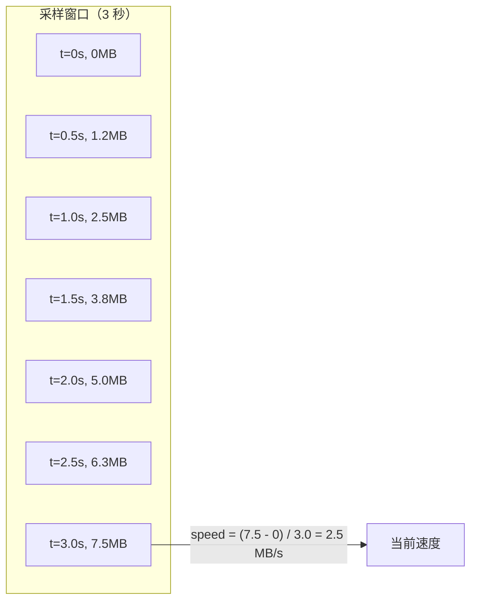
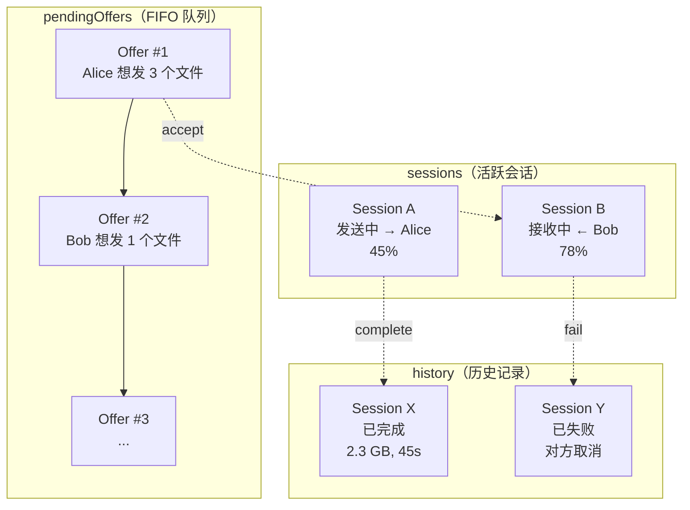
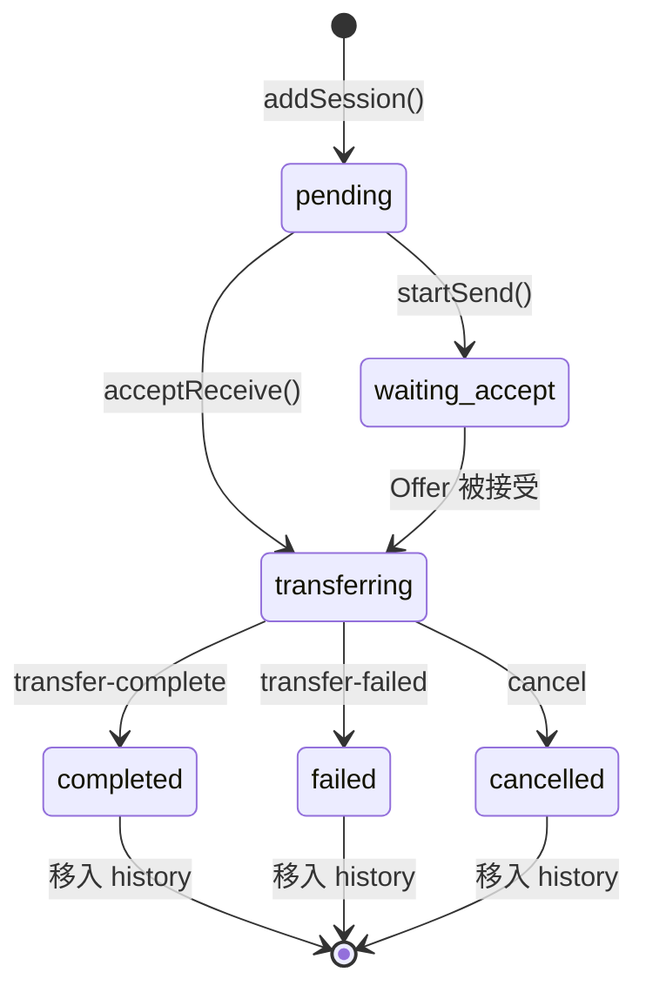
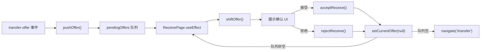
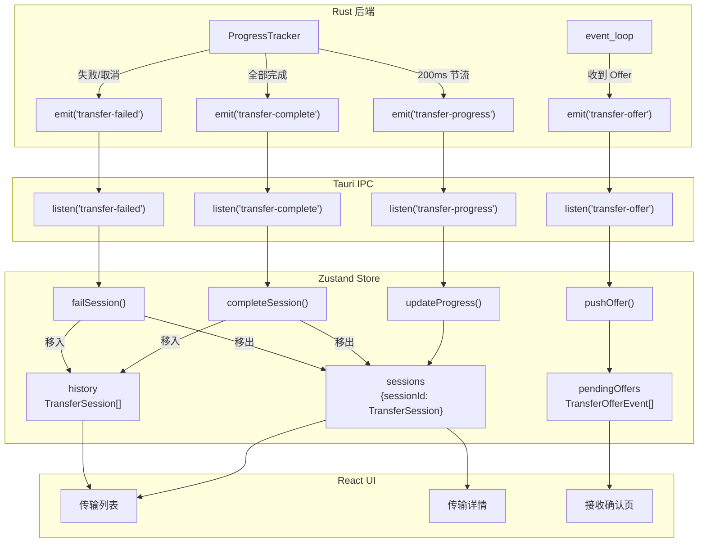

# 进度追踪与前端状态机：从滑动窗口到 Zustand Store

文件传输的 UI 体验，核心就是一个进度条。但一个"好用"的进度条背后需要解决不少问题：速度怎么算才不抖动？ETA 怎么估算？200ms 节流会不会丢失关键事件？前端状态怎么跟后端同步？

本文从后端的 `ProgressTracker` 讲到前端的 `transfer-store`，完整呈现 SwarmDrop 的进度追踪和传输状态管理方案。

## 后端：ProgressTracker

### 为什么需要专门的进度追踪器？

最简单的方案是每个分块完成后直接发事件给前端：

```
分块完成 → emit("transfer-progress", { transferred_bytes, total_bytes })
```

但这有三个问题：

1. **事件风暴**——8 路并发，每秒可能产生几十个进度事件，前端 re-render 跟不上
2. **速度计算**——`已传输 / 已用时间` 给出的是平均速度，不反映当前实时速度
3. **ETA 抖动**——速度波动大时，ETA 在 "3 分钟" 和 "8 分钟" 之间来回跳

ProgressTracker 解决这三个问题。

### 结构体设计

```rust
pub struct ProgressTracker {
    session_id: Uuid,
    direction: &'static str,      // "send" 或 "receive"
    total_bytes: u64,
    transferred_bytes: u64,
    total_files: usize,
    completed_files: usize,
    current_file: Option<CurrentFileProgress>,
    started_at: Instant,
    samples: VecDeque<(Instant, u64)>,  // 滑动窗口采样点
    last_emit: Option<Instant>,         // 上次发射时间（节流用）
}
```

### 滑动窗口速度计算

传统的"平均速度"（总字节 / 总时间）无法反映当前状态——如果前 30 秒传了 100MB，后 5 秒只传了 1MB（网络波动），平均速度仍然显示 2.9 MB/s，但用户体验的是接近停滞。

SwarmDrop 使用 **3 秒滑动窗口**：只看最近 3 秒内的传输数据来计算速度。



```rust
/// 节流间隔：200ms
const THROTTLE_INTERVAL: Duration = Duration::from_millis(200);
/// 速度计算滑动窗口：3 秒
const SPEED_WINDOW: Duration = Duration::from_secs(3);

/// 记录传输的字节数
pub fn add_bytes(&mut self, bytes: u64) {
    self.transferred_bytes += bytes;
    let now = Instant::now();
    self.samples.push_back((now, self.transferred_bytes));

    // 清理超出窗口的采样点
    let cutoff = now - SPEED_WINDOW;
    while self.samples.front().is_some_and(|(t, _)| *t < cutoff) {
        self.samples.pop_front();
    }
}
```

#### 速度计算

```rust
pub fn speed(&self) -> f64 {
    if self.samples.len() < 2 {
        return 0.0;  // 采样不足，返回 0
    }
    let (t_first, b_first) = self.samples.front().unwrap();
    let (t_last, b_last) = self.samples.back().unwrap();
    let elapsed = t_last.duration_since(*t_first).as_secs_f64();
    if elapsed < 0.001 {
        return 0.0;  // 时间间隔太短，避免除零
    }
    (b_last - b_first) as f64 / elapsed
}
```

为什么用窗口首尾而不是平均值？因为 VecDeque 中的采样点不是等间隔的（受分块大小和网络延迟影响）。首尾差值法等价于窗口内的平均速率，但计算更简单、更稳定。

#### ETA 估算

```rust
pub fn eta(&self) -> Option<f64> {
    let speed = self.speed();
    if speed < 1.0 {
        return None;  // 速度太低时不显示 ETA（避免"999 小时"）
    }
    let remaining = self.total_bytes.saturating_sub(self.transferred_bytes);
    Some(remaining as f64 / speed)
}
```

当速度低于 1 byte/sec 时返回 `None`，前端显示 "--" 而非一个荒谬的大数字。

### 节流发射：200ms 间隔

```rust
pub fn emit_progress(&mut self, app: &AppHandle) {
    let now = Instant::now();
    if let Some(last) = self.last_emit {
        if now.duration_since(last) < THROTTLE_INTERVAL {
            return;  // 距上次发射不足 200ms，跳过
        }
    }
    self.last_emit = Some(now);

    let event = TransferProgressEvent {
        session_id: self.session_id,
        direction: self.direction,
        total_files: self.total_files,
        completed_files: self.completed_files,
        current_file: self.current_file.clone(),
        total_bytes: self.total_bytes,
        transferred_bytes: self.transferred_bytes,
        speed: self.speed(),
        eta: self.eta(),
    };
    let _ = app.emit("transfer-progress", &event);
}
```

200ms 节流意味着前端每秒最多收到 5 次进度更新——足够流畅（人眼感知更新频率约 60fps，5fps 的进度条已经很丝滑），又不会淹没前端。

### 三种事件类型

| 事件名 | 触发时机 | 关键字段 |
|---|---|---|
| `transfer-progress` | 200ms 节流发射 | `speed`, `eta`, `currentFile`, `transferredBytes` |
| `transfer-complete` | 所有文件传输完成 | `elapsedMs`, `savePath`, `fileUris`(Android) |
| `transfer-failed` | 传输失败或被取消 | `error` |

```rust
/// 进度事件
#[derive(Serialize)]
#[serde(rename_all = "camelCase")]
pub struct TransferProgressEvent {
    pub session_id: Uuid,
    pub direction: &'static str,
    pub total_files: usize,
    pub completed_files: usize,
    pub current_file: Option<CurrentFileProgress>,
    pub total_bytes: u64,
    pub transferred_bytes: u64,
    pub speed: f64,       // bytes/sec
    pub eta: Option<f64>, // 剩余秒数
}

/// 完成事件
#[derive(Serialize)]
#[serde(rename_all = "camelCase")]
pub struct TransferCompleteEvent {
    pub session_id: Uuid,
    pub direction: &'static str,
    pub total_bytes: u64,
    pub elapsed_ms: u64,
    pub save_path: Option<String>,
    pub file_uris: Vec<Value>,       // Android FileUri 列表
    pub save_dir_uri: Option<Value>,  // Android 保存目录 URI
}
```

`file_uris` 使用 `serde_json::Value` 而非具体类型——因为 `FileUri` 只在 Android 编译，用 `Value` 可以跨平台编译而不需要 `#[cfg]` 条件编译。前端直接把它当 `AndroidFsUri[]` 用。

## 前端：Transfer Store

### 状态定义

```typescript
interface TransferState {
  /** 活跃传输会话 */
  sessions: Record<string, TransferSession>;
  /** 已完成传输历史（内存中保留，重启后清空） */
  history: TransferSession[];
  /** 待处理的接收请求队列 */
  pendingOffers: TransferOfferEvent[];
}
```

三个核心状态：



### TransferSession 状态机

```typescript
export type TransferStatus =
  | "pending"         // 初始状态
  | "waiting_accept"  // 等待对方接受
  | "transferring"    // 传输中
  | "completed"       // 完成
  | "failed"          // 失败
  | "cancelled";      // 已取消

export interface TransferSession {
  sessionId: string;
  direction: TransferDirection;
  peerId: string;
  deviceName: string;
  files: TransferFileInfo[];
  totalSize: number;
  status: TransferStatus;
  progress: TransferProgressEvent | null;
  error: string | null;
  startedAt: number;
  completedAt: number | null;
  savePath?: string;
  fileUris?: AndroidFsUri[];       // Android 端文件 URI
  saveDirUri?: AndroidFsUri;       // Android 端目录 URI
}
```



### 事件监听设置

SwarmDrop 使用 Tauri 的事件系统（非 Channel），前端通过 `listen` 订阅后端事件：

```typescript
export async function setupTransferListeners() {
  await cleanupTransferListeners();  // 先清理旧监听（避免重复）

  const fns = await Promise.all([
    listen<TransferOfferEvent>("transfer-offer", (event) => {
      useTransferStore.getState().pushOffer(event.payload);
    }),
    listen<TransferProgressEvent>("transfer-progress", (event) => {
      useTransferStore.getState().updateProgress(event.payload);
    }),
    listen<TransferCompleteEvent>("transfer-complete", (event) => {
      useTransferStore.getState().completeSession(event.payload);
    }),
    listen<TransferFailedEvent>("transfer-failed", (event) => {
      useTransferStore.getState().failSession(event.payload);
    }),
  ]);

  unlistenFns = fns;
}
```

四个事件，四个 action——一一对应，没有复杂的状态转换逻辑。

### Store Actions 解析

#### updateProgress：高频更新的优化

```typescript
updateProgress(event) {
  set((state) => {
    const session = state.sessions[event.sessionId];
    if (!session) return state;  // 防御：会话可能已被移除
    return {
      sessions: {
        ...state.sessions,
        [event.sessionId]: {
          ...session,
          status: "transferring",
          progress: event,  // 直接替换整个 progress 对象
        },
      },
    };
  });
},
```

每秒最多 5 次更新（后端 200ms 节流），前端直接**替换** progress 对象。不做 merge、不做 diff——简单即正确。Zustand 的浅比较会自动跳过不必要的 re-render。

#### completeSession：从活跃列表移入历史

```typescript
completeSession(event) {
  set((state) => {
    const session = state.sessions[event.sessionId];
    if (!session) return state;

    const completed: TransferSession = {
      ...session,
      status: "completed",
      completedAt: Date.now(),
      savePath: event.savePath,
      fileUris: event.fileUris.length > 0 ? event.fileUris : undefined,
      saveDirUri: event.saveDirUri ?? undefined,
    };

    // 从 sessions 移除，加入 history 头部
    const { [event.sessionId]: _, ...rest } = state.sessions;
    return {
      sessions: rest,
      history: [completed, ...state.history],
    };
  });
},
```

使用 ES6 解构 `{ [event.sessionId]: _, ...rest }` 从 sessions 中移除指定 key——比 `delete` + spread 更干净。`history` 新条目插入头部（最近完成的在最前）。

#### pendingOffers：FIFO 队列

```typescript
pushOffer(offer) {
  set((state) => ({
    pendingOffers: [...state.pendingOffers, offer],
  }));
},

shiftOffer() {
  const { pendingOffers } = get();
  if (pendingOffers.length === 0) return undefined;
  const [first, ...rest] = pendingOffers;
  set({ pendingOffers: rest });
  return first;
},
```

收到多个 Offer 时排队处理——用户先处理第一个（接受/拒绝），处理完自动弹出下一个。不会同时弹出多个确认弹窗。

## 前端命令 Wrapper

### prepareSend：Channel 实时进度

```typescript
export async function prepareSend(
  files: ScannedFile[],
  onProgress?: (progress: PrepareProgress) => void,
): Promise<PreparedTransfer> {
  const channel = new Channel<PrepareProgress>();
  if (onProgress) {
    channel.onmessage = onProgress;
  }
  return invoke("prepare_send", { files, onProgress: channel });
}
```

`prepareSend` 使用 Tauri Channel（非全局事件）来接收进度——因为准备阶段的进度只跟当前发送页面相关，不需要全局广播。Channel 是一对一的、自动清理的。

发送页面中的使用方式：

```tsx
function SendPage() {
  const [prepareProgress, setPrepareProgress] = useState<PrepareProgress | null>(null);

  const handleSend = async () => {
    const prepared = await prepareSend(scannedFiles, setPrepareProgress);
    // ... 发送 Offer
  };

  return (
    <>
      {prepareProgress && <PrepareProgressBar progress={prepareProgress} />}
    </>
  );
}
```

### 进度条组件

```tsx
function PrepareProgressBar({ progress }: { progress: PrepareProgress }) {
  const percent = progress.totalBytes > 0
    ? Math.round((progress.bytesHashed / progress.totalBytes) * 100)
    : 0;

  return (
    <div className="flex flex-col gap-2">
      <div className="flex items-center justify-between text-xs text-muted-foreground">
        <span>正在计算校验和 ({progress.completedFiles}/{progress.totalFiles})</span>
        <span>{formatFileSize(progress.bytesHashed)} / {formatFileSize(progress.totalBytes)}</span>
      </div>
      <Progress value={percent} className="h-2" />
      {progress.currentFile && <p className="truncate text-xs">{progress.currentFile}</p>}
    </div>
  );
}
```

展示三层信息：

1. **文件进度**——"正在计算校验和 (3/12)"
2. **字节进度**——"235 MB / 1.2 GB" + 进度条
3. **当前文件**——"large-dataset.zip"

## 接收页面：Offer 队列消费

```tsx
function ReceivePage() {
  const shiftOffer = useTransferStore((s) => s.shiftOffer);
  const pendingCount = useTransferStore((s) => s.pendingOffers.length);
  const [currentOffer, setCurrentOffer] = useState<TransferOfferEvent | null>(null);

  // 从队列取出第一个 offer
  useEffect(() => {
    if (currentOffer === null && pendingCount > 0) {
      const offer = shiftOffer();
      if (offer) setCurrentOffer(offer);
    }
  }, [currentOffer, pendingCount, shiftOffer]);

  const handleAccept = async () => {
    await acceptReceive(currentOffer!.sessionId, savePath);
    // 创建前端会话对象
    useTransferStore.getState().addSession({ ... });
    // 清空 currentOffer，触发 useEffect 取下一个
    setCurrentOffer(null);
  };
}
```

流程：



### 默认保存路径

桌面端让用户选择保存目录（可修改），Android 端固定保存到 `Download/SwarmDrop/`（不可修改）：

```tsx
useEffect(() => {
  getDefaultSavePath().then(setSavePath);
}, []);

// Android 端不显示路径选择器
{!isAndroid() && (
  <button onClick={handleChangePath}>
    <FolderOpen /> {savePath}
  </button>
)}
```

## 传输列表与详情页

### 传输列表

传输列表展示两个分区：**活跃传输** + **历史记录**。

```tsx
function TransferPage() {
  const sessions = useTransferStore((s) => s.sessions);
  const history = useTransferStore((s) => s.history);

  const activeSessions = Object.values(sessions);

  return (
    <main>
      {activeSessions.length > 0 && (
        <section>
          <h2>活跃传输</h2>
          {activeSessions.map((s) => <TransferItem key={s.sessionId} session={s} />)}
        </section>
      )}
      {history.length > 0 && (
        <section>
          <h2>历史记录</h2>
          {history.map((s) => <TransferItem key={s.sessionId} session={s} />)}
        </section>
      )}
    </main>
  );
}
```

### 传输详情页

点击某个传输项进入详情页，展示实时进度和操作按钮。进度信息来自后端的 `TransferProgressEvent`：

| 展示项 | 数据来源 | 格式化 |
|---|---|---|
| 总进度条 | `transferredBytes / totalBytes` | 百分比 + 进度条 |
| 当前速度 | `speed` (bytes/sec) | `formatFileSize(speed) + "/s"` |
| 剩余时间 | `eta` (秒) | `formatDuration(eta)` |
| 当前文件 | `currentFile.name` | 文件名 + 分块进度 |
| 文件计数 | `completedFiles / totalFiles` | "3/12 个文件" |

详情页还提供操作按钮：

- **传输中**——取消按钮（调用 `cancelSend()` 或 `cancelReceive()`）
- **已完成**——
  - 桌面端：打开文件夹（`openPath(savePath)`）
  - Android 端：查看文件（`showViewFileDialog(fileUris)`）或打开文件夹（`showViewDirDialog(saveDirUri)`）

## 数据流全览



## 为什么不用 Channel 传递所有进度？

Tauri 提供了两种前后端通信方式：

| | Tauri Event (emit/listen) | Tauri Channel |
|---|---|---|
| 范围 | 全局广播 | 一对一 |
| 生命周期 | 手动管理（unlisten） | 跟随 invoke 调用自动清理 |
| 适用场景 | 多个组件都关心的事件 | 单次调用的回调 |

SwarmDrop 的选择：

- **传输进度/完成/失败** → Tauri Event——因为传输列表页、详情页、通知栏可能同时关心同一个会话的进度
- **prepare_send 进度** → Tauri Channel——因为只有当前发送页面关心准备进度，Channel 跟随 invoke 调用自动清理

## 踩过的坑

### 1. 窗口未聚焦时的系统通知

收到传输请求时，如果用户不在 SwarmDrop 窗口中，需要发系统通知提醒：

```rust
fn notify_if_unfocused(app: &AppHandle, title: &str, body: &str) {
    let focused = app
        .get_webview_window("main")
        .and_then(|w| w.is_focused().ok())
        .unwrap_or(false);

    if !focused {
        app.notification().builder().title(title).body(body).show();
    }
}
```

如果窗口已聚焦，就不弹通知——避免干扰用户。

### 2. 速度为 0 时 ETA 的处理

如果网络暂时中断，速度降到 0，ETA 计算会除零或得到 infinity。解决方案是当速度低于 1 byte/sec 时返回 `None`：

```rust
pub fn eta(&self) -> Option<f64> {
    let speed = self.speed();
    if speed < 1.0 {
        return None;  // 前端显示 "--"
    }
    // ...
}
```

### 3. 历史记录的内存管理

当前 `history` 数组没有大小限制，重启后清空。如果用户在一次会话中传输了上百次，history 会占用可观的内存。未来可能需要：

- 限制 history 最大条数（如 50 条）
- 持久化到 tauri-plugin-store
- 分页加载

但对于 MVP 阶段，内存中的无限 history 足够了。

## 总结

SwarmDrop 的进度追踪系统可以总结为两句话：

> **后端**：滑动窗口算速度，200ms 节流发事件，三种事件覆盖完整生命周期。
>
> **前端**：Zustand 三个状态分区（活跃/历史/待确认），四个 listener 一一映射，FIFO 队列处理并发 Offer。

设计哲学是**后端做重活，前端做展示**：速度计算、ETA 估算、节流控制全在 Rust 端完成，前端只是忠实地渲染 `TransferProgressEvent` 中的数据。这避免了 JavaScript 端的计时精度问题和高频 setState 的性能问题。
