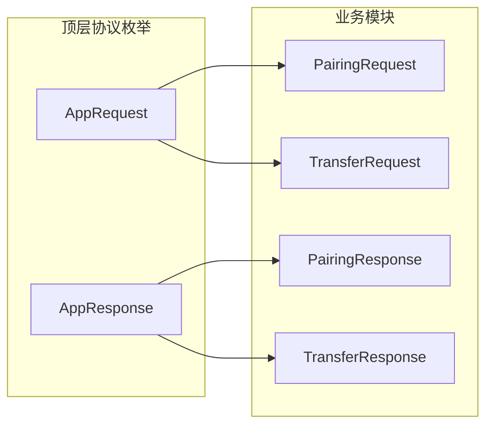
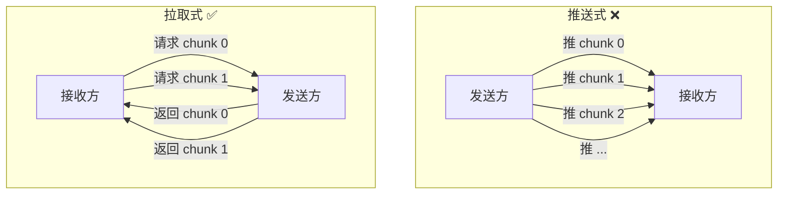
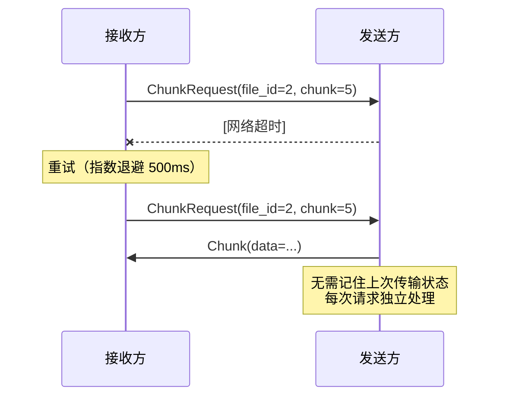
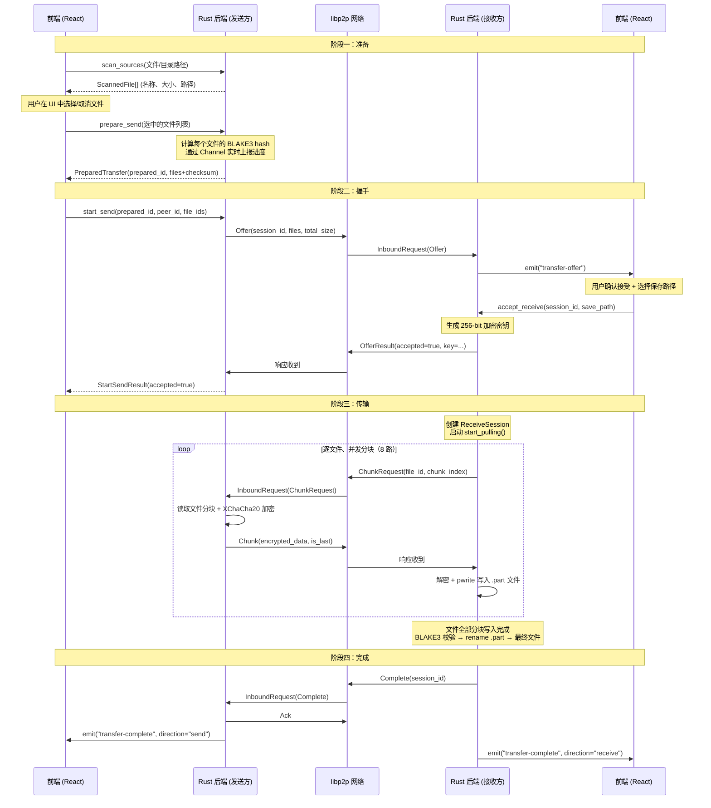
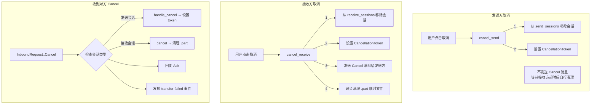

# P2P 文件传输协议设计：拉取式架构与四阶段握手

SwarmDrop 是一个基于 libp2p 的去中心化文件传输工具。P2P 传输不像 HTTP 那样有成熟的规范可以直接套用——你需要自己设计整个协议：谁先发起？谁控制流量？分块怎么请求？断了怎么办？

本文详细讲解 SwarmDrop 的传输协议设计，包括消息格式、交互流程、以及为什么选择"拉取式"而非"推送式"的架构。

## 协议选型：基于 libp2p Request-Response

SwarmDrop 的底层网络使用 libp2p。libp2p 提供了多种通信模式，我们选择了 **Request-Response** 协议：

| 模式 | 特点 | 适用场景 |
|---|---|---|
| Gossipsub | 多对多发布订阅 | 聊天室、区块同步 |
| **Request-Response** | **一对一请求-响应** | **文件传输、RPC** |
| Bitswap | 内容寻址块交换 | IPFS 风格文件分享 |

Request-Response 的优势：

1. **语义清晰**——每个请求必定有一个响应，天然支持错误处理
2. **背压控制**——发送方不会无限制地推数据，每个分块都是接收方主动请求
3. **超时可控**——请求级别的超时，不需要自己管理连接级超时

## 消息格式：CBOR 编解码

所有消息使用 **CBOR（Concise Binary Object Representation）** 编解码。CBOR 是一种二进制的类 JSON 格式，比 JSON 更紧凑，比 Protocol Buffers 更灵活。



SwarmDrop 的所有通信共用一对顶层枚举 `AppRequest` / `AppResponse`，内部通过标签（`"type"` 字段）区分是配对还是传输消息。这样只需要注册一个 Request-Response 协议，而不是为每种业务单独注册。

### 顶层协议定义

```rust
// protocol.rs
#[derive(Debug, Clone, Serialize, Deserialize)]
#[serde(rename_all = "camelCase", tag = "type")]
pub enum AppRequest {
    Pairing(PairingRequest),
    Transfer(TransferRequest),
}

#[derive(Debug, Clone, Serialize, Deserialize)]
#[serde(rename_all = "camelCase", tag = "type")]
pub enum AppResponse {
    Pairing(PairingResponse),
    Transfer(TransferResponse),
}
```

`#[serde(tag = "type")]` 让 CBOR 编码时使用内部标签，序列化后类似：

```json
{"type": "Transfer", "kind": "Offer", "sessionId": "...", "files": [...]}
```

## 传输协议的四种消息

```rust
/// 传输请求
#[derive(Debug, Clone, Serialize, Deserialize)]
#[serde(rename_all = "camelCase", tag = "kind")]
pub enum TransferRequest {
    Offer { session_id: Uuid, files: Vec<FileInfo>, total_size: u64 },
    ChunkRequest { session_id: Uuid, file_id: u32, chunk_index: u32 },
    Complete { session_id: Uuid },
    Cancel { session_id: Uuid, reason: String },
}

/// 传输响应
#[derive(Debug, Clone, Serialize, Deserialize)]
#[serde(rename_all = "camelCase", tag = "kind")]
pub enum TransferResponse {
    OfferResult { accepted: bool, key: Option<[u8; 32]>, reason: Option<String> },
    Chunk { session_id: Uuid, file_id: u32, chunk_index: u32, data: Vec<u8>, is_last: bool },
    Ack { session_id: Uuid },
}
```

四种请求对应三种响应，形成清晰的交互矩阵：

| 请求 | 响应 | 说明 |
|---|---|---|
| `Offer` | `OfferResult` | 发起传输 → 接受/拒绝 + 加密密钥 |
| `ChunkRequest` | `Chunk` | 拉取分块 → 加密数据 |
| `Complete` | `Ack` | 所有文件完成 → 确认 |
| `Cancel` | `Ack` | 取消传输 → 确认 |

## 为什么是"拉取式"？

这是协议设计中最重要的决策。传统文件传输通常是**推送式**——发送方把数据推给接收方。SwarmDrop 选择了**拉取式**——接收方主动请求每一个分块。



拉取式有几个关键优势：

### 1. 天然背压控制

推送式需要额外的流控机制（滑动窗口、ACK 确认等），否则发送方可能淹没接收方。拉取式中接收方控制请求节奏——Semaphore 限制并发 8 个请求，磁盘写入慢了就自然减速。

### 2. 重试简单到极致

推送式重试需要发送方维护发送窗口和确认状态。拉取式重试只是接收方重新发一次 `ChunkRequest`——幂等操作，发送方无状态。



### 3. 与加密方案完美配合

SwarmDrop 的 nonce 从 `(session_id, file_id, chunk_index)` 确定性派生。接收方重试时使用相同参数，发送方加密后得到完全相同的密文——**幂等安全**。如果是推送式，发送方需要自己管理重传逻辑，复杂度倍增。

### 4. 接收方决定存储策略

接收方可以根据磁盘写入速度动态调整并发度，甚至跳过已成功写入的分块（断点续传的基础）。推送式则需要发送方感知接收方的状态，引入额外的反馈通道。

### 拉取式的代价

公平起见，拉取式也有缺点：

- **延迟略高**——每个分块多一次 RTT（请求 → 响应 vs 直接推送）
- **小文件效率低**——单个分块的文件也需要完整的请求-响应往返

但在 SwarmDrop 的场景中，分块大小 256KB、并发 8 路，延迟影响可以忽略。

## 完整传输流程：四阶段



### 阶段一：准备

发送方在发出 Offer 之前需要两步准备：

1. **`scan_sources`** — 扫描选中的文件/目录，返回扁平化的文件列表（名称、大小、路径）。不计算 hash，速度快，用于 UI 展示文件树
2. **`prepare_send`** — 对选中的文件计算 BLAKE3 校验和。这步是 CPU 密集型操作，通过 Tauri Channel 实时上报字节级进度

为什么分两步？因为用户可能选了一个包含上万文件的目录，但最终只想发其中几个。先 scan 让用户看到文件树并筛选，再对选中的文件计算 hash，避免浪费时间。

### 阶段二：握手

核心交互是 `Offer → OfferResult`：

```rust
// 发送方发出
TransferRequest::Offer {
    session_id: Uuid,      // 会话唯一标识
    files: Vec<FileInfo>,  // 文件列表（含 BLAKE3 校验和）
    total_size: u64,       // 总大小
}

// 接收方回复
TransferResponse::OfferResult {
    accepted: bool,           // 是否接受
    key: Option<[u8; 32]>,    // 256-bit 加密密钥（接受时提供）
    reason: Option<String>,   // 拒绝原因
}
```

关键设计：**接收方在接受的同时生成并返回加密密钥**。这样一次握手就完成了密钥交换，不需要额外的 Diffie-Hellman 协商。

安全前提：SwarmDrop 的配对系统确保双方已经互相验证身份。事件循环在收到 Offer 时会检查发送方是否为已配对设备，未配对直接拒绝。

### 阶段三：传输

接收方创建 `ReceiveSession` 后调用 `start_pulling()`，逐文件、并发分块拉取。每个分块的完整流程：

```
ChunkRequest(session_id, file_id, chunk_index)
  → 发送方读取文件分块
  → XChaCha20-Poly1305 加密
  → Chunk(encrypted_data, is_last)
  → 接收方解密
  → pwrite 写入 .part 临时文件
```

`is_last` 标志告知接收方当前文件的最后一个分块已到达，但接收方不依赖此标志判断完成——而是通过自己的 `calc_total_chunks(file_size)` 计算。

### 阶段四：完成

所有文件传输完毕后，接收方发送 `Complete` 消息。发送方收到后清理会话资源，双方各自发射 `transfer-complete` 事件到前端。

## FileInfo：文件元数据设计

```rust
#[derive(Debug, Clone, Serialize, Deserialize)]
#[serde(rename_all = "camelCase")]
pub struct FileInfo {
    pub file_id: u32,
    pub name: String,
    pub relative_path: String,
    pub size: u64,
    pub checksum: String,
}
```

| 字段 | 说明 | 设计理由 |
|---|---|---|
| `file_id` | 自增整数标识 | 比 UUID 短，在 ChunkRequest 中节省带宽 |
| `name` | 文件名 | 前端展示用 |
| `relative_path` | 相对路径（Unix 风格 `/` 分隔符） | 保留目录结构，接收方按路径创建子目录 |
| `size` | 文件大小（字节） | 分块计算、进度计算 |
| `checksum` | BLAKE3 hex 字符串 | 文件级完整性校验（分块有 Poly1305，文件级用 BLAKE3 双重保障） |

## 密钥传输的 CBOR 优化

加密密钥是 32 字节的二进制数据。直接用 `[u8; 32]` 在 CBOR 中会被编码为数组（32 个整数元素），浪费空间。SwarmDrop 使用自定义序列化器将其编码为 CBOR bytes 类型：

```rust
TransferResponse::OfferResult {
    accepted: bool,
    #[serde(serialize_with = "serialize_opt_key", deserialize_with = "deserialize_opt_key")]
    key: Option<[u8; 32]>,
    reason: Option<String>,
}
```

效果：32 字节密钥在 CBOR 中只需要 34 字节（2 字节头 + 32 字节数据），而不是 96+ 字节（32 个整数元素各 3 字节）。

## 分块数据的 serde_bytes 优化

类似地，`Chunk` 响应中的加密数据也使用 `serde_bytes` 优化：

```rust
TransferResponse::Chunk {
    session_id: Uuid,
    file_id: u32,
    chunk_index: u32,
    #[serde(with = "serde_bytes")]
    data: Vec<u8>,  // 最大 256KB + 16 字节认证标签
    is_last: bool,
}
```

没有 `serde_bytes`，CBOR 会把 `Vec<u8>` 编码为整数数组；有了它，直接编码为 bytes 类型，256KB 的分块只多 5 字节头，而不是翻三倍。

## 取消协议

任意一方都可以取消传输。取消是一个"尽力而为"的操作：



取消设计的几个原则：

1. **幂等安全**——多次取消不会出错（DashMap.remove 返回 None 而非 panic）
2. **先取消后清理**——CancellationToken 立即阻止新的 ChunkRequest 发出，再异步清理临时文件
3. **无需确认**——Cancel 收到 Ack 即可，不需要等对方完成清理

## 安全边界：事件循环的门卫

所有入站消息在事件循环（`event_loop.rs`）中先经过安全检查，再分派到对应的处理器：

```rust
// 仅接受已配对设备的 Offer
AppRequest::Transfer(TransferRequest::Offer { .. }) => {
    if !shared.pairing.is_paired(&peer_id) {
        warn!("Rejecting transfer offer from unpaired peer: {}", peer_id);
        // 直接回复拒绝，不缓存
        let response = AppResponse::Transfer(TransferResponse::OfferResult {
            accepted: false,
            key: None,
            reason: Some("未配对设备".into()),
        });
        client.send_response(pending_id, response).await;
        continue;
    }
    // 已配对，正常处理...
}
```

`ChunkRequest` 不需要额外的身份检查——它依赖 `session_id` 查找对应的 `SendSession`。如果 session_id 不存在（伪造的请求），返回一个空的 `Ack` 响应，不会泄露任何数据。

## 总结

SwarmDrop 的传输协议遵循几个设计原则：

1. **拉取式优于推送式**——接收方控制流量，天然背压，重试简单
2. **最小消息类型**——4 种请求 + 3 种响应，覆盖完整生命周期
3. **一次握手完成密钥交换**——`Offer → OfferResult` 顺带传递加密密钥
4. **二进制优化**——CBOR 编码 + `serde_bytes` 避免 Vec<u8> 膨胀
5. **安全第一**——事件循环检查配对状态，未配对直接拒绝

整个协议实现约 120 行 Rust 代码（`protocol.rs`），简洁但完整。协议层只关心消息格式和语义，不包含任何业务逻辑——文件读写、加密解密、会话管理都由上层模块负责。
