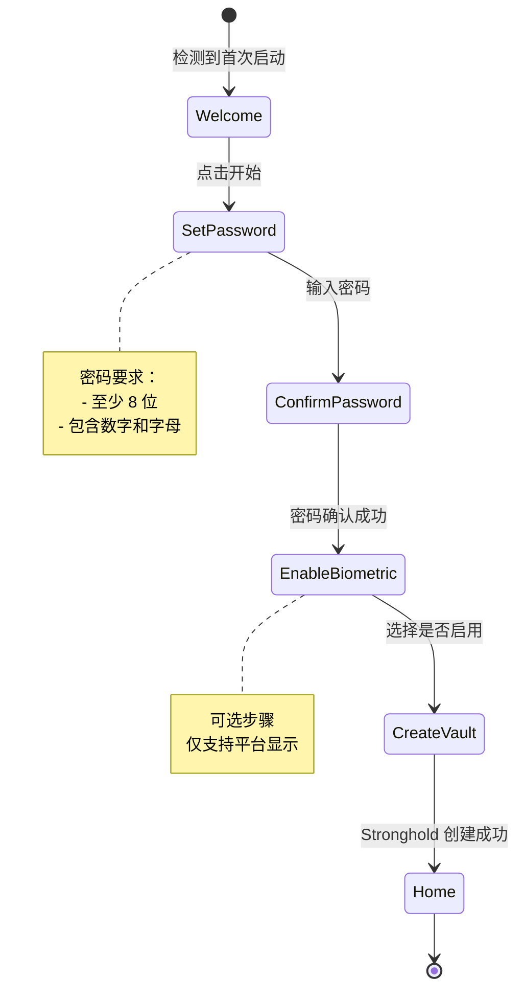
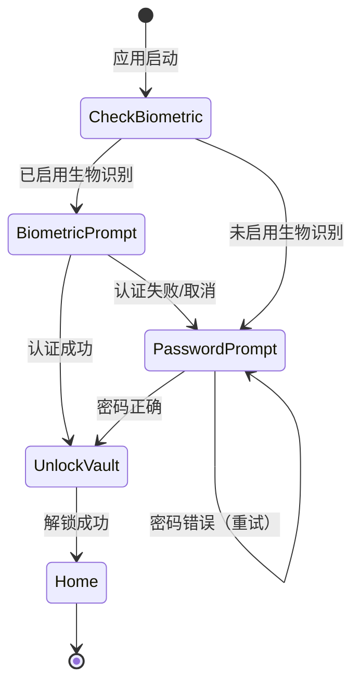
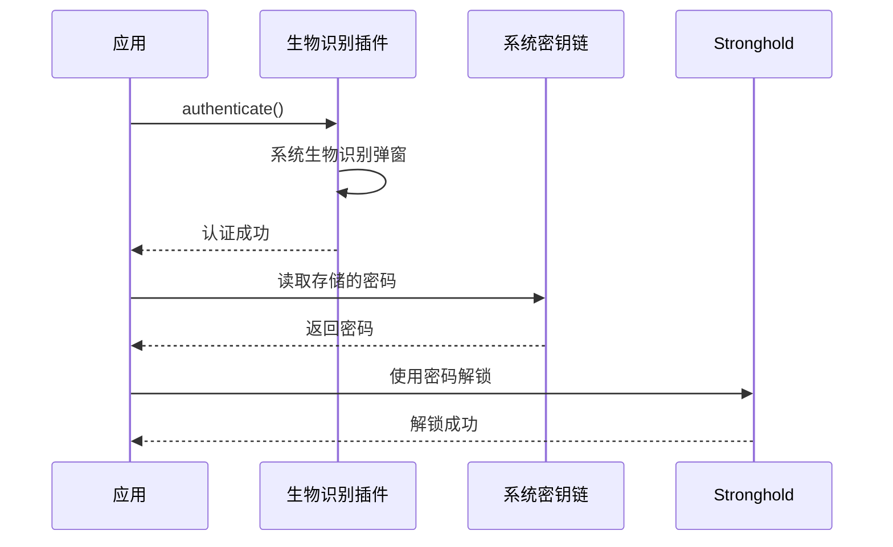

# SwarmDrop 认证系统设计

## 概述

为 SwarmDrop 添加用户认证功能，保护设备密钥对的安全。支持密码认证和生物识别（指纹/面容）两种方式。

## 用户流程

### 首次启动流程



### 后续启动流程



## 界面设计

### 1. 欢迎页面 (Welcome)

**目的：** 介绍应用，引导用户开始设置

**元素：**
- SwarmDrop Logo
- 欢迎标语："安全、快速的跨网络文件传输"
- 功能亮点（3-4 个图标+文字）
  - 端到端加密
  - 无需服务器
  - 跨平台支持
  - 局域网/广域网
- "开始使用" 按钮

### 2. 设置密码页面 (SetPassword)

**目的：** 用户创建主密码

**元素：**
- 返回按钮
- 标题："创建主密码"
- 说明文字："此密码用于保护您的设备身份，请妥善保管"
- 密码输入框（带显示/隐藏切换）
- 确认密码输入框
- 密码强度指示器
- 密码要求提示
- "下一步" 按钮（密码符合要求时启用）

### 3. 启用生物识别页面 (EnableBiometric)

**目的：** 询问是否启用快捷解锁

**元素：**
- 生物识别图标（指纹/面容）
- 标题："启用快捷解锁？"
- 说明："使用指纹或面容快速解锁应用"
- "启用" 按钮
- "稍后设置" 链接

**条件显示：** 仅在支持生物识别的设备上显示

### 4. 解锁页面 (Unlock)

**目的：** 后续启动时验证身份

**元素：**
- SwarmDrop Logo（小）
- 生物识别按钮（如已启用）
- 分隔线 "或"
- 密码输入框
- "解锁" 按钮
- 错误提示区域

## 技术实现

### 数据存储

```typescript
// 认证状态存储（非敏感，可用普通存储）
interface AuthConfig {
  // 是否已完成初始设置
  isSetupComplete: boolean;
  // 是否启用生物识别
  biometricEnabled: boolean;
  // 密码哈希（用于本地验证，可选）
  passwordHash?: string;
}

// Stronghold 存储（敏感数据）
interface SecretStore {
  keypair: number[];  // 密钥对
}
```

### Tauri 插件依赖

```toml
# Cargo.toml
[dependencies]
tauri-plugin-stronghold = "2"
tauri-plugin-biometric = "2"  # 生物识别
```

```json
// package.json
{
  "dependencies": {
    "@tauri-apps/plugin-stronghold": "^2.0.0",
    "@tauri-apps/plugin-biometric": "^2.0.0"
  }
}
```

### 生物识别流程



### 密码存储策略

**启用生物识别时：**
1. 用户设置密码
2. 密码存入系统密钥链（Keychain/Credential Manager）
3. 密码用于 Stronghold 加密
4. 生物识别成功后从密钥链读取密码

**仅密码模式：**
1. 用户每次输入密码
2. 密码直接用于 Stronghold 解锁
3. 不存储密码

## 安全考虑

### 密码要求
- 最小长度：8 字符
- 必须包含：字母 + 数字
- 推荐包含：特殊字符

### 错误处理
- 密码错误：显示错误提示，允许重试
- 生物识别失败：回退到密码输入
- 连续错误：考虑添加延迟（防暴力破解）

### 密码重置
- **MVP 阶段：** 不支持重置，忘记密码需重新设置（丢失身份）
- **后续迭代：** 支持密钥备份和恢复

## 路由设计

```typescript
// TanStack Router 路由结构
const routes = {
  '/': {
    // 根据认证状态重定向
    loader: () => {
      if (!isSetupComplete) return redirect('/welcome');
      if (!isUnlocked) return redirect('/unlock');
      return redirect('/home');
    }
  },
  '/welcome': WelcomePage,
  '/setup-password': SetPasswordPage,
  '/enable-biometric': EnableBiometricPage,
  '/unlock': UnlockPage,
  '/home': HomePage,  // 需要认证
  '/devices': DevicesPage,  // 需要认证
  // ...
};
```

## 状态管理

```typescript
// auth-store.ts
interface AuthState {
  // 配置状态
  isSetupComplete: boolean;
  biometricEnabled: boolean;
  biometricAvailable: boolean;

  // 运行时状态
  isUnlocked: boolean;
  isLoading: boolean;
  error: string | null;

  // Actions
  checkSetupStatus: () => Promise<void>;
  setupPassword: (password: string) => Promise<void>;
  enableBiometric: () => Promise<void>;
  unlock: (password: string) => Promise<void>;
  unlockWithBiometric: () => Promise<void>;
  lock: () => void;
}
```

## 实现优先级

1. **P0 - MVP**
   - 欢迎页面
   - 密码设置
   - 密码解锁
   - 路由守卫

2. **P1 - 增强**
   - 生物识别
   - 密码强度检测
   - 错误重试限制

3. **P2 - 完善**
   - 密码修改
   - 密钥备份/恢复
   - 自动锁定

## 文件结构

```
src/
├── routes/
│   ├── _auth.tsx           # 认证布局（需要解锁的页面）
│   ├── welcome.tsx         # 欢迎页
│   ├── setup-password.tsx  # 设置密码
│   ├── enable-biometric.tsx # 启用生物识别
│   └── unlock.tsx          # 解锁页
├── stores/
│   ├── auth-store.ts       # 认证状态
│   └── secret-store.ts     # 密钥存储（已有）
├── components/
│   └── auth/
│       ├── PasswordInput.tsx
│       ├── PasswordStrength.tsx
│       └── BiometricButton.tsx
└── lib/
    └── stronghold.ts       # 需要修改：支持动态密码
```
