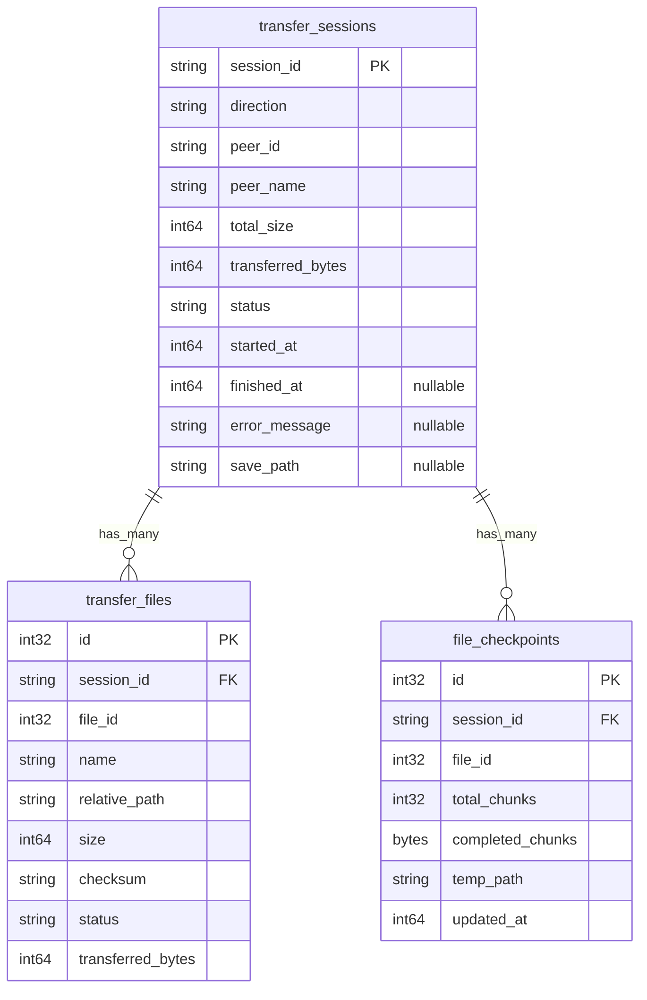

# 数据库实体设计

> **日期**: 2026-02-27
>
> **状态**: 设计阶段
>
> **相关文档**:
> - [文件传输设计](./file-transfer-design.md) — Phase 3 整体方案
> - [传输功能分析](./transfer-features-analysis.md) — 分块传输 / 传输记录 / 断点续传分析

---

## 背景

v0.3.2 需要引入 SQLite + SeaORM 2.0 以支持：

1. **传输历史持久化** — 记录每次传输会话和文件列表，重启后可查看历史
2. **断点续传 Checkpoint** — 持久化每个文件的分块完成状态，支持中断恢复
3. **传输中断支持** — 在 Interrupted 状态下保留足够信息以恢复传输

---

## 实体总览



---

## 实体详细设计

### 1. `transfer_sessions` — 传输会话记录

每次传输（发送或接收）对应一条记录。**发送方和接收方各自独立记录**，通过 `direction` 区分。

| 字段 | 类型 | 说明 |
|------|------|------|
| `session_id` | `String` (PK) | UUID，来自协议层的 `session_id` |
| `direction` | `String` | `"send"` 或 `"receive"` |
| `peer_id` | `String` | 对端 libp2p PeerId（hex） |
| `peer_name` | `String` | 对端设备名（快照，不跟踪更新） |
| `total_size` | `i64` | 所有文件总字节数 |
| `transferred_bytes` | `i64` | 已传输字节数（实时更新） |
| `status` | `String` | 见下表 |
| `started_at` | `i64` | Unix 时间戳（ms） |
| `finished_at` | `Option<i64>` | 完成/失败/取消时间，Null = 进行中 |
| `error_message` | `Option<String>` | 失败原因（status=failed 时有值） |
| `save_path` | `Option<String>` | 接收方保存目录（direction=receive 时有值） |

**`status` 枚举值：**

| 值 | 含义 | 写入时机 |
|----|------|---------|
| `"transferring"` | 传输进行中 | Offer 被接受时创建 |
| `"completed"` | 传输完成 | 所有文件校验通过 |
| `"failed"` | 传输失败 | 网络错误/校验失败等 |
| `"cancelled"` | 用户取消 | 任一方主动取消 |
| `"interrupted"` | 中断（可恢复） | 连接断开但未超时 |

> **说明**：`interrupted` 是特殊状态，表示传输因网络断开而中断，`file_checkpoints` 中保留了恢复信息。超过一定时间未恢复则降级为 `failed`，并清除 checkpoint。

---

### 2. `transfer_files` — 传输文件记录

每个传输文件对应一条记录，与 `transfer_sessions` 一对多关联。用于：
- 历史页面展示文件列表
- 断点续传时记录每个文件的传输进度

| 字段 | 类型 | 说明 |
|------|------|------|
| `id` | `i32` (PK, auto) | 自增主键 |
| `session_id` | `String` (FK) | 关联 `transfer_sessions.session_id` |
| `file_id` | `i32` | 会话内文件 ID（来自协议层，从 0 递增） |
| `name` | `String` | 文件名 |
| `relative_path` | `String` | 相对路径（用于重建目录结构） |
| `size` | `i64` | 文件大小（字节） |
| `checksum` | `String` | BLAKE3 校验和（hex，64 字符） |
| `status` | `String` | `"pending"` / `"completed"` / `"failed"` |
| `transferred_bytes` | `i64` | 已传输字节数（接收方用，更新频率低，不节流） |

> **注意**：`transferred_bytes` 不需要实时同步，仅在断点时持久化，用于恢复后的进度展示。

---

### 3. `file_checkpoints` — 断点续传检查点

**仅接收方使用**，记录每个文件的分块接收状态。发送方无需 checkpoint（发送方是响应式的，根据 ChunkRequest 按需读取文件）。

| 字段 | 类型 | 说明 |
|------|------|------|
| `id` | `i32` (PK, auto) | 自增主键 |
| `session_id` | `String` (FK) | 关联 `transfer_sessions.session_id` |
| `file_id` | `i32` | 会话内文件 ID |
| `total_chunks` | `i32` | 该文件总分块数 |
| `completed_chunks` | `Vec<u8>` (Blob) | BitVec 序列化字节，标记每个分块是否完成 |
| `temp_path` | `String` | 临时文件路径（`.part` 文件） |
| `updated_at` | `i64` | 最后更新时间戳（ms），用于超时清理 |

**`completed_chunks` 编码：**

使用 `bit-vec` crate 的 `BitVec<u8, Msb0>`，序列化为原始字节。例如：
- 8 个分块，已完成 0、1、3 → `[0b11010000]` = `[0xD0]`
- 查询是否可恢复：找出值为 `false` 的位 → 这些块需要重新拉取

**生命周期：**

```
文件开始接收  → 创建 checkpoint（completed_chunks 全 false）
每个块写入完成 → 更新对应 bit → 更新 updated_at
文件接收完成   → 删除该 checkpoint 行
会话完成/失败  → 删除所有相关 checkpoint
会话变为 interrupted → 保留 checkpoint（等待恢复）
超过 24h 未恢复 → 清理 checkpoint，会话降级为 failed
```

---

## 关系与约束

```
transfer_sessions (1) ──< transfer_files (N)
  约束: CASCADE DELETE（会话删除时，文件记录一并删除）
  UNIQUE INDEX: (session_id, file_id)

transfer_sessions (1) ──< file_checkpoints (N)
  约束: CASCADE DELETE（会话删除时，checkpoint 一并删除）
  UNIQUE INDEX: (session_id, file_id)
```

---

## SeaORM Entity 草图（Rust）

```rust
// entity/transfer_session.rs
#[sea_orm::model]
#[derive(Clone, Debug, PartialEq, Eq, DeriveEntityModel)]
#[sea_orm(table_name = "transfer_sessions")]
pub struct Model {
    #[sea_orm(primary_key, auto_increment = false)]
    pub session_id: String,
    pub direction: String,
    pub peer_id: String,
    pub peer_name: String,
    pub total_size: i64,
    pub transferred_bytes: i64,
    pub status: String,
    pub started_at: i64,
    pub finished_at: Option<i64>,
    pub error_message: Option<String>,
    pub save_path: Option<String>,
    #[sea_orm(has_many)]
    pub files: HasMany<super::transfer_file::Entity>,
    #[sea_orm(has_many)]
    pub checkpoints: HasMany<super::file_checkpoint::Entity>,
}

// entity/transfer_file.rs
#[sea_orm::model]
#[derive(Clone, Debug, PartialEq, Eq, DeriveEntityModel)]
#[sea_orm(table_name = "transfer_files")]
pub struct Model {
    #[sea_orm(primary_key)]
    pub id: i32,
    #[sea_orm(belongs_to, from = "session_id", to = "transfer_session::COLUMN.session_id")]
    pub session_id: String,
    pub file_id: i32,
    pub name: String,
    pub relative_path: String,
    pub size: i64,
    pub checksum: String,
    pub status: String,
    pub transferred_bytes: i64,
}

// entity/file_checkpoint.rs
#[sea_orm::model]
#[derive(Clone, Debug, PartialEq, Eq, DeriveEntityModel)]
#[sea_orm(table_name = "file_checkpoints")]
pub struct Model {
    #[sea_orm(primary_key)]
    pub id: i32,
    #[sea_orm(belongs_to, from = "session_id", to = "transfer_session::COLUMN.session_id")]
    pub session_id: String,
    pub file_id: i32,
    pub total_chunks: i32,
    pub completed_chunks: Vec<u8>,
    pub temp_path: String,
    pub updated_at: i64,
}
```

---

## 决策记录

| 决策 | 结论 | 理由 |
|------|------|------|
| 是否用 Enum 类型字段 | 用 `String` | SQLite 无 ENUM 类型，用字符串 + 应用层验证更简单 |
| Checkpoint 存放位置 | 独立表 `file_checkpoints` | 职责分离：历史记录 vs 恢复状态；历史页不需要查 checkpoint |
| 发送方是否需要 checkpoint | 不需要 | 发送方是响应式的，无需追踪分块状态；源文件始终在磁盘上 |
| `completed_chunks` 存储格式 | BitVec bytes (Blob) | 紧凑（每块 1 bit），查询时反序列化；对于 256KB 块，1GB 文件仅需 512 字节 |
| 加密密钥是否持久化 | **不持久化** | 密钥为会话级临时密钥，存储在磁盘上是安全隐患；断点恢复时重新协商 |
| 断点恢复密钥处理 | 发起新 ResumeRequest，生成新密钥 | 协议层扩展，见 [传输功能分析](./transfer-features-analysis.md#layer-2b-断点续传) |
| 历史记录清理策略 | 手动清理（用户操作）+ 自动清理 interrupted>24h | 不强制过期，用户可能想查看历史 |
| `session_id` 类型 | `String` (UUID hex) | 避免 SQLite UUID 兼容问题，与协议层对齐 |

---

## 待讨论问题

1. **`transfer_files` 的 `transferred_bytes` 更新频率**：是否每个 chunk 都更新？还是只在中断时更新？
   - 建议：仅在 checkpoint 更新时同步（降低写入频率）

2. **历史记录分页**：UI 是否需要分页？多少条合适？
   - 建议：默认展示最近 50 条，按 `started_at DESC` 排序

3. **`peer_name` 是否需要跟踪更新**：对端重命名后历史记录中的名字要不要变？
   - 建议：**快照**，传输时写入，不跟踪更新（符合历史记录语义）

4. **发送方是否记录 `save_path`**：发送方没有保存路径，但有源文件路径？
   - 建议：`save_path` 仅接收方有意义，发送方 `NULL`；如需源路径可后续扩展
