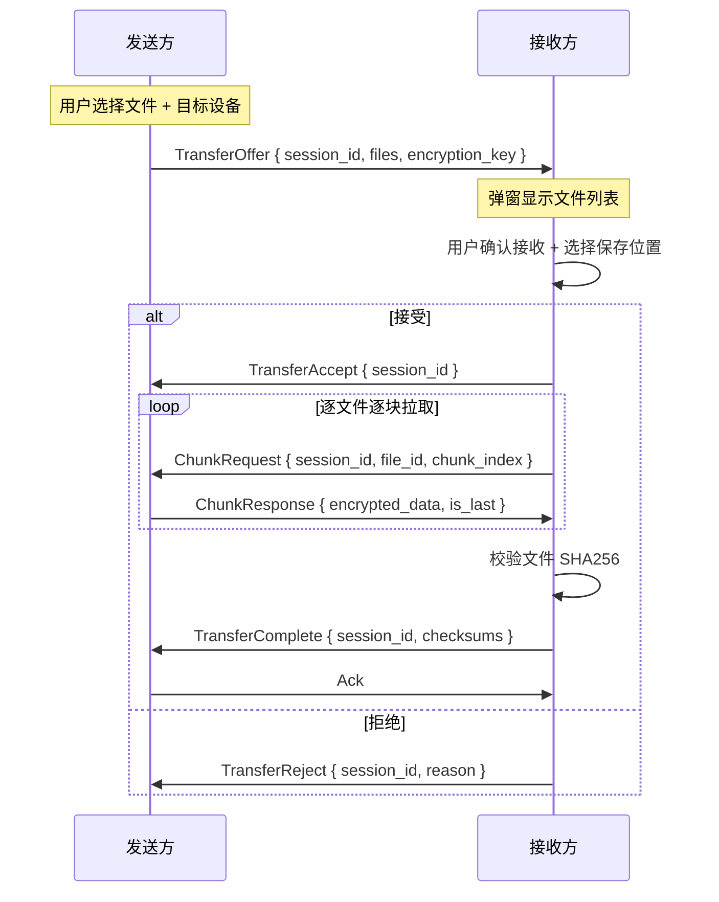
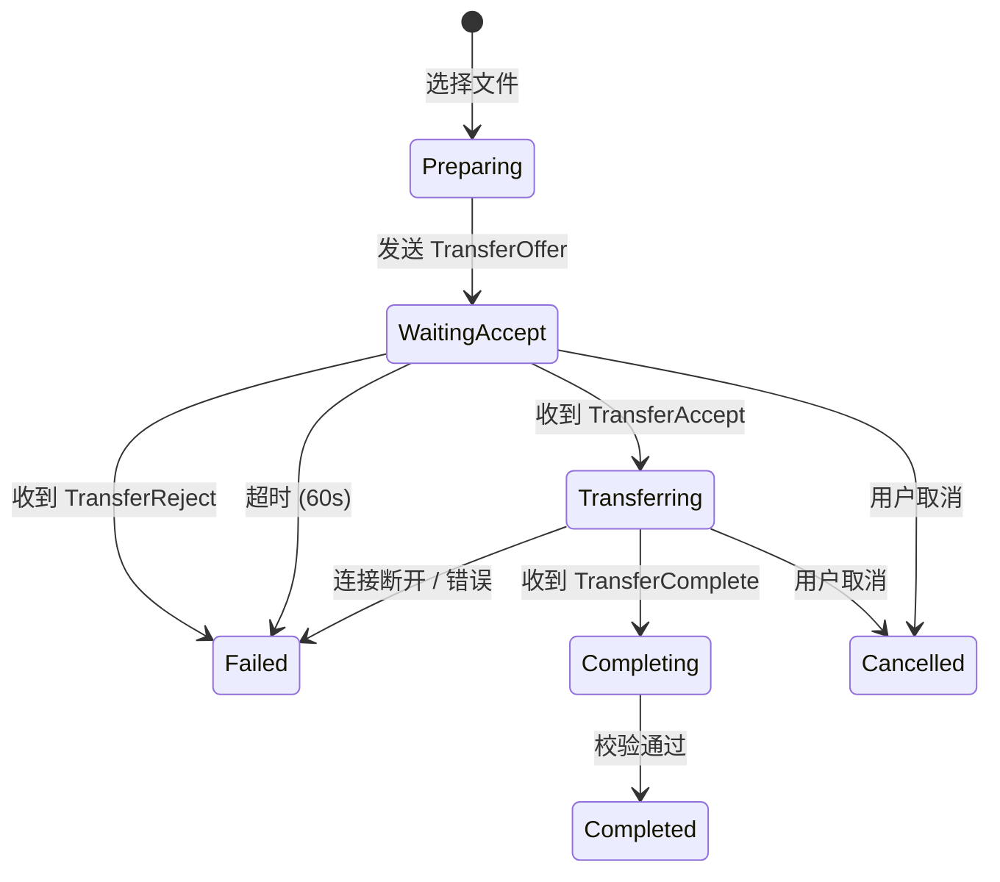
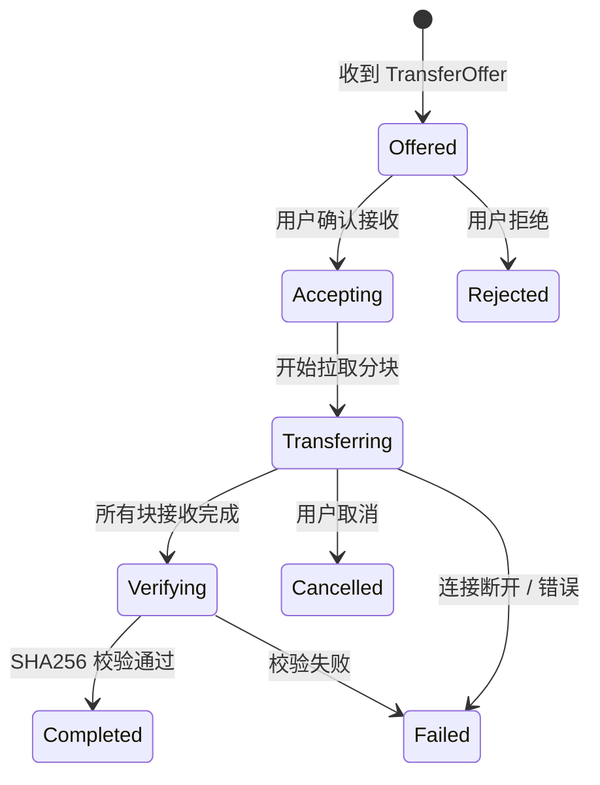

# 文件传输功能设计

## 概述

本文档描述 Phase 3 文件传输功能的实现方案。基于 Phase 2 已完成的设备配对系统，实现**已配对设备间**的端到端加密文件传输。

本阶段完成后即为**桌面端 MVP**。

### 设计原则

1. **配对前置**：仅已配对且在线的设备可以传输文件，不引入新的发现机制
2. **接收方拉取**：接收方主动请求每个分块，控制传输节奏和并发度
3. **会话级加密**：每次传输生成独立的对称密钥，传输结束后销毁
4. **扩展现有协议**：复用 `AppRequest`/`AppResponse` 枚举，不新增 libp2p 协议通道

### 相关文档

- [配对与传输设计](./pairing-transfer-design.md) — 产品设计和用户流程
- [Phase 3 路线图](../roadmap/phase-3-file-transfer.md) — 阶段任务规划
- [配对功能实现](./pairing-implementation.md) — Phase 2 实现细节

---

## 核心决策

| 决策项 | 结论 | 理由 |
|--------|------|------|
| 协议集成 | 扩展现有 `AppRequest`/`AppResponse` | 复用同一 Request-Response 通道，避免修改 swarm-p2p-core |
| 触发方式 | 仅已配对设备 | Phase 2 已建立连接，无需新发现机制 |
| 数据流方向 | 接收方拉取（ChunkRequest → Chunk） | 接收方控制并发度，利于断点续传扩展 |
| 分块大小 | 256 KB | libp2p CBOR 响应限制 10MB，256KB 保守安全，重传成本低 |
| E2E 加密 | XChaCha20-Poly1305 | 每次传输随机密钥，通过 Noise 通道安全传递 |
| 接收确认 | 始终需要确认 | 自动接收作为后续迭代 |
| UI 入口 | 设备页 + 侧边栏传输 Tab | 从设备页发起，传输 Tab 展示进度 |

### libp2p 消息大小约束

swarm-p2p-core 使用 `request_response::cbor::Behaviour`，libp2p 0.56 硬编码限制：

| 类型 | 上限 | 说明 |
|------|------|------|
| 请求 | 1 MB | ChunkRequest 等控制消息远低于此 |
| 响应 | 10 MB | 256KB 块 + CBOR/加密开销 ≈ 260KB，充裕 |

---

## 传输流程

### 整体时序



### 发送方状态机



### 接收方状态机



---

## 协议设计

### 扩展 AppRequest / AppResponse

在现有枚举中新增 `Transfer` 变体：

```rust
// src-tauri/src/protocol.rs

#[derive(Debug, Clone, Serialize, Deserialize)]
#[serde(rename_all = "camelCase", tag = "type")]
pub enum AppRequest {
    Pairing(PairingRequest),
    Transfer(TransferRequest),
}

#[derive(Debug, Clone, Serialize, Deserialize)]
#[serde(rename_all = "camelCase", tag = "type")]
pub enum AppResponse {
    Pairing(PairingResponse),
    Transfer(TransferResponse),
}
```

### TransferRequest 枚举

```rust
#[derive(Debug, Clone, Serialize, Deserialize)]
#[serde(rename_all = "camelCase", tag = "action")]
pub enum TransferRequest {
    /// 发送方 → 接收方：提议传输
    Offer {
        session_id: String,
        files: Vec<FileInfo>,
        total_size: u64,
        /// 对称加密密钥（通过 Noise 通道安全传递）
        encryption_key: [u8; 32],
    },

    /// 接收方 → 发送方：请求一个分块
    ChunkRequest {
        session_id: String,
        file_id: u32,
        chunk_index: u32,
    },

    /// 接收方 → 发送方：传输完成确认
    Complete {
        session_id: String,
        /// 每个文件的 SHA256 校验和
        checksums: Vec<FileChecksum>,
    },

    /// 任一方 → 对方：取消传输
    Cancel {
        session_id: String,
        reason: String,
    },
}
```

### TransferResponse 枚举

```rust
#[derive(Debug, Clone, Serialize, Deserialize)]
#[serde(rename_all = "camelCase", tag = "action")]
pub enum TransferResponse {
    /// 接收方对 Offer 的回复
    OfferResult {
        session_id: String,
        accepted: bool,
        reason: Option<String>,
    },

    /// 发送方对 ChunkRequest 的回复
    Chunk {
        session_id: String,
        file_id: u32,
        chunk_index: u32,
        /// 加密后的分块数据
        data: Vec<u8>,
        is_last: bool,
    },

    /// 发送方对 Complete 的确认
    Ack {
        session_id: String,
        success: bool,
    },
}
```

### 数据模型

```rust
#[derive(Debug, Clone, Serialize, Deserialize)]
#[serde(rename_all = "camelCase")]
pub struct FileInfo {
    pub id: u32,                    // 文件 ID（会话内唯一，从 0 递增）
    pub name: String,               // 文件名
    pub relative_path: String,      // 相对路径（保留文件夹结构）
    pub size: u64,                  // 文件大小 (bytes)
    pub mime_type: Option<String>,  // MIME 类型
    pub checksum: [u8; 32],         // SHA256 校验和
    pub total_chunks: u32,          // 总块数 = ceil(size / CHUNK_SIZE)
}

#[derive(Debug, Clone, Serialize, Deserialize)]
#[serde(rename_all = "camelCase")]
pub struct FileChecksum {
    pub file_id: u32,
    pub checksum: [u8; 32],
}
```

---

## 文件分块

### 常量

```rust
/// 分块大小：256 KB
const CHUNK_SIZE: usize = 256 * 1024;

/// 接收方最大并发拉取数
const MAX_CONCURRENT_CHUNKS: usize = 4;
```

### FileChunker

```rust
/// 文件分块器
///
/// 负责将文件按 CHUNK_SIZE 分块读取，支持随机访问。
/// 使用 BufReader + seek 实现，不将整个文件加载到内存。
pub struct FileChunker {
    path: PathBuf,
    file_size: u64,
    total_chunks: u32,
}

impl FileChunker {
    pub fn new(path: PathBuf) -> io::Result<Self>;

    /// 读取指定块的数据
    pub fn read_chunk(&self, index: u32) -> io::Result<Vec<u8>>;

    /// 计算文件 SHA256
    pub fn compute_checksum(&self) -> io::Result<[u8; 32]>;

    pub fn total_chunks(&self) -> u32;
    pub fn file_size(&self) -> u64;
}
```

### 接收方文件重组

```rust
/// 文件写入器
///
/// 接收分块数据并写入临时文件，所有块接收后重命名为最终文件。
pub struct FileAssembler {
    temp_path: PathBuf,
    final_path: PathBuf,
    file_size: u64,
    total_chunks: u32,
    received_chunks: HashSet<u32>,
}

impl FileAssembler {
    pub fn new(save_dir: &Path, file_info: &FileInfo) -> io::Result<Self>;

    /// 写入一个解密后的分块
    pub fn write_chunk(&mut self, index: u32, data: &[u8]) -> io::Result<()>;

    /// 是否所有块都已接收
    pub fn is_complete(&self) -> bool;

    /// 校验 SHA256 并重命名为最终文件
    pub fn finalize(&self, expected_checksum: &[u8; 32]) -> io::Result<()>;
}
```

---

## 端到端加密

### 方案

每次传输生成一个随机 256-bit 对称密钥，通过 `TransferOffer` 消息明文传递给接收方。由于 libp2p 底层使用 Noise 协议加密所有传输层通信，密钥交换是安全的。

### 加密器

```rust
use chacha20poly1305::{XChaCha20Poly1305, aead::Aead, KeyInit};

/// 传输加密器
///
/// 每个分块使用独立的 nonce（session_id + file_id + chunk_index 派生），
/// 确保 nonce 不重复。
pub struct TransferCrypto {
    cipher: XChaCha20Poly1305,
}

impl TransferCrypto {
    /// 从 256-bit 密钥创建
    pub fn new(key: &[u8; 32]) -> Self;

    /// 根据 file_id 和 chunk_index 派生 24 字节 nonce
    fn derive_nonce(session_id: &str, file_id: u32, chunk_index: u32) -> [u8; 24];

    /// 加密分块（发送方调用）
    pub fn encrypt_chunk(
        &self,
        session_id: &str,
        file_id: u32,
        chunk_index: u32,
        plaintext: &[u8],
    ) -> Result<Vec<u8>, CryptoError>;

    /// 解密分块（接收方调用）
    pub fn decrypt_chunk(
        &self,
        session_id: &str,
        file_id: u32,
        chunk_index: u32,
        ciphertext: &[u8],
    ) -> Result<Vec<u8>, CryptoError>;
}
```

### Nonce 派生

```
nonce = BLAKE3-derive_key("swarmdrop-transfer-nonce-v1", session_id || file_id || chunk_index)[..24]
```

使用 BLAKE3 的 `derive_key` 模式，基于 context 字符串做域分离，输出截取 24 字节。

使用确定性 nonce 派生而非递增计数器，好处：

- 支持乱序接收和并发请求
- 重传同一块时 nonce 一致，幂等安全
- 无需同步计数器状态

### 加密开销

| 项目 | 大小 |
|------|------|
| 明文块 | 256 KB |
| Poly1305 认证标签 | 16 B |
| CBOR 编码开销 | ~100 B |
| 加密后总大小 | ~256.1 KB |

远低于 libp2p 响应 10MB 限制。

---

## 后端架构

### 模块结构

```
src-tauri/src/
├── transfer/
│   ├── mod.rs              # 模块导出
│   ├── session.rs          # TransferSession 状态管理
│   ├── sender.rs           # 发送端逻辑
│   ├── receiver.rs         # 接收端逻辑
│   ├── chunker.rs          # 文件分块读取
│   ├── assembler.rs        # 文件重组写入
│   ├── crypto.rs           # XChaCha20-Poly1305 加密/解密
│   ├── progress.rs         # 进度追踪 + 速度计算
│   └── error.rs            # 传输错误类型
├── commands/
│   └── transfer.rs         # Tauri 命令（新增）
├── protocol.rs             # 扩展 TransferRequest/TransferResponse
└── network/
    └── event_loop.rs       # 扩展：处理 Transfer 类型的入站请求
```

### TransferManager

```rust
/// 传输管理器
///
/// 管理所有活跃的传输会话，与 NetManager 同级。
/// 通过 Arc 在事件循环和命令处理器间共享。
pub struct TransferManager {
    client: AppNetClient,
    /// 活跃的发送会话
    send_sessions: DashMap<String, SendSession>,
    /// 活跃的接收会话
    receive_sessions: DashMap<String, ReceiveSession>,
}

impl TransferManager {
    /// 准备发送：扫描文件、计算校验和、生成 session_id
    pub async fn prepare_send(&self, file_paths: Vec<PathBuf>) -> Result<PreparedTransfer>;

    /// 开始发送：向目标设备发送 TransferOffer
    pub async fn start_send(
        &self,
        prepared_id: &str,
        target_peer: PeerId,
        app: &AppHandle,
    ) -> Result<String>;

    /// 处理入站 TransferOffer（事件循环调用）
    pub fn handle_offer(
        &self,
        peer_id: PeerId,
        pending_id: u64,
        offer: TransferOffer,
    );

    /// 用户确认接收
    pub async fn accept_receive(
        &self,
        session_id: &str,
        save_dir: PathBuf,
        app: &AppHandle,
    ) -> Result<()>;

    /// 处理入站 ChunkRequest（事件循环调用，发送方侧）
    pub async fn handle_chunk_request(
        &self,
        session_id: &str,
        file_id: u32,
        chunk_index: u32,
    ) -> Result<TransferResponse>;

    /// 取消传输（任一方）
    pub fn cancel(&self, session_id: &str) -> Result<()>;
}
```

### 集成到 NetManager

```rust
// network/manager.rs
pub struct NetManager {
    client: AppNetClient,
    peer_id: PeerId,
    pairing: Arc<PairingManager>,
    devices: Arc<DeviceManager>,
    transfer: Arc<TransferManager>,  // 新增
    // ...
}
```

### 集成到事件循环

```rust
// network/event_loop.rs — InboundRequest 处理扩展

NodeEvent::InboundRequest { peer_id, pending_id, request } => {
    match request {
        AppRequest::Pairing(req) => {
            // 现有逻辑
        }
        AppRequest::Transfer(req) => {
            match req {
                TransferRequest::Offer { .. } => {
                    shared.transfer.handle_offer(peer_id, pending_id, req);
                    notify_if_unfocused(&app, "文件传输请求", "...");
                    app.emit("transfer-offer-received", &payload);
                }
                TransferRequest::ChunkRequest { session_id, file_id, chunk_index } => {
                    // 发送方侧：读取块 → 加密 → 回复
                    let response = shared.transfer
                        .handle_chunk_request(&session_id, file_id, chunk_index)
                        .await;
                    shared.client.send_response(pending_id, response);
                }
                TransferRequest::Complete { .. } => {
                    shared.transfer.handle_complete(req);
                    app.emit("transfer-completed", &payload);
                }
                TransferRequest::Cancel { .. } => {
                    shared.transfer.handle_cancel(req);
                    app.emit("transfer-cancelled", &payload);
                }
            }
        }
    }
}
```

---

## Tauri 命令

### 发送相关

```rust
/// 准备发送：扫描文件、计算校验和
/// 返回文件列表信息，供前端展示确认
#[tauri::command]
async fn prepare_send(
    file_paths: Vec<String>,
    state: State<'_, NetManagerState>,
) -> Result<PreparedTransfer, AppError>;

/// 开始发送到指定已配对设备
/// 发送 TransferOffer，等待接收方确认
#[tauri::command]
async fn start_send(
    prepared_id: String,
    peer_id: String,
    state: State<'_, NetManagerState>,
) -> Result<String, AppError>;  // 返回 session_id

/// 取消发送
#[tauri::command]
async fn cancel_send(
    session_id: String,
    state: State<'_, NetManagerState>,
) -> Result<(), AppError>;
```

### 接收相关

```rust
/// 确认接收：选择保存路径后调用，开始拉取分块
#[tauri::command]
async fn accept_receive(
    session_id: String,
    save_path: String,
    state: State<'_, NetManagerState>,
) -> Result<(), AppError>;

/// 拒绝接收
#[tauri::command]
async fn reject_receive(
    session_id: String,
    state: State<'_, NetManagerState>,
) -> Result<(), AppError>;

/// 取消接收（传输过程中）
#[tauri::command]
async fn cancel_receive(
    session_id: String,
    state: State<'_, NetManagerState>,
) -> Result<(), AppError>;
```

### 前端事件

```typescript
// 接收方收到传输提议
interface TransferOfferEvent {
  sessionId: string;
  peerId: string;
  deviceName: string;
  files: FileInfo[];
  totalSize: number;
}

// 传输进度更新（发送/接收通用）
interface TransferProgressEvent {
  sessionId: string;
  direction: 'send' | 'receive';
  totalFiles: number;
  completedFiles: number;
  currentFile: {
    fileId: number;
    name: string;
    size: number;
    transferred: number;
    chunksCompleted: number;
    totalChunks: number;
  } | null;
  totalBytes: number;
  transferredBytes: number;
  speed: number;        // bytes/sec
  eta: number | null;   // 预计剩余秒数
}

// 传输完成
interface TransferCompleteEvent {
  sessionId: string;
  direction: 'send' | 'receive';
  totalBytes: number;
  elapsedMs: number;
  savePath?: string;  // 接收方：保存路径
}

// 传输失败
interface TransferFailedEvent {
  sessionId: string;
  direction: 'send' | 'receive';
  error: string;
}
```

---

## 进度追踪

### 速度计算

使用滑动窗口计算平均传输速度，避免瞬时波动：

```rust
pub struct SpeedCalculator {
    /// 滑动窗口采样点 (时间戳, 累计字节数)
    samples: VecDeque<(Instant, u64)>,
    /// 窗口大小
    window: Duration,  // 默认 3 秒
}

impl SpeedCalculator {
    pub fn record(&mut self, total_bytes: u64);

    /// 返回 bytes/sec
    pub fn speed(&self) -> f64;

    /// 根据剩余字节数估算剩余时间
    pub fn eta(&self, remaining_bytes: u64) -> Option<Duration>;
}
```

### 进度事件节流

进度事件通过 Tauri Channel 推送，限制频率避免前端负担：

- 每 **200ms** 最多推送一次进度事件
- 文件完成时立即推送一次
- 传输完成/失败时立即推送

---

## 错误处理与重试

### 错误类型

```rust
#[derive(Debug, thiserror::Error)]
pub enum TransferError {
    #[error("连接断开")]
    ConnectionLost,

    #[error("请求超时")]
    Timeout,

    #[error("文件校验失败: file_id={file_id}")]
    ChecksumMismatch { file_id: u32 },

    #[error("磁盘空间不足: 需要 {required} 字节, 可用 {available} 字节")]
    DiskFull { required: u64, available: u64 },

    #[error("文件访问失败: {0}")]
    FileAccess(#[from] std::io::Error),

    #[error("解密失败: file_id={file_id}, chunk={chunk_index}")]
    DecryptionFailed { file_id: u32, chunk_index: u32 },

    #[error("对方取消传输")]
    CancelledByPeer,

    #[error("用户取消")]
    CancelledByUser,

    #[error("协议错误: {0}")]
    Protocol(String),
}
```

### 重试策略

针对**单个分块**的重试，而非整个传输：

```rust
/// 分块级重试策略
const MAX_CHUNK_RETRIES: u32 = 3;
const RETRY_DELAY_BASE: Duration = Duration::from_millis(500);
const RETRY_DELAY_MAX: Duration = Duration::from_secs(5);
```

重试逻辑：

1. ChunkRequest 超时 → 重试同一块（指数退避）
2. 解密失败 → 重试同一块（可能传输损坏）
3. 连接断开 → 等待重连（30 秒超时），重连后从断开的块继续
4. 校验失败 → 重新拉取该文件所有块

**不可重试的错误**：磁盘空间不足、用户取消、对方取消。

---

## 前端设计

### 路由结构

```
src/routes/
├── _app/
│   ├── devices.lazy.tsx        # 现有：设备列表（新增"发送文件"入口）
│   ├── transfer.lazy.tsx       # 新增：传输列表页（侧边栏 Tab）
│   └── transfer/
│       └── $sessionId.lazy.tsx # 新增：单个传输详情页
```

### 侧边栏 / 底部导航

新增「传输」Tab：

```
桌面端侧边栏：
┌──────────────┐
│ 📱 设备       │  ← 现有
│ 📁 传输       │  ← 新增（显示活跃传输数角标）
│ ⚙️ 设置       │  ← 现有
└──────────────┘

移动端底部导航：
[ 📱 设备 ] [ 📁 传输 ] [ ⚙️ 设置 ]
```

### 发送流程 UI

从设备页面的已配对设备卡片发起：

```
设备卡片操作：
┌──────────────────┐
│ 🟢 MacBook Pro   │
│ 局域网 · 2ms     │
│ [发送文件]       │  ← 新增按钮
└──────────────────┘
```

点击后打开全屏 Dialog：

```
┌─────────────────────────────────────────────────┐
│  发送文件到 MacBook Pro                  ✕ 关闭 │
├─────────────────────────────────────────────────┤
│                                                 │
│  ┌─────────────────────────────────────────┐   │
│  │                                         │   │
│  │      拖拽文件到这里，或点击选择          │   │
│  │                                         │   │
│  └─────────────────────────────────────────┘   │
│                                                 │
│  已选文件：                                     │
│  📄 document.pdf          2.1 MB    ✕           │
│  🖼 screenshot.png        856 KB    ✕           │
│  📁 project/              12.3 MB   ✕           │
│                                                 │
│  共 3 项，15.2 MB                               │
│                                                 │
│                                [发送]           │
└─────────────────────────────────────────────────┘
```

### 接收确认弹窗

接收方收到 TransferOffer 时弹出 Dialog：

```
┌─────────────────────────────────────────┐
│  📥 收到文件                        ✕   │
├─────────────────────────────────────────┤
│                                         │
│  来自：MacBook Pro                      │
│                                         │
│  📄 document.pdf          2.1 MB        │
│  🖼 screenshot.png        856 KB        │
│  📁 project/              12.3 MB       │
│                                         │
│  共 3 项，15.2 MB                       │
│                                         │
│  保存到：[~/Downloads/SwarmDrop] [更改]  │
│                                         │
│  [拒绝]                    [接收]       │
└─────────────────────────────────────────┘
```

### 传输进度页

传输列表页展示所有活跃和最近完成的传输：

```
┌─────────────────────────────────────────────────┐
│  传输                                           │
├─────────────────────────────────────────────────┤
│                                                 │
│  活跃传输                                       │
│  ┌─────────────────────────────────────────┐   │
│  │ ↑ 发送到 iPhone              取消       │   │
│  │ ████████████████░░░░░░░░░  67%          │   │
│  │ 🖼 photo.jpg · 2.3 MB/s · 剩余 12s     │   │
│  └─────────────────────────────────────────┘   │
│                                                 │
│  最近完成                                       │
│  ┌─────────────────────────────────────────┐   │
│  │ ↓ 来自 MacBook Pro          ✅ 完成     │   │
│  │ 3 个文件 · 15.2 MB · 12s               │   │
│  │                        [打开文件夹]     │   │
│  └─────────────────────────────────────────┘   │
│                                                 │
└─────────────────────────────────────────────────┘
```

### 前端状态管理

新增 `transfer-store`（Zustand，运行时状态，不持久化）：

```typescript
interface TransferStore {
  // 活跃传输会话
  sessions: Map<string, TransferSession>;

  // 最近完成的传输（内存中保留，重启后清空）
  recentTransfers: TransferResult[];

  // Actions
  addSession: (session: TransferSession) => void;
  updateProgress: (event: TransferProgressEvent) => void;
  completeSession: (event: TransferCompleteEvent) => void;
  failSession: (event: TransferFailedEvent) => void;
  removeSession: (sessionId: string) => void;
}

interface TransferSession {
  sessionId: string;
  direction: 'send' | 'receive';
  peerId: string;
  deviceName: string;
  files: FileInfo[];
  totalSize: number;
  status: 'pending' | 'waiting_accept' | 'transferring'
        | 'completed' | 'failed' | 'cancelled';
  progress: TransferProgressEvent | null;
  error: string | null;
  startedAt: number;
}

interface TransferResult {
  sessionId: string;
  direction: 'send' | 'receive';
  deviceName: string;
  totalBytes: number;
  fileCount: number;
  elapsedMs: number;
  completedAt: number;
  savePath?: string;
}
```

---

## Rust 依赖新增

```toml
# src-tauri/Cargo.toml
[dependencies]
chacha20poly1305 = "0.10"   # XChaCha20-Poly1305 AEAD
blake3 = "1"                # Nonce 派生（derive_key 模式）
```

---

## 性能目标

| 指标 | 目标值 | 说明 |
|------|--------|------|
| 局域网传输速度 | ≥ 50 MB/s | 千兆网络，256KB 块 × 4 并发 |
| 跨网络传输速度 | ≥ 5 MB/s | 取决于双方带宽 |
| 单文件大小 | 10 GB+ | 流式分块，不加载整个文件到内存 |
| 内存占用（传输时） | < 100 MB | 4 并发 × 256KB ≈ 1MB 缓冲区 |
| 加密 CPU 开销 | < 5% | XChaCha20 有 SIMD 硬件加速 |

---

## 实现优先级

### P0 — 本阶段实现

- [ ] 扩展 `AppRequest`/`AppResponse` 协议
- [ ] 文件分块读取器（FileChunker）
- [ ] XChaCha20-Poly1305 加密/解密
- [ ] TransferManager（会话管理）
- [ ] 发送端逻辑（prepare → offer → 响应 chunk 请求）
- [ ] 接收端逻辑（确认 → 拉取块 → 重组 → 校验）
- [ ] 进度追踪 + 速度计算
- [ ] 分块级重试（3 次，指数退避）
- [ ] 事件循环集成
- [ ] Tauri 命令
- [ ] 前端：发送流程 UI（设备页入口 + 文件选择 Dialog）
- [ ] 前端：接收确认弹窗
- [ ] 前端：传输进度页（侧边栏 Tab）
- [ ] 前端：transfer-store 状态管理

### P1 — 后续迭代

- [ ] 可配置自动接收（信任设备）
- [ ] 多设备同时发送
- [ ] 断点续传（持久化断点 + 恢复协商）
- [ ] 传输历史持久化（SQLite）
- [ ] 传输限速

---

## 测试计划

### 单元测试

- FileChunker：分块读取、边界文件（0 字节、1 字节、恰好整除）
- TransferCrypto：加密/解密往返、nonce 唯一性、错误密钥拒绝
- SpeedCalculator：速度计算、ETA 估算
- FileAssembler：块写入、乱序写入、校验

### 集成测试

| 场景 | 预期 |
|------|------|
| 小文件传输（< 256KB，单块） | 一次 ChunkRequest 完成 |
| 大文件传输（> 10MB） | 多块并发拉取，进度更新 |
| 多文件传输 | 逐文件传输，每个文件独立校验 |
| 传输中取消（发送方） | 接收方收到 Cancel，清理临时文件 |
| 传输中取消（接收方） | 发送方收到 Cancel，释放资源 |
| 传输中网络断开 | 30 秒内重连后继续，超时则失败 |
| 分块校验失败 | 自动重试 3 次 |

---

## 风险与对策

| 风险 | 对策 |
|------|------|
| 大文件 SHA256 计算慢 | 异步计算，准备阶段在后台线程进行 |
| 加密性能瓶颈 | XChaCha20 有 SIMD 加速，dev profile 已开 `opt-level = 3` |
| 接收方磁盘空间不足 | 接收前检查可用空间，不足时拒绝并提示 |
| 并发传输内存膨胀 | 限制同时活跃会话数（初期 1 个） |
| 传输中应用崩溃 | 临时文件使用 `.part` 后缀，启动时清理孤立临时文件 |
