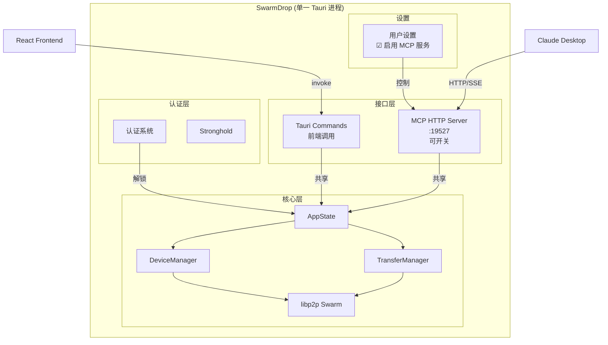
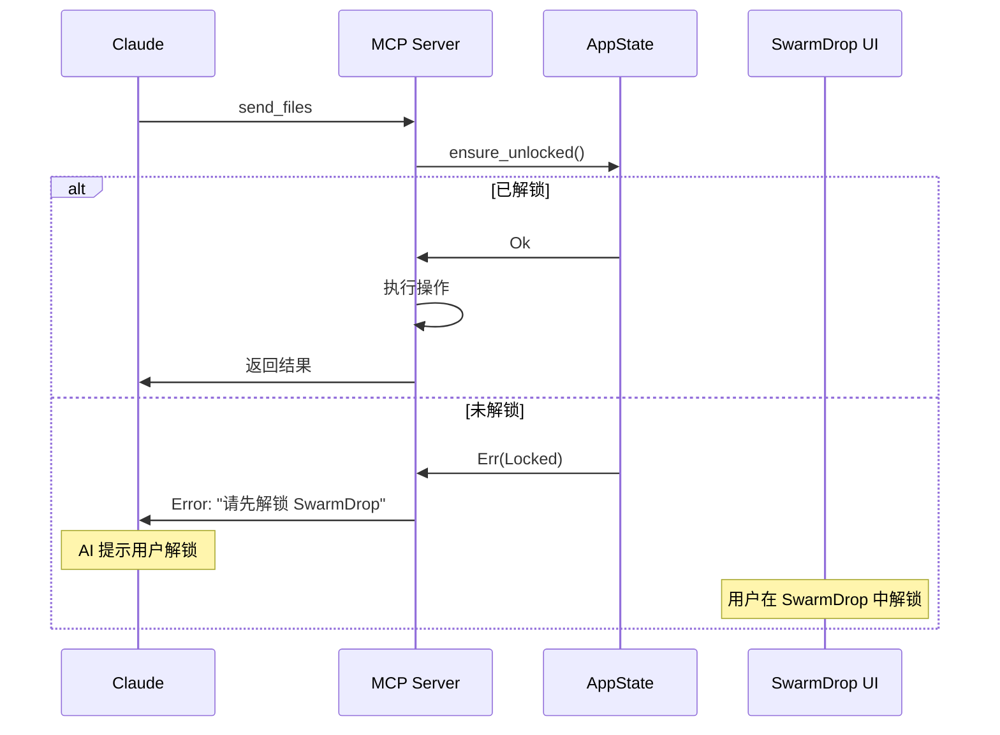
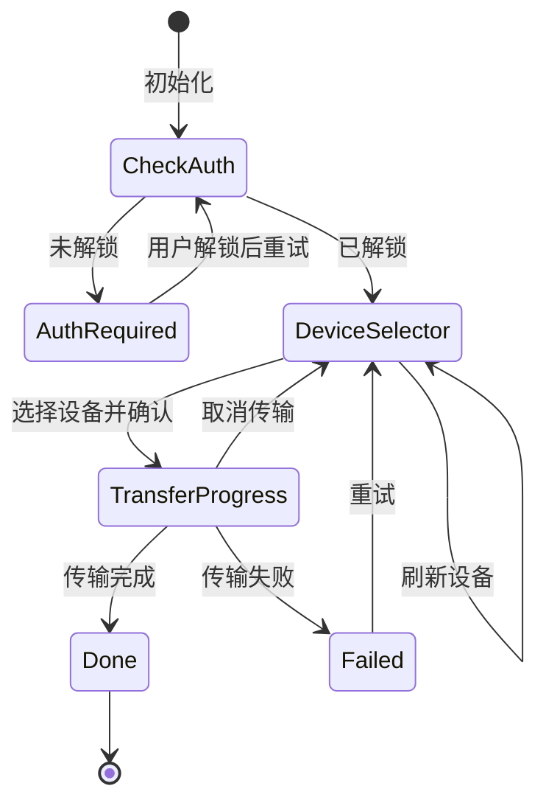

# SwarmDrop MCP 服务设计

## 概述

本文档描述 SwarmDrop 的 MCP（Model Context Protocol）服务设计，使 AI 助手（如 Claude）能够通过 MCP 协议控制 SwarmDrop 进行文件传输。

### 设计目标

1. **嵌入式架构**：MCP Server 嵌入 Tauri 进程，共享认证状态
2. **用户可控**：用户可在设置中开启/关闭 MCP 服务
3. **MCP App 支持**：提供交互式 UI，用户无需切换窗口
4. **安全第一**：未解锁时拒绝所有 MCP 请求

### 相关文档

- [认证系统设计](./auth-design.md)
- [配对与传输设计](./pairing-transfer-design.md)
- [MCP App 教程](../tutorials/mcp-app-tutorial.md)

---

## 架构设计

### 整体架构



### 嵌入式架构优势

| 优势 | 说明 |
|------|------|
| **共享状态** | MCP 直接访问已认证的 AppState，无需 token 机制 |
| **用户可控** | 设置中开关 MCP 服务，保护隐私 |
| **安全** | 未解锁时 MCP 返回错误，无安全漏洞 |
| **简单** | 无需进程间通信，代码更简洁 |
| **一致性** | MCP 和前端使用相同的核心逻辑 |

---

## MCP 协议实现

### 技术选型

使用 [rmcp](https://github.com/modelcontextprotocol/rust-sdk) 官方 Rust SDK：

```toml
# Cargo.toml
[dependencies]
rmcp = { version = "0.13", features = ["server", "transport-streamable-http-server"] }
```

### 传输方式

采用 **Streamable HTTP** 传输，支持：
- HTTP POST 请求
- SSE (Server-Sent Events) 响应流
- 监听 `127.0.0.1:19527`（仅本地）

---

## Tool 定义

### 工具列表

| Tool | 可见性 | 描述 | 需要认证 |
|------|--------|------|---------|
| `list_devices` | model, app | 列出所有设备（已配对 + 附近） | ✅ |
| `refresh_devices` | app | 刷新设备列表 | ✅ |
| `send_files` | model, app | 发送文件到设备 | ✅ |
| `confirm_transfer` | app | 确认并开始传输（UI 调用） | ✅ |
| `cancel_transfer` | model, app | 取消传输 | ✅ |
| `get_transfer_status` | model, app | 获取传输状态 | ✅ |
| `get_auth_status` | model, app | 获取认证状态 | ❌ |

### 可见性说明

- `model`: AI 模型可以调用
- `app`: MCP App UI 可以调用
- `app` only: 仅 UI 可调用，对 AI 隐藏（如 `confirm_transfer`）

### Tool 详细定义

#### list_devices

```typescript
// 输入
interface ListDevicesInput {
  filter?: "all" | "paired" | "nearby";  // 默认 "all"
}

// 输出
interface ListDevicesOutput {
  devices: Device[];
}

interface Device {
  id: string;
  name: string;
  type: "desktop" | "laptop" | "phone" | "tablet";
  status: "online" | "offline";
  connection?: "lan" | "relay" | "holepunch";
  latency?: number;  // ms
  isPaired: boolean;
}
```

#### send_files

```typescript
// 输入
interface SendFilesInput {
  files: string[];           // 文件路径列表
  deviceId?: string;         // 可选：目标设备 ID
}

// 输出（无 deviceId 时）
{
  content: [{ type: "text", text: "请选择接收设备" }],
  _meta: { ui: { resourceUri: "ui://swarmdrop/app" } }
}

// 输出（有 deviceId 时）
{
  content: [{ type: "text", text: "传输已开始，ID: xxx" }],
  _meta: { ui: { resourceUri: "ui://swarmdrop/progress" } }
}
```

#### confirm_transfer

```typescript
// 输入
interface ConfirmTransferInput {
  deviceId: string;
  files: string[];
}

// 输出
interface ConfirmTransferOutput {
  transferId: string;
  deviceName: string;
  totalSize: number;
  fileCount: number;
}
```

#### get_transfer_status

```typescript
// 输入
interface GetTransferStatusInput {
  transferId: string;
}

// 输出
interface TransferStatus {
  id: string;
  status: "pending" | "transferring" | "completed" | "failed" | "cancelled";
  progress: number;          // 0-100
  bytesTransferred: number;
  totalBytes: number;
  speed: number;             // bytes/sec
  currentFile?: string;
  error?: string;
}
```

---

## Resource 定义

### UI Resource

```typescript
// Resource 声明
{
  uri: "ui://swarmdrop/app",
  name: "SwarmDrop App",
  description: "SwarmDrop 文件传输界面",
  mimeType: "text/html;profile=mcp-app"
}
```

### Resource 内容

Resource 返回打包后的单文件 HTML（使用 `vite-plugin-singlefile`）：

```typescript
// resources/read 响应
{
  contents: [{
    uri: "ui://swarmdrop/app",
    mimeType: "text/html;profile=mcp-app",
    text: "<!DOCTYPE html>...",  // 打包后的 HTML
    _meta: {
      ui: {
        prefersBorder: true,
        // 无需外部网络访问，使用默认 CSP
      }
    }
  }]
}
```

---

## 认证集成

### 认证流程



### 错误响应

未解锁时返回标准 MCP 错误：

```json
{
  "jsonrpc": "2.0",
  "id": 1,
  "error": {
    "code": -32001,
    "message": "SwarmDrop 已锁定，请先解锁应用"
  }
}
```

---

## 用户控制

### 设置界面

```
┌─────────────────────────────────────────────────┐
│  设置                                           │
├─────────────────────────────────────────────────┤
│                                                 │
│  MCP 服务                                       │
│  ─────────────────────────────────────────      │
│                                                 │
│  ☑ 启用 MCP 服务                    [开关]     │
│    允许 AI 助手（如 Claude）访问 SwarmDrop      │
│                                                 │
│  监听地址: localhost:19527                      │
│  状态: 🟢 运行中                                │
│                                                 │
│  ⚠️ 仅在解锁状态下 MCP 服务可用                 │
│                                                 │
└─────────────────────────────────────────────────┘
```

### Tauri Commands

```rust
#[tauri::command]
async fn enable_mcp_server(state: State<'_, Arc<AppState>>) -> Result<(), String>;

#[tauri::command]
async fn disable_mcp_server(state: State<'_, Arc<AppState>>) -> Result<(), String>;

#[tauri::command]
fn is_mcp_enabled(state: State<'_, Arc<AppState>>) -> bool;

#[tauri::command]
fn get_mcp_status(state: State<'_, Arc<AppState>>) -> McpStatus;
```

---

## 代码结构

```
src-tauri/src/
├── lib.rs                    # Tauri 入口
├── state.rs                  # AppState（共享）
├── auth/                     # 认证系统
├── device/                   # 设备管理
├── transfer/                 # 传输管理
│
└── mcp/                      # MCP 模块
    ├── mod.rs                # 模块导出
    ├── server.rs             # HTTP Server 启动/停止
    ├── handler.rs            # ServerHandler 实现
    ├── tools/
    │   ├── mod.rs
    │   ├── devices.rs        # list_devices, refresh_devices
    │   ├── transfer.rs       # send_files, confirm_transfer
    │   └── status.rs         # get_transfer_status, get_auth_status
    └── resources.rs          # Resource 提供
```

---

## MCP App UI

MCP App UI 是独立的前端项目，打包后嵌入 Rust 二进制：

```
src-tauri/
└── mcp-app/                  # MCP App UI 项目
    ├── package.json
    ├── vite.config.ts        # 使用 vite-plugin-singlefile
    ├── src/
    │   ├── main.tsx
    │   ├── App.tsx
    │   ├── components/
    │   │   ├── DeviceSelector.tsx
    │   │   ├── TransferProgress.tsx
    │   │   └── AuthRequired.tsx
    │   └── hooks/
    │       └── useSwarmDrop.ts
    └── dist/
        └── index.html        # 打包后的单文件 HTML
```

### UI 状态机



### 构建流程

```bash
# 1. 构建 MCP App UI
cd src-tauri/mcp-app
pnpm build

# 2. 构建 Tauri（会包含 MCP App HTML）
cd ../..
pnpm tauri build
```

在 Rust 中嵌入：

```rust
// src-tauri/src/mcp/resources.rs
const MCP_APP_HTML: &str = include_str!("../mcp-app/dist/index.html");
```

---

## 实现优先级

### P0 - MVP

- [ ] MCP Server 基础框架（rmcp 集成）
- [ ] `list_devices` tool
- [ ] `send_files` tool（无 UI）
- [ ] `get_transfer_status` tool
- [ ] 认证状态检查
- [ ] 设置开关

### P1 - MCP App

- [ ] MCP App UI 项目搭建
- [ ] DeviceSelector 组件
- [ ] TransferProgress 组件
- [ ] `confirm_transfer` tool（UI 调用）
- [ ] 单文件打包和嵌入

### P2 - 增强

- [ ] `refresh_devices` tool
- [ ] `cancel_transfer` tool
- [ ] 多设备同时发送
- [ ] 传输历史查询

---

## 安全考虑

### 网络安全

- MCP Server 仅监听 `127.0.0.1`，拒绝外部连接
- 使用 Streamable HTTP，支持 SSE 但不暴露 WebSocket

### 认证安全

- 未解锁时所有操作返回错误（除 `get_auth_status`）
- 不在 MCP 层面实现认证，依赖 SwarmDrop 主认证系统

### 用户控制

- MCP 服务默认关闭，用户需手动启用
- 设置中可随时关闭 MCP 服务
- 未来可添加：允许的客户端白名单

---

## Claude Desktop 配置

用户在 Claude Desktop 中添加 SwarmDrop MCP Server：

```json
// claude_desktop_config.json
{
  "mcpServers": {
    "swarmdrop": {
      "url": "http://localhost:19527/mcp"
    }
  }
}
```

---

## 测试计划

### 单元测试

- Tool 参数验证
- 认证状态检查
- Resource 内容返回

### 集成测试

- MCP Server 启动/停止
- Tool 调用完整流程
- MCP App UI 交互

### 手动测试

| 场景 | 预期结果 |
|------|----------|
| 未解锁时调用 tool | 返回锁定错误 |
| 解锁后调用 list_devices | 返回设备列表 |
| send_files 无 deviceId | 显示设备选择 UI |
| send_files 有 deviceId | 直接开始传输 |
| 传输过程中查询状态 | 返回实时进度 |
| 设置中关闭 MCP | Server 停止，连接断开 |
