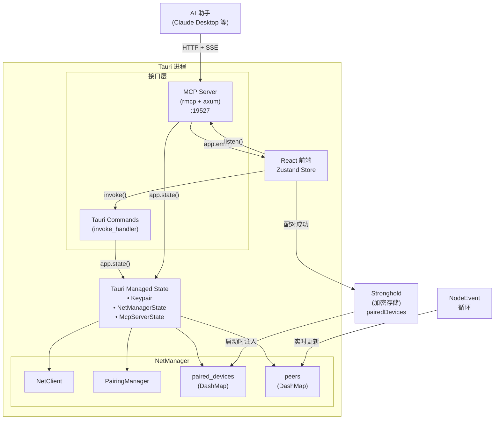
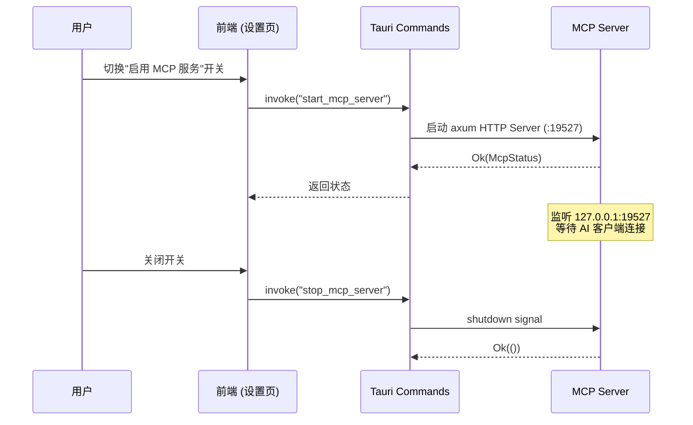
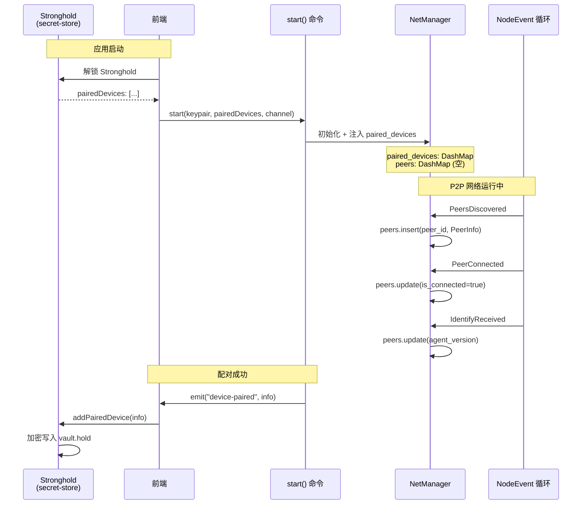
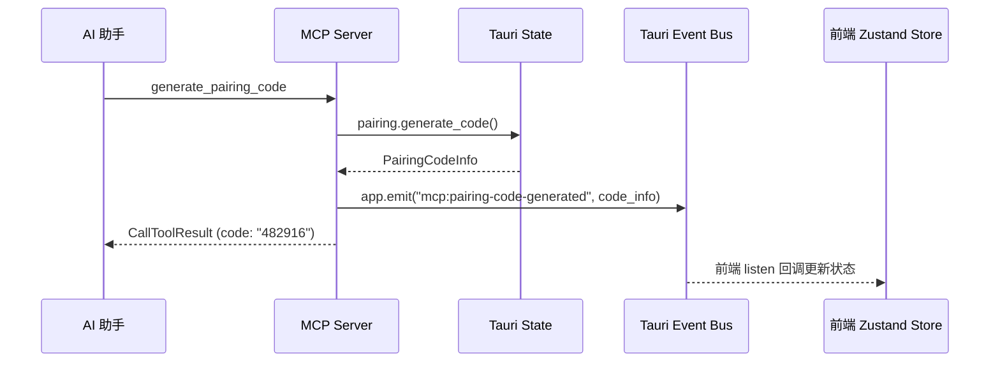

# MCP Server 实现设计（rmcp 集成）

## 概述

本文档描述 SwarmDrop MCP Server 的具体实现方案。使用 [rmcp](https://github.com/modelcontextprotocol/rust-sdk)（官方 Rust MCP SDK）将现有的 P2P 网络和配对功能暴露为 MCP Tool，使 AI 助手能通过标准协议操控 SwarmDrop。

### 设计原则

1. **嵌入式架构**：MCP Server 嵌入 Tauri 进程，通过 `AppHandle` 共享已有状态
2. **用户可控**：MCP 服务通过独立 Tauri 命令启停，由用户决定是否开启
3. **Tool + Resource**：提供 6 个配对相关 Tool + 2 个使用指南 Resource，当前阶段不做 MCP App UI
4. **不碰鉴权**：MCP Tool 只暴露网络和配对功能，不暴露密钥对生成、网络启停等生命周期命令
5. **前端感知**：MCP Tool 操作产生的状态变更通过 Tauri Event 通知前端

### 相关文档

- [MCP 总体设计](./mcp-design.md) — 完整产品愿景（含 MCP App UI、文件传输等后续阶段）
- [配对功能实现](./pairing-implementation.md) — 配对系统实现细节
- [认证系统设计](./auth-design.md) — 认证流程

---

## 架构

### 状态共享模型

MCP Server 和 Tauri Command 共享同一个状态树，通过 `AppHandle` 访问：



MCP Handler 的核心结构：

```rust
#[derive(Clone)]
pub struct SwarmDropMcp {
    app: AppHandle,
    tool_router: ToolRouter<Self>,
}
```

通过 `self.app.state::<NetManagerState>()` 访问网络状态，与 Tauri Command 使用完全相同的状态路径。**无需额外存储**。

### MCP Server 生命周期

MCP 服务独立于 P2P 网络，有自己的启停命令：



MCP 服务可以在 P2P 网络未启动时运行。此时网络相关的 Tool 会返回"节点未启动"错误，AI 可据此提示用户。

---

## 数据存储方案

### 存储策略

SwarmDrop 采用**前端 Stronghold + 启动注入**的方案，无需引入 SQLite 等重型数据库。

| 数据类型 | 存储位置 | 持久化方式 | 访问路径 |
|---------|---------|-----------|---------|
| 已配对设备列表 | 前端 `secret-store` | Stronghold 加密存储 | 启动时注入到 `NetManager.paired_devices` |
| 运行时 peer 信息 | 后端 `NetManager.peers` | 内存（DashMap） | 通过 `NodeEvent` 实时更新 |
| 密钥对 | 前端 `secret-store` | Stronghold 加密存储 | 启动时注册到 Tauri State |
| 用户偏好 | 前端 `preferences-store` | tauri-plugin-store | - |

**设计理由**：
- 已配对设备包含 PeerId（敏感信息），需要加密保护 → Stronghold
- 运行时 peer 信息是临时数据，无需持久化 → 内存
- 配对成功后通过 Tauri Event 回写前端，保持同步

### 数据流



### 数据结构定义

#### PairedDeviceInfo（已配对设备）

持久化到 Stronghold，启动时注入到 `NetManager`。

```rust
// src-tauri/src/commands/mod.rs

#[derive(Debug, Clone, Serialize, Deserialize)]
#[serde(rename_all = "camelCase")]
pub struct PairedDeviceInfo {
    /// PeerId 字符串
    pub id: String,
    /// 设备名称（用户自定义或 hostname）
    pub name: String,
    /// 操作系统类型（windows, macos, linux, ios, android）
    pub os: String,
    /// 配对时间戳（毫秒）
    pub paired_at: i64,
}
```

对应前端 TypeScript 定义（已存在于 `src/stores/secret-store.ts:12-21`）：

```typescript
export interface PairedDevice {
  id: string;
  name: string;
  os: string;
  pairedAt: number;
}
```

#### PeerInfo（运行时 peer 信息）

仅存在于内存，从 `NodeEvent` 实时更新。

```rust
// src-tauri/src/commands/mod.rs

#[derive(Debug, Clone, Serialize)]
#[serde(rename_all = "camelCase")]
pub struct PeerInfo {
    pub peer_id: PeerId,
    pub addrs: Vec<Multiaddr>,
    pub agent_version: Option<String>,
    pub rtt_ms: Option<u64>,
    pub is_connected: bool,
    pub discovered_at: i64,
    pub connected_at: Option<i64>,
}
```

### NetManager 扩展

在 `NetManager` 中新增两个 DashMap 字段：

```rust
// src-tauri/src/commands/mod.rs

use dashmap::DashMap;
use std::sync::Arc;

pub struct NetManager {
    pub client: AppNetClient,
    pub peer_id: PeerId,
    pub pairing: PairingManager,

    /// 已配对设备（持久化，来自 Stronghold）
    pub paired_devices: Arc<DashMap<PeerId, PairedDeviceInfo>>,

    /// 运行时 peer 信息（内存，从 NodeEvent 更新）
    pub peers: Arc<DashMap<PeerId, PeerInfo>>,
}

impl NetManager {
    pub fn new(
        client: AppNetClient,
        peer_id: PeerId,
        paired_devices: Vec<PairedDeviceInfo>,
    ) -> Self {
        let pairing = PairingManager::new(client.clone(), peer_id);

        // 初始化已配对设备 Map
        let paired_map = DashMap::new();
        for device in paired_devices {
            if let Ok(peer_id) = device.id.parse() {
                paired_map.insert(peer_id, device);
            }
        }

        Self {
            client,
            peer_id,
            pairing,
            paired_devices: Arc::new(paired_map),
            peers: Arc::new(DashMap::new()),
        }
    }

    /// 检查 peer 是否已配对
    pub fn is_paired(&self, peer_id: &PeerId) -> bool {
        self.paired_devices.contains_key(peer_id)
    }

    /// 获取所有已配对设备
    pub fn get_paired_devices(&self) -> Vec<PairedDeviceInfo> {
        self.paired_devices.iter().map(|e| e.value().clone()).collect()
    }

    /// 获取所有运行时 peer
    pub fn get_peers(&self, filter: PeerFilter) -> Vec<PeerInfo> {
        match filter {
            PeerFilter::All => {
                self.peers.iter().map(|e| e.value().clone()).collect()
            }
            PeerFilter::Connected => {
                self.peers.iter()
                    .filter(|e| e.value().is_connected)
                    .map(|e| e.value().clone())
                    .collect()
            }
        }
    }
}

pub enum PeerFilter {
    All,
    Connected,
}
```

### start() 命令修改

接收前端传入的 `paired_devices` 并订阅 `NodeEvent` 更新 `peers`：

```rust
// src-tauri/src/commands/mod.rs

#[tauri::command]
pub async fn start(
    app: AppHandle,
    keypair: State<'_, Keypair>,
    paired_devices: Vec<PairedDeviceInfo>,  // 新增：从前端传入
    channel: Channel<NodeEvent<AppRequest>>,
) -> crate::AppResult<()> {
    let agent_version = crate::device::OsInfo::new().to_agent_version();
    let bootstrap_peers = parse_bootstrap_peers();

    let config = NodeConfig::new("/swarmdrop/1.0.0", agent_version)
        .with_mdns(true)
        .with_relay_client(true)
        .with_dcutr(true)
        .with_autonat(true)
        .with_bootstrap_peers(bootstrap_peers);

    let (client, mut receiver) =
        swarm_p2p_core::start::<AppRequest, AppResponse>((*keypair).clone(), config)?;

    // DHT bootstrap
    let bootstrap_client = client.clone();
    tokio::spawn(async move {
        match bootstrap_client.bootstrap().await {
            Ok(result) => info!("DHT bootstrap completed: {:?}", result),
            Err(e) => warn!("DHT bootstrap failed: {}", e),
        }
    });

    let peer_id = PeerId::from_public_key(&keypair.public());
    let net_manager = NetManager::new(client, peer_id, paired_devices);

    // 克隆 peers map 用于事件处理
    let peers = net_manager.peers.clone();

    tokio::spawn(async move {
        while let Some(event) = receiver.recv().await {
            // 更新运行时 peer 信息
            update_peers_from_event(&peers, &event);

            // 转发事件给前端
            if let Err(e) = channel.send(event) {
                error!("Failed to send event: {}", e);
            }
        }
    });

    // 宣布上线
    if let Err(e) = net_manager.pairing().announce_online().await {
        warn!("Failed to announce online: {}", e);
    }

    // 存储 NetManager 到 state
    if let Some(state) = app.try_state::<NetManagerState>() {
        *state.lock().await = Some(net_manager);
    } else {
        app.manage(Mutex::new(Some(net_manager)));
    }

    Ok(())
}

/// 根据 NodeEvent 更新 peers map
fn update_peers_from_event(peers: &DashMap<PeerId, PeerInfo>, event: &NodeEvent<AppRequest>) {
    match event {
        NodeEvent::PeersDiscovered { peers: discovered } => {
            let now = chrono::Utc::now().timestamp();
            for (peer_id, addr) in discovered {
                peers.entry(*peer_id)
                    .and_modify(|peer| {
                        if !peer.addrs.contains(addr) {
                            peer.addrs.push(addr.clone());
                        }
                    })
                    .or_insert_with(|| PeerInfo {
                        peer_id: *peer_id,
                        addrs: vec![addr.clone()],
                        agent_version: None,
                        rtt_ms: None,
                        is_connected: false,
                        discovered_at: now,
                        connected_at: None,
                    });
            }
        }
        NodeEvent::PeerConnected { peer_id } => {
            peers.entry(*peer_id)
                .and_modify(|peer| {
                    peer.is_connected = true;
                    peer.connected_at = Some(chrono::Utc::now().timestamp());
                })
                .or_insert_with(|| PeerInfo {
                    peer_id: *peer_id,
                    addrs: vec![],
                    agent_version: None,
                    rtt_ms: None,
                    is_connected: true,
                    discovered_at: chrono::Utc::now().timestamp(),
                    connected_at: Some(chrono::Utc::now().timestamp()),
                });
        }
        NodeEvent::PeerDisconnected { peer_id } => {
            if let Some(mut peer) = peers.get_mut(peer_id) {
                peer.is_connected = false;
                peer.connected_at = None;
                peer.rtt_ms = None;
            }
        }
        NodeEvent::IdentifyReceived { peer_id, agent_version, .. } => {
            if let Some(mut peer) = peers.get_mut(peer_id) {
                peer.agent_version = Some(agent_version.clone());
            }
        }
        NodeEvent::PingSuccess { peer_id, rtt } => {
            if let Some(mut peer) = peers.get_mut(peer_id) {
                peer.rtt_ms = Some(rtt.as_millis() as u64);
            }
        }
        _ => {}
    }
}
```

### 前端调用修改

在 `network-store.ts` 的 `startNetwork()` 中传递 `pairedDevices`：

```typescript
// src/stores/network-store.ts

async startNetwork() {
  const { status } = get();
  if (status === "running" || status === "starting") return;

  // 检查 keypair 是否已初始化
  const { deviceId, pairedDevices } = useSecretStore.getState();
  if (!deviceId) {
    set({ status: "error", error: "Keypair not initialized" });
    return;
  }

  set({
    status: "starting",
    error: null,
    listenAddrs: [],
    peers: new Map(),
    natStatus: "unknown",
    publicAddr: null,
  });

  try {
    // 传递 pairedDevices 到后端
    await start(get().handleEvent, pairedDevices);
    // status 会在收到 listening 事件后更新为 running
  } catch (err) {
    console.error("Failed to start node:", JSON.stringify(err));
    set({
      status: "error",
      error: err instanceof Error ? err.message : JSON.stringify(err),
    });
  }
},
```

同时修改 `src/commands/network.ts` 的 `start()` 函数签名：

```typescript
// src/commands/network.ts

import type { PairedDevice } from "@/stores/secret-store";

export async function start(
  onEvent: (event: NodeEvent) => void,
  pairedDevices: PairedDevice[]
): Promise<void> {
  const channel = new Channel<NodeEvent>();
  channel.onmessage = onEvent;

  await invoke("start", {
    channel,
    pairedDevices,  // 传递给后端
  });
}
```

### 配对成功后同步

配对成功后，后端发送 Tauri Event 通知前端更新 Stronghold：

```rust
// src-tauri/src/commands/pairing.rs

#[tauri::command]
pub async fn respond_pairing_request(
    app: AppHandle,
    pending_id: u64,
    method: PairingMethod,
    accept: bool,
    reason: Option<String>,
) -> AppResult<()> {
    // ... 处理配对逻辑 ...

    if accept && matches!(response, PairingResponse::Success) {
        // 从请求中提取设备信息
        let device_info = serde_json::json!({
            "peerId": peer_id.to_string(),
            "name": request.os_info.hostname,
            "os": request.os_info.platform,
        });

        // 发送事件通知前端
        app.emit("device-paired", device_info)?;
    }

    Ok(())
}
```

前端监听事件：

```typescript
// src/hooks/use-pairing-events.ts

import { listen } from "@tauri-apps/api/event";
import { useSecretStore } from "@/stores/secret-store";
import { toast } from "sonner";

export function usePairingEvents() {
  useEffect(() => {
    const unlisten = listen<{
      peerId: string;
      name: string;
      os: string;
    }>("device-paired", (event) => {
      // 添加到已配对设备列表（写入 Stronghold）
      useSecretStore.getState().addPairedDevice({
        id: event.payload.peerId,
        name: event.payload.name,
        os: event.payload.os,
      });

      // 显示通知
      toast.success(`已与 ${event.payload.name} 配对成功`);
    });

    return () => {
      unlisten.then((fn) => fn());
    };
  }, []);
}
```

在 `_app.tsx` 布局中注册：

```typescript
// src/routes/_app.tsx

import { usePairingEvents } from "@/hooks/use-pairing-events";

export function AppLayout() {
  usePairingEvents();  // 全局监听配对事件

  // ... 其余布局代码 ...
}
```

### MCP Tool 数据访问

MCP Tool 从 `NetManager` 读取数据，支持三种过滤模式：

```rust
// src-tauri/src/mcp/tools.rs

#[tool(description = "列出已发现的设备")]
async fn list_devices(
    &self,
    #[tool(param, description = "过滤条件：all=全部已发现, connected=仅已连接, paired=已配对")]
    filter: Option<String>,
) -> Result<CallToolResult, McpError> {
    let net_mgr_state = self.app.state::<NetManagerState>();
    let guard = net_mgr_state.lock().await;

    let net_mgr = guard.as_ref()
        .ok_or_else(|| McpError::internal("P2P 网络节点未启动"))?;

    let filter_str = filter.as_deref().unwrap_or("connected");

    let devices: Vec<serde_json::Value> = match filter_str {
        "paired" => {
            // 只返回已配对设备（来自 Stronghold）
            net_mgr.get_paired_devices()
                .into_iter()
                .map(|d| serde_json::json!({
                    "peerId": d.id,
                    "name": d.name,
                    "os": d.os,
                    "isPaired": true,
                    "pairedAt": d.paired_at,
                    // 如果设备在线，合并运行时信息
                    "isConnected": net_mgr.peers.get(&d.id.parse().unwrap())
                        .map(|p| p.is_connected)
                        .unwrap_or(false),
                }))
                .collect()
        }
        "all" => {
            // 返回所有已发现的 peer，标注配对状态
            net_mgr.get_peers(PeerFilter::All)
                .into_iter()
                .map(|peer| {
                    let is_paired = net_mgr.is_paired(&peer.peer_id);
                    serde_json::json!({
                        "peerId": peer.peer_id.to_string(),
                        "name": extract_hostname(&peer.agent_version),
                        "os": extract_os(&peer.agent_version),
                        "isConnected": peer.is_connected,
                        "isPaired": is_paired,
                        "latencyMs": peer.rtt_ms,
                        "connectionType": infer_connection_type(peer.rtt_ms),
                    })
                })
                .collect()
        }
        "connected" => {
            // 只返回已连接的 peer
            net_mgr.get_peers(PeerFilter::Connected)
                .into_iter()
                .map(|peer| {
                    let is_paired = net_mgr.is_paired(&peer.peer_id);
                    serde_json::json!({
                        "peerId": peer.peer_id.to_string(),
                        "name": extract_hostname(&peer.agent_version),
                        "os": extract_os(&peer.agent_version),
                        "isConnected": true,
                        "isPaired": is_paired,
                        "latencyMs": peer.rtt_ms,
                        "connectionType": infer_connection_type(peer.rtt_ms),
                    })
                })
                .collect()
        }
        _ => return Err(McpError::invalid_params("filter 必须是 all, connected 或 paired")),
    };

    let result = serde_json::json!({
        "devices": devices,
        "total": devices.len(),
    });

    Ok(CallToolResult {
        content: vec![Content::text(serde_json::to_string_pretty(&result)?)],
        ..Default::default()
    })
}

// 辅助函数：从 agent_version 提取 hostname
fn extract_hostname(agent_version: &Option<String>) -> String {
    agent_version.as_ref()
        .and_then(|s| s.split("host=").nth(1))
        .unwrap_or("Unknown")
        .to_string()
}

// 辅助函数：从 agent_version 提取 os
fn extract_os(agent_version: &Option<String>) -> String {
    agent_version.as_ref()
        .and_then(|s| {
            s.split("; ").find(|part| part.starts_with("os="))
                .and_then(|part| part.strip_prefix("os="))
        })
        .unwrap_or("unknown")
        .to_string()
}

// 辅助函数：根据延迟推断连接类型
fn infer_connection_type(rtt_ms: Option<u64>) -> String {
    match rtt_ms {
        Some(rtt) if rtt < 10 => "lan".to_string(),
        Some(rtt) if rtt < 100 => "dcutr".to_string(),
        Some(_) => "relay".to_string(),
        None => "none".to_string(),
    }
}
```

### 依赖添加（Phase 2）

`Cargo.toml` 新增：

```toml
[dependencies]
dashmap = "6.1"
chrono = "0.4"  # 如果尚未添加
```

---

## 数据库方案（Phase 3 - 文件传输）

> **注意**：本章节描述 Phase 3（文件传输）的数据库实现方案，**当前 Phase 2 不需要引入**。

### 为什么需要数据库

Phase 3 的文件传输功能需要存储：

1. **文件传输历史**
   - 查询需求：按时间、设备、状态筛选，分页显示
   - 数据量：数百上千条记录
   - 用 Stronghold 的问题：key-value 存储，不支持复杂查询

2. **断点续传会话**
   - 需要持久化传输进度（chunk 完成位图）
   - 需要事务支持（原子性更新）
   - 需要并发安全（多个传输同时进行）

### 为什么选择 sea-orm

| 对比维度 | rusqlite | sea-orm（推荐） |
|---------|----------|----------------|
| 类型安全 | ❌ 运行时检查 | ✅ 编译时检查 |
| 迁移管理 | ❌ 手动维护 | ✅ 内置迁移系统 |
| 开发效率 | ⚠️ 手写 SQL | ✅ 代码生成 + 类型推导 |
| Async 支持 | ⚠️ 需 spawn_blocking | ✅ 原生 async/await |
| 复杂查询 | ⚠️ 拼接 SQL 字符串 | ✅ 类型安全的查询构建器 |
| 编译时间 | ✅ 快（+10s） | ⚠️ 慢（+30-60s） |
| 包大小 | ✅ +400KB | ⚠️ +2-3MB |
| 未来扩展 | ⚠️ 锁定 SQLite | ✅ 可换 PostgreSQL/MySQL |

**选择理由**：
- 项目已不算轻量（libp2p 依赖重），增加 2-3MB 可接受
- 长期维护性优先（类型安全、迁移系统）
- 与 Tauri async 完美配合
- 团队开发效率高

### 数据模型设计

#### 1. 文件传输历史（transfers 表）

```rust
// src-tauri/src/storage/entities/transfer.rs

use sea_orm::entity::prelude::*;
use serde::{Deserialize, Serialize};

#[derive(Clone, Debug, PartialEq, DeriveEntityModel, Serialize, Deserialize)]
#[sea_orm(table_name = "transfers")]
pub struct Model {
    #[sea_orm(primary_key, auto_increment = false)]
    pub id: String,  // UUID
    pub file_name: String,
    pub file_size: i64,
    pub file_hash: String,  // SHA256，用于断点续传匹配
    pub peer_id: String,
    pub direction: String,  // "send" | "receive"
    pub status: String,     // "pending" | "transferring" | "success" | "failed" | "cancelled"
    pub started_at: i64,    // Unix timestamp (ms)
    pub completed_at: Option<i64>,
    pub local_path: String,
    pub thumbnail: Option<Vec<u8>>,  // 图片缩略图（可选）
    pub transferred_bytes: i64,      // 已传输字节数
    pub error_message: Option<String>,
    pub created_at: i64,
}

#[derive(Copy, Clone, Debug, EnumIter, DeriveRelation)]
pub enum Relation {
    #[sea_orm(has_many = "super::session::Entity")]
    Sessions,
}

impl Related<super::session::Entity> for Entity {
    fn to() -> RelationDef {
        Relation::Sessions.def()
    }
}

impl ActiveModelBehavior for ActiveModel {}
```

#### 2. 断点续传会话（sessions 表）

```rust
// src-tauri/src/storage/entities/session.rs

use sea_orm::entity::prelude::*;
use serde::{Deserialize, Serialize};

#[derive(Clone, Debug, PartialEq, DeriveEntityModel, Serialize, Deserialize)]
#[sea_orm(table_name = "sessions")]
pub struct Model {
    #[sea_orm(primary_key, auto_increment = false)]
    pub id: String,  // UUID
    pub transfer_id: String,  // 外键 -> transfers.id
    pub file_hash: String,
    pub file_size: i64,
    pub chunk_size: i32,
    pub total_chunks: i32,
    pub completed_chunks: Vec<u8>,  // 位图（BitVec 序列化）
    pub peer_id: String,
    pub direction: String,
    pub local_path: String,
    pub is_completed: bool,
    pub created_at: i64,
    pub last_updated: i64,
}

#[derive(Copy, Clone, Debug, EnumIter, DeriveRelation)]
pub enum Relation {
    #[sea_orm(
        belongs_to = "super::transfer::Entity",
        from = "Column::TransferId",
        to = "super::transfer::Column::Id"
    )]
    Transfer,
}

impl Related<super::transfer::Entity> for Entity {
    fn to() -> RelationDef {
        Relation::Transfer.def()
    }
}

impl ActiveModelBehavior for ActiveModel {}
```

### 迁移管理

#### 迁移文件结构

```
src-tauri/src/storage/migrations/
├── mod.rs                           # 导出 Migrator
├── m20240301_create_transfers.rs    # 创建 transfers 表
└── m20240302_create_sessions.rs     # 创建 sessions 表
```

#### 迁移示例

```rust
// src-tauri/src/storage/migrations/m20240301_create_transfers.rs

use sea_orm_migration::prelude::*;

#[derive(DeriveMigrationName)]
pub struct Migration;

#[async_trait::async_trait]
impl MigrationTrait for Migration {
    async fn up(&self, manager: &SchemaManager) -> Result<(), DbErr> {
        manager
            .create_table(
                Table::create()
                    .table(Transfer::Table)
                    .if_not_exists()
                    .col(ColumnDef::new(Transfer::Id).string().not_null().primary_key())
                    .col(ColumnDef::new(Transfer::FileName).string().not_null())
                    .col(ColumnDef::new(Transfer::FileSize).big_integer().not_null())
                    .col(ColumnDef::new(Transfer::FileHash).string().not_null())
                    .col(ColumnDef::new(Transfer::PeerId).string().not_null())
                    .col(ColumnDef::new(Transfer::Direction).string().not_null())
                    .col(ColumnDef::new(Transfer::Status).string().not_null())
                    .col(ColumnDef::new(Transfer::StartedAt).big_integer().not_null())
                    .col(ColumnDef::new(Transfer::CompletedAt).big_integer())
                    .col(ColumnDef::new(Transfer::LocalPath).string().not_null())
                    .col(ColumnDef::new(Transfer::Thumbnail).binary())
                    .col(ColumnDef::new(Transfer::TransferredBytes).big_integer().not_null().default(0))
                    .col(ColumnDef::new(Transfer::ErrorMessage).string())
                    .col(ColumnDef::new(Transfer::CreatedAt).big_integer().not_null())
                    .to_owned(),
            )
            .await?;

        // 创建索引：按设备 + 时间查询
        manager
            .create_index(
                Index::create()
                    .name("idx_transfers_peer_time")
                    .table(Transfer::Table)
                    .col(Transfer::PeerId)
                    .col((Transfer::StartedAt, IndexOrder::Desc))
                    .to_owned(),
            )
            .await?;

        // 创建索引：按状态 + 时间查询
        manager
            .create_index(
                Index::create()
                    .name("idx_transfers_status_time")
                    .table(Transfer::Table)
                    .col(Transfer::Status)
                    .col((Transfer::StartedAt, IndexOrder::Desc))
                    .to_owned(),
            )
            .await?;

        // 创建索引：按文件哈希查询（断点续传匹配）
        manager
            .create_index(
                Index::create()
                    .name("idx_transfers_file_hash")
                    .table(Transfer::Table)
                    .col(Transfer::FileHash)
                    .to_owned(),
            )
            .await?;

        Ok(())
    }

    async fn down(&self, manager: &SchemaManager) -> Result<(), DbErr> {
        manager
            .drop_table(Table::drop().table(Transfer::Table).to_owned())
            .await
    }
}

#[derive(DeriveIden)]
enum Transfer {
    Table,
    Id,
    FileName,
    FileSize,
    FileHash,
    PeerId,
    Direction,
    Status,
    StartedAt,
    CompletedAt,
    LocalPath,
    Thumbnail,
    TransferredBytes,
    ErrorMessage,
    CreatedAt,
}
```

```rust
// src-tauri/src/storage/migrations/mod.rs

use sea_orm_migration::prelude::*;

pub struct Migrator;

#[async_trait::async_trait]
impl MigratorTrait for Migrator {
    fn migrations() -> Vec<Box<dyn MigrationTrait>> {
        vec![
            Box::new(m20240301_create_transfers::Migration),
            Box::new(m20240302_create_sessions::Migration),
        ]
    }
}

mod m20240301_create_transfers;
mod m20240302_create_sessions;
```

### 数据库初始化

```rust
// src-tauri/src/storage/connection.rs

use sea_orm::{Database, DatabaseConnection, DbErr};
use sea_orm_migration::MigratorTrait;
use crate::storage::migrations::Migrator;
use tauri::AppHandle;

/// 初始化数据库连接并运行迁移
pub async fn init_database(app: &AppHandle) -> Result<DatabaseConnection, DbErr> {
    let app_data_dir = app.path().app_data_dir()
        .map_err(|e| DbErr::Custom(format!("Failed to get app data dir: {}", e)))?;

    let db_path = app_data_dir.join("swarmdrop.db");
    let db_url = format!("sqlite://{}?mode=rwc", db_path.display());

    // 连接数据库
    let db = Database::connect(&db_url).await?;

    // 运行迁移
    Migrator::up(&db, None).await?;

    tracing::info!("Database initialized at {:?}", db_path);

    Ok(db)
}
```

### 查询逻辑

```rust
// src-tauri/src/storage/queries/transfer_history.rs

use sea_orm::{DatabaseConnection, EntityTrait, QueryFilter, QueryOrder, PaginatorTrait};
use crate::storage::entities::{transfer, prelude::*};

pub struct TransferHistory;

impl TransferHistory {
    /// 查询传输历史（带分页和过滤）
    pub async fn query(
        db: &DatabaseConnection,
        filter: TransferFilter,
        page: u32,
        page_size: u32,
    ) -> Result<(Vec<transfer::Model>, u64), sea_orm::DbErr> {
        let mut query = Transfer::find();

        // 按设备筛选
        if let Some(peer_id) = filter.peer_id {
            query = query.filter(transfer::Column::PeerId.eq(peer_id));
        }

        // 按状态筛选
        if let Some(status) = filter.status {
            query = query.filter(transfer::Column::Status.eq(status));
        }

        // 按时间范围筛选
        if let Some(since) = filter.since {
            query = query.filter(transfer::Column::StartedAt.gte(since));
        }

        // 按文件名搜索
        if let Some(search) = filter.search {
            query = query.filter(transfer::Column::FileName.contains(&search));
        }

        // 排序
        query = query.order_by_desc(transfer::Column::StartedAt);

        // 分页
        let paginator = query.paginate(db, page_size as u64);
        let total = paginator.num_items().await?;
        let items = paginator.fetch_page(page as u64).await?;

        Ok((items, total))
    }

    /// 获取统计信息
    pub async fn get_statistics(
        db: &DatabaseConnection,
        since: i64,
    ) -> Result<TransferStats, sea_orm::DbErr> {
        use sea_orm::{ColumnTrait, QuerySelect};

        let success_count = Transfer::find()
            .filter(transfer::Column::StartedAt.gte(since))
            .filter(transfer::Column::Status.eq("success"))
            .count(db)
            .await?;

        let total_bytes: Option<i64> = Transfer::find()
            .filter(transfer::Column::StartedAt.gte(since))
            .filter(transfer::Column::Status.eq("success"))
            .select_only()
            .column_as(transfer::Column::FileSize.sum(), "total")
            .into_tuple()
            .one(db)
            .await?;

        Ok(TransferStats {
            success_count,
            total_bytes: total_bytes.unwrap_or(0) as u64,
        })
    }
}

#[derive(Debug)]
pub struct TransferFilter {
    pub peer_id: Option<String>,
    pub status: Option<String>,
    pub since: Option<i64>,
    pub search: Option<String>,
}

#[derive(Debug, serde::Serialize)]
pub struct TransferStats {
    pub success_count: u64,
    pub total_bytes: u64,
}
```

```rust
// src-tauri/src/storage/queries/session_manager.rs

use sea_orm::{DatabaseConnection, EntityTrait, QueryFilter, Set, ActiveModelTrait};
use crate::storage::entities::{session, prelude::*};

pub struct SessionManager;

impl SessionManager {
    /// 保存或更新会话
    pub async fn save_session(
        db: &DatabaseConnection,
        session: &session::Model,
    ) -> Result<(), sea_orm::DbErr> {
        let active_model = session::ActiveModel {
            id: Set(session.id.clone()),
            transfer_id: Set(session.transfer_id.clone()),
            file_hash: Set(session.file_hash.clone()),
            file_size: Set(session.file_size),
            chunk_size: Set(session.chunk_size),
            total_chunks: Set(session.total_chunks),
            completed_chunks: Set(session.completed_chunks.clone()),
            peer_id: Set(session.peer_id.clone()),
            direction: Set(session.direction.clone()),
            local_path: Set(session.local_path.clone()),
            is_completed: Set(session.is_completed),
            created_at: Set(session.created_at),
            last_updated: Set(chrono::Utc::now().timestamp_millis()),
        };

        Session::insert(active_model)
            .on_conflict(
                sea_orm::sea_query::OnConflict::column(session::Column::Id)
                    .update_columns([
                        session::Column::CompletedChunks,
                        session::Column::IsCompleted,
                        session::Column::LastUpdated,
                    ])
                    .to_owned(),
            )
            .exec(db)
            .await?;

        Ok(())
    }

    /// 根据文件哈希加载会话
    pub async fn load_session(
        db: &DatabaseConnection,
        file_hash: &str,
    ) -> Result<Option<session::Model>, sea_orm::DbErr> {
        Session::find()
            .filter(session::Column::FileHash.eq(file_hash))
            .filter(session::Column::IsCompleted.eq(false))
            .one(db)
            .await
    }

    /// 标记 chunk 为已完成
    pub async fn mark_chunk_completed(
        db: &DatabaseConnection,
        session_id: &str,
        chunk_id: u32,
    ) -> Result<(), sea_orm::DbErr> {
        // 读取当前会话
        let session = Session::find_by_id(session_id)
            .one(db)
            .await?
            .ok_or_else(|| sea_orm::DbErr::RecordNotFound("Session not found".to_string()))?;

        // 更新 completed_chunks 位图
        let mut chunks = session.completed_chunks.clone();
        let byte_idx = (chunk_id / 8) as usize;
        let bit_idx = chunk_id % 8;

        if byte_idx < chunks.len() {
            chunks[byte_idx] |= 1 << bit_idx;
        }

        // 检查是否全部完成
        let is_completed = chunks.iter().all(|&b| b == 0xFF)
            || chunks.iter().take_while(|&&b| b == 0xFF).count() * 8 >= session.total_chunks as usize;

        // 更新数据库
        let mut active_model: session::ActiveModel = session.into();
        active_model.completed_chunks = Set(chunks);
        active_model.is_completed = Set(is_completed);
        active_model.last_updated = Set(chrono::Utc::now().timestamp_millis());
        active_model.update(db).await?;

        Ok(())
    }

    /// 清理已完成的会话
    pub async fn cleanup_completed(
        db: &DatabaseConnection,
        older_than: i64,
    ) -> Result<u64, sea_orm::DbErr> {
        let result = Session::delete_many()
            .filter(session::Column::IsCompleted.eq(true))
            .filter(session::Column::LastUpdated.lt(older_than))
            .exec(db)
            .await?;

        Ok(result.rows_affected)
    }
}
```

### Tauri 命令集成

```rust
// src-tauri/src/commands/transfer.rs

use sea_orm::DatabaseConnection;
use tauri::State;
use crate::storage::queries::{TransferHistory, TransferFilter, SessionManager};
use crate::storage::entities::transfer;

#[tauri::command]
pub async fn get_transfer_history(
    db: State<'_, DatabaseConnection>,
    peer_id: Option<String>,
    status: Option<String>,
    since: Option<i64>,
    search: Option<String>,
    page: u32,
    page_size: u32,
) -> Result<(Vec<transfer::Model>, u64), String> {
    let filter = TransferFilter {
        peer_id,
        status,
        since,
        search,
    };

    TransferHistory::query(db.inner(), filter, page, page_size)
        .await
        .map_err(|e| e.to_string())
}

#[tauri::command]
pub async fn get_transfer_statistics(
    db: State<'_, DatabaseConnection>,
    since: i64,
) -> Result<crate::storage::queries::TransferStats, String> {
    TransferHistory::get_statistics(db.inner(), since)
        .await
        .map_err(|e| e.to_string())
}

#[tauri::command]
pub async fn add_transfer_record(
    db: State<'_, DatabaseConnection>,
    record: transfer::Model,
) -> Result<(), String> {
    use sea_orm::{ActiveModelTrait, Set};

    let active_model = transfer::ActiveModel {
        id: Set(record.id),
        file_name: Set(record.file_name),
        file_size: Set(record.file_size),
        file_hash: Set(record.file_hash),
        peer_id: Set(record.peer_id),
        direction: Set(record.direction),
        status: Set(record.status),
        started_at: Set(record.started_at),
        completed_at: Set(record.completed_at),
        local_path: Set(record.local_path),
        thumbnail: Set(record.thumbnail),
        transferred_bytes: Set(record.transferred_bytes),
        error_message: Set(record.error_message),
        created_at: Set(record.created_at),
    };

    active_model.insert(db.inner())
        .await
        .map_err(|e| e.to_string())?;

    Ok(())
}

#[tauri::command]
pub async fn update_transfer_progress(
    db: State<'_, DatabaseConnection>,
    transfer_id: String,
    transferred_bytes: i64,
    status: String,
) -> Result<(), String> {
    use sea_orm::{EntityTrait, Set};
    use crate::storage::entities::prelude::*;

    let transfer = Transfer::find_by_id(transfer_id)
        .one(db.inner())
        .await
        .map_err(|e| e.to_string())?
        .ok_or("Transfer not found")?;

    let mut active_model: transfer::ActiveModel = transfer.into();
    active_model.transferred_bytes = Set(transferred_bytes);
    active_model.status = Set(status);

    active_model.update(db.inner())
        .await
        .map_err(|e| e.to_string())?;

    Ok(())
}
```

### Tauri 初始化

```rust
// src-tauri/src/lib.rs

use sea_orm::DatabaseConnection;
use crate::storage::connection::init_database;

#[cfg_attr(mobile, tauri::mobile_entry_point)]
pub fn run() {
    tauri::Builder::default()
        .setup(|app| {
            // Phase 3: 初始化数据库
            tauri::async_runtime::block_on(async {
                let db = init_database(&app.handle()).await
                    .map_err(|e| format!("Failed to init database: {}", e))?;
                app.manage(db);
                Ok::<_, String>(())
            })?;

            Ok(())
        })
        .invoke_handler(tauri::generate_handler![
            commands::get_transfer_history,
            commands::get_transfer_statistics,
            commands::add_transfer_record,
            commands::update_transfer_progress,
            // ... 其他命令
        ])
        .run(tauri::generate_context!())
        .expect("error while running tauri application");
}
```

### MCP Tool 集成（Phase 3 扩展）

Phase 3 可以为 MCP Server 添加文件传输相关的 Tool：

```rust
// src-tauri/src/mcp/tools.rs (Phase 3 扩展)

#[tool(description = "查询文件传输历史")]
async fn get_transfer_history(
    &self,
    #[tool(param, description = "设备 PeerId（可选）")]
    peer_id: Option<String>,
    #[tool(param, description = "传输状态（可选）：success/failed/transferring")]
    status: Option<String>,
    #[tool(param, description = "起始时间戳（可选）")]
    since: Option<i64>,
    #[tool(param, description = "页码，从 0 开始")]
    page: Option<u32>,
) -> Result<CallToolResult, McpError> {
    let db = self.app.state::<DatabaseConnection>();

    let filter = TransferFilter {
        peer_id,
        status,
        since,
        search: None,
    };

    let (records, total) = TransferHistory::query(
        db.inner(),
        filter,
        page.unwrap_or(0),
        20,
    ).await
        .map_err(|e| McpError::internal(e.to_string()))?;

    let result = serde_json::json!({
        "transfers": records,
        "total": total,
        "page": page.unwrap_or(0),
    });

    Ok(CallToolResult {
        content: vec![Content::text(serde_json::to_string_pretty(&result)?)],
        ..Default::default()
    })
}

#[tool(description = "获取传输统计信息")]
async fn get_transfer_stats(
    &self,
    #[tool(param, description = "统计起始时间戳（默认今天 0 点）")]
    since: Option<i64>,
) -> Result<CallToolResult, McpError> {
    let db = self.app.state::<DatabaseConnection>();

    let since_ts = since.unwrap_or_else(|| {
        // 默认今天 0 点
        let now = chrono::Local::now();
        now.date_naive().and_hms_opt(0, 0, 0).unwrap()
            .and_local_timezone(chrono::Local).unwrap()
            .timestamp_millis()
    });

    let stats = TransferHistory::get_statistics(db.inner(), since_ts)
        .await
        .map_err(|e| McpError::internal(e.to_string()))?;

    Ok(CallToolResult {
        content: vec![Content::text(serde_json::to_string_pretty(&stats)?)],
        ..Default::default()
    })
}
```

### 依赖配置（Phase 3）

```toml
# src-tauri/Cargo.toml

[dependencies]
# Phase 3: 数据库 ORM
sea-orm = { version = "1.1", features = [
    "sqlx-sqlite",
    "runtime-tokio-native-tls",
    "macros"
] }
sea-orm-migration = "1.1"
uuid = { version = "1.0", features = ["v4", "serde"] }

# 可选：CLI 工具用于生成 Entity（仅开发）
[dev-dependencies]
sea-orm-cli = "1.1"
```

### 数据库维护命令

```bash
# 生成新的迁移文件
sea-orm-cli migrate generate create_xxx_table

# 运行迁移（应用会自动运行，此命令用于测试）
sea-orm-cli migrate up

# 回滚迁移
sea-orm-cli migrate down

# 从现有数据库生成 Entity（如果需要）
sea-orm-cli generate entity -o src/storage/entities
```

---

## MCP Apps 实现（Phase 2.5 - React）

> **注意**：本章节描述使用 React + Vite 构建 MCP Apps UI 的方案，建议在 Phase 2 配对功能完成后立即实施。

### 为什么使用 React

SwarmDrop 项目本身就是 React + TypeScript + Tailwind CSS，使用 React 构建 MCP Apps UI 有巨大优势：

| 优势 | 说明 |
|------|------|
| ✅ **组件复用** | shadcn/ui 组件、DeviceCard 等直接复用 |
| ✅ **类型安全** | 与后端共享类型定义，端到端类型检查 |
| ✅ **统一技术栈** | 团队无需学习新框架，维护成本低 |
| ✅ **开发体验** | Vite 热重载、TypeScript 提示、React DevTools |
| ✅ **生态丰富** | React Query、Zustand、useHooks 等可复用 |

**包体积对比**：
- 纯 HTML + Vanilla JS: ~20KB
- React + shadcn/ui: ~150KB (gzip 后 ~50KB)

对于 P2P 文件传输工具，增加 50KB 完全可接受。

### MCP Apps 基础概念

**MCP Apps = Tool + UI Resource**

```
传统 Tool:  Tool 调用 → 返回 JSON → AI 解析展示

MCP Apps:   Tool 调用 → 返回 JSON + 关联 UI
                            ↓
                   HTML UI 在沙箱 iframe 中渲染
                            ↓
                   通过 postMessage 双向通信
```

**关键特性**：
- UI 在沙箱 iframe 中隔离运行
- 通过 `window.parent.postMessage()` 与 MCP Server 通信
- 资源类型为 `text/html+mcp`
- 长期存在，可多次更新

### 架构设计

```
src/
├── routes/                      # 主应用路由
├── components/
│   ├── ui/                      # shadcn/ui 组件（可复用）
│   └── devices/                 # 设备相关组件（可复用）
├── mcp-apps/                    # MCP Apps 源码（新增）
│   ├── shared/                  # 共享代码
│   │   ├── mcp-client.ts        # MCP 通信客户端
│   │   ├── types.ts             # 共享类型定义
│   │   └── components/          # 共享组件
│   │       ├── DeviceCard.tsx
│   │       └── StatusBadge.tsx
│   ├── device-manager/          # 设备管理 App
│   │   ├── App.tsx
│   │   ├── main.tsx
│   │   └── index.html
│   ├── pairing-wizard/          # 配对向导 App（可选）
│   │   ├── App.tsx
│   │   ├── main.tsx
│   │   └── index.html
│   └── transfer-progress/       # 传输进度 App (Phase 3)
│       ├── App.tsx
│       ├── main.tsx
│       └── index.html
├── lib/                         # 工具函数（可共享）
└── stores/                      # Zustand stores（可共享类型）

vite.config.mcp.ts               # MCP Apps 专用 Vite 配置

src-tauri/ui/                    # 构建输出目录
├── device-manager.html          # 打包后的单文件 HTML
├── pairing-wizard.html
└── transfer-progress.html       # Phase 3
```

### Vite 配置（打包成单文件）

```typescript
// vite.config.mcp.ts
import { defineConfig } from 'vite';
import react from '@vitejs/plugin-react';
import { resolve } from 'path';
import { viteSingleFile } from 'vite-plugin-singlefile';

export default defineConfig({
  plugins: [
    react(),
    viteSingleFile(), // 关键：打包成单个 HTML 文件（内联所有 CSS/JS）
  ],
  build: {
    rollupOptions: {
      input: {
        'device-manager': resolve(__dirname, 'src/mcp-apps/device-manager/index.html'),
        'pairing-wizard': resolve(__dirname, 'src/mcp-apps/pairing-wizard/index.html'),
        // Phase 3
        'transfer-progress': resolve(__dirname, 'src/mcp-apps/transfer-progress/index.html'),
      },
    },
    outDir: 'src-tauri/ui',  // 输出到 Rust 可访问的目录
    emptyOutDir: false,
    minify: 'terser',        // 压缩
    terserOptions: {
      compress: {
        drop_console: true,  // 生产环境移除 console
      },
    },
  },
  resolve: {
    alias: {
      '@': resolve(__dirname, './src'),
    },
  },
  css: {
    postcss: './postcss.config.js', // 复用 Tailwind CSS 配置
  },
});
```

**依赖安装**：

```bash
pnpm add -D vite-plugin-singlefile
```

**package.json 脚本**：

```json
{
  "scripts": {
    "dev": "vite",
    "build": "tsc && vite build",

    "mcp:dev": "vite --config vite.config.mcp.ts",
    "mcp:build": "vite build --config vite.config.mcp.ts",
    "mcp:preview": "vite preview --config vite.config.mcp.ts"
  }
}
```

### MCP 通信客户端（共享）

```typescript
// src/mcp-apps/shared/mcp-client.ts

export interface MCPMessage {
  messageId: string;
  method: string;
  params: {
    name: string;
    arguments: Record<string, any>;
  };
}

export interface MCPResponse<T = any> {
  messageId: string;
  result?: T;
  error?: string;
}

/**
 * MCP 通信客户端
 * 通过 window.parent.postMessage 与 MCP Server 通信
 */
export class MCPClient {
  private pendingRequests = new Map<string, {
    resolve: (value: any) => void;
    reject: (error: Error) => void;
    timeout: NodeJS.Timeout;
  }>();

  constructor(private timeout = 10000) {
    this.setupMessageListener();
  }

  private setupMessageListener() {
    window.addEventListener('message', (event) => {
      const response: MCPResponse = event.data;
      const pending = this.pendingRequests.get(response.messageId);

      if (pending) {
        clearTimeout(pending.timeout);
        this.pendingRequests.delete(response.messageId);

        if (response.error) {
          pending.reject(new Error(response.error));
        } else {
          pending.resolve(response.result);
        }
      }
    });
  }

  /**
   * 调用 MCP Tool
   * @param toolName Tool 名称
   * @param args Tool 参数
   * @returns Tool 返回结果
   */
  async callTool<T = any>(
    toolName: string,
    args: Record<string, any> = {}
  ): Promise<T> {
    return new Promise((resolve, reject) => {
      const messageId = `msg-${Date.now()}-${Math.random()}`;

      const timeoutId = setTimeout(() => {
        this.pendingRequests.delete(messageId);
        reject(new Error('请求超时'));
      }, this.timeout);

      this.pendingRequests.set(messageId, {
        resolve,
        reject,
        timeout: timeoutId,
      });

      const message: MCPMessage = {
        messageId,
        method: 'callTool',
        params: {
          name: toolName,
          arguments: args,
        },
      };

      window.parent.postMessage(message, '*');
    });
  }

  /**
   * 轮询模式：定期调用工具获取更新
   * @param toolName Tool 名称
   * @param args Tool 参数
   * @param callback 数据回调
   * @param interval 轮询间隔（毫秒）
   * @returns 清理函数
   */
  async startPolling<T = any>(
    toolName: string,
    args: Record<string, any>,
    callback: (data: T) => void,
    interval = 5000
  ): Promise<() => void> {
    const poll = async () => {
      try {
        const data = await this.callTool<T>(toolName, args);
        callback(data);
      } catch (error) {
        console.error('Polling error:', error);
      }
    };

    // 立即执行一次
    await poll();

    // 定期轮询
    const intervalId = setInterval(poll, interval);

    // 返回清理函数
    return () => clearInterval(intervalId);
  }
}

// 单例导出
export const mcpClient = new MCPClient();
```

### 共享类型定义

```typescript
// src/mcp-apps/shared/types.ts

// 与后端保持一致的类型定义
export interface Device {
  peerId: string;
  name: string;
  os: string;
  isConnected: boolean;
  isPaired: boolean;
  rttMs?: number;
  connectionType?: 'lan' | 'dcutr' | 'relay' | 'none';
}

export interface DeviceListResponse {
  devices: Device[];
  total: number;
}

export interface PairingRequest {
  peer_id: string;
  method: 'code' | 'direct';
  code?: string;
}

export interface PairingResponse {
  success: boolean;
  message: string;
}

// Phase 3: 文件传输类型
export interface TransferProgress {
  transferId: string;
  fileName: string;
  fileSize: number;
  transferredBytes: number;
  speed: number;
  eta: number;
  status: 'pending' | 'transferring' | 'success' | 'failed';
}
```

### 共享组件（复用 shadcn/ui）

```tsx
// src/mcp-apps/shared/components/DeviceCard.tsx

import { Badge } from '@/components/ui/badge';
import { Button } from '@/components/ui/button';
import { Card, CardContent } from '@/components/ui/card';
import { Laptop, Smartphone, Monitor } from 'lucide-react';
import type { Device } from '../types';

interface DeviceCardProps {
  device: Device;
  onPair?: (peerId: string) => void;
  onRemove?: (peerId: string) => void;
}

function getDeviceIcon(os: string) {
  const osLower = os.toLowerCase();
  if (osLower.includes('ios') || osLower.includes('android')) {
    return <Smartphone className="w-5 h-5" />;
  }
  if (osLower.includes('mac') || osLower.includes('darwin')) {
    return <Laptop className="w-5 h-5" />;
  }
  return <Monitor className="w-5 h-5" />;
}

export function DeviceCard({ device, onPair, onRemove }: DeviceCardProps) {
  return (
    <Card className="hover:shadow-lg transition-shadow">
      <CardContent className="p-4">
        <div className="flex items-center justify-between gap-4">
          <div className="flex items-center gap-3 flex-1">
            <div className="text-muted-foreground">
              {getDeviceIcon(device.os)}
            </div>
            <div className="flex-1 min-w-0">
              <h3 className="font-semibold text-lg truncate">{device.name}</h3>
              <p className="text-sm text-muted-foreground">
                {device.os} • {device.rttMs ? `${device.rttMs}ms` : '未知延迟'}
              </p>
            </div>
          </div>

          <div className="flex gap-2 items-center flex-shrink-0">
            <Badge variant={device.isConnected ? 'default' : 'secondary'}>
              {device.isConnected ? '在线' : '离线'}
            </Badge>

            {device.isPaired && (
              <Badge variant="outline">已配对</Badge>
            )}

            {device.isPaired ? (
              <Button
                variant="destructive"
                size="sm"
                onClick={() => onRemove?.(device.peerId)}
              >
                移除
              </Button>
            ) : device.isConnected ? (
              <Button
                size="sm"
                onClick={() => onPair?.(device.peerId)}
              >
                配对
              </Button>
            ) : null}
          </div>
        </div>
      </CardContent>
    </Card>
  );
}
```

### 设备管理 App 完整实现

#### App.tsx

```tsx
// src/mcp-apps/device-manager/App.tsx

import { useEffect, useState } from 'react';
import { mcpClient } from '../shared/mcp-client';
import { DeviceCard } from '../shared/components/DeviceCard';
import { Button } from '@/components/ui/button';
import { RefreshCw, WifiOff } from 'lucide-react';
import { useToast } from '@/hooks/use-toast';
import type { Device, DeviceListResponse } from '../shared/types';

export function App() {
  const [devices, setDevices] = useState<Device[]>([]);
  const [loading, setLoading] = useState(true);
  const { toast } = useToast();

  const loadDevices = async () => {
    try {
      setLoading(true);
      const response = await mcpClient.callTool<string>('device_manager', {
        action: 'fetch_devices',
      });

      const data: DeviceListResponse = JSON.parse(response);
      setDevices(data.devices);
    } catch (error) {
      toast({
        title: '加载失败',
        description: error instanceof Error ? error.message : '未知错误',
        variant: 'destructive',
      });
    } finally {
      setLoading(false);
    }
  };

  const handlePair = async (peerId: string) => {
    try {
      await mcpClient.callTool('device_manager', {
        action: 'pair_device',
        peer_id: peerId,
        method: 'direct',
      });

      toast({
        title: '配对请求已发送',
        description: '等待对方确认',
      });

      // 刷新列表
      await loadDevices();
    } catch (error) {
      toast({
        title: '配对失败',
        description: error instanceof Error ? error.message : '未知错误',
        variant: 'destructive',
      });
    }
  };

  const handleRemove = async (peerId: string) => {
    if (!confirm('确定要移除这个设备吗？')) return;

    try {
      await mcpClient.callTool('device_manager', {
        action: 'remove_device',
        peer_id: peerId,
      });

      toast({
        title: '设备已移除',
      });

      await loadDevices();
    } catch (error) {
      toast({
        title: '移除失败',
        description: error instanceof Error ? error.message : '未知错误',
        variant: 'destructive',
      });
    }
  };

  useEffect(() => {
    loadDevices();

    // 定期刷新（可选）
    const interval = setInterval(loadDevices, 10000);
    return () => clearInterval(interval);
  }, []);

  if (loading) {
    return (
      <div className="flex items-center justify-center min-h-screen bg-gradient-to-br from-purple-500 to-indigo-600">
        <div className="text-center text-white">
          <RefreshCw className="w-8 h-8 animate-spin mx-auto mb-4" />
          <p className="text-lg">正在加载设备列表...</p>
        </div>
      </div>
    );
  }

  return (
    <div className="min-h-screen bg-gradient-to-br from-purple-500 to-indigo-600 p-6">
      <div className="max-w-4xl mx-auto">
        <div className="flex items-center justify-between mb-6">
          <h1 className="text-3xl font-bold text-white flex items-center gap-2">
            <Monitor className="w-8 h-8" />
            设备管理器
          </h1>
          <Button
            variant="secondary"
            size="icon"
            onClick={loadDevices}
            title="刷新"
          >
            <RefreshCw className="w-4 h-4" />
          </Button>
        </div>

        {devices.length === 0 ? (
          <div className="bg-white rounded-lg shadow-xl p-12 text-center">
            <WifiOff className="w-16 h-16 mx-auto mb-4 text-muted-foreground" />
            <h2 className="text-xl font-semibold mb-2">暂无设备</h2>
            <p className="text-muted-foreground">
              请确保其他设备已连接到网络
            </p>
          </div>
        ) : (
          <div className="space-y-3">
            {devices.map((device) => (
              <DeviceCard
                key={device.peerId}
                device={device}
                onPair={handlePair}
                onRemove={handleRemove}
              />
            ))}
          </div>
        )}
      </div>
    </div>
  );
}
```

#### main.tsx

```tsx
// src/mcp-apps/device-manager/main.tsx

import React from 'react';
import ReactDOM from 'react-dom/client';
import { App } from './App';
import { Toaster } from '@/components/ui/toaster';
import '@/index.css'; // 复用主应用的样式

ReactDOM.createRoot(document.getElementById('root')!).render(
  <React.StrictMode>
    <App />
    <Toaster />
  </React.StrictMode>,
);
```

#### index.html

```html
<!-- src/mcp-apps/device-manager/index.html -->
<!DOCTYPE html>
<html lang="zh-CN">
<head>
    <meta charset="UTF-8">
    <meta name="viewport" content="width=device-width, initial-scale=1.0">
    <title>设备管理器</title>
</head>
<body>
    <div id="root"></div>
    <script type="module" src="./main.tsx"></script>
</body>
</html>
```

### Rust 侧集成

#### Tool 定义（关联 UI）

```rust
// src-tauri/src/mcp/tools.rs

#[tool_router]
impl SwarmDropMcp {
    #[tool(
        description = "管理 P2P 网络中的设备，支持交互式 UI",
        metadata = json!({
            "ui": {
                "resourceUri": "ui://swarmdrop/device-manager",
                "visibility": ["model", "app"]
            }
        })
    )]
    async fn device_manager(
        &self,
        #[tool(param, description = "操作类型：fetch_devices | pair_device | remove_device")]
        action: String,
        #[tool(param, description = "设备 PeerId（可选）")]
        peer_id: Option<String>,
        #[tool(param, description = "配对方法（可选）：code | direct")]
        method: Option<String>,
        #[tool(param, description = "配对码（可选）")]
        code: Option<String>,
    ) -> Result<CallToolResult, McpError> {
        let net_mgr_state = self.app.state::<NetManagerState>();
        let guard = net_mgr_state.lock().await;
        let net_mgr = guard.as_ref()
            .ok_or_else(|| McpError::internal("节点未启动"))?;

        let result = match action.as_str() {
            "fetch_devices" => {
                let peers = net_mgr.get_peers(PeerFilter::All);
                let devices: Vec<_> = peers.iter().map(|peer| {
                    serde_json::json!({
                        "peerId": peer.peer_id.to_string(),
                        "name": extract_hostname(&peer.agent_version),
                        "os": extract_os(&peer.agent_version),
                        "isConnected": peer.is_connected,
                        "isPaired": net_mgr.is_paired(&peer.peer_id),
                        "rttMs": peer.rtt_ms,
                    })
                }).collect();

                serde_json::json!({
                    "devices": devices,
                    "total": devices.len(),
                })
            }
            "pair_device" => {
                let peer_id_str = peer_id.ok_or_else(|| McpError::invalid_params("需要 peer_id"))?;
                let peer_id: PeerId = peer_id_str.parse()
                    .map_err(|_| McpError::invalid_params("无效的 peer_id"))?;

                let pairing_method = match method.as_deref() {
                    Some("code") => {
                        let code = code.ok_or_else(|| McpError::invalid_params("需要 code"))?;
                        PairingMethod::Code { code }
                    }
                    Some("direct") => PairingMethod::Direct,
                    _ => return Err(McpError::invalid_params("无效的 method")),
                };

                net_mgr.pairing().request_pairing(peer_id, pairing_method)
                    .await
                    .map_err(|e| McpError::internal(e.to_string()))?;

                serde_json::json!({
                    "success": true,
                    "message": "配对请求已发送",
                })
            }
            "remove_device" => {
                let peer_id_str = peer_id.ok_or_else(|| McpError::invalid_params("需要 peer_id"))?;

                // 发送事件通知前端删除
                self.app.emit("device-unpaired", serde_json::json!({ "peerId": peer_id_str }))?;

                serde_json::json!({
                    "success": true,
                    "message": "设备已移除",
                })
            }
            _ => {
                return Err(McpError::invalid_params("未知的 action"));
            }
        };

        Ok(CallToolResult {
            content: vec![Content::text(serde_json::to_string(&result)?)],
            ..Default::default()
        })
    }
}
```

#### UI Resource 注册

```rust
// src-tauri/src/mcp/resources.rs

#[resource_router]
impl SwarmDropMcp {
    #[resource(
        uri = "ui://swarmdrop/device-manager",
        name = "设备管理器",
        description = "交互式设备管理界面，支持设备配对、查看和移除"
    )]
    async fn get_device_manager_ui(&self) -> Result<ResourceContents, ErrorData> {
        Ok(ResourceContents {
            contents: vec![ResourceContent {
                uri: "ui://swarmdrop/device-manager".into(),
                mime_type: Some("text/html+mcp".into()),
                // 嵌入构建后的单文件 HTML
                text: Some(include_str!("../../ui/device-manager.html").into()),
                ..Default::default()
            }],
        })
    }

    // Phase 3: 文件传输进度 UI
    #[resource(
        uri = "ui://swarmdrop/transfer-progress",
        name = "文件传输进度",
        description = "实时显示文件传输进度和队列"
    )]
    async fn get_transfer_progress_ui(&self) -> Result<ResourceContents, ErrorData> {
        Ok(ResourceContents {
            contents: vec![ResourceContent {
                uri: "ui://swarmdrop/transfer-progress".into(),
                mime_type: Some("text/html+mcp".into()),
                text: Some(include_str!("../../ui/transfer-progress.html").into()),
                ..Default::default()
            }],
        })
    }
}
```

### 构建流程

```bash
# 1. 开发模式（热重载）
pnpm mcp:dev
# 访问 http://localhost:5173 查看所有 MCP Apps

# 2. 构建打包（生成单文件 HTML）
pnpm mcp:build
# 输出到 src-tauri/ui/*.html

# 3. Rust 自动嵌入（include_str!）
# 构建后的 HTML 会在编译时嵌入到二进制文件

# 4. 测试
# 启动 MCP Server，在 Claude Desktop 中测试
```

### 优劣对比

#### 优势

| 维度 | React 方案 | 纯 HTML 方案 |
|------|-----------|-------------|
| **组件复用** | ✅ 直接复用 shadcn/ui | ❌ 需要重写 |
| **类型安全** | ✅ TypeScript 端到端 | ⚠️ 手动维护 |
| **开发效率** | ✅ 热重载 + 代码提示 | ⚠️ 需要手动刷新 |
| **可维护性** | ✅ 组件化、模块化 | ⚠️ 大量重复代码 |
| **包体积** | ⚠️ ~150KB (gzip 50KB) | ✅ ~20KB |
| **首次加载** | ⚠️ 稍慢（50KB） | ✅ 很快（20KB） |

#### 解决劣势的方案

**包体积优化**：
```typescript
// vite.config.mcp.ts
export default defineConfig({
  build: {
    minify: 'terser',
    terserOptions: {
      compress: {
        drop_console: true,      // 移除 console
        drop_debugger: true,     // 移除 debugger
        pure_funcs: ['console.log'], // 移除指定函数
      },
    },
    rollupOptions: {
      output: {
        manualChunks: undefined, // 不分包，单文件
      },
    },
  },
});
```

**按需加载**：
```tsx
import { lazy, Suspense } from 'react';

// 懒加载大组件
const HeavyChart = lazy(() => import('./HeavyChart'));

<Suspense fallback={<Loading />}>
  <HeavyChart />
</Suspense>
```

### 最佳实践

#### 1. 共享代码策略

```typescript
// ✅ 可共享的部分
- 类型定义（src/types/）
- 工具函数（src/lib/）
- UI 组件（src/components/ui/）
- Hooks（src/hooks/）

// ❌ 不共享的部分
- Zustand Stores（MCP Apps 不需要全局状态）
- TanStack Router（MCP Apps 是单页面）
- Tauri 命令（MCP Apps 通过 postMessage 通信）
```

#### 2. 样式复用

```tsx
// main.tsx 中复用主应用样式
import '@/index.css'; // Tailwind CSS + 全局样式
```

#### 3. 性能优化

**虚拟列表**（大量设备时）：
```tsx
import { useVirtualizer } from '@tanstack/react-virtual';

function DeviceList({ devices }: { devices: Device[] }) {
  const parentRef = useRef<HTMLDivElement>(null);

  const virtualizer = useVirtualizer({
    count: devices.length,
    getScrollElement: () => parentRef.current,
    estimateSize: () => 80,
  });

  return (
    <div ref={parentRef} className="h-[600px] overflow-auto">
      <div style={{ height: virtualizer.getTotalSize() }}>
        {virtualizer.getVirtualItems().map((item) => (
          <div
            key={item.key}
            style={{
              position: 'absolute',
              top: 0,
              left: 0,
              transform: `translateY(${item.start}px)`,
            }}
          >
            <DeviceCard device={devices[item.index]} />
          </div>
        ))}
      </div>
    </div>
  );
}
```

**防抖/节流**：
```tsx
import { useDebouncedCallback } from 'use-debounce';

const debouncedRefresh = useDebouncedCallback(
  () => loadDevices(),
  500
);
```

#### 4. 错误处理

```tsx
import { ErrorBoundary } from 'react-error-boundary';

function ErrorFallback({ error }: { error: Error }) {
  return (
    <div className="p-6 text-center">
      <h2 className="text-xl font-bold mb-2">出错了</h2>
      <p className="text-muted-foreground">{error.message}</p>
      <Button onClick={() => window.location.reload()}>
        刷新页面
      </Button>
    </div>
  );
}

<ErrorBoundary FallbackComponent={ErrorFallback}>
  <App />
</ErrorBoundary>
```

### 实施优先级

#### Phase 2.5（建议在配对功能完成后立即实施）

1. ✅ **搭建基础框架**（1-2 天）
   - 创建 `mcp-apps/` 目录结构
   - 配置 `vite.config.mcp.ts`
   - 实现 `MCPClient` 通信层
   - 编写共享组件

2. ✅ **设备管理 App**（2-3 天）
   - `device_manager` Tool + UI Resource
   - React App 实现
   - 前端事件监听
   - 构建和测试

3. ⚠️ **配对向导 App**（可选，1-2 天）
   - 分步引导配对流程
   - 配对码可视化
   - 进度指示

#### Phase 3（文件传输）

4. ✅ **文件传输进度 App**（3-5 天）
   - `transfer_progress` Tool + UI Resource
   - 实时进度更新（轮询或 WebSocket）
   - 文件队列管理 UI
   - 暂停/取消/重试功能

---

## Tool 定义

### Tool 列表

| Tool | 描述 | 前置条件 |
|------|------|---------|
| `get_network_status` | 获取 P2P 节点运行状态 | 无 |
| `list_devices` | 列出已发现/已连接的设备 | 节点运行中 |
| `generate_pairing_code` | 生成 6 位配对码并发布到 DHT | 节点运行中 |
| `get_device_info` | 通过配对码查询对端设备信息 | 节点运行中 |
| `request_pairing` | 向指定设备发起配对请求 | 节点运行中 |
| `respond_pairing_request` | 响应收到的配对请求 | 节点运行中 |

### Tool 详细定义

#### get_network_status

获取 P2P 节点的运行状态，AI 可据此判断是否需要提示用户启动网络。

```rust
#[tool(description = "获取 P2P 网络节点的运行状态，包括是否在线、监听地址、已连接的 peer 数量")]
async fn get_network_status(&self) -> Result<CallToolResult, McpError>
```

**输入：** 无参数

**输出示例：**

```json
{
  "status": "running",
  "peerId": "12D3KooW...",
  "listenAddresses": ["/ip4/192.168.1.100/tcp/0"],
  "connectedPeers": 3,
  "discoveredPeers": 5
}
```

**status 取值：**
- `"stopped"` — 节点未启动
- `"running"` — 节点运行中

#### list_devices

列出当前已发现或已连接的设备。

```rust
#[tool(description = "列出 P2P 网络中已发现的设备，包括设备名称、类型、连接状态和延迟")]
async fn list_devices(
    &self,
    #[tool(param, description = "过滤条件：all=全部已发现, connected=仅已连接")]
    filter: Option<String>,
) -> Result<CallToolResult, McpError>
```

**输入：**

| 参数 | 类型 | 必填 | 说明 |
|------|------|------|------|
| `filter` | string | 否 | `"all"` \| `"connected"`，默认 `"connected"` |

**输出示例：**

```json
{
  "devices": [
    {
      "peerId": "12D3KooW...",
      "name": "MacBook-Pro",
      "os": "macos",
      "deviceType": "laptop",
      "isConnected": true,
      "connectionType": "lan",
      "latencyMs": 2
    }
  ],
  "total": 1
}
```

#### generate_pairing_code

生成一个 6 位数字配对码并发布到 DHT 网络。

```rust
#[tool(description = "生成一个 6 位数字配对码，其他设备可通过此码发现并连接本设备。配对码有时效限制。")]
async fn generate_pairing_code(
    &self,
    #[tool(param, description = "配对码有效期（秒），默认 300")]
    expires_in_secs: Option<u64>,
) -> Result<CallToolResult, McpError>
```

**输入：**

| 参数                | 类型  | 必填  | 说明           |
| ----------------- | --- | --- | ------------ |
| `expires_in_secs` | u64 | 否   | 有效期秒数，默认 300 |

**输出示例：**

```json
{
  "code": "482916",
  "createdAt": 1739180400,
  "expiresAt": 1739180700
}
```

**Tauri Event：** `mcp:pairing-code-generated`

#### get_device_info

通过配对码查询对端设备的信息。从 DHT 网络中检索配对码关联的设备记录。

```rust
#[tool(description = "通过 6 位配对码查询对端设备信息，包括设备名称、操作系统等")]
async fn get_device_info(
    &self,
    #[tool(param, description = "6 位数字配对码")]
    code: String,
) -> Result<CallToolResult, McpError>
```

**输入：**

| 参数 | 类型 | 必填 | 说明 |
|------|------|------|------|
| `code` | string | 是 | 6 位数字配对码 |

**输出示例：**

```json
{
  "peerId": "12D3KooW...",
  "hostname": "Windows-Desktop",
  "os": "windows",
  "platform": "win32",
  "arch": "x86_64",
  "createdAt": 1739180400,
  "expiresAt": 1739180700
}
```

#### request_pairing

向指定设备发起配对请求。支持两种配对方式：通过配对码或局域网直连。

```rust
#[tool(description = "向指定设备发起配对请求。配对方式可选：code（配对码）或 direct（局域网直连）")]
async fn request_pairing(
    &self,
    #[tool(param, description = "目标设备的 PeerId")]
    peer_id: String,
    #[tool(param, description = "配对方式：code 或 direct")]
    method: String,
    #[tool(param, description = "配对码（仅 method=code 时需要）")]
    code: Option<String>,
) -> Result<CallToolResult, McpError>
```

**输入：**

| 参数 | 类型 | 必填 | 说明 |
|------|------|------|------|
| `peer_id` | string | 是 | 目标设备的 PeerId |
| `method` | string | 是 | `"code"` \| `"direct"` |
| `code` | string | 条件必填 | `method="code"` 时必须提供 |

**输出示例：**

```json
{
  "status": "success"
}
```

```json
{
  "status": "refused",
  "reason": "用户拒绝了配对请求"
}
```

**Tauri Event：** `mcp:pairing-requested`

#### respond_pairing_request

响应收到的配对请求（接受或拒绝）。

```rust
#[tool(description = "响应收到的配对请求，可以接受或拒绝")]
async fn respond_pairing_request(
    &self,
    #[tool(param, description = "待处理请求的 ID")]
    pending_id: u64,
    #[tool(param, description = "配对方式：code 或 direct")]
    method: String,
    #[tool(param, description = "配对码（仅 method=code 时需要）")]
    code: Option<String>,
    #[tool(param, description = "是否接受配对")]
    accept: bool,
    #[tool(param, description = "拒绝原因（仅 accept=false 时）")]
    reason: Option<String>,
) -> Result<CallToolResult, McpError>
```

**输入：**

| 参数 | 类型 | 必填 | 说明 |
|------|------|------|------|
| `pending_id` | u64 | 是 | 待处理请求 ID |
| `method` | string | 是 | `"code"` \| `"direct"` |
| `code` | string | 条件必填 | `method="code"` 时必须提供 |
| `accept` | bool | 是 | 是否接受 |
| `reason` | string | 否 | 拒绝原因 |

**Tauri Event：** `mcp:pairing-responded`

---

## Resource 定义

### Resource 列表

| Resource | URI | 描述 |
|----------|-----|------|
| SwarmDrop 使用指南 | `swarmdrop://guide` | 完整使用说明，包括配对流程、最佳实践和常见问题 |
| 配对流程示例 | `swarmdrop://workflows` | 典型配对场景的分步指导 |

### Resource 详细定义

#### swarmdrop://guide

SwarmDrop 的完整使用指南，帮助 AI 助手理解工具能力和使用方式。

**内容**：`src-tauri/docs/mcp-guide.md`（Markdown 格式）

**包含章节**：
- 前置条件检查
- 配对流程（配对码配对 vs 局域网直连）
- Tool 使用顺序建议
- 错误处理指南
- 最佳实践
- 功能限制说明

**实现**：

```rust
#[resource(
    uri = "swarmdrop://guide",
    name = "SwarmDrop 使用指南",
    description = "P2P 文件传输工具的完整使用说明，包括配对流程、最佳实践和常见问题"
)]
async fn get_guide(&self) -> Result<ResourceContents, ErrorData> {
    Ok(ResourceContents {
        contents: vec![ResourceContent {
            uri: "swarmdrop://guide".into(),
            mime_type: Some("text/markdown".into()),
            text: Some(include_str!("../../docs/mcp-guide.md").into()),
            ..Default::default()
        }],
    })
}
```

#### swarmdrop://workflows

典型配对场景的分步指导，提供 3 个常见场景的详细操作步骤。

**内容**：`src-tauri/docs/pairing-workflows.md`（Markdown 格式）

**包含场景**：
- 场景 1：同事间传输文件（同一办公室 WiFi）
- 场景 2：异地朋友传输（不同网络）
- 场景 3：查看当前连接

**实现**：

```rust
#[resource(
    uri = "swarmdrop://workflows",
    name = "配对流程示例",
    description = "典型配对场景的分步指导"
)]
async fn get_workflows(&self) -> Result<ResourceContents, ErrorData> {
    Ok(ResourceContents {
        contents: vec![ResourceContent {
            uri: "swarmdrop://workflows".into(),
            mime_type: Some("text/markdown".into()),
            text: Some(include_str!("../../docs/pairing-workflows.md").into()),
            ..Default::default()
        }],
    })
}
```

### Resource 的作用

有了这些 Resource，AI 助手可以：

1. **自动阅读指南**：连接后先读取 `swarmdrop://guide`，了解工作流程
2. **参考典型场景**：遇到不确定的情况时查阅 `swarmdrop://workflows`
3. **提供更好的引导**：知道常见错误和解决方案，给出更准确的提示
4. **减少试错**：理解 Tool 的正确使用顺序和前置条件

### 使用指南文档内容

**src-tauri/docs/mcp-guide.md** 包含：

```markdown
# SwarmDrop MCP 使用指南

## 前置条件
1. SwarmDrop 应用已启动
2. P2P 网络已连接（用户在应用中点击"启动网络"）
3. MCP 服务已启用（用户在设置中开启）

## 配对流程

### 方式一：配对码配对（跨网络）
- 发送方：generate_pairing_code → 告知接收方
- 接收方：get_device_info → request_pairing
- 发送方：应用中确认

### 方式二：局域网直连（LAN）
- 接收方：list_devices → request_pairing
- 发送方：应用中确认

## Tool 使用顺序建议
1. get_network_status() - 检查网络
2. list_devices() - 查看可用设备
3. generate_pairing_code() / get_device_info()
4. request_pairing()

## 错误处理
- 节点未启动 → 提示用户启动网络
- 配对码过期 → 重新生成（默认 5 分钟）
- 配对被拒绝 → 正常行为，对方不愿配对

## 最佳实践
- 总是先检查状态
- 配对码默认 5 分钟，可延长到 10 分钟
- 局域网场景用 filter="connected"
- 网络抖动可重试 1-2 次
```

**src-tauri/docs/pairing-workflows.md** 包含：

```markdown
# 配对流程示例

## 场景 1：同事间传输（同一 WiFi）
用户："帮我连接到张三的电脑"
→ get_network_status → list_devices → request_pairing(method="direct")

## 场景 2：异地朋友传输（不同网络）
用户："生成配对码给我朋友"
→ generate_pairing_code → 告知对方
对方：get_device_info → request_pairing(method="code")

## 场景 3：查看当前连接
用户："有哪些设备连接着我？"
→ get_network_status → list_devices(filter="connected")
```

详细内容见实现阶段创建的完整文档。

---

## 前端通知机制

### 问题

MCP Tool 调用绕过前端，直接操作 Rust 状态。前端需要感知这些变更以保持 UI 一致。

### 方案：Tauri Event

MCP Tool 执行后，通过 `app.emit()` 发送事件，前端 `listen()` 后更新对应的 Zustand Store。



### 事件定义

| 事件名 | 触发场景 | Payload | 前端处理 |
|--------|----------|---------|---------|
| `device-paired` | 配对成功（后端） | `{ peerId, name, os }` | 写入 Stronghold，显示通知 |
| `mcp:pairing-code-generated` | `generate_pairing_code` | `PairingCodeInfo` | 显示配对码通知 |
| `mcp:pairing-requested` | `request_pairing` | `{ peerId, method }` | 显示配对状态 |
| `mcp:pairing-responded` | `respond_pairing_request` | `{ pendingId, accept }` | 更新配对请求列表 |

### 前端监听

在 `_app.tsx` 布局或专门的 hook 中注册全局监听：

#### use-pairing-events.ts（配对事件）

```typescript
// src/hooks/use-pairing-events.ts
import { listen } from "@tauri-apps/api/event";
import { useEffect } from "react";
import { useSecretStore } from "@/stores/secret-store";
import { toast } from "sonner";

export function usePairingEvents() {
  useEffect(() => {
    const unlisten = listen<{
      peerId: string;
      name: string;
      os: string;
    }>("device-paired", (event) => {
      // 添加到已配对设备列表（写入 Stronghold）
      useSecretStore.getState().addPairedDevice({
        id: event.payload.peerId,
        name: event.payload.name,
        os: event.payload.os,
      });

      // 显示通知
      toast.success(`已与 ${event.payload.name} 配对成功`);
    });

    return () => {
      unlisten.then((fn) => fn());
    };
  }, []);
}
```

#### use-mcp-events.ts（MCP Tool 事件）

```typescript
// src/hooks/use-mcp-events.ts
import { listen } from "@tauri-apps/api/event";
import { useEffect } from "react";

export function useMcpEvents() {
  useEffect(() => {
    const unlisten = Promise.all([
      listen("mcp:pairing-code-generated", (event) => {
        // 显示 toast 通知
      }),
      listen("mcp:pairing-requested", (event) => {
        // 更新 UI 状态
      }),
      listen("mcp:pairing-responded", (event) => {
        // 更新配对请求列表
      }),
    ]);

    return () => {
      unlisten.then((fns) => fns.forEach((fn) => fn()));
    };
  }, []);
}
```

在 `_app.tsx` 中同时注册两个 hook：

```typescript
// src/routes/_app.tsx
import { usePairingEvents } from "@/hooks/use-pairing-events";
import { useMcpEvents } from "@/hooks/use-mcp-events";

export function AppLayout() {
  usePairingEvents();  // 配对成功事件
  useMcpEvents();      // MCP Tool 操作事件

  // ... 其余布局代码 ...
}
```

---

## 错误处理

### 节点未启动

网络相关 Tool 在节点未启动时返回结构化错误：

```json
{
  "content": [
    {
      "type": "text",
      "text": "P2P 网络节点未启动，请先在 SwarmDrop 中启动网络连接"
    }
  ],
  "isError": true
}
```

AI 收到此错误后，可以提示用户在 SwarmDrop 中启动网络。

### 错误映射

`AppError` → MCP 错误的转换：

| AppError | MCP 处理 |
|----------|---------|
| `Network("节点未启动")` | `isError: true`，提示启动网络 |
| `ExpiredCode` | `isError: true`，提示配对码已过期 |
| `InvalidCode` | `isError: true`，提示配对码无效 |
| `Peer(msg)` | `isError: true`，返回具体错误信息 |
| 其他 | `isError: true`，返回通用错误 |

转换辅助函数：

```rust
fn app_error_to_tool_result(err: AppError) -> CallToolResult {
    CallToolResult {
        content: vec![Content::text(err.to_string())],
        is_error: Some(true),
        ..Default::default()
    }
}
```

---

## 代码结构

```
src-tauri/
├── src/
│   ├── lib.rs                       # 新增 mcp 模块声明
│   │                                # Phase 3: 初始化数据库
│   ├── commands/
│   │   ├── mod.rs                   # 修改：NetManager 新增 paired_devices + peers
│   │   │                            # 新增：start_mcp_server / stop_mcp_server
│   │   │                            # 修改：start() 接收 paired_devices 参数
│   │   ├── pairing.rs               # 修改：配对成功发送 device-paired 事件
│   │   └── transfer.rs              # Phase 3: 文件传输命令
│   ├── mcp/
│   │   ├── mod.rs                   # 模块导出 + SwarmDropMcp 结构定义
│   │   ├── server.rs                # axum HTTP Server 启停逻辑
│   │   ├── tools.rs                 # #[tool] 宏标注的 Tool 实现
│   │   │                            # Phase 2.5: device_manager Tool
│   │   │                            # Phase 3: 新增传输历史相关 Tool
│   │   └── resources.rs             # #[resource] 宏标注的 Resource 实现
│   │                                # Phase 2.5: device-manager UI Resource
│   └── storage/                     # Phase 3: 数据库模块
│       ├── mod.rs                   # 导出模块
│       ├── connection.rs            # 数据库连接管理
│       ├── entities/                # Entity 定义
│       │   ├── mod.rs
│       │   ├── transfer.rs          # 传输记录 Entity
│       │   └── session.rs           # 断点续传会话 Entity
│       ├── migrations/              # 迁移脚本
│       │   ├── mod.rs
│       │   ├── m20240301_create_transfers.rs
│       │   └── m20240302_create_sessions.rs
│       └── queries/                 # 查询逻辑
│           ├── transfer_history.rs  # 传输历史查询
│           └── session_manager.rs   # 会话管理
├── ui/                              # Phase 2.5: MCP Apps 构建输出
│   ├── device-manager.html          # 设备管理 App（单文件 HTML）
│   ├── pairing-wizard.html          # 配对向导 App（可选）
│   └── transfer-progress.html       # Phase 3: 传输进度 App
└── docs/
    ├── mcp-guide.md                 # MCP 使用指南（嵌入 Resource）✅
    └── pairing-workflows.md         # 配对流程示例（嵌入 Resource）✅

src/
├── routes/                          # 主应用路由
├── commands/
│   ├── network.ts                   # 修改：start() 接收 pairedDevices 参数
│   ├── mcp.ts                       # 新增：MCP Server 启停命令封装
│   └── transfer.ts                  # Phase 3: 文件传输命令封装
├── components/
│   ├── ui/                          # shadcn/ui 组件（MCP Apps 可复用）
│   └── devices/                     # 设备相关组件（MCP Apps 可复用）
├── mcp-apps/                        # Phase 2.5: MCP Apps 源码
│   ├── shared/                      # 共享代码
│   │   ├── mcp-client.ts            # MCP 通信客户端
│   │   ├── types.ts                 # 共享类型定义
│   │   └── components/              # 共享组件
│   │       ├── DeviceCard.tsx       # 设备卡片组件
│   │       └── StatusBadge.tsx      # 状态徽章组件
│   ├── device-manager/              # 设备管理 App
│   │   ├── App.tsx                  # 主组件
│   │   ├── main.tsx                 # 入口
│   │   └── index.html               # HTML 模板
│   ├── pairing-wizard/              # 配对向导 App（可选）
│   │   ├── App.tsx
│   │   ├── main.tsx
│   │   └── index.html
│   └── transfer-progress/           # Phase 3: 传输进度 App
│       ├── App.tsx
│       ├── main.tsx
│       └── index.html
├── lib/                             # 工具函数（MCP Apps 可复用）
├── stores/
│   ├── secret-store.ts              # 已有 pairedDevices + 管理方法 ✅
│   ├── network-store.ts             # 修改：startNetwork() 传递 pairedDevices
│   └── transfer-store.ts            # Phase 3: 文件传输状态管理
└── hooks/
    ├── use-pairing-events.ts        # 新增：监听 device-paired 事件
    └── use-mcp-events.ts            # 新增：监听 MCP Tool 事件

vite.config.mcp.ts                   # Phase 2.5: MCP Apps 专用 Vite 配置
```

**图例**：
- 无标注 = Phase 2 当前阶段
- `Phase 2.5:` = MCP Apps 框架（建议紧随 Phase 2 实施）
- `Phase 3:` = 文件传输阶段引入
- ✅ = 已完成

### 关键模块

#### mcp/mod.rs

```rust
pub mod server;
mod tools;
mod resources;

use tauri::AppHandle;
use rmcp::handler::server::{tool::ToolRouter, resource::ResourceRouter};

#[derive(Clone)]
pub struct SwarmDropMcp {
    pub(crate) app: AppHandle,
    tool_router: ToolRouter<Self>,
    resource_router: ResourceRouter<Self>,
}

impl SwarmDropMcp {
    pub fn new(app: AppHandle) -> Self {
        Self {
            app,
            tool_router: Self::tool_router(),
            resource_router: Self::resource_router(),
        }
    }
}
```

#### mcp/server.rs

MCP HTTP Server 的启停管理：

```rust
use std::net::SocketAddr;
use tokio::sync::oneshot;

pub struct McpServerHandle {
    shutdown_tx: oneshot::Sender<()>,
    pub addr: SocketAddr,
}

/// 启动 MCP Server，返回控制句柄
pub async fn start(app: AppHandle) -> anyhow::Result<McpServerHandle> {
    let addr: SocketAddr = "127.0.0.1:19527".parse()?;
    let (shutdown_tx, shutdown_rx) = oneshot::channel();

    let mcp = SwarmDropMcp::new(app);
    let service = StreamableHttpService::new(
        move || Ok(mcp.clone()),
        /* session_manager, config */
    );

    // axum server with graceful shutdown
    let listener = tokio::net::TcpListener::bind(addr).await?;
    tokio::spawn(async move {
        axum::serve(listener, service.into_make_service())
            .with_graceful_shutdown(async { let _ = shutdown_rx.await; })
            .await
    });

    Ok(McpServerHandle { shutdown_tx, addr })
}
```

#### mcp/tools.rs

所有 Tool 的实现，使用 rmcp 的 `#[tool]` 和 `#[tool_router]` 宏：

```rust
use rmcp::{tool, tool_router, model::*, ErrorData as McpError};
use crate::commands::NetManagerState;

#[tool_router]
impl SwarmDropMcp {
    #[tool(description = "获取 P2P 网络节点的运行状态")]
    async fn get_network_status(&self) -> Result<CallToolResult, McpError> {
        // self.app.state::<NetManagerState>() ...
    }

    #[tool(description = "列出已发现的设备")]
    async fn list_devices(&self, filter: Option<String>) -> Result<CallToolResult, McpError> {
        // ...
    }

    #[tool(description = "生成配对码")]
    async fn generate_pairing_code(&self, expires_in_secs: Option<u64>) -> Result<CallToolResult, McpError> {
        // 执行后 app.emit("mcp:pairing-code-generated", ...)
    }

    // ... 其余 Tool
}
```

#### mcp/resources.rs

所有 Resource 的实现，使用 rmcp 的 `#[resource]` 和 `#[resource_router]` 宏：

```rust
use rmcp::{resource, resource_router, model::*, ErrorData};

#[resource_router]
impl SwarmDropMcp {
    #[resource(
        uri = "swarmdrop://guide",
        name = "SwarmDrop 使用指南",
        description = "P2P 文件传输工具的完整使用说明，包括配对流程、最佳实践和常见问题"
    )]
    async fn get_guide(&self) -> Result<ResourceContents, ErrorData> {
        Ok(ResourceContents {
            contents: vec![ResourceContent {
                uri: "swarmdrop://guide".into(),
                mime_type: Some("text/markdown".into()),
                text: Some(include_str!("../../docs/mcp-guide.md").into()),
                ..Default::default()
            }],
        })
    }

    #[resource(
        uri = "swarmdrop://workflows",
        name = "配对流程示例",
        description = "典型配对场景的分步指导"
    )]
    async fn get_workflows(&self) -> Result<ResourceContents, ErrorData> {
        Ok(ResourceContents {
            contents: vec![ResourceContent {
                uri: "swarmdrop://workflows".into(),
                mime_type: Some("text/markdown".into()),
                text: Some(include_str!("../../docs/pairing-workflows.md").into()),
                ..Default::default()
            }],
        })
    }
}
```

---

## Tauri 命令

新增两个命令供前端控制 MCP 服务：

```rust
/// MCP Server 句柄，存储在 Tauri State 中
pub type McpServerState = Mutex<Option<McpServerHandle>>;

#[tauri::command]
pub async fn start_mcp_server(app: AppHandle) -> AppResult<McpStatus> {
    // 检查是否已启动
    if let Some(state) = app.try_state::<McpServerState>() {
        if state.lock().await.is_some() {
            return Ok(McpStatus { running: true, addr: "127.0.0.1:19527".into() });
        }
    }

    let handle = mcp::server::start(app.clone()).await?;
    let status = McpStatus { running: true, addr: handle.addr.to_string() };

    if let Some(state) = app.try_state::<McpServerState>() {
        *state.lock().await = Some(handle);
    } else {
        app.manage(Mutex::new(Some(handle)));
    }

    Ok(status)
}

#[tauri::command]
pub async fn stop_mcp_server(app: AppHandle) -> AppResult<()> {
    if let Some(state) = app.try_state::<McpServerState>() {
        if let Some(handle) = state.lock().await.take() {
            let _ = handle.shutdown_tx.send(());
        }
    }
    Ok(())
}

#[derive(Serialize)]
pub struct McpStatus {
    pub running: bool,
    pub addr: String,
}
```

---

## 依赖配置

### Cargo.toml 新增

```toml
[dependencies]
rmcp = { version = "0.1", features = ["server", "transport-streamable-http-server"] }
axum = "0.8"
```

> rmcp 的 `transport-streamable-http-server` feature 自带 axum 依赖，实际可能不需要单独添加 axum。需在实现时确认。

### 前端

新增 Tauri 命令的 TypeScript 封装：

```typescript
// src/commands/mcp.ts
import { invoke } from "@tauri-apps/api/core";

export interface McpStatus {
  running: boolean;
  addr: string;
}

export async function startMcpServer(): Promise<McpStatus> {
  return invoke("start_mcp_server");
}

export async function stopMcpServer(): Promise<void> {
  return invoke("stop_mcp_server");
}
```

---

## 安全

- **仅本地监听**：MCP Server 绑定 `127.0.0.1:19527`，拒绝外部连接
- **不暴露鉴权命令**：`generate_keypair`、`register_keypair`、`start`、`shutdown` 等生命周期命令不作为 MCP Tool
- **用户可控**：MCP 服务默认关闭，需用户主动启用

---

## Claude Desktop 配置

用户在 Claude Desktop 中添加 SwarmDrop MCP Server：

```json
{
  "mcpServers": {
    "swarmdrop": {
      "url": "http://localhost:19527/mcp"
    }
  }
}
```

---

## 实现步骤

### 第一阶段：数据存储层（优先）

1. **修改 `NetManager` 结构**
   - 添加 `PairedDeviceInfo` 和 `PeerInfo` 结构定义
   - 添加 `paired_devices: Arc<DashMap<PeerId, PairedDeviceInfo>>` 字段
   - 添加 `peers: Arc<DashMap<PeerId, PeerInfo>>` 字段
   - 实现 `is_paired()`, `get_paired_devices()`, `get_peers()` 方法

2. **修改 `start()` 命令**
   - 接收 `paired_devices: Vec<PairedDeviceInfo>` 参数
   - 传递给 `NetManager::new()`
   - 订阅 `NodeEvent`，实现 `update_peers_from_event()` 函数
   - 实时更新 `NetManager.peers`

3. **前端调用修改**
   - 修改 `src/commands/network.ts` 的 `start()` 函数签名
   - 修改 `src/stores/network-store.ts` 的 `startNetwork()` 传递 `pairedDevices`

4. **配对成功事件**
   - 在 `respond_pairing_request()` 中发送 `device-paired` 事件
   - 创建 `src/hooks/use-pairing-events.ts` 监听配对事件
   - 在 `_app.tsx` 中注册全局监听
   - 配对成功后自动写入 Stronghold

### 第二阶段：MCP Server 基础架构

5. **添加 rmcp 依赖**
   - `Cargo.toml` 新增 `rmcp`, `axum`, `dashmap`, `chrono` 依赖
   - 创建 `src-tauri/src/mcp/` 模块结构

6. **实现 `SwarmDropMcp` 结构**
   - 添加 `#[tool_router]` 和 `#[resource_router]`
   - 通过 `self.app.state::<NetManagerState>()` 访问 `NetManager`

7. **创建使用指南文档**
   - 创建 `src-tauri/docs/mcp-guide.md`（已完成）
   - 创建 `src-tauri/docs/pairing-workflows.md`（已完成）

8. **实现 Resource**
   - 实现 `mcp/resources.rs`（`swarmdrop://guide`, `swarmdrop://workflows`）
   - 验证文档嵌入机制

### 第三阶段：MCP Tool 实现

9. **实现只读 Tool**（验证基础架构）
   - `get_network_status` - 从 `NetManager` 读取状态
   - `list_devices` - 支持 3 种过滤模式（all/connected/paired）

10. **实现配对码 Tool**（含 Tauri Event 通知）
    - `generate_pairing_code` - 生成配对码 + 发送 `mcp:pairing-code-generated` 事件
    - `get_device_info` - 查询配对码对应设备

11. **实现配对请求 Tool**
    - `request_pairing` - 发起配对 + 发送 `mcp:pairing-requested` 事件
    - `respond_pairing_request` - 响应配对 + 发送 `mcp:pairing-responded` 事件

### 第四阶段：MCP Server 启停管理

12. **实现 `mcp/server.rs`**
    - axum HTTP Server 启停逻辑
    - `McpServerHandle` 结构
    - graceful shutdown 支持

13. **添加 Tauri 命令**
    - `start_mcp_server` / `stop_mcp_server`
    - `McpServerState` 管理

### 第五阶段：前端集成

14. **前端命令封装**
    - 创建 `src/commands/mcp.ts`（`startMcpServer`, `stopMcpServer`）

15. **MCP 事件监听**
    - 创建 `src/hooks/use-mcp-events.ts`
    - 监听 `mcp:pairing-code-generated`, `mcp:pairing-requested`, `mcp:pairing-responded`
    - 在 `_app.tsx` 中注册

16. **设置页面开关**
    - 添加"启用 MCP 服务"开关
    - 显示 MCP Server 状态和地址（127.0.0.1:19527）

### 第六阶段：MCP Apps 框架（Phase 2.5）

> **建议在完成第五阶段后立即实施**，为 Phase 3 打好基础

17. **搭建 MCP Apps 基础框架**（1-2 天）
    - 安装 `vite-plugin-singlefile` 依赖
    - 创建 `vite.config.mcp.ts` 配置文件
    - 创建 `src/mcp-apps/` 目录结构
    - 实现 `shared/mcp-client.ts` 通信层
    - 定义 `shared/types.ts` 共享类型
    - 编写 `shared/components/` 共享组件（`DeviceCard.tsx` 等）

18. **实现设备管理 App**（2-3 天）
    - 创建 `device-manager/` 目录（`App.tsx`, `main.tsx`, `index.html`）
    - 实现设备列表展示、一键配对/移除功能
    - 添加 `device_manager` Tool（`fetch_devices`, `pair_device`, `remove_device`）
    - 注册 `ui://swarmdrop/device-manager` UI Resource
    - 构建和测试（`pnpm mcp:build`）

19. **（可选）实现配对向导 App**（1-2 天）
    - 创建 `pairing-wizard/` 目录
    - 分步引导配对流程
    - 配对码可视化展示
    - 进度指示

### 第七阶段：测试验证

20. **本地测试**
    - 启动 MCP Server（`pnpm tauri dev` + 启用 MCP）
    - 用 curl 测试 `tools/list` 端点
    - 验证 Resource 可访问
    - 测试 MCP Apps UI 加载

21. **Claude Desktop 集成测试**
    - 配置 `claude_desktop_config.json`
    - 验证所有 Tool 和 Resource
    - 测试 MCP Apps 交互（设备管理）
    - 测试完整配对流程

### Phase 3（文件传输）扩展

22. **（Phase 3）实现文件传输进度 App**（3-5 天）
    - 创建 `transfer-progress/` 目录
    - 实现实时进度展示（轮询或 WebSocket）
    - 文件队列管理 UI
    - 暂停/取消/重试功能
    - 添加 `transfer_progress` Tool 和 UI Resource

23. **（Phase 3）集成数据库**
    - 引入 sea-orm 依赖
    - 创建 `storage/` 模块
    - 实现迁移系统
    - 添加传输历史相关 Tool
