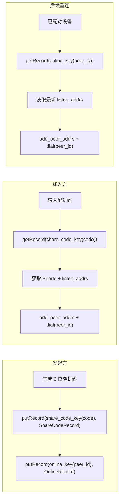
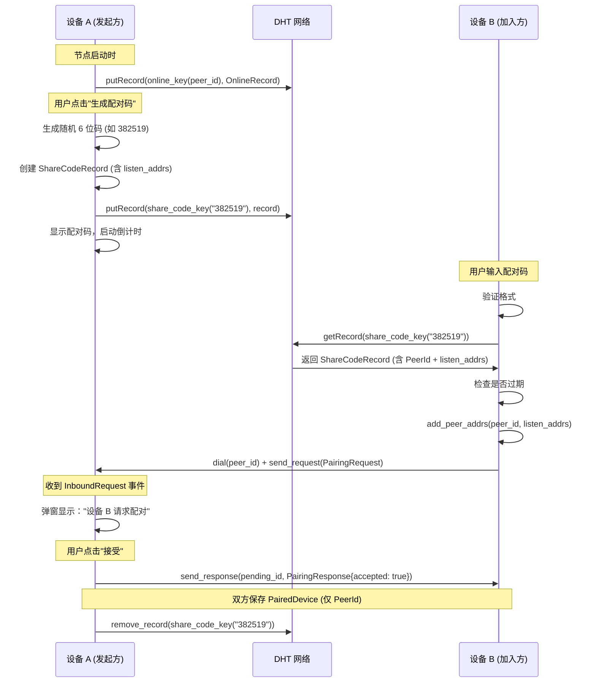
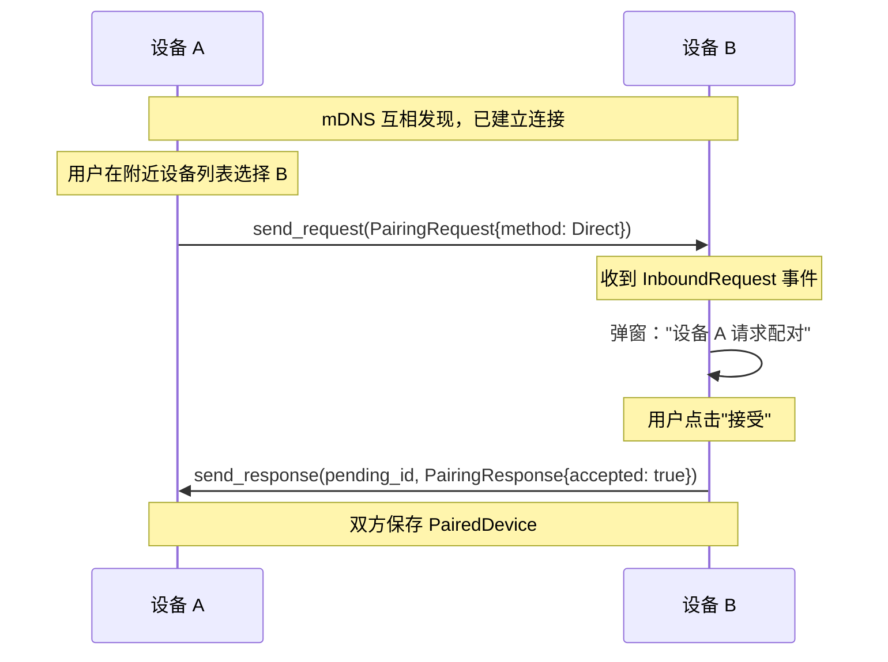
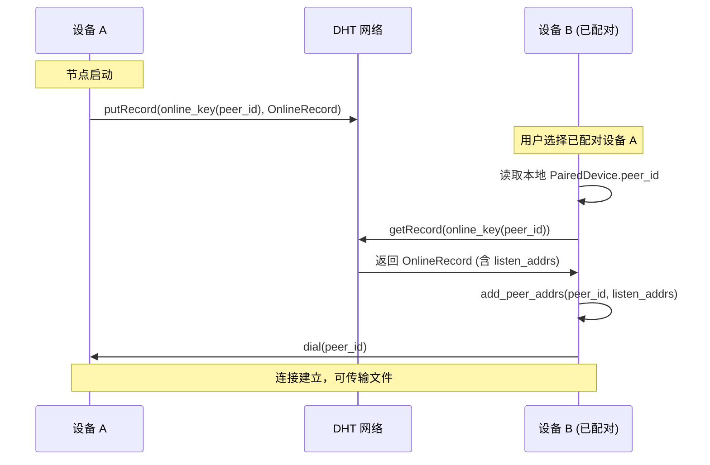
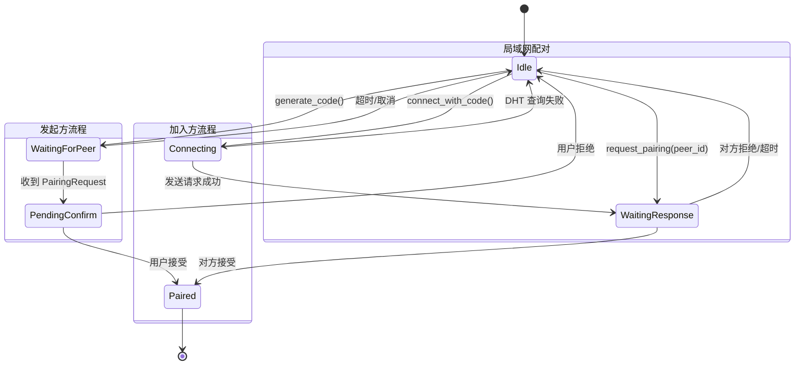

# 配对功能实现设计

## 概述

本文档详细说明设备配对功能的实现方案。配对是文件传输的前置步骤——所有传输都需要先建立配对关系。

### 设计原则

1. **业务与网络分离**：配对业务逻辑在 `src-tauri`，网络能力在 `libs/core`
2. **配对优先**：所有传输都需要先建立设备配对关系
3. **双向确认**：配对需要双方确认，防止单方面添加
4. **不缓存地址**：已配对设备仅存 PeerId，每次通过 DHT 重新查找地址，适应移动网络

### 相关文档

- [配对与传输设计](./pairing-transfer-design.md) - 产品设计和用户流程
- [Phase 2 路线图](../roadmap/phase-2-pairing.md) - 阶段任务规划

---

## 网络层能力（已实现）

`libs/core` 提供的 `NetClient<Req, Resp>` 已实现以下能力：

| 分类 | 方法 | 说明 |
|------|------|------|
| 连接 | `dial(peer_id)` | 连接到指定 Peer |
| 连接 | `is_connected(peer_id)` | 查询是否已连接 |
| 地址 | `get_addrs()` | 获取本节点所有可达地址（listeners + external） |
| 地址 | `add_peer_addrs(peer_id, addrs)` | 批量注册 peer 地址到 Swarm 地址簿 |
| DHT 引导 | `bootstrap()` | 加入 DHT 网络 |
| DHT Record | `put_record(record)` | 存储键值对 |
| DHT Record | `get_record(key)` | 查询键值对 |
| DHT Record | `remove_record(key)` | 删除键值对 |
| DHT Provider | `start_provide(key)` | 宣布 Provider |
| DHT Provider | `stop_provide(key)` | 停止 Provider |
| DHT Provider | `get_providers(key)` | 查询 Provider |
| DHT 查询 | `get_closest_peers(key)` | 查询最近节点 |
| Request-Response | `send_request(peer_id, req)` | 发送请求，等待响应 |
| Request-Response | `send_response(pending_id, resp)` | 回复入站请求 |

**入站请求事件**：当收到对端请求时，`NodeEvent::InboundRequest { peer_id, pending_id, request }` 会被推送到事件接收器。`pending_id` 用于后续调用 `send_response` 回复。

**关键约束**：`NetClient` 的泛型参数 `Req` 和 `Resp` 必须实现 `CborMessage` trait（即 `Debug + Clone + Serialize + Deserialize + Send + Sync + 'static`）。当前 `src-tauri` 中使用 `NetClient<(), ()>`，需要替换为实际的消息类型。

---

## 第一步：定义应用层消息类型

在实现配对之前，需要先定义 Request-Response 协议的消息类型，替换当前的 `NetClient<(), ()>`。

### 消息枚举

```rust
// src-tauri/src/protocol.rs

use serde::{Deserialize, Serialize};

/// 应用层请求类型
///
/// 所有通过 request-response 协议发送的请求都包含在此枚举中。
/// 后续新增功能（如文件传输）可直接扩展变体。
#[derive(Debug, Clone, Serialize, Deserialize)]
pub enum AppRequest {
    /// 配对请求
    Pairing(PairingRequest),
    // 预留：FileTransfer(FileTransferRequest),
}

/// 应用层响应类型
#[derive(Debug, Clone, Serialize, Deserialize)]
pub enum AppResponse {
    /// 配对响应
    Pairing(PairingResponse),
    // 预留：FileTransfer(FileTransferResponse),
}
```

### 修改 NetClient 实例化

```rust
// src-tauri/src/commands/mod.rs

// 之前：
pub type NetClientState = Mutex<Option<NetClient<(), ()>>>;
let (client, mut receiver) = swarm_p2p_core::start::<(), ()>(keypair, config)?;

// 之后：
pub type NetClientState = Mutex<Option<NetClient<AppRequest, AppResponse>>>;
let (client, mut receiver) = swarm_p2p_core::start::<AppRequest, AppResponse>(keypair, config)?;
```

### 事件类型变化

修改后 `NodeEvent` 的泛型参数从 `()` 变为 `AppRequest`：

```rust
// 之前：NodeEvent<()>  → InboundRequest.request 是 ()，无意义
// 之后：NodeEvent<AppRequest> → InboundRequest.request 是 AppRequest

// 前端需要处理新的事件：
NodeEvent::InboundRequest {
    peer_id,
    pending_id,   // 用于 send_response 回复
    request: AppRequest::Pairing(pairing_request),
}
```

---

## 配对码设计

### 格式规范

```
字符集: 0123456789 (纯数字)
长度:   6 位
组合数: 10^6 = 1,000,000 (100 万)
有效期: 默认 5 分钟
示例:   382 519 (显示时 3+3 分组，手机弹数字键盘)
```

### DHT 使用策略

6 位配对码信息量有限，无法直接编码 PeerId + 加密密钥等完整信息。采用 **配对码 → DHT Record → PeerId** 的间接方案：



**DHT Key 命名空间**：

为防止不同用途的 DHT Key 冲突，所有 Key 都带有命名空间前缀后再进行 SHA256 哈希：

```rust
// src-tauri/src/pairing/dht_key.rs
const NS_SHARE_CODE: &[u8] = b"/swarmdrop/share-code/";
const NS_ONLINE: &[u8] = b"/swarmdrop/online/";

fn dht_key(namespace: &[u8], id: &[u8]) -> RecordKey {
    sha2::Sha256::digest([namespace, id].concat()).to_vec().into()
}

pub fn share_code_key(code: &str) -> RecordKey {
    dht_key(NS_SHARE_CODE, code.as_bytes())
}

pub fn online_key(peer_id_bytes: &[u8]) -> RecordKey {
    dht_key(NS_ONLINE, peer_id_bytes)
}
```

**双重 Record 机制**：

| 机制 | Key | Value | 用途 | 生命周期 |
|------|-----|-------|------|----------|
| 配对码 Record | `SHA256(NS_SHARE_CODE + code)` | `ShareCodeRecord` | 配对码 → PeerId + 地址映射 | 配对完成或过期后删除 |
| 在线宣告 Record | `SHA256(NS_ONLINE + peer_id)` | `OnlineRecord` | 宣布节点在线状态 + 可达地址 | 节点运行期间持续，关闭时删除 |

**为什么在线宣告使用 `put_record` 而非 `start_provide`？**
- `start_provide` 的 Provider Record 仅存储 PeerId，不携带地址
- NAT 后的节点通过 `get_providers` 无法获取其 relay circuit 地址
- `put_record` 可以携带完整的 `OnlineRecord`，包含所有可达地址（listeners + external + relay）
- 对端拿到地址后可通过 `add_peer_addrs` 注册到 Swarm 地址簿，实现跨网络直连

### 数据结构

```rust
// src-tauri/src/pairing/code.rs

/// 配对码字符集 (纯数字)
const CHARSET: &[u8] = b"0123456789";
const CODE_LENGTH: usize = 6;

/// 配对码信息（返回给前端显示）
#[derive(Debug, Clone, Serialize, Deserialize)]
#[serde(rename_all = "camelCase")]
pub struct PairingCodeInfo {
    /// 6 位配对码
    pub code: String,
    /// 创建时间戳 (秒)
    pub created_at: i64,
    /// 过期时间戳 (秒)
    pub expires_at: i64,
}

/// DHT Record 中存储的内容（配对码 → 节点信息）
#[derive(Debug, Clone, Serialize, Deserialize)]
#[serde(rename_all = "camelCase")]
pub struct ShareCodeRecord {
    /// 设备信息（hostname, os, platform, arch）
    #[serde(flatten)]
    pub os_info: OsInfo,
    /// 创建时间戳 (秒)
    pub created_at: i64,
    /// 过期时间戳 (秒)
    pub expires_at: i64,
    /// 发布者的可达地址（Multiaddr），用于跨网络场景下让对方直接 dial
    #[serde(default)]
    pub listen_addrs: Vec<Multiaddr>,
}

/// 在线宣告记录，发布到 DHT 供已配对设备发现地址
#[derive(Debug, Clone, Serialize, Deserialize)]
#[serde(rename_all = "camelCase")]
pub struct OnlineRecord {
    #[serde(flatten)]
    pub os_info: OsInfo,
    /// 节点的可达地址（监听地址 + 外部地址 + relay circuit 地址）
    #[serde(default)]
    pub listen_addrs: Vec<Multiaddr>,
    pub timestamp: i64,
}
```

### 生成与验证

```rust
// src-tauri/src/pairing/code.rs

use rand::seq::IndexedRandom;

impl PairingCodeInfo {
    /// 生成新的配对码
    pub fn generate(expires_in_secs: u64) -> Self {
        let mut rng = rand::rng();
        let code: String = (0..CODE_LENGTH)
            .map(|_| *CHARSET.choose(&mut rng).unwrap() as char)
            .collect();

        let now = chrono::Utc::now().timestamp();

        Self {
            code,
            created_at: now,
            expires_at: now + expires_in_secs as i64,
        }
    }

    /// 检查是否过期
    pub fn is_expired(&self) -> bool {
        chrono::Utc::now().timestamp() > self.expires_at
    }
}
```

---

## 配对协议消息

```rust
// src-tauri/src/protocol.rs (续)

/// 配对请求
#[derive(Debug, Clone, Serialize, Deserialize)]
pub struct PairingRequest {
    /// 请求 ID (UUID)
    pub request_id: String,
    /// 请求方设备名称
    pub device_name: String,
    /// 请求方 OS 类型
    pub os: String,
    /// 配对方式
    pub method: PairingMethod,
    /// 时间戳 (毫秒)
    pub timestamp: u64,
}

/// 配对响应
#[derive(Debug, Clone, Serialize, Deserialize)]
pub struct PairingResponse {
    /// 对应的请求 ID
    pub request_id: String,
    /// 是否接受
    pub accepted: bool,
    /// 拒绝原因
    pub reject_reason: Option<String>,
    /// 响应方设备名称
    pub device_name: String,
    /// 响应方 OS 类型
    pub os: String,
}

/// 配对方式
#[derive(Debug, Clone, Serialize, Deserialize)]
pub enum PairingMethod {
    /// 通过配对码（跨网络）
    Code { code: String },
    /// 局域网直连（mDNS 发现后）
    Direct,
}
```

---

## 配对流程

### 跨网络配对（配对码方式）



### 局域网配对（mDNS 直连）



### 已配对设备重连



---

## 配对管理器

### 状态机



### 核心结构

```rust
// src-tauri/src/pairing/manager.rs

use std::collections::HashMap;
use tokio::sync::RwLock;
use swarm_p2p_core::NetClient;
use crate::protocol::{AppRequest, AppResponse, PairingRequest, PairingResponse};

/// 配对管理器
pub struct PairingManager {
    /// 网络客户端
    net_client: NetClient<AppRequest, AppResponse>,
    /// 当前活跃的配对码
    active_code: RwLock<Option<ActiveCode>>,
    /// 待确认的入站配对请求 (request_id -> PendingInbound)
    pending_inbound: RwLock<HashMap<String, PendingInbound>>,
    /// 本机设备信息
    local_device: LocalDeviceInfo,
}

struct ActiveCode {
    info: PairingCodeInfo,
    dht_key: Vec<u8>,
}

/// 待确认的入站请求
struct PendingInbound {
    request: PairingRequest,
    peer_id: PeerId,
    /// send_response 所需的 pending_id
    pending_id: u64,
    received_at: i64,
}

struct LocalDeviceInfo {
    device_name: String,
    os: String,
}
```

### 核心方法

```rust
impl PairingManager {
    /// 节点启动时调用 - 在 DHT 宣布在线（含可达地址）
    pub async fn announce_online(&self) -> AppResult<()> {
        let addrs = self.client.get_addrs().await?;
        let record_value = OnlineRecord {
            os_info: OsInfo::default(),
            listen_addrs: addrs,
            timestamp: chrono::Utc::now().timestamp(),
        };
        let key = dht_key::online_key(&self.peer_id.to_bytes());
        self.client.put_record(Record {
            key,
            value: serde_json::to_vec(&record_value)?,
            publisher: Some(self.peer_id),
            expires: None,
        }).await?;
        Ok(())
    }

    /// 节点关闭时调用 - 从 DHT 移除在线记录
    pub async fn announce_offline(&self) -> AppResult<()> {
        let key = dht_key::online_key(&self.peer_id.to_bytes());
        self.client.remove_record(key).await?;
        Ok(())
    }

    /// 生成配对码 (发起方)
    pub async fn generate_code(&self, expires_in_secs: u64) -> Result<PairingCodeInfo> {
        // 1. 清理已有配对码
        self.cancel_code().await?;

        // 2. 生成配对码
        let info = PairingCodeInfo::generate(expires_in_secs);

        // 3. 构造 ShareCodeRecord（含可达地址）
        let addrs = self.client.get_addrs().await?;
        let mut share_record = ShareCodeRecord::from(&info);
        share_record.listen_addrs = addrs;

        // 4. 发布到 DHT（使用命名空间 Key）
        let key = dht_key::share_code_key(&info.code);
        let value = serde_json::to_vec(&share_record)?;
        let record = Record {
            key: key.clone(),
            value,
            publisher: Some(self.peer_id),
            expires: None,
        };
        self.client.put_record(record).await?;

        // 5. 保存并启动过期定时器
        self.active_codes.insert(info.code.clone(), info.clone());

        Ok(info)
    }

    /// 取消配对码
    pub async fn cancel_code(&self) -> Result<()> {
        // 遍历 active_codes 并从 DHT 删除
        for entry in self.active_codes.iter() {
            let key = dht_key::share_code_key(entry.key());
            self.client.remove_record(key).await?;
        }
        self.active_codes.clear();
        Ok(())
    }

    /// 通过配对码查询设备信息 (加入方第一步)
    pub async fn get_device_info(&self, code: &str) -> AppResult<(PeerId, ShareCodeRecord)> {
        let key = dht_key::share_code_key(code);
        let result = self.client.get_record(key).await?;
        let record = result.record;

        let peer_id = record.publisher.ok_or(AppError::Peer("无效的配对码".into()))?;
        let share_record: ShareCodeRecord = serde_json::from_slice(&record.value)?;

        if share_record.expires_at < chrono::Utc::now().timestamp() {
            return Err(AppError::Peer("配对码已过期".into()));
        }

        Ok((peer_id, share_record))
    }

    /// 向对端发起配对请求 (加入方第二步)
    pub async fn request_pairing(
        &self,
        peer_id: PeerId,
        method: PairingMethod,
        addrs: Option<Vec<Multiaddr>>,
    ) -> AppResult<PairingResponse> {
        // 1. 注册对端地址（跨网络场景下从 ShareCodeRecord.listen_addrs 获取）
        if let Some(addrs) = addrs {
            if !addrs.is_empty() {
                self.client.add_peer_addrs(peer_id, addrs).await?;
            }
        }

        // 2. 如果未连接则先 dial
        if !self.client.is_connected(peer_id).await? {
            self.client.dial(peer_id).await?;
        }

        // 3. 发送配对请求
        let res = self.client.send_request(
            peer_id,
            AppRequest::Pairing(PairingRequest {
                os_info: OsInfo::default(),
                method,
                timestamp: chrono::Utc::now().timestamp(),
            }),
        ).await?;

        match res {
            AppResponse::Pairing(pairing_res) => Ok(pairing_res),
        }
    }

    /// 处理入站配对请求 (由事件循环调用)
    ///
    /// 收到请求后暂存，等待用户通过 UI 确认/拒绝
    pub async fn on_inbound_pairing(
        &self,
        peer_id: PeerId,
        pending_id: u64,
        request: PairingRequest,
    ) {
        self.pending_inbound.insert(pending_id, PendingInbound {
            request,
            peer_id,
            pending_id,
            received_at: chrono::Utc::now().timestamp(),
        });
        // 通知前端弹窗 (通过 Tauri Channel 事件)
    }

    /// 处理配对请求（接受/拒绝，由 UI 调用）
    pub async fn handle_pairing_request(
        &self,
        pending_id: u64,
        method: &PairingMethod,
        response: PairingResponse,
    ) -> AppResult<()> {
        // Code 模式：验证并消耗配对码
        if let PairingMethod::Code { code } = method {
            let (_, info) = self.active_codes
                .remove(code.as_str())
                .ok_or(AppError::Peer("无效的配对码".into()))?;
            if info.is_expired() {
                return Err(AppError::Peer("配对码已过期".into()));
            }
            // 清理 DHT Record
            let key = dht_key::share_code_key(code);
            self.client.remove_record(key).await?;
        }
        // Direct 模式（局域网）：无需配对码，用户确认即可

        self.client
            .send_response(pending_id, AppResponse::Pairing(response))
            .await?;
        self.pending_inbound.remove(&pending_id);
        Ok(())
    }
}
```

---

## Tauri 命令

```rust
// src-tauri/src/commands/pairing.rs

use tauri::State;
use super::NetManagerState;
use swarm_p2p_core::libp2p::{Multiaddr, PeerId};

/// 查询设备信息的返回类型
#[derive(Debug, Clone, Serialize, Deserialize)]
#[serde(rename_all = "camelCase")]
pub struct DeviceInfo {
    pub peer_id: PeerId,
    pub code_record: ShareCodeRecord,
}

/// 生成配对码
#[tauri::command]
pub async fn generate_pairing_code(
    net: State<'_, NetManagerState>,
    expires_in_secs: Option<u64>,
) -> AppResult<PairingCodeInfo> {
    let guard = net.lock().await;
    let manager = guard.as_ref().ok_or_else(not_started)?;
    manager.pairing()
        .generate_code(expires_in_secs.unwrap_or(300))
        .await
}

/// 通过配对码查询对端设备信息
#[tauri::command]
pub async fn get_device_info(
    net: State<'_, NetManagerState>,
    code: String,
) -> AppResult<DeviceInfo> {
    let guard = net.lock().await;
    let manager = guard.as_ref().ok_or_else(not_started)?;
    let (peer_id, record) = manager.pairing().get_device_info(&code).await?;
    Ok(DeviceInfo { peer_id, code_record: record })
}

/// 向对端发起配对请求
#[tauri::command]
pub async fn request_pairing(
    net: State<'_, NetManagerState>,
    peer_id: PeerId,
    method: PairingMethod,
    addrs: Option<Vec<Multiaddr>>,
) -> AppResult<PairingResponse> {
    let guard = net.lock().await;
    let manager = guard.as_ref().ok_or_else(not_started)?;
    manager.pairing()
        .request_pairing(peer_id, method, addrs)
        .await
}

/// 处理收到的配对请求（接受/拒绝）
#[tauri::command]
pub async fn respond_pairing_request(
    net: State<'_, NetManagerState>,
    pending_id: u64,
    method: PairingMethod,
    response: PairingResponse,
) -> AppResult<()> {
    let guard = net.lock().await;
    let manager = guard.as_ref().ok_or_else(not_started)?;
    manager.pairing()
        .handle_pairing_request(pending_id, &method, response)
        .await
}
```

---

## 前端集成

### 事件处理

`NodeEvent<AppRequest>` 序列化后通过 Tauri Channel 推送到前端。需要在 `handleEvent` 中增加对 `inboundRequest` 事件的处理：

```typescript
// src/commands/network.ts - 扩展 NodeEvent 类型

interface InboundPairingRequestEvent {
  type: "inboundRequest";
  peerId: string;
  pendingId: number;
  request: {
    Pairing: {
      request_id: string;
      device_name: string;
      os: string;
      method: { Code: { code: string } } | "Direct";
      timestamp: number;
    };
  };
}
```

### 配对 Store

```typescript
// src/stores/pairing-store.ts

interface PairingState {
  /** 当前配对码（发起方） */
  activeCode: PairingCodeInfo | null;
  /** 待确认的入站请求 */
  pendingRequests: InboundPairingRequest[];
  /** 连接状态 */
  connectStatus: "idle" | "connecting" | "waiting" | "success" | "error";
  connectError: string | null;

  // Actions
  generateCode: (expiresSecs?: number) => Promise<void>;
  cancelCode: () => Promise<void>;
  connectWithCode: (code: string) => Promise<void>;
  requestDirectPairing: (peerId: string) => Promise<void>;
  acceptPairing: (requestId: string) => Promise<void>;
  rejectPairing: (requestId: string, reason?: string) => Promise<void>;
  handleInboundRequest: (event: InboundPairingRequestEvent) => void;
}

interface PairingCodeInfo {
  code: string;
  createdAt: number;
  expiresAt: number;
}

interface InboundPairingRequest {
  requestId: string;
  peerId: string;
  pendingId: number;
  deviceName: string;
  os: string;
  method: "code" | "direct";
  receivedAt: number;
}
```

---

## 文件结构

```
src-tauri/src/
├── lib.rs
├── error.rs                    # 已有
├── device.rs                   # OsInfo — 设备信息
├── protocol.rs                 # AppRequest/AppResponse + 配对消息
├── commands/
│   ├── mod.rs                  # NetManager + start/shutdown + 注册命令
│   ├── identity.rs             # 已有
│   └── pairing.rs              # 配对 Tauri 命令
└── pairing/
    ├── mod.rs                  # 模块导出
    ├── code.rs                 # PairingCodeInfo, ShareCodeRecord, OnlineRecord
    ├── dht_key.rs              # DHT Key 命名空间 (share_code_key, online_key)
    └── manager.rs              # PairingManager 核心业务逻辑

src/
├── commands/
│   ├── network.ts              # 网络命令 + NodeEvent 类型
│   └── pairing.ts              # 配对 invoke 封装 + 类型定义
├── stores/
│   ├── network-store.ts        # 处理 inboundRequest 事件
│   ├── secret-store.ts         # 配对成功后保存 PairedDevice
│   └── pairing-store.ts        # 配对流程状态管理
└── components/
    └── pairing/                # 配对 UI 组件
```

---

## 实现步骤

### Step 1：消息类型与基础设施

- [ ] 创建 `src-tauri/src/protocol.rs` — 定义 `AppRequest`、`AppResponse`、`PairingRequest`、`PairingResponse`
- [ ] 修改 `commands/mod.rs` — `NetClient<(), ()>` → `NetClient<AppRequest, AppResponse>`
- [ ] 修改前端 `NodeEvent` 类型定义 — 扩展 `inboundRequest` 事件
- [ ] 验证：编译通过，启动正常，mDNS 发现不受影响

### Step 2：配对码生成

- [ ] 创建 `src-tauri/src/pairing/code.rs` — 配对码生成、过期判断
- [ ] 创建 `src-tauri/src/pairing/dht_key.rs` — DHT Key 命名空间（share_code_key, online_key）
- [ ] 单元测试：生成格式、字符集、过期判断、命名空间 Key 一致性

### Step 3：配对管理器

- [ ] 创建 `src-tauri/src/pairing/manager.rs` — PairingManager 核心逻辑
- [ ] 实现 `generate_code` — 生成码 + get_addrs + putRecord（含地址）
- [ ] 实现 `get_device_info` — getRecord + 解析 ShareCodeRecord
- [ ] 实现 `request_pairing` — add_peer_addrs + dial + send_request（含可选 addrs）
- [ ] 实现 `on_inbound_pairing` / `handle_pairing_request` — 入站处理
- [ ] 实现 `announce_online` — putRecord(online_key, OnlineRecord)
- [ ] 实现 `announce_offline` — removeRecord(online_key)

### Step 4：Tauri 命令注册

- [ ] 创建 `src-tauri/src/commands/pairing.rs` — 封装 Tauri 命令
- [ ] 在 `lib.rs` 注册命令
- [ ] 在 `start` 命令中初始化 PairingManager 并存入 Tauri State

### Step 5：前端集成

- [ ] 创建 `src/commands/pairing.ts` — invoke 封装
- [ ] 创建 `src/stores/pairing-store.ts` — 状态管理
- [ ] 修改 `network-store.ts` — 路由 inboundRequest 事件到 pairing-store
- [ ] 实现配对 UI 组件

---

## 测试计划

### 单元测试

| 测试项 | 内容 |
|--------|------|
| 配对码生成 | 长度 6，纯数字 0-9 |
| 配对码验证 | 合法码通过，非数字字符拒绝，长度不对拒绝 |
| DHT Key | 相同配对码产生相同 Key |
| 过期判断 | 未过期返回 false，已过期返回 true |
| 消息序列化 | AppRequest/AppResponse 的 CBOR 往返一致 |

### 集成测试场景

| 场景 | 预期 |
|------|------|
| 正常配对码配对 | 双方成功配对，保存 PairedDevice |
| 过期配对码 | 提示"配对码已过期" |
| 格式错误配对码 | 提示"无效的配对码格式" |
| 不存在的配对码 | DHT 查询失败，提示"未找到设备" |
| 配对被拒绝 | 加入方收到 accepted=false |
| 局域网直连配对 | mDNS 发现后直接配对成功 |
| 配对码超时自动清理 | 过期后 DHT Record 被删除 |

---

## 安全考虑

1. **配对码有效期**：默认 5 分钟，过期后自动从 DHT 清除
2. **随机性**：使用 `rand::rng()`（底层 ChaCha20），满足密码学安全要求
3. **双向确认**：配对必须双方明确同意
4. **DHT Key 命名空间**：不同用途的 Key 使用不同命名空间前缀（`/swarmdrop/share-code/`、`/swarmdrop/online/`），防止 Key 冲突
5. **DHT Record 不含敏感信息**：仅存设备信息 + 可达地址 + 时间戳，不含密钥
6. **配对码哈希存储**：配对码经 SHA256(namespace + code) 哈希后作为 DHT Key，无法从 Key 反推配对码
7. **E2E 加密密钥协商**：留给 Phase 3 文件传输阶段，配对阶段不涉及
