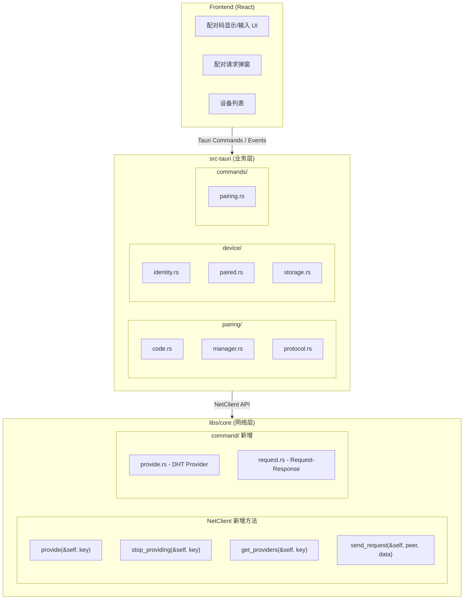
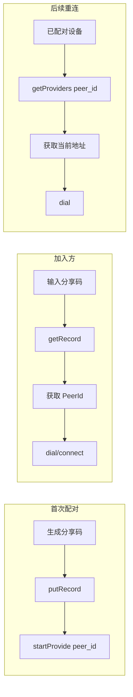
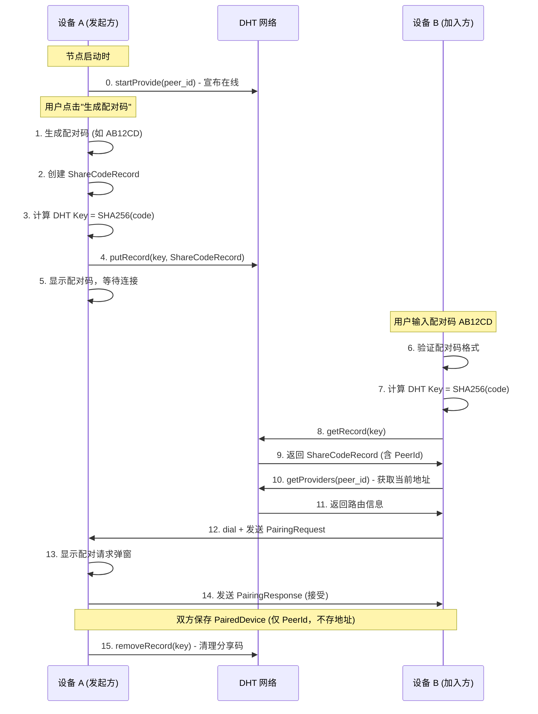
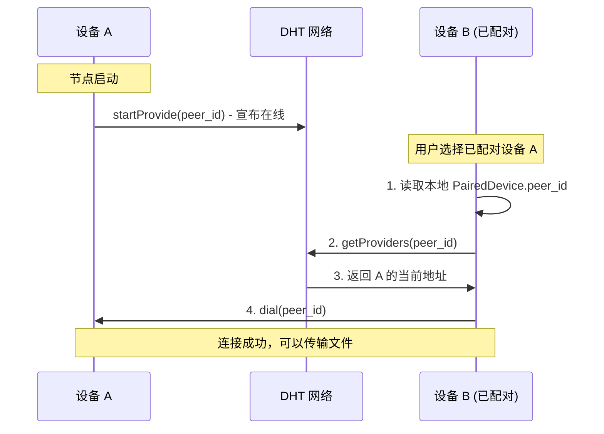
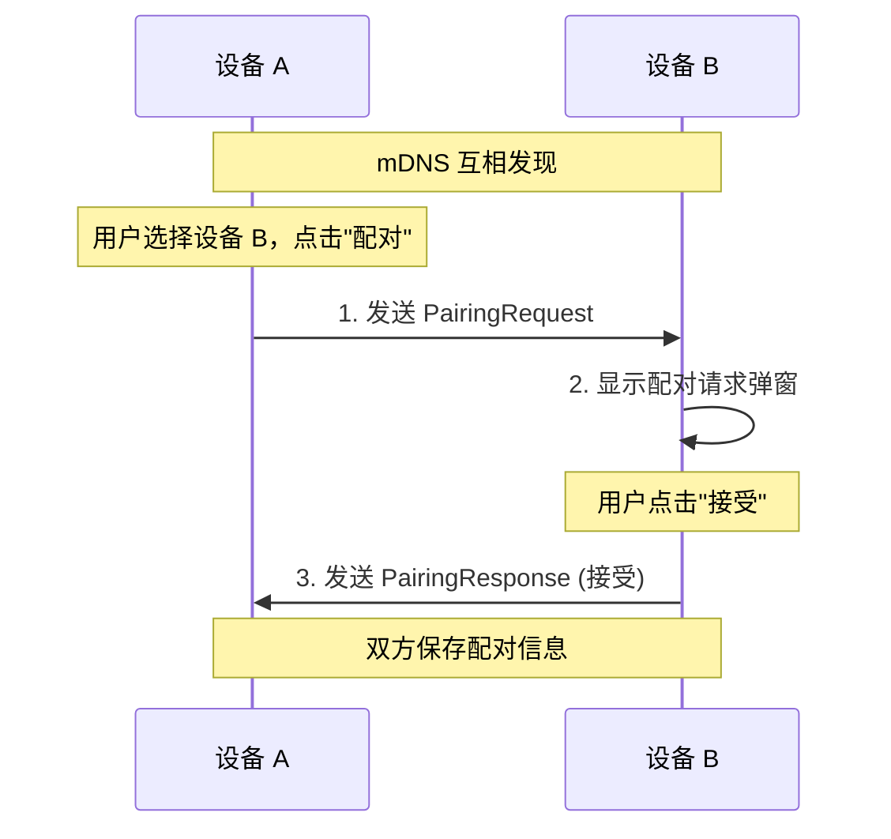
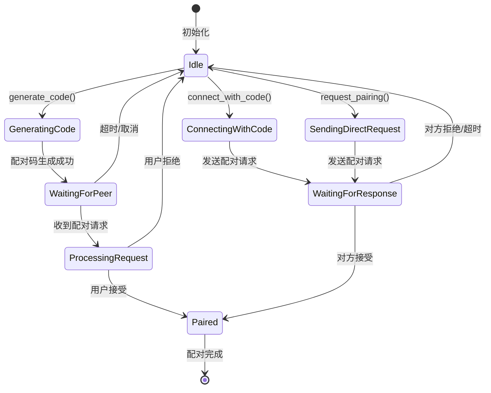

# 配对功能实现设计

## 概述

本文档详细说明设备配对功能的实现方案，包括架构设计、模块划分、数据结构、流程细节和代码示例。

### 设计原则

1. **业务与网络分离**：配对业务逻辑放 `src-tauri`，网络能力放 `libs/core`
2. **配对优先**：所有传输都需要先建立设备配对关系
3. **双向确认**：配对需要双方确认，防止单方面添加

### 相关文档

- [配对与传输设计](./pairing-transfer-design.md) - 产品设计和用户流程
- [Phase 2 路线图](../roadmap/phase-2-pairing.md) - 阶段任务规划

---

## 架构设计

### 分层架构



### 模块职责

| 模块 | 位置 | 职责 |
|------|------|------|
| `pairing/code.rs` | src-tauri | 配对码生成、编解码、验证 |
| `pairing/manager.rs` | src-tauri | 配对流程管理、状态机 |
| `pairing/protocol.rs` | src-tauri | 配对请求/响应消息定义 |
| `device/identity.rs` | src-tauri | 本机设备身份管理 |
| `device/paired.rs` | src-tauri | 已配对设备存储和管理 |
| `command/provide.rs` | libs/core | DHT Provider 发布/查询 |
| `command/request.rs` | libs/core | Request-Response 协议 |

---

## 核心设计思路

### DHT 使用策略

本设计采用 **Provider + Record** 双重机制：

1. **`startProvide(peer_id)`** - 节点启动时宣布自己的存在，DHT 会维护当前路由信息
2. **`putRecord(share_code -> NodeInfo)`** - 分享码仅用于首次发现，指向节点的 PeerId
3. **重连时通过 `getProviders(peer_id)` 查找** - 不依赖缓存地址，适应移动网络地址变化



### 为什么这样设计？

| 问题 | 解决方案 |
|------|----------|
| 移动网络地址频繁变化 | 不缓存地址，每次通过 DHT 查找 |
| 首次发现需要简单方式 | 分享码 → Record → PeerId |
| 配对后需要稳定身份 | PeerId 是永久身份标识 |
| DHT 需要保持路由信息 | `startProvide(peer_id)` 持续宣布 |

---

## 配对码设计

### 格式规范

```
字符集: ABCDEFGHJKMNPQRSTUVWXYZ23456789 (32 字符)
        - 去除易混淆字符: 0/O, 1/I/L
长度: 6 位
组合数: 32^6 = 1,073,741,824 (约 10 亿)
有效期: 5 分钟
示例: AB12CD, XY9K3M
```

### 数据结构

```rust
// src-tauri/src/pairing/code.rs

use serde::{Deserialize, Serialize};
use libp2p::PeerId;

/// 配对码字符集 (32 字符，去除易混淆字符)
const CHARSET: &[u8] = b"ABCDEFGHJKMNPQRSTUVWXYZ23456789";
const CODE_LENGTH: usize = 6;

/// 配对码信息（发送给前端）
#[derive(Debug, Clone, Serialize, Deserialize)]
pub struct PairingCodeInfo {
    /// 6 位配对码
    pub code: String,
    /// 创建时间戳 (毫秒)
    pub created_at: i64,
    /// 过期时间戳 (毫秒)
    pub expires_at: i64,
}

/// 分享码对应的 DHT Record 内容（仅用于首次发现）
#[derive(Debug, Clone, Serialize, Deserialize)]
pub struct ShareCodeRecord {
    /// 发起方 PeerId（核心：用于后续连接和重连）
    pub peer_id: PeerId,
    /// 发起方设备名称
    pub device_name: String,
    /// 发起方设备类型
    pub device_type: DeviceType,
    /// 创建时间戳 (秒)
    pub created_at: u64,
    /// 过期时间戳 (秒)
    pub expires_at: u64,
}

/// 已配对设备（本地存储）
#[derive(Debug, Clone, Serialize, Deserialize)]
pub struct PairedDevice {
    /// 对方 PeerId（永久身份标识）
    pub peer_id: PeerId,
    /// 设备名称
    pub device_name: String,
    /// 设备类型
    pub device_type: DeviceType,
    /// 配对时间戳
    pub paired_at: u64,
    /// 最后在线时间
    pub last_seen: Option<u64>,
    // 注意：不保存 Multiaddr，因为移动网络地址会变化
}

#[derive(Debug, Clone, Serialize, Deserialize)]
pub enum DeviceType {
    Desktop,
    Laptop,
    Phone,
    Tablet,
    Unknown,
}
```

### 编解码实现

```rust
// src-tauri/src/pairing/code.rs

use rand::Rng;
use sha2::{Sha256, Digest};

impl PairingCodeInfo {
    /// 生成新的配对码
    pub fn generate(expires_in_secs: u64) -> Self {
        let mut rng = rand::thread_rng();
        let code: String = (0..CODE_LENGTH)
            .map(|_| {
                let idx = rng.gen_range(0..CHARSET.len());
                CHARSET[idx] as char
            })
            .collect();

        let now = chrono::Utc::now().timestamp_millis();
        let expires_at = now + (expires_in_secs * 1000) as i64;

        Self {
            code,
            created_at: now,
            expires_at,
        }
    }

    /// 检查是否过期
    pub fn is_expired(&self) -> bool {
        chrono::Utc::now().timestamp_millis() > self.expires_at
    }

    /// 计算 DHT Key (用于 Provider 发布)
    pub fn dht_key(&self) -> Vec<u8> {
        let mut hasher = Sha256::new();
        hasher.update(self.code.as_bytes());
        hasher.finalize().to_vec()
    }
}

/// 验证配对码格式
pub fn validate_code(code: &str) -> bool {
    code.len() == CODE_LENGTH
        && code.chars().all(|c| CHARSET.contains(&(c as u8)))
}

/// 格式化配对码显示 (AB12CD -> AB12 CD)
pub fn format_code_display(code: &str) -> String {
    if code.len() == 6 {
        format!("{} {}", &code[0..3], &code[3..6])
    } else {
        code.to_string()
    }
}
```

---

## 配对流程

### 跨网络配对（配对码方式）



### 已配对设备重连



**关键点：** 移动网络地址会变化，所以：
- 不缓存 Multiaddr
- 每次通过 `getProviders(peer_id)` 获取当前地址
- `startProvide(peer_id)` 保持 DHT 路由信息更新

### 局域网配对（mDNS 方式）



---

## 配对协议

### 消息定义

```rust
// src-tauri/src/pairing/protocol.rs

use serde::{Deserialize, Serialize};
use libp2p::PeerId;

/// 配对协议 ID
pub const PAIRING_PROTOCOL: &str = "/swarmdrop/pairing/1.0.0";

/// 配对请求
#[derive(Debug, Clone, Serialize, Deserialize)]
pub struct PairingRequest {
    /// 请求 ID
    pub request_id: String,
    /// 请求方 PeerId
    pub peer_id: PeerId,
    /// 请求方设备名称
    pub device_name: String,
    /// 请求方设备类型
    pub device_type: DeviceType,
    /// 请求方设备指纹
    pub fingerprint: String,
    /// 配对方式
    pub method: PairingMethod,
    /// 时间戳
    pub timestamp: u64,
}

/// 配对响应
#[derive(Debug, Clone, Serialize, Deserialize)]
pub struct PairingResponse {
    /// 对应的请求 ID
    pub request_id: String,
    /// 是否接受
    pub accepted: bool,
    /// 拒绝原因 (如果拒绝)
    pub reject_reason: Option<String>,
    /// 响应方设备名称
    pub device_name: String,
    /// 响应方设备类型
    pub device_type: DeviceType,
    /// 响应方设备指纹
    pub fingerprint: String,
}

#[derive(Debug, Clone, Serialize, Deserialize)]
pub enum PairingMethod {
    /// 通过配对码
    Code { code: String },
    /// 通过局域网直连
    Direct,
}
```

### 协议处理

```rust
// src-tauri/src/pairing/protocol.rs

/// 配对消息（请求或响应）
#[derive(Debug, Clone, Serialize, Deserialize)]
pub enum PairingMessage {
    Request(PairingRequest),
    Response(PairingResponse),
}

impl PairingMessage {
    pub fn encode(&self) -> Vec<u8> {
        bincode::serialize(self).expect("Failed to serialize pairing message")
    }

    pub fn decode(data: &[u8]) -> Result<Self, bincode::Error> {
        bincode::deserialize(data)
    }
}
```

---

## 配对管理器

### 状态机



### 实现

```rust
// src-tauri/src/pairing/manager.rs

use std::collections::HashMap;
use std::sync::Arc;
use parking_lot::RwLock;
use tokio::sync::mpsc;
use libp2p::PeerId;

use crate::pairing::{PairingCodeInfo, PairingRequest, PairingResponse};

/// 配对管理器
pub struct PairingManager {
    /// 当前活跃的配对码 (本机生成的)
    active_code: RwLock<Option<ActivePairingCode>>,
    /// 待处理的配对请求 (收到的)
    pending_requests: RwLock<HashMap<String, PendingRequest>>,
    /// 网络客户端
    net_client: swarmdrop_core::NetClient,
    /// 事件发送器 (通知前端)
    event_tx: mpsc::Sender<PairingEvent>,
}

/// 活跃的配对码
struct ActivePairingCode {
    info: PairingCodeInfo,
    dht_key: Vec<u8>,
}

/// 待处理的配对请求
struct PendingRequest {
    request: PairingRequest,
    received_at: i64,
}

/// 配对事件 (发送到前端)
#[derive(Debug, Clone, Serialize)]
#[serde(tag = "type")]
pub enum PairingEvent {
    /// 收到配对请求
    PairingRequest {
        request_id: String,
        peer_id: String,
        device_name: String,
        device_type: String,
        fingerprint: String,
    },
    /// 配对被接受
    PairingAccepted {
        peer_id: String,
        device_name: String,
    },
    /// 配对被拒绝
    PairingRejected {
        peer_id: String,
        reason: Option<String>,
    },
    /// 配对码已过期
    CodeExpired,
}

impl PairingManager {
    /// 节点启动时调用，宣布在线状态
    pub async fn announce_online(&self) -> Result<()> {
        let peer_id = self.local_peer_id();
        let key = RecordKey::new(&peer_id.to_bytes());
        self.net_client.start_provide(key).await?;
        Ok(())
    }

    /// 生成配对码
    pub async fn generate_code(&self, expires_in_secs: u64) -> Result<PairingCodeInfo> {
        // 1. 如果有活跃的配对码，先清理
        self.cancel_code().await?;

        // 2. 生成新配对码
        let info = PairingCodeInfo::generate(expires_in_secs);
        let dht_key = info.dht_key();

        // 3. 创建 ShareCodeRecord
        let record = ShareCodeRecord {
            peer_id: self.local_peer_id(),
            device_name: self.local_device_name(),
            device_type: self.local_device_type(),
            created_at: current_timestamp(),
            expires_at: current_timestamp() + expires_in_secs,
        };

        // 4. 在 DHT 发布 Record (分享码 -> 节点信息)
        self.net_client.put_record(
            RecordKey::new(&dht_key),
            bincode::serialize(&record)?,
        ).await?;

        // 5. 保存活跃配对码
        *self.active_code.write() = Some(ActivePairingCode {
            info: info.clone(),
            dht_key,
        });

        // 6. 启动过期定时器
        self.start_expiry_timer(expires_in_secs);

        Ok(info)
    }

    /// 取消当前配对码
    pub async fn cancel_code(&self) -> Result<()> {
        if let Some(active) = self.active_code.write().take() {
            // 从 DHT 删除 Record
            self.net_client.remove_record(RecordKey::new(&active.dht_key)).await?;
        }
        Ok(())
    }

    /// 使用配对码连接
    pub async fn connect_with_code(&self, code: String) -> Result<PairingResponse> {
        // 1. 验证配对码格式
        if !validate_code(&code) {
            return Err(Error::InvalidCode);
        }

        // 2. 计算 DHT Key
        let dht_key = {
            let mut hasher = Sha256::new();
            hasher.update(code.as_bytes());
            hasher.finalize().to_vec()
        };

        // 3. 从 DHT 获取 Record
        let record_data = self.net_client.get_record(RecordKey::new(&dht_key)).await?;
        let share_record: ShareCodeRecord = bincode::deserialize(&record_data.value)?;

        // 4. 检查是否过期
        if share_record.expires_at < current_timestamp() {
            return Err(Error::CodeExpired);
        }

        let peer_id = share_record.peer_id;

        // 5. 通过 DHT 查找对方当前地址并连接
        // (getProviders 会返回路由信息，然后 dial)
        self.net_client.dial(peer_id).await?;

        // 6. 发送配对请求
        let request = PairingRequest {
            request_id: uuid::Uuid::new_v4().to_string(),
            peer_id: self.local_peer_id(),
            device_name: self.local_device_name(),
            device_type: self.local_device_type(),
            fingerprint: self.local_fingerprint(),
            method: PairingMethod::Code { code },
            timestamp: current_timestamp(),
        };

        let response_data = self.net_client
            .send_request(peer_id, PairingMessage::Request(request).encode())
            .await?;

        let response = match PairingMessage::decode(&response_data)? {
            PairingMessage::Response(r) => r,
            _ => return Err(Error::InvalidResponse),
        };

        // 7. 如果接受，保存配对信息 (仅 PeerId，不存地址)
        if response.accepted {
            self.save_paired_device(peer_id, &response).await?;
        }

        Ok(response)
    }

    /// 连接已配对设备
    pub async fn connect_paired_device(&self, peer_id: PeerId) -> Result<()> {
        // 通过 DHT 查找当前地址 (适应移动网络地址变化)
        let key = RecordKey::new(&peer_id.to_bytes());
        let result = self.net_client.get_providers(key).await?;

        if result.providers.is_empty() {
            return Err(Error::DeviceOffline);
        }

        // 连接
        self.net_client.dial(peer_id).await?;
        Ok(())
    }

    /// 向附近设备发起配对请求
    pub async fn request_pairing(&self, peer_id: PeerId) -> Result<PairingResponse> {
        // 1. 连接到对方
        self.net_client.dial(peer_id).await?;

        // 2. 发送配对请求
        let request = PairingRequest {
            request_id: uuid::Uuid::new_v4().to_string(),
            peer_id: self.local_peer_id(),
            device_name: self.local_device_name(),
            device_type: self.local_device_type(),
            fingerprint: self.local_fingerprint(),
            method: PairingMethod::Direct,
            timestamp: current_timestamp(),
        };

        let response_data = self.net_client
            .send_request(peer_id, PairingMessage::Request(request).encode())
            .await?;

        let response = match PairingMessage::decode(&response_data)? {
            PairingMessage::Response(r) => r,
            _ => return Err(Error::InvalidResponse),
        };

        if response.accepted {
            self.save_paired_device(peer_id, &response).await?;
        }

        Ok(response)
    }

    /// 处理收到的配对请求
    pub fn on_pairing_request(&self, peer_id: PeerId, request: PairingRequest) {
        // 1. 保存待处理请求
        self.pending_requests.write().insert(
            request.request_id.clone(),
            PendingRequest {
                request: request.clone(),
                received_at: current_timestamp_millis(),
            },
        );

        // 2. 通知前端
        let _ = self.event_tx.try_send(PairingEvent::PairingRequest {
            request_id: request.request_id,
            peer_id: peer_id.to_string(),
            device_name: request.device_name,
            device_type: format!("{:?}", request.device_type),
            fingerprint: request.fingerprint,
        });
    }

    /// 接受配对请求
    pub async fn accept_pairing(&self, request_id: &str) -> Result<()> {
        let pending = self.pending_requests.write()
            .remove(request_id)
            .ok_or(Error::RequestNotFound)?;

        let response = PairingResponse {
            request_id: request_id.to_string(),
            accepted: true,
            reject_reason: None,
            device_name: self.local_device_name(),
            device_type: self.local_device_type(),
            fingerprint: self.local_fingerprint(),
        };

        // 发送响应
        self.net_client
            .send_request(pending.request.peer_id, PairingMessage::Response(response).encode())
            .await?;

        // 保存配对信息
        self.save_paired_device(pending.request.peer_id, &pending.request).await?;

        Ok(())
    }

    /// 拒绝配对请求
    pub async fn reject_pairing(&self, request_id: &str, reason: Option<String>) -> Result<()> {
        let pending = self.pending_requests.write()
            .remove(request_id)
            .ok_or(Error::RequestNotFound)?;

        let response = PairingResponse {
            request_id: request_id.to_string(),
            accepted: false,
            reject_reason: reason,
            device_name: self.local_device_name(),
            device_type: self.local_device_type(),
            fingerprint: self.local_fingerprint(),
        };

        self.net_client
            .send_request(pending.request.peer_id, PairingMessage::Response(response).encode())
            .await?;

        Ok(())
    }
}
```

---

## libs/core 新增 API

### Kademlia 命令模块结构

```text
libs/core/src/command/
├── mod.rs
├── dial.rs
├── handler.rs
└── kad/                    # Kademlia 命令子模块
    ├── mod.rs
    ├── start_provide.rs    # 宣布 Provider
    ├── stop_provide.rs     # 停止 Provider
    ├── get_providers.rs    # 查询 Providers
    ├── get_closest_peers.rs # 查询最近节点
    ├── get_record.rs       # 获取 Record
    ├── put_record.rs       # 存储 Record
    └── remove_record.rs    # 删除 Record
```

### NetClient 扩展

```rust
// libs/core/src/runtime/client.rs

impl NetClient {
    // ... 现有方法 ...

    /// 在 DHT 宣布 Provider (用于宣布节点在线)
    pub async fn start_provide(&self, key: RecordKey) -> Result<QueryStatsInfo> {
        let cmd = StartProvideCommand::new(key);
        CommandFuture::new(cmd, self.command_tx.clone()).await
    }

    /// 停止 DHT Provider
    pub async fn stop_provide(&self, key: RecordKey) -> Result<()> {
        let cmd = StopProvideCommand::new(key);
        CommandFuture::new(cmd, self.command_tx.clone()).await
    }

    /// 查询 DHT Providers (用于查找节点)
    pub async fn get_providers(&self, key: RecordKey) -> Result<GetProvidersResult> {
        let cmd = GetProvidersCommand::new(key);
        CommandFuture::new(cmd, self.command_tx.clone()).await
    }

    /// 存储 DHT Record (用于存储分享码 -> 节点信息)
    pub async fn put_record(&self, key: RecordKey, value: Vec<u8>) -> Result<QueryStatsInfo> {
        let record = Record { key, value, publisher: None, expires: None };
        let cmd = PutRecordCommand::new(record);
        CommandFuture::new(cmd, self.command_tx.clone()).await
    }

    /// 获取 DHT Record (用于通过分享码查找节点信息)
    pub async fn get_record(&self, key: RecordKey) -> Result<GetRecordResult> {
        let cmd = GetRecordCommand::new(key);
        CommandFuture::new(cmd, self.command_tx.clone()).await
    }

    /// 删除本地 DHT Record
    pub async fn remove_record(&self, key: RecordKey) -> Result<()> {
        let cmd = RemoveRecordCommand::new(key);
        CommandFuture::new(cmd, self.command_tx.clone()).await
    }

    /// 查询最近节点
    pub async fn get_closest_peers(&self, key: RecordKey) -> Result<GetClosestPeersResult> {
        let cmd = GetClosestPeersCommand::new(key);
        CommandFuture::new(cmd, self.command_tx.clone()).await
    }

    /// 发送请求并等待响应 (Request-Response 协议)
    pub async fn send_request(&self, peer_id: PeerId, data: Vec<u8>) -> Result<Vec<u8>> {
        let cmd = SendRequestCommand::new(peer_id, data);
        CommandFuture::new(cmd, self.command_tx.clone()).await
    }
}
```

### 命令结果类型

```rust
// libs/core/src/util.rs

/// 查询统计信息
#[derive(Debug, Clone, Default, Serialize, Deserialize)]
pub struct QueryStatsInfo {
    pub duration: Option<Duration>,
    pub num_requests: u32,
    pub num_successes: u32,
    pub num_failures: u32,
}

// libs/core/src/command/kad/get_providers.rs

/// GetProviders 命令结果
#[derive(Debug, Clone)]
pub struct GetProvidersResult {
    pub providers: Vec<PeerId>,
    pub stats: QueryStatsInfo,
}

// libs/core/src/command/kad/get_record.rs

/// GetRecord 命令结果
#[derive(Debug, Clone)]
pub struct GetRecordResult {
    pub record: Record,
    pub stats: QueryStatsInfo,
}

// libs/core/src/command/kad/get_closest_peers.rs

/// GetClosestPeers 命令结果
#[derive(Debug, Clone)]
pub struct GetClosestPeersResult {
    pub peers: Vec<PeerId>,
    pub stats: QueryStatsInfo,
}
```

### 命令实现示例 (StartProvideCommand)

```rust
// libs/core/src/command/kad/start_provide.rs

pub struct StartProvideCommand {
    key: RecordKey,
    query_id: Option<kad::QueryId>,
    stats: Option<kad::QueryStats>,
}

#[async_trait]
impl CommandHandler for StartProvideCommand {
    type Result = QueryStatsInfo;

    async fn run(&mut self, swarm: &mut CoreSwarm, handle: &ResultHandle<Self::Result>) {
        match swarm.behaviour_mut().kad.start_providing(self.key.clone()) {
            Ok(query_id) => self.query_id = Some(query_id),
            Err(e) => handle.finish(Err(e.into())),
        }
    }

    async fn on_event(
        &mut self,
        event: &SwarmEvent<CoreBehaviourEvent>,
        handle: &ResultHandle<Self::Result>,
    ) -> bool {
        let SwarmEvent::Behaviour(CoreBehaviourEvent::Kad(
            kad::Event::OutboundQueryProgressed { id, result, stats, step }
        )) = event else { return true };

        if self.query_id != Some(*id) { return true; }

        // 累积统计
        self.stats = Some(match self.stats.take() {
            Some(s) => s.merge(stats.clone()),
            None => stats.clone(),
        });

        if !step.last { return true; }

        // 完成
        let stats_info = QueryStatsInfo::from(self.stats.as_ref().unwrap());
        match result {
            kad::QueryResult::StartProviding(Ok(_)) => handle.finish(Ok(stats_info)),
            kad::QueryResult::StartProviding(Err(e)) => {
                handle.finish(Err(Error::KadProvide(format!("{:?}", e))))
            }
            _ => return true,
        }
        false
    }
}
```

---

## Tauri 命令

```rust
// src-tauri/src/commands/pairing.rs

use tauri::State;
use crate::pairing::{PairingManager, PairingCodeInfo};

/// 生成配对码
#[tauri::command]
pub async fn generate_pairing_code(
    manager: State<'_, PairingManager>,
    expires_in_secs: Option<u64>,
) -> Result<PairingCodeInfo, String> {
    let expires = expires_in_secs.unwrap_or(300); // 默认 5 分钟
    manager.generate_code(expires)
        .await
        .map_err(|e| e.to_string())
}

/// 取消配对码
#[tauri::command]
pub async fn cancel_pairing_code(
    manager: State<'_, PairingManager>,
) -> Result<(), String> {
    manager.cancel_code()
        .await
        .map_err(|e| e.to_string())
}

/// 使用配对码连接
#[tauri::command]
pub async fn connect_with_pairing_code(
    manager: State<'_, PairingManager>,
    code: String,
) -> Result<PairingResult, String> {
    manager.connect_with_code(code)
        .await
        .map_err(|e| e.to_string())
}

/// 向附近设备发起配对
#[tauri::command]
pub async fn request_pairing(
    manager: State<'_, PairingManager>,
    peer_id: String,
) -> Result<PairingResult, String> {
    let peer_id: PeerId = peer_id.parse()
        .map_err(|_| "Invalid peer ID")?;

    manager.request_pairing(peer_id)
        .await
        .map_err(|e| e.to_string())
}

/// 接受配对请求
#[tauri::command]
pub async fn accept_pairing(
    manager: State<'_, PairingManager>,
    request_id: String,
) -> Result<(), String> {
    manager.accept_pairing(&request_id)
        .await
        .map_err(|e| e.to_string())
}

/// 拒绝配对请求
#[tauri::command]
pub async fn reject_pairing(
    manager: State<'_, PairingManager>,
    request_id: String,
    reason: Option<String>,
) -> Result<(), String> {
    manager.reject_pairing(&request_id, reason)
        .await
        .map_err(|e| e.to_string())
}
```

---

## 前端事件

```typescript
// src/hooks/usePairing.ts

import { listen } from '@tauri-apps/api/event';

interface PairingRequestEvent {
  type: 'PairingRequest';
  request_id: string;
  peer_id: string;
  device_name: string;
  device_type: string;
  fingerprint: string;
}

interface PairingAcceptedEvent {
  type: 'PairingAccepted';
  peer_id: string;
  device_name: string;
}

interface PairingRejectedEvent {
  type: 'PairingRejected';
  peer_id: string;
  reason?: string;
}

type PairingEvent = PairingRequestEvent | PairingAcceptedEvent | PairingRejectedEvent;

// 监听配对事件
export function usePairingEvents(callbacks: {
  onRequest?: (event: PairingRequestEvent) => void;
  onAccepted?: (event: PairingAcceptedEvent) => void;
  onRejected?: (event: PairingRejectedEvent) => void;
}) {
  useEffect(() => {
    const unlisten = listen<PairingEvent>('pairing-event', (event) => {
      switch (event.payload.type) {
        case 'PairingRequest':
          callbacks.onRequest?.(event.payload);
          break;
        case 'PairingAccepted':
          callbacks.onAccepted?.(event.payload);
          break;
        case 'PairingRejected':
          callbacks.onRejected?.(event.payload);
          break;
      }
    });

    return () => { unlisten.then(f => f()); };
  }, [callbacks]);
}
```

---

## 文件结构

```text
src-tauri/src/
├── pairing/
│   ├── mod.rs              # 模块导出
│   ├── code.rs             # 配对码生成/验证
│   ├── manager.rs          # 配对流程管理
│   ├── protocol.rs         # 配对消息协议
│   └── error.rs            # 配对错误类型
├── device/
│   ├── mod.rs              # 模块导出
│   ├── identity.rs         # 本机身份管理
│   ├── paired.rs           # 已配对设备管理
│   └── storage.rs          # 设备数据持久化
├── commands/
│   ├── mod.rs
│   └── pairing.rs          # Tauri 配对命令
└── lib.rs

libs/core/src/
├── command/
│   ├── mod.rs
│   ├── dial.rs             # 连接命令
│   ├── handler.rs          # CommandHandler trait
│   └── kad/                # Kademlia DHT 命令
│       ├── mod.rs
│       ├── start_provide.rs
│       ├── stop_provide.rs
│       ├── get_providers.rs
│       ├── get_closest_peers.rs
│       ├── get_record.rs
│       ├── put_record.rs
│       └── remove_record.rs
├── util.rs                 # QueryStatsInfo 等工具类型
└── ...
```

---

## 实现步骤

### Phase 1: libs/core Kademlia 命令 ✅ 已完成

1. [x] 实现 `StartProvideCommand` - 宣布 Provider
2. [x] 实现 `StopProvideCommand` - 停止 Provider
3. [x] 实现 `GetProvidersCommand` - 查询 Providers
4. [x] 实现 `GetClosestPeersCommand` - 查询最近节点
5. [x] 实现 `GetRecordCommand` - 获取 Record
6. [x] 实现 `PutRecordCommand` - 存储 Record
7. [x] 实现 `RemoveRecordCommand` - 删除 Record
8. [x] 创建 `kad/` 子模块组织代码
9. [x] 实现 `QueryStatsInfo` 统计信息

### Phase 2: libs/core 扩展

1. [ ] 实现 `SendRequestCommand` (Request-Response 协议)
2. [ ] 扩展 `NetClient` API (封装上述命令)
3. [ ] 实现基于 PeerId 的 dial (从 DHT 获取地址)
4. [ ] 单元测试

### Phase 3: src-tauri 配对模块

1. [ ] 创建 `pairing/code.rs` - 配对码生成
2. [ ] 创建 `pairing/protocol.rs` - 消息定义
3. [ ] 创建 `pairing/manager.rs` - 配对流程管理
4. [ ] 创建 `device/identity.rs` - 设备身份
5. [ ] 创建 `device/paired.rs` - 已配对设备存储
6. [ ] 实现 Tauri 命令
7. [ ] 集成测试

### Phase 4: 前端集成

1. [ ] 实现配对事件监听
2. [ ] 配对码生成/输入 UI
3. [ ] 配对请求弹窗
4. [ ] 设备列表更新

---

## 测试计划

### 单元测试

- 配对码生成格式验证
- 配对码编解码正确性
- 协议消息序列化/反序列化

### 集成测试

- 配对码生成 -> DHT 发布 -> 查询 -> 连接
- 局域网直连配对流程
- 配对超时处理
- 配对拒绝处理

### 测试场景

| 场景 | 预期结果 |
|------|----------|
| 正常配对码配对 | 双方成功配对 |
| 配对码过期后使用 | 提示"配对码已过期" |
| 错误配对码格式 | 提示"配对码格式错误" |
| 不存在的配对码 | 提示"未找到设备" |
| 配对被拒绝 | 提示"对方拒绝了配对请求" |
| 配对超时 | 提示"配对请求超时" |
| 并发配对请求 | 正确处理多个请求 |

---

## 安全考虑

1. **配对码有效期**：默认 5 分钟，防止长期暴露
2. **配对码随机性**：使用密码学安全的随机数生成器
3. **双向确认**：配对需要双方明确同意
4. **设备指纹**：显示设备指纹供用户核对
5. **配对历史**：记录配对历史，便于审计

---

## 后续优化

1. **配对码 QR 码**：支持扫码配对
2. **配对设备分组**：支持设备分类管理
3. **配对有效期设置**：允许用户设置配对码有效期
4. **批量配对**：支持一次配对多个设备
