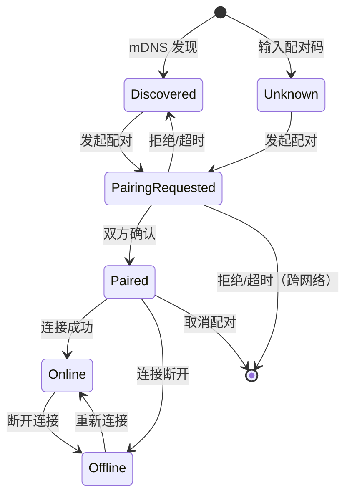
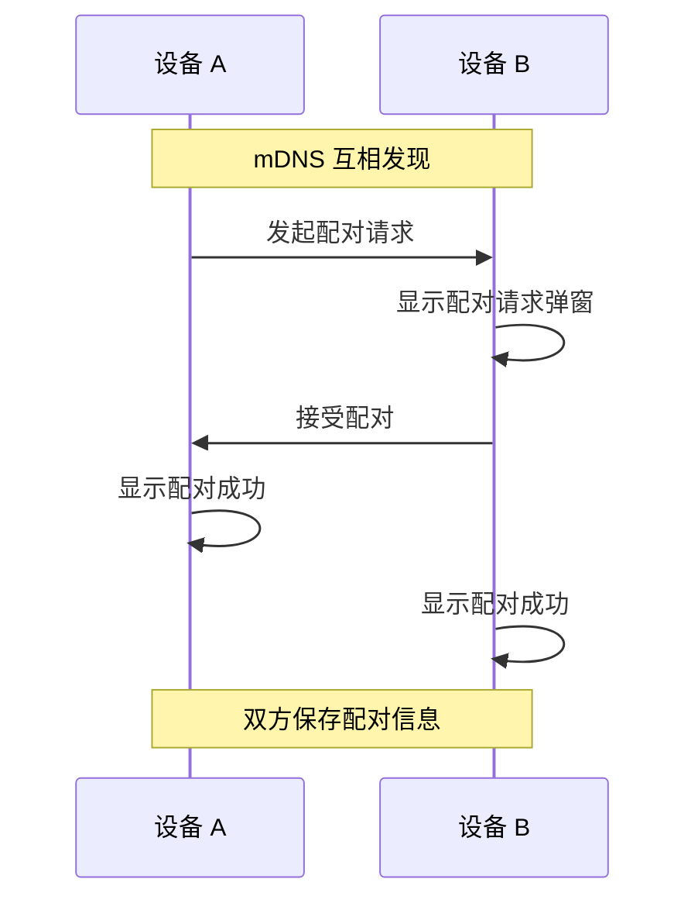
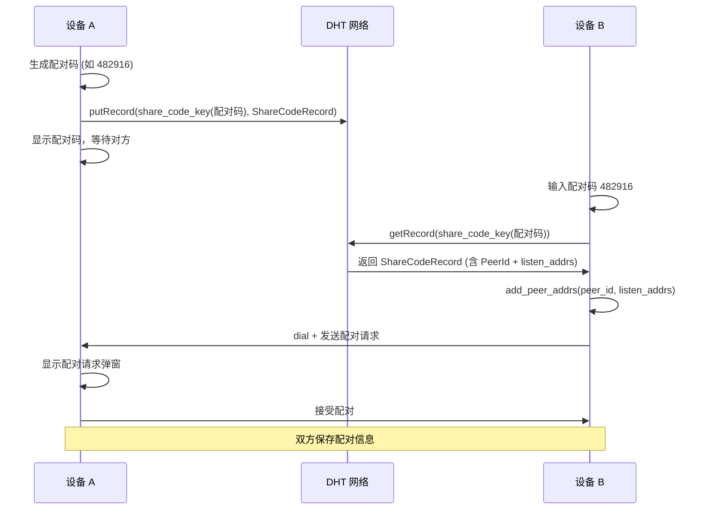
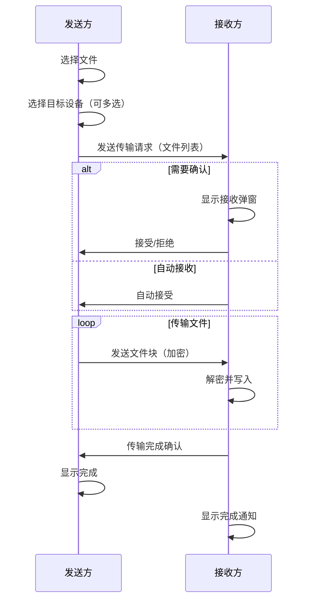
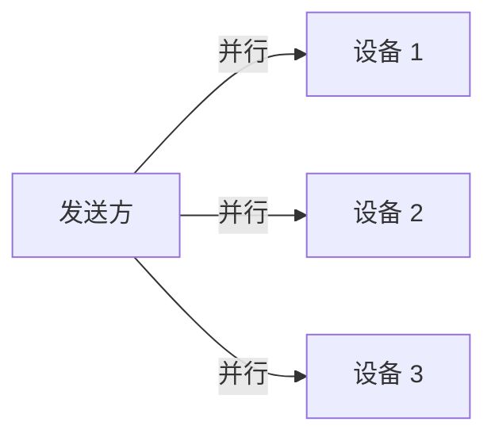

# SwarmDrop 配对与传输设计

## 概述

本文档描述 SwarmDrop 的设备配对和文件传输机制。与原 PRD 的"分享码传输"模式不同，采用**先配对、后传输**的模式，提供更自然的用户体验。

### 设计原则

1. **配对优先**：所有传输都需要先建立设备配对关系
2. **接收方控制**：接收方可决定是否接收文件
3. **多设备支持**：支持同时向多个已配对设备发送
4. **安全隔离**：未配对设备无法发送文件，防止骚扰

### 与原设计对比

| 维度 | 原设计（分享码传输） | 新设计（配对后传输） |
|------|---------------------|---------------------|
| 连接方式 | 每次生成分享码 | 一次配对，永久信任 |
| 附近设备 | 可直接发送 | 需先配对才能发送 |
| 发送流程 | 生成码 → 告知对方 → 等待连接 | 选设备 → 发送 → 对方确认 |
| 多设备发送 | 需多个分享码 | 多选设备，一次发送 |
| 接收确认 | P2 功能 | 核心功能 |

---

## 核心概念

### 设备状态



### 设备分类

| 分类 | 说明 | 可执行操作 |
|------|------|-----------|
| **附近设备（未配对）** | mDNS 发现但未配对 | 仅配对 |
| **已配对 - 在线** | 已配对且连接正常 | 发送文件 |
| **已配对 - 离线** | 已配对但无法连接 | 无（灰显） |

### 发送前提条件

```
可发送 = 已配对 ∧ 在线
```

- ❌ 未配对 → 不可发送（需先配对）
- ❌ 已配对但离线 → 不可发送（等待上线）
- ✅ 已配对且在线 → 可发送

---

## 配对流程

### 配对方式

支持两种配对方式：

1. **局域网配对**：通过 mDNS 发现附近设备，点击配对
2. **跨网络配对**：一方生成配对码，另一方输入配对码

### 局域网配对流程



**用户操作**：
1. 设备 A 在"附近设备"列表看到设备 B
2. 设备 A 点击"配对"按钮
3. 设备 B 收到配对请求弹窗
4. 设备 B 点击"接受"
5. 双方显示配对成功，设备 B 移至"已配对"列表

### 跨网络配对流程



**用户操作**：
1. 设备 A 点击"添加设备" → "生成配对码"
2. 设备 A 将配对码告知设备 B（微信/口头等）
3. 设备 B 点击"添加设备" → "输入配对码"
4. 设备 A 收到配对请求弹窗，点击"接受"
5. 双方显示配对成功

### 配对码设计

```
格式：6 位纯数字 (0-9)
有效期：5 分钟
用途：仅用于首次配对，配对后不再需要
DHT Key：SHA256("/swarmdrop/share-code/" + code)
```

配对码发布到 DHT 的内容：
```rust
struct ShareCodeRecord {
    pub os_info: OsInfo,             // hostname, os, platform, arch
    pub created_at: i64,
    pub expires_at: i64,
    pub listen_addrs: Vec<Multiaddr>, // 发布者的可达地址
}
```

### 配对请求弹窗

```
┌─────────────────────────────────────┐
│  📲 配对请求                    ✕   │
├─────────────────────────────────────┤
│                                     │
│  "MacBook Pro" 请求与您配对         │
│                                     │
│  设备指纹：A1B2:C3D4:E5F6           │
│                                     │
│  ⚠️ 配对后对方可向您发送文件         │
│                                     │
│  [拒绝]              [接受]         │
└─────────────────────────────────────┘
```

---

## 传输流程

### 发送流程



### 接收策略

每个已配对设备可独立设置接收策略：

| 策略 | 说明 | 适用场景 |
|------|------|---------|
| **每次询问** | 每次收到文件都弹窗确认 | 默认设置 |
| **自动接收** | 自动接收，不弹窗 | 自己的设备/高度信任 |
| **自动拒绝** | 自动拒绝，静默丢弃 | 临时屏蔽 |

```typescript
interface ReceiveSettings {
  // 接收策略
  mode: 'always_ask' | 'auto_accept' | 'auto_reject';

  // 自动接收的限制条件（可选）
  autoAcceptRules?: {
    maxFileSize?: number;        // 最大单文件大小 (bytes)
    maxTotalSize?: number;       // 最大总大小 (bytes)
    allowedMimeTypes?: string[]; // 允许的文件类型
  };
}
```

### 接收弹窗

```
┌─────────────────────────────────────┐
│  📥 收到文件                    ✕   │
├─────────────────────────────────────┤
│                                     │
│  来自：MacBook Pro                  │
│                                     │
│  📄 report.pdf           2.1 MB     │
│  🖼 screenshot.png       856 KB     │
│  📁 project/             12.3 MB    │
│                                     │
│  共 3 项，15.2 MB                   │
│                                     │
│  ☐ 始终接收来自此设备的文件         │
│                                     │
│  [拒绝]              [接收]         │
└─────────────────────────────────────┘
```

勾选"始终接收"后，该设备的接收策略自动改为 `auto_accept`。

### 多设备发送

支持同时选择多个在线的已配对设备发送：



**实现策略**：

1. **独立会话**：为每个目标设备创建独立的传输会话
2. **独立进度**：每个设备有独立的传输进度
3. **独立结果**：部分成功/部分失败独立处理

**带宽管理**：

| 模式 | 说明 |
|------|------|
| **并行传输** | 同时向所有设备传输，速度快但带宽占用高 |
| **串行队列** | 依次传输，带宽占用低但总耗时长 |
| **智能调度** | 根据带宽动态调整并发数（P2 实现） |

MVP 阶段采用**并行传输**，后续可增加带宽控制选项。

---

## 界面设计

### 主界面

```
┌─────────────────────────────────────────────────┐
│  SwarmDrop                        [+] ⚙        │
├─────────────────────────────────────────────────┤
│                                                 │
│  ┌─────────────────────────────────────────┐   │
│  │                                         │   │
│  │       拖拽文件到这里，或点击选择         │   │
│  │                                         │   │
│  └─────────────────────────────────────────┘   │
│                                                 │
├─────────────────────────────────────────────────┤
│  已配对设备                                      │
│  ┌──────────┐ ┌──────────┐ ┌──────────┐        │
│  │ 🟢       │ │ 🟢       │ │ ⚫       │        │
│  │ iPhone   │ │ MacBook  │ │ iPad     │        │
│  │ 局域网   │ │ 中继     │ │ 离线     │        │
│  └──────────┘ └──────────┘ └──────────┘        │
│                                                 │
│  附近设备                                        │
│  ┌──────────┐ ┌──────────┐                     │
│  │ 📱 张三  │ │ 💻 李四  │                     │
│  │ [配对]   │ │ [配对]   │                     │
│  └──────────┘ └──────────┘                     │
├─────────────────────────────────────────────────┤
│  🟢 在线 | 我的电脑 (A1B2:C3D4)                 │
└─────────────────────────────────────────────────┘
```

### 发送界面（选择文件后）

```
┌─────────────────────────────────────────────────┐
│  发送文件                              ✕ 取消   │
├─────────────────────────────────────────────────┤
│                                                 │
│  待发送文件：                                    │
│  📄 document.pdf        2.1 MB                  │
│  🖼 photo.jpg           856 KB                  │
│  📁 project/            12.3 MB                 │
│  共 3 项，15.2 MB                               │
│                                                 │
│  ─────────────────────────────────────          │
│                                                 │
│  选择接收设备：                                  │
│  ☑ 🟢 iPhone      局域网                        │
│  ☑ 🟢 MacBook     中继                          │
│  ☐ ⚫ iPad        离线（不可选）                 │
│                                                 │
│                            [发送到 2 台设备]    │
└─────────────────────────────────────────────────┘
```

### 传输进度界面（多设备）

```
┌─────────────────────────────────────────────────┐
│  正在发送                              ✕ 取消   │
├─────────────────────────────────────────────────┤
│                                                 │
│  📱 iPhone                                      │
│  ████████████████████░░░░░░░░░░  67%  2.3 MB/s │
│  📄 photo.jpg 传输中...                         │
│                                                 │
│  💻 MacBook                                     │
│  ████████████░░░░░░░░░░░░░░░░░░  42%  1.1 MB/s │
│  📄 document.pdf 传输中...                      │
│                                                 │
│  总进度：54%  已发送 8.2 MB / 15.2 MB           │
│                                                 │
└─────────────────────────────────────────────────┘
```

### 传输完成界面

```
┌─────────────────────────────────────────────────┐
│  发送完成                                   ✕   │
├─────────────────────────────────────────────────┤
│                                                 │
│  ✅ iPhone         15.2 MB    成功              │
│  ✅ MacBook        15.2 MB    成功              │
│                                                 │
│  共发送 30.4 MB，耗时 12 秒                     │
│                                                 │
│                                      [完成]     │
└─────────────────────────────────────────────────┘
```

### 部分失败界面

```
┌─────────────────────────────────────────────────┐
│  发送结果                                   ✕   │
├─────────────────────────────────────────────────┤
│                                                 │
│  ✅ iPhone         15.2 MB    成功              │
│  ❌ MacBook        ────       连接断开          │
│                    [重试]                       │
│                                                 │
│                                      [完成]     │
└─────────────────────────────────────────────────┘
```

---

## 数据模型

### 已配对设备

```typescript
interface PairedDevice {
  // 设备标识
  id: string;              // 唯一 ID
  peerId: string;          // libp2p PeerId

  // 设备信息
  name: string;            // 设备名称
  deviceType: DeviceType;  // 设备类型
  fingerprint: string;     // 设备指纹（用于验证）

  // 配对信息
  pairedAt: number;        // 配对时间
  pairingMethod: 'lan' | 'code';  // 配对方式

  // 运行时状态（不持久化）
  status: 'online' | 'offline';
  connectionType?: 'lan' | 'relay' | 'holepunch';
  latency?: number;        // 延迟 (ms)

  // 接收设置
  receiveSettings: ReceiveSettings;
}

type DeviceType = 'desktop' | 'laptop' | 'phone' | 'tablet' | 'unknown';
```

### 附近设备（未配对）

```typescript
interface NearbyDevice {
  peerId: string;
  name: string;
  deviceType: DeviceType;
  fingerprint: string;
  discoveredAt: number;

  // mDNS 发现的额外信息
  addresses: string[];
}
```

### 传输会话

```typescript
interface TransferSession {
  id: string;
  direction: 'send' | 'receive';

  // 目标设备（发送时可能多个）
  targets: TransferTarget[];

  // 文件列表
  files: FileInfo[];
  totalSize: number;

  // 状态
  status: TransferStatus;
  startedAt?: number;
  completedAt?: number;

  // 加密密钥（会话结束后销毁）
  encryptionKey: Uint8Array;
}

interface TransferTarget {
  deviceId: string;
  status: 'pending' | 'accepted' | 'rejected' | 'transferring' | 'completed' | 'failed';
  progress: number;        // 0-100
  bytesTransferred: number;
  speed: number;           // bytes/sec
  error?: string;
}

type TransferStatus =
  | 'preparing'
  | 'waiting_acceptance'
  | 'transferring'
  | 'completed'
  | 'partially_completed'
  | 'failed'
  | 'cancelled';
```

---

## Tauri 命令

### 配对相关

```rust
/// 获取附近设备列表（mDNS 发现的未配对设备）
#[tauri::command]
fn get_nearby_devices() -> Vec<NearbyDevice>;

/// 获取已配对设备列表
#[tauri::command]
fn get_paired_devices() -> Vec<PairedDevice>;

/// 生成配对码（跨网络配对）
#[tauri::command]
async fn generate_pairing_code() -> Result<PairingCodeInfo, String>;

/// 使用配对码连接（跨网络配对）
#[tauri::command]
async fn connect_with_pairing_code(code: String) -> Result<PairingRequest, String>;

/// 向附近设备发起配对请求
#[tauri::command]
async fn request_pairing(peer_id: String) -> Result<(), String>;

/// 接受配对请求
#[tauri::command]
fn accept_pairing(request_id: String) -> Result<PairedDevice, String>;

/// 拒绝配对请求
#[tauri::command]
fn reject_pairing(request_id: String) -> Result<(), String>;

/// 取消配对（删除已配对设备）
#[tauri::command]
fn unpair_device(device_id: String) -> Result<(), String>;

/// 更新设备接收设置
#[tauri::command]
fn update_receive_settings(device_id: String, settings: ReceiveSettings) -> Result<(), String>;
```

### 传输相关

```rust
/// 准备发送（选择文件后调用）
#[tauri::command]
async fn prepare_send(file_paths: Vec<String>) -> Result<PreparedTransfer, String>;

/// 开始发送到指定设备
#[tauri::command]
async fn start_send(
    prepared_id: String,
    device_ids: Vec<String>
) -> Result<TransferSession, String>;

/// 取消发送
#[tauri::command]
fn cancel_send(session_id: String) -> Result<(), String>;

/// 接受接收请求
#[tauri::command]
fn accept_receive(request_id: String, save_path: String) -> Result<(), String>;

/// 拒绝接收请求
#[tauri::command]
fn reject_receive(request_id: String) -> Result<(), String>;

/// 取消接收
#[tauri::command]
fn cancel_receive(session_id: String) -> Result<(), String>;
```

### 前端事件

```typescript
// 配对相关事件
listen('pairing-request', (event: PairingRequestEvent) => { ... });
listen('pairing-accepted', (event: PairingAcceptedEvent) => { ... });
listen('pairing-rejected', (event: PairingRejectedEvent) => { ... });

// 设备状态事件
listen('device-online', (event: DeviceOnlineEvent) => { ... });
listen('device-offline', (event: DeviceOfflineEvent) => { ... });
listen('nearby-device-found', (event: NearbyDeviceEvent) => { ... });
listen('nearby-device-lost', (event: NearbyDeviceEvent) => { ... });

// 传输相关事件
listen('receive-request', (event: ReceiveRequestEvent) => { ... });
listen('transfer-progress', (event: TransferProgressEvent) => { ... });
listen('transfer-completed', (event: TransferCompletedEvent) => { ... });
listen('transfer-failed', (event: TransferFailedEvent) => { ... });
```

---

## 安全考虑

### 配对安全

1. **配对码有效期**：5 分钟后自动失效
2. **设备指纹验证**：配对时显示设备指纹，用户可核对
3. **双向确认**：配对需要双方确认，防止单方面添加

### 传输安全

1. **端到端加密**：XChaCha20-Poly1305 加密传输内容
2. **会话密钥**：每次传输生成新的加密密钥
3. **密钥交换**：配对时通过 Noise 协议安全交换密钥

### 隐私保护

1. **可见性控制**：可关闭 mDNS 广播（隐身模式）
2. **接收控制**：可设置自动拒绝特定设备
3. **无历史记录**：默认不记录传输历史（可选开启）

---

## 实现优先级

### P0 - MVP

- [x] 设备身份（密钥对生成、存储）
- [ ] 局域网配对
- [ ] 跨网络配对（配对码）
- [ ] 已配对设备管理
- [ ] 单设备发送
- [ ] 接收弹窗确认
- [ ] 传输进度显示

### P1 - 增强

- [ ] 多设备同时发送
- [ ] 自动接收设置
- [ ] 设备在线状态监测
- [ ] 连接类型显示（局域网/中继）

### P2 - 完善

- [ ] 传输带宽控制
- [ ] 传输历史记录
- [ ] 设备分组管理
- [ ] 隐身模式

---

## 与原 PRD 的功能映射

| 原 PRD 功能 | 新设计对应 | 说明 |
|------------|-----------|------|
| P0 发送文件（分享码） | 配对后发送 | 分享码改为配对码 |
| P0 接收文件（输入分享码） | 接收弹窗 | 无需输入码 |
| P0 局域网发现 | 附近设备列表 | 需配对后才能发送 |
| P1 收藏设备 | 已配对设备 | 核心功能提前 |
| P2 接收确认 | 接收弹窗 | 核心功能提前 |
| P1 批量操作 | 多设备发送 | 自然支持 |
