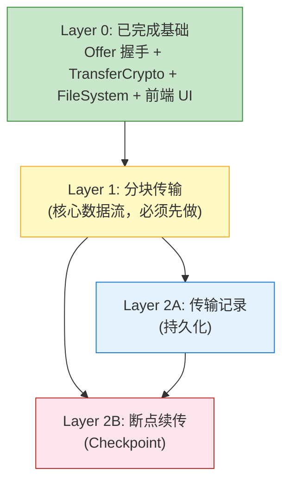
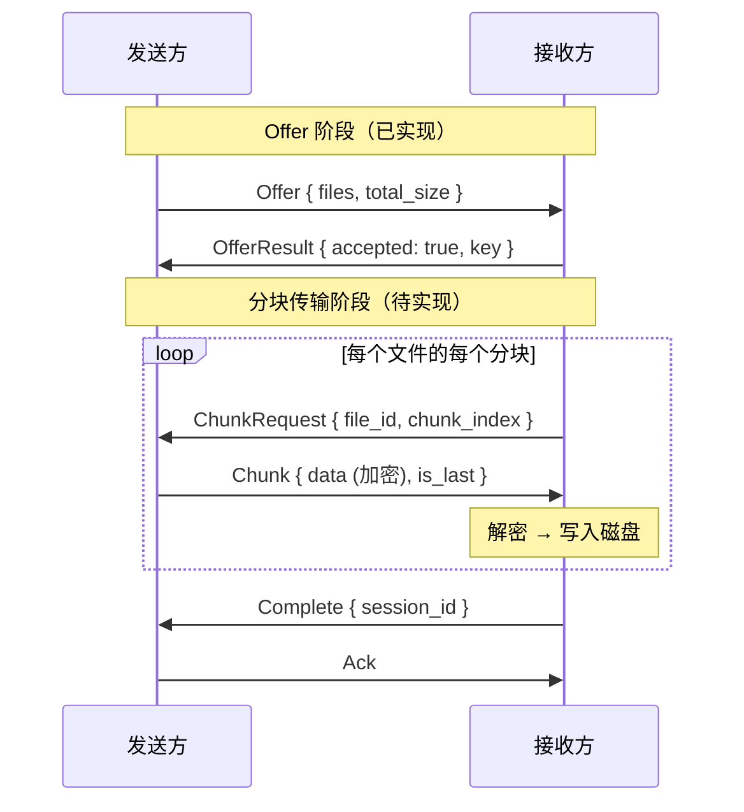
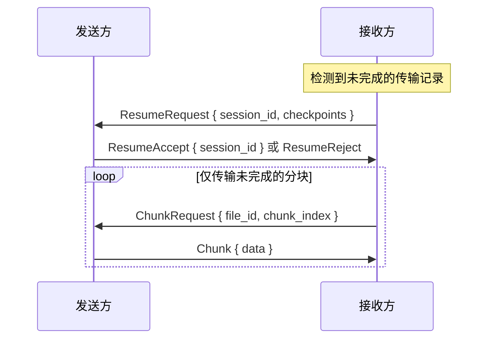

# 传输功能分析：分块传输、传输记录与断点续传

> **日期**: 2026-02-18
>
> **状态**: 讨论记录
>
> **相关文档**:
> - [文件传输设计](./file-transfer-design.md) — Phase 3 整体设计方案
> - [Phase 3 路线图](../roadmap/phase-3-file-transfer.md) — 阶段任务规划

---

## 当前实现状态

| 模块 | 文件 | 状态 |
|------|------|------|
| 加密基础设施 | `transfer/crypto.rs` | 已完成（XChaCha20-Poly1305，确定性 nonce 派生） |
| 文件系统工具 | `transfer/fs.rs` | 已完成（list_files、get_file_meta） |
| Offer 握手 | `transfer/offer.rs` | 已完成（prepare → send_offer → accept/reject + 密钥交换） |
| 协议类型 | `protocol.rs` | 部分完成（仅 Offer/OfferResult，分块变体为注释占位） |
| 前端 UI | `src/routes/_app/send/`、`receive/`、`transfer/` | 已完成（发送页、接收页、传输列表页） |
| 前端 Store | `src/stores/transfer-store.ts` | 已完成（sessions、history、pendingOffers，仅内存） |

**缺失的核心功能：**

| 功能 | 说明 |
|------|------|
| 分块传输 | ChunkRequest/Chunk 协议变体、Sender/Receiver 状态机 |
| 进度事件 | 后端未发射 transfer-progress/complete/failed 事件 |
| Cancel 命令 | 前端有调用但后端 **未注册到 `lib.rs` 的 `generate_handler!`** |
| 传输历史持久化 | 当前仅内存，重启清空 |
| 断点续传 | 完全未实现 |

---

## 三大功能依赖关系



**依赖链总结：**

1. **分块传输** → 无新依赖（直接在 Offer 基础上扩展协议）
2. **传输记录** → 依赖分块传输（需要传输完成/失败事件触发记录写入）
3. **断点续传** → 依赖分块传输 + 传输记录（需要持久化每个分块完成状态，恢复时查询中断点）

**推荐实现顺序：分块传输 → 传输记录 → 断点续传**

---

## Layer 1: 分块传输

### 需要新建的模块

| 文件 | 职责 |
|------|------|
| `transfer/session.rs` | TransferSession 状态机（Offering → Transferring → Complete/Failed） |
| `transfer/sender.rs` | 发送方：响应 ChunkRequest，读文件 → 加密 → 返回 Chunk |
| `transfer/receiver.rs` | 接收方：发 ChunkRequest 拉取分块 → 解密 → 写入磁盘 |

### 需要扩展的协议

```rust
// protocol.rs — 需要取消注释并实现
pub enum TransferRequest {
    Offer { ... },                        // 已实现
    ChunkRequest {                        // 待实现
        session_id: String,
        file_id: u32,
        chunk_index: u32,
    },
    Complete { session_id: String },      // 待实现
    Cancel { session_id: String, reason: String },  // 待实现
}

pub enum TransferResponse {
    OfferResult { ... },                  // 已实现
    Chunk {                               // 待实现
        session_id: String,
        file_id: u32,
        chunk_index: u32,
        data: Vec<u8>,                    // 加密后的分块数据
        is_last: bool,
    },
    Ack { session_id: String },           // 待实现
}
```

### 数据流（接收方拉取模式）



### 核心设计点

- **分块大小**: 256 KB（libp2p CBOR 响应限制 10MB，256KB 保守安全）
- **并发拉取**: 接收方可同时发多个 ChunkRequest，控制并发度（如 4 并发）
- **进度事件**: 后端通过 `app.emit("transfer-progress", ...)` 推送给前端
- **Cancel 机制**: 双向 Cancel，需要在 event_loop 中处理

---

## Layer 2A: 传输记录

### 方案对比

| 方案 | 优点 | 缺点 |
|------|------|------|
| SQLite (rusqlite/sqlx) | 查询灵活，支持复杂过滤和分页 | 新增依赖，需要迁移管理 |
| tauri-plugin-store | 已有依赖，简单键值存储 | 不适合大量结构化数据查询 |
| serde JSON 文件 | 零依赖，简单 | 并发写入不安全，文件可能损坏 |

**推荐**: SQLite — 传输记录天然是结构化数据（按时间/设备/状态查询），且后续断点续传的 Checkpoint 也需要持久化。

### 数据结构

```rust
/// 传输记录（持久化到 SQLite）
pub struct TransferRecord {
    pub id: String,                // session_id
    pub direction: Direction,      // Send / Receive
    pub peer_id: String,
    pub peer_name: String,
    pub files: Vec<FileRecord>,
    pub total_size: u64,
    pub transferred_size: u64,
    pub status: TransferStatus,    // Completed / Failed / Cancelled
    pub started_at: i64,
    pub finished_at: Option<i64>,
    pub error: Option<String>,
}
```

### 写入时机

| 事件 | 操作 |
|------|------|
| Offer 被接受 | 创建记录（status = Transferring） |
| 传输完成 | 更新 status = Completed, finished_at |
| 传输失败 | 更新 status = Failed, error |
| 用户取消 | 更新 status = Cancelled |

---

## Layer 2B: 断点续传

### 前置条件

- 分块传输必须完成（知道哪些块已传输）
- 传输记录必须持久化（重启后能查到中断的会话）

### Checkpoint 结构

```rust
/// 传输检查点（持久化到 SQLite）
pub struct TransferCheckpoint {
    pub session_id: String,
    pub file_checkpoints: Vec<FileCheckpoint>,
}

pub struct FileCheckpoint {
    pub file_id: u32,
    pub total_chunks: u32,
    pub completed_chunks: BitVec,  // 位图标记每个分块是否完成
    pub checksum: String,          // 用于校验文件一致性
}
```

### 恢复流程



### 核心挑战

1. **文件变更检测**: 恢复前需用 BLAKE3 校验和验证源文件未被修改
2. **协议扩展**: 需要新增 `ResumeRequest` / `ResumeAccept` 协议变体
3. **发送方也需缓存**: 发送方必须保留 PreparedTransfer（当前是一次性消费），或重新扫描
4. **超时清理**: 长期未恢复的 Checkpoint 需要定期清理

---

## 复杂度评估

| 功能 | 新增文件 | 修改文件 | 核心技术点 | 复杂度 |
|------|---------|---------|-----------|--------|
| 分块传输 | 3 (session/sender/receiver) | protocol.rs, event_loop.rs, commands/transfer.rs, lib.rs | 状态机、并发分块、加解密管线、进度计算 | **高** |
| 传输记录 | 2 (db.rs, record.rs) | commands/transfer.rs, lib.rs | SQLite 集成、迁移、查询 API | **中** |
| 断点续传 | 1 (checkpoint.rs) | protocol.rs, receiver.rs, sender.rs | BitVec 追踪、会话恢复协商、文件变更检测 | **高** |

---

## 已知问题

1. **cancel 命令未注册**: `cancel_send` / `cancel_receive` 在前端有调用 (`src/commands/transfer.ts`)，但后端未注册到 `lib.rs` 的 `generate_handler!`，需在分块传输阶段修复。
2. **accept_receive 的 save_path 未使用**: 当前 `let _ = save_path;`，需在分块传输实现时启用。
3. **前端事件空转**: `transfer-store.ts` 监听 `transfer-progress`/`transfer-complete`/`transfer-failed` 事件，但后端从未发射这些事件。
