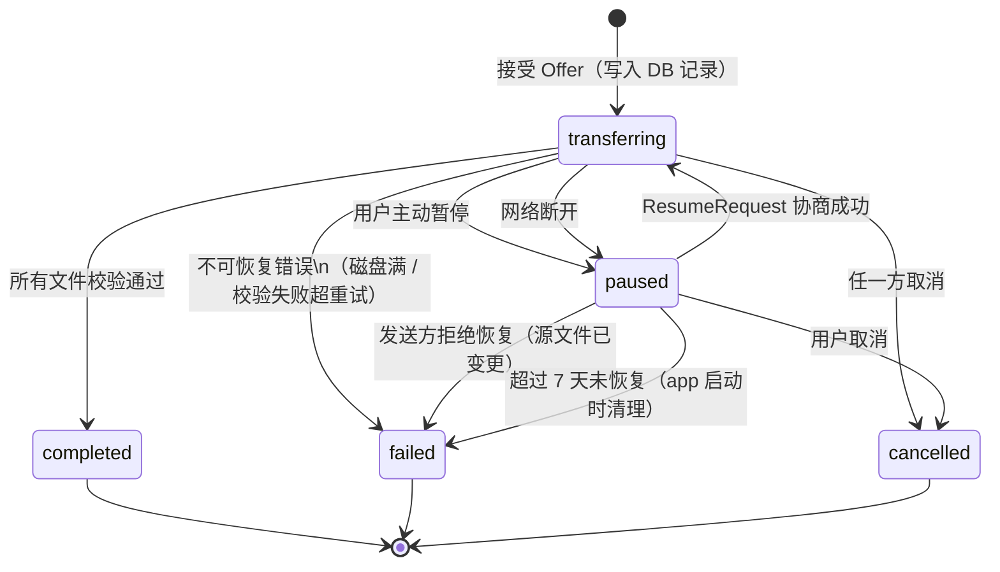
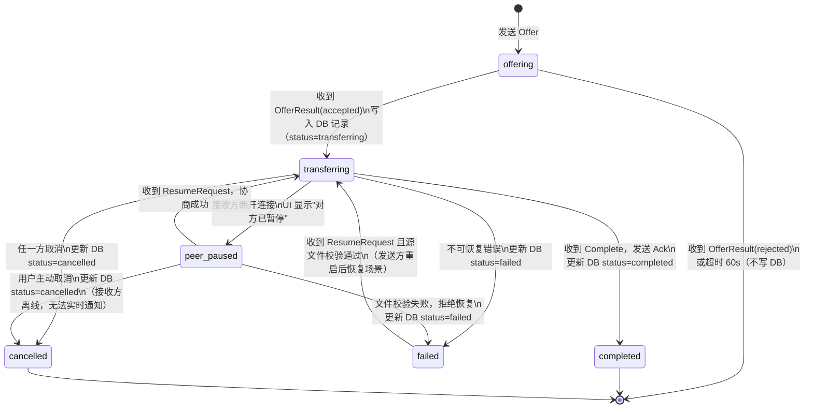
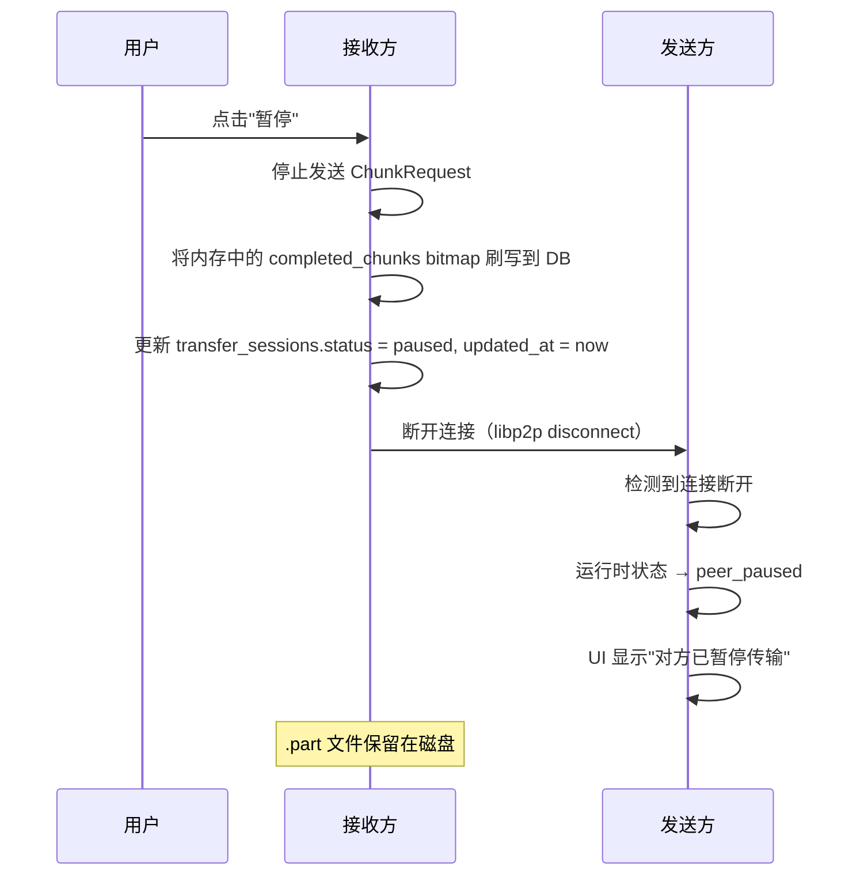
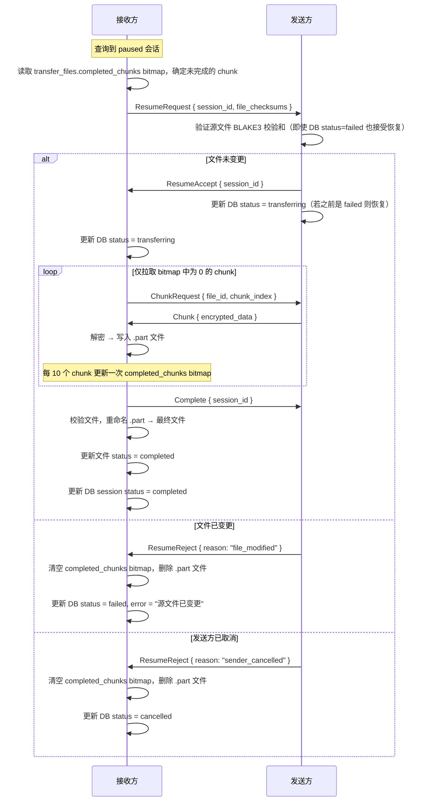
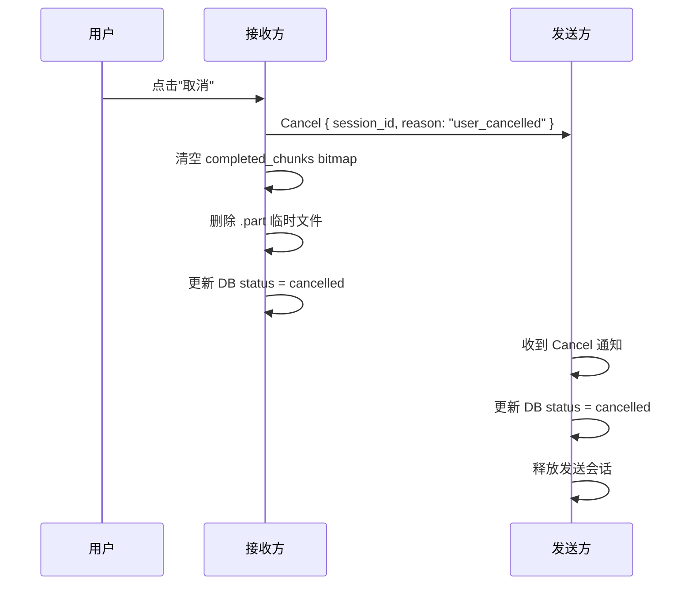
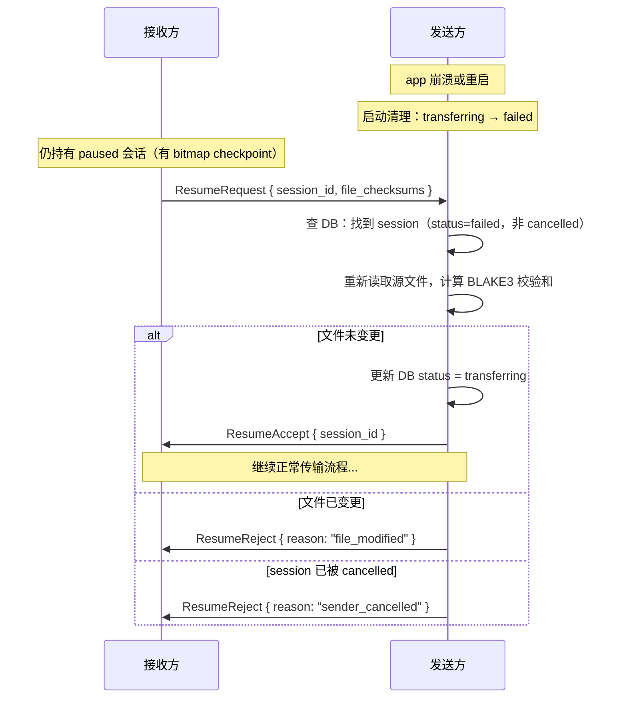

# 传输过程场景设计

> **日期**: 2026-02-27
>
> **状态**: 已确认
>
> **相关文档**:
> - [文件传输设计](./file-transfer-design.md) — Phase 3 整体方案
> - [传输功能分析](./transfer-features-analysis.md) — 分块传输 / 断点续传分析
> - [数据库实体设计](./database-entity-design.md) — SeaORM 实体定义

---

## 场景决策总览

| 场景 | 决策 | 说明 |
|------|------|------|
| 网络断开 | 持久 bitmap checkpoint，随时可恢复 | 保留 `.part` 文件和 `completed_chunks` bitmap，重连后发 ResumeRequest 恢复 |
| 用户暂停 | 硬暂停，与断线同一机制 | 暂停 = 主动触发的中断，走相同 checkpoint 路径 |
| 发送方感知暂停 | 显示运行时 `peer_paused` 状态 | UI 显示"对方已暂停"，不写数据库，app 重启后消失 |
| app 崩溃 | 每 10 个 chunk 批量写 bitmap | 崩溃最多丢失 2.5MB 进度（10 × 256KB） |
| 取消传输 | 不可恢复，立即清理磁盘 | 清空 bitmap 并删除 `.part` 文件，历史标记 `cancelled` |
| 并发传输 | 收发各一个 | 同时允许一个发送会话 + 一个接收会话 |
| 源文件已变更 | 发送方拒绝恢复 | BLAKE3 校验和比对失败 → 拒绝 ResumeRequest，接收方清空 bitmap 并删除 `.part` |
| 暂停会话过期 | 7 天自动清理 | app 启动时检查 `updated_at`，超期则清空 bitmap、删除 `.part`，降级为 `failed` |
| 目标文件名冲突 | 自动重命名 | 保存为 `filename (1).ext`，不打扰用户 |
| 发送方重启后恢复 | 允许从 `failed` 恢复 | 发送方 app 重启后记录降级为 `failed`，但收到 ResumeRequest 时仍可验证文件并恢复 |

---

## 状态机

### 接收方状态机（持久化到数据库）



**状态说明：**

| 状态 | DB 持久化 | `completed_chunks` bitmap | `.part` 文件存在 |
|------|-----------|--------------------------|-----------------|
| `transferring` | ✅ | ✅（实时更新） | ✅ |
| `paused` | ✅ | ✅（保留） | ✅（保留） |
| `completed` | ✅ | 全 1（文件 status=completed） | ❌（已重命名为最终文件） |
| `failed` | ✅ | 已清空 | ❌（已清理） |
| `cancelled` | ✅ | 已清空 | ❌（已清理） |

---

### 发送方状态机（运行时，不持久化状态）



**关键设计点：**

- `peer_paused` 是**纯运行时状态**，不写数据库。DB 中发送方记录在此期间保持 `transferring`
- app 重启后，发送方所有 `transferring` 记录 → **降级为 `failed`**（连接已断，运行时会话无法恢复）
- **`failed` 对发送方不是绝对终态**：收到有效的 ResumeRequest 且源文件校验通过时，可恢复为 `transferring`。这覆盖了发送方 app 重启后接收方请求恢复的场景
- 发送方不持久化 checkpoint，恢复时重新扫描源文件并验证校验和
- `peer_paused` 时用户取消：因接收方已离线，Cancel 消息无法送达。接收方下次 ResumeRequest 时，发送方回复 `ResumeReject { reason: SenderCancelled }`

---

## app 启动时的清理逻辑

```
启动时执行一次：

1. 查询所有 direction=send, status=transferring 的记录
   → 批量更新为 status=failed, error="应用重启，连接已断"
   （注意：发送方 failed 记录不是绝对终态，后续收到 ResumeRequest 时仍可恢复）

2. 查询所有 direction=receive, status=transferring 的记录
   → 检查其 transfer_files 的 completed_chunks bitmap：
     - 若存在任何文件 completed_chunks 非全零 → 有进度可恢复 → 更新为 status=paused
     - 若所有文件 completed_chunks 全零 → 无任何进度 → 更新为 status=failed
     - 若所有文件 status=completed → 传输实际已完成但未更新 session → 更新为 status=completed

3. 查询所有 direction=receive, status=paused 且 updated_at < now-7days 的记录
   → 清空对应 transfer_files 的 completed_chunks bitmap
   → 删除对应 .part 临时文件
   → 更新 status=failed, error="传输已过期（超过 7 天）"
```

---

## 关键场景处理流程

### 场景 1：用户主动暂停（接收方）



### 场景 2：断点续传恢复



### 场景 3：取消传输



### 场景 4：源文件已变更（发送方拒绝恢复）

```
接收方发送 ResumeRequest { session_id, file_checksums: [{ file_id: 0, checksum: "abc..." }] }
发送方逐文件验证：
  重新计算源文件 BLAKE3 → 与 checksum 比对
  任意文件不匹配 → 发送 ResumeReject { reason: "file_modified" }
接收方收到拒绝：
  清空所有 transfer_files 的 completed_chunks bitmap
  删除所有 .part 临时文件
  更新 transfer_sessions.status = failed
  error_message = "源文件已被修改，无法恢复传输"
```

> **v1 简化**: 任意文件校验失败则拒绝整个会话恢复（all-or-nothing）。
> 后续可优化为文件级别的选择性恢复：仅重传变更的文件，保留未变更文件的进度。

### 场景 5：目标文件名冲突

```
接收完成，准备将 .part 文件重命名为最终文件时：
  检查 save_path/filename.ext 是否存在
  若存在：
    尝试 save_path/filename (1).ext
    尝试 save_path/filename (2).ext
    ...直到找到可用名称
  重命名 .part 文件为最终文件名
  DB 中记录实际保存路径（含重命名后的文件名）
```

### 场景 6：发送方重启后，接收方请求恢复



> **关键**：发送方收到 ResumeRequest 时，判断能否恢复的逻辑是：
> 1. DB 中存在该 session_id 的记录
> 2. status **不是** `cancelled`（唯一不可逆终态）
> 3. 源文件校验和匹配
>
> 满足以上三个条件即可恢复，不论当前 status 是 `transferring` 还是 `failed`。

---

## 数据库状态字段修订

基于以上场景，`transfer_sessions.status` 最终枚举值：

| 值 | 适用方 | 含义 |
|----|--------|------|
| `transferring` | 收 / 发 | 传输进行中 |
| `paused` | 仅接收方 | 已暂停（含用户暂停 + 网络断开），可恢复 |
| `completed` | 收 / 发 | 传输完成 |
| `failed` | 收 / 发 | 传输失败（不可恢复） |
| `cancelled` | 收 / 发 | 已取消 |

> **注意**：
> - 发送方没有 `paused` 状态。发送方暂停期间 DB 保持 `transferring`，app 重启后降级为 `failed`。
> - 发送方的 `failed` **不是绝对终态**：收到接收方 ResumeRequest 且源文件校验通过时，可恢复为 `transferring`。
> - 仅 `cancelled` 是真正的终态（双方共识，不可逆）。

---

## checkpoint 写入时机

> **存储方式**: checkpoint 以 bitmap 形式内联在 `transfer_files.completed_chunks`（BLOB 字段）中，
> 每 bit 对应一个 chunk（1 = 已接收），长度 = ceil(total_chunks / 8) 字节。
> 不再使用独立的 checkpoint 表。

| 事件 | 操作 |
|------|------|
| 接受 Offer | 创建 `transfer_files` 行，`total_chunks` = ceil(size / 256KB)，`completed_chunks` 初始化为全零 bitmap |
| 每接收 10 个 chunk | UPDATE `completed_chunks` bitmap + `transferred_bytes` + session `updated_at`（单条 UPDATE，天然原子） |
| 文件接收完成 | 更新文件 `status = completed`（bitmap 自然全 1） |
| 用户暂停 / 网络断开 | 立即将内存中的 bitmap 刷写到 DB |
| 用户取消 | 清空 `completed_chunks` bitmap + 删除 `.part` 文件 |
| 传输完成 | 更新 session `status = completed`（bitmap 保留，可用于传输详情展示） |
| 传输失败 | 清空 `completed_chunks` bitmap + 删除 `.part` 文件 |

---

## 协议扩展需求

在现有 `TransferRequest` / `TransferResponse` 基础上新增两个变体：

```rust
#[derive(Debug, Clone, Serialize, Deserialize)]
pub struct FileChecksum {
    pub file_id: i32,
    /// BLAKE3 校验和（hex，64 字符）
    pub checksum: String,
}
```

```rust
// TransferRequest 新增
ResumeRequest {
    session_id: Uuid,
    /// 每个文件的当前校验和（用于发送方验证源文件）
    file_checksums: Vec<FileChecksum>,
},

// TransferResponse 新增
ResumeResult {
    session_id: Uuid,
    accepted: bool,
    /// 拒绝原因（accepted=false 时有值）
    reason: Option<ResumeRejectReason>,
},
```

```rust
#[derive(Debug, Clone, Serialize, Deserialize)]
#[serde(rename_all = "snake_case")]
pub enum ResumeRejectReason {
    /// 源文件已被修改
    FileModified,
    /// 发送方找不到对应会话（已清理）
    SessionNotFound,
    /// 发送方已主动取消传输
    SenderCancelled,
}
```
