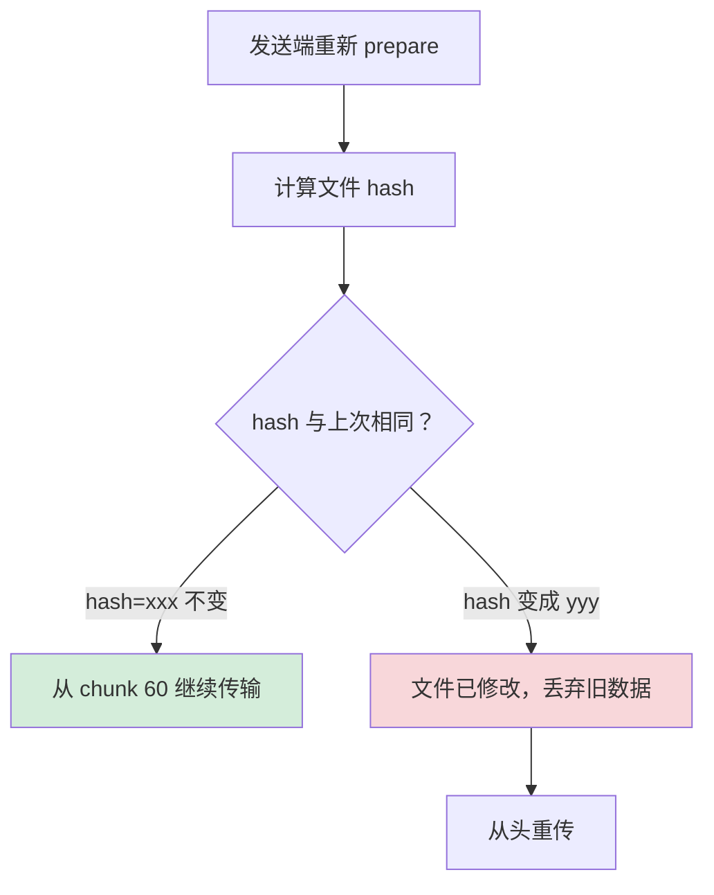
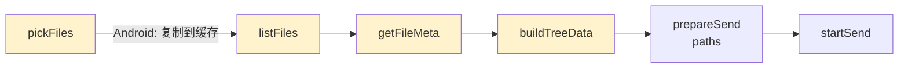
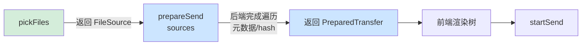
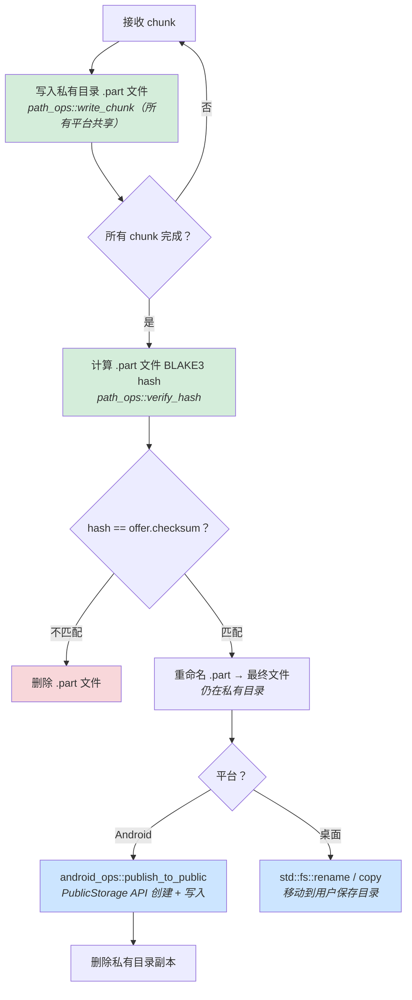
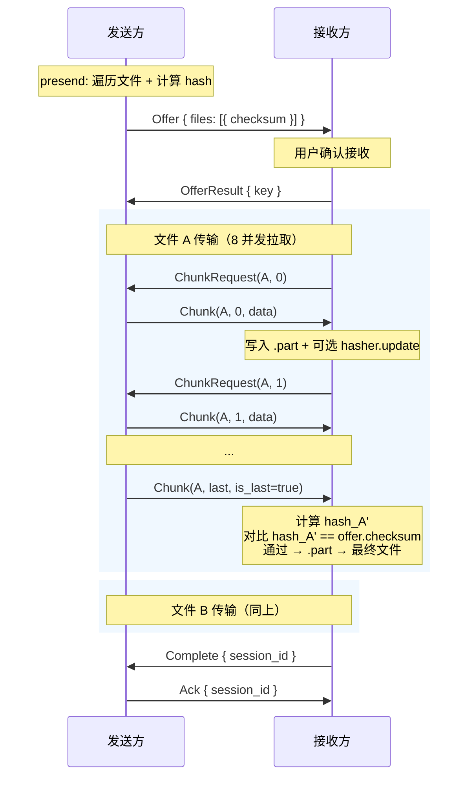
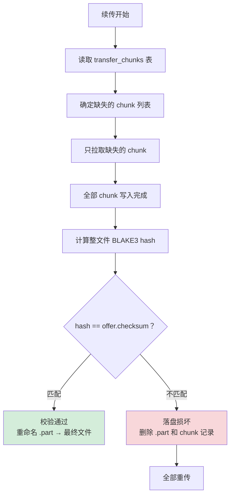
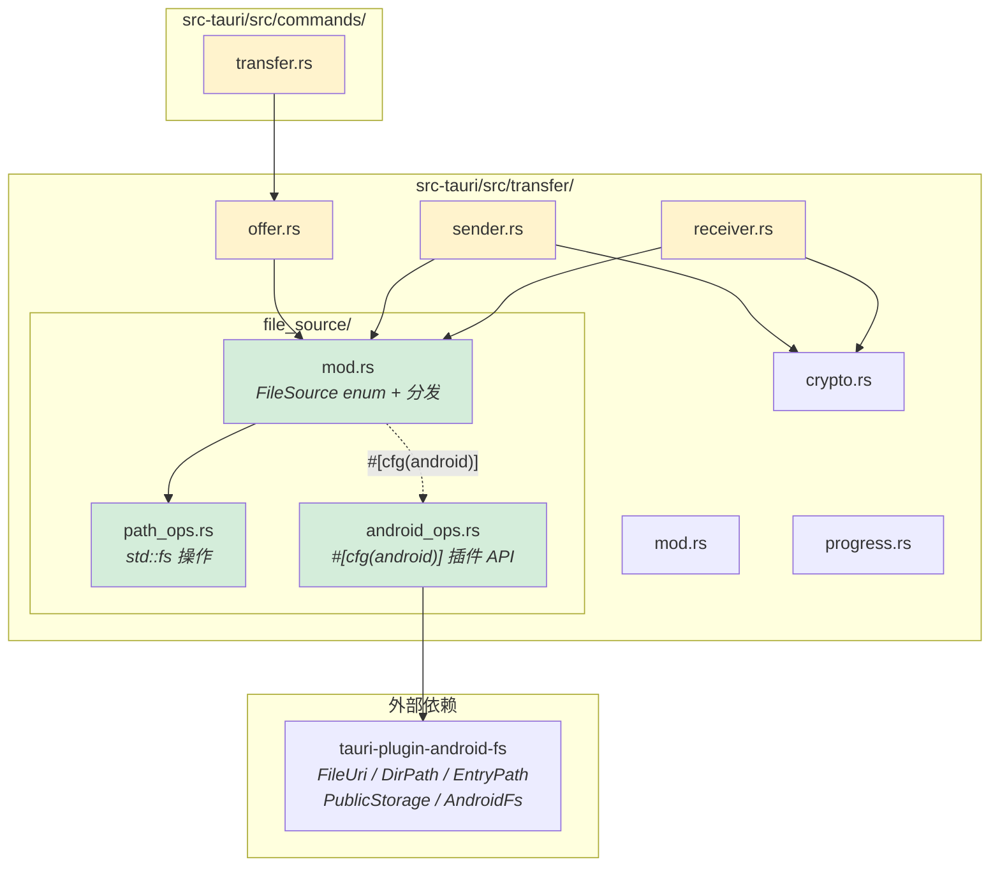
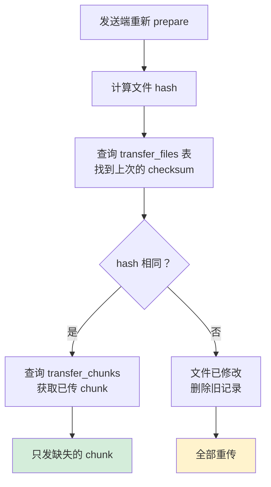

# 传输系统重构设计

## 概述

本文档描述传输系统的重构方案。核心目标：

1. **支持 Android 文件读写**：直接通过 `tauri-plugin-android-fs` 读取 `content://` URI，不再复制到缓存
2. **前端逻辑下沉后端**：文件遍历、元数据收集、相对路径计算全部移到 Rust 后端
3. **保留 presend 阶段的 hash 计算**：hash 作为文件身份标识，断点续传时用于判断文件是否被修改
4. **传输时同步计算 hash 用于双重验证**：接收端边收边算，与 offer 中的 hash 对比
5. **统一文件源抽象**：后端通过 `FileSource` 枚举统一处理标准路径和 Android content:// URI
6. **接收端保存到公共目录**：Android 按 MIME 类型保存到对应公共目录，桌面端支持自定义保存目录

### 设计原则

1. **前端只管 UI**：前端只负责调用选择器和展示，所有 I/O 逻辑在后端
2. **Android 零拷贝**：直接读取 content:// URI 的内容进行传输，不复制到缓存目录
3. **hash 双重角色**：presend 阶段的 hash 用于文件身份标识（断点续传判断文件变更），传输时的流式 hash 用于完整性验证
4. **为断点续传预留扩展点**：数据结构和协议兼容未来 sea-orm 持久化
5. **复用插件类型**：Android 相关类型直接复用 `tauri-plugin-android-fs` 提供的类型（Rust 端 `FileUri`、TS 端 `AndroidFsUri`），不重复定义
6. **条件编译隔离平台代码**：Android 专有代码通过 `#[cfg(target_os = "android")]` 隔离，桌面端编译产物不含 Android 代码

### 相关文档

- [文件传输功能设计](./file-transfer-design.md) — 原始设计（Phase 3）
- [配对与传输设计](./pairing-transfer-design.md) — 产品设计和用户流程

---

## 当前问题

### 1. 不支持 Android content:// URI 直接读取

当前传输层使用 `std::fs::File` 读取文件，无法处理 Android SAF 返回的 `content://` URI。前端被迫在 `pickFiles()` 中将文件复制到应用缓存目录，导致：
- 大文件复制耗时且阻塞 UI
- 磁盘空间双倍占用
- 缓存文件无清理机制

### 2. 前端承担过多后端职责

当前 `file-picker.ts` 和 `useFileSelection` Hook 中包含大量文件系统操作逻辑：

| 逻辑 | 当前位置 | 应在位置 |
|------|---------|---------|
| 目录递归遍历 | 前端 `listFiles()` | 后端 |
| 文件元数据收集 | 前端 `getFileMeta()` | 后端 |
| 相对路径计算 | 前端 `computeRelativePath()` + 后端 `pathdiff` | 仅后端 |
| Android content:// 文件复制 | 前端 `pickFiles()` | 不需要（直接读取） |
| 文件树构建数据 | 前端 `buildTreeData()` | 后端准备数据，前端渲染 |

前后端各算一套相对路径，算法不同，可能导致 UI 展示与实际传输的文件结构不一致。

### 3. Android 缓存文件无管理

`pickFiles()` 在 Android 上用 `Date.now()` 做 batchId 将文件复制到缓存，但：
- 没有清理机制，传输完成/失败后缓存文件成为孤儿
- 复制过程阻塞 UI，大文件时用户体验差
- 本质上浪费了磁盘空间和时间

---

## 核心改动

### 改动一：引入 FileSource 抽象

统一处理两种文件来源，不再复制 Android 文件到缓存。Android 分支直接复用 `tauri-plugin-android-fs` 的 `FileUri` 类型，通过条件编译隔离平台代码：

```rust
use std::path::PathBuf;
#[cfg(target_os = "android")]
use tauri_plugin_android_fs::FileUri;

/// 文件来源：标准路径 或 Android content:// URI
#[derive(Debug, Clone, Serialize, Deserialize)]
#[serde(tag = "type", rename_all = "camelCase")]
pub enum FileSource {
    /// 标准文件系统路径（桌面 + Android 私有目录）
    /// 使用 std::fs 读取
    Path { path: PathBuf },

    /// Android SAF/MediaStore URI
    /// 直接复用 tauri-plugin-android-fs 的 FileUri 类型，无需自定义字段
    /// 桌面端不编译此分支
    #[cfg(target_os = "android")]
    AndroidUri(FileUri),
}
```

> **为什么复用 `FileUri` 而不自定义字段？**
>
> `FileUri` 是 `tauri-plugin-android-fs` 的核心类型，已实现 `Serialize/Deserialize`（camelCase），前端 `AndroidFsUri` 与之序列化格式一致。自定义 `{ uri: String, document_top_tree_uri: Option<String> }` 只是重复了 `FileUri` 的定义，且后续调用插件 API 时还需要手动构造 `FileUri`，白白增加一层转换。

后端所有文件操作根据 `FileSource` 分发，Android 分支的 `match` arm 在桌面端被条件编译排除：

```rust
impl FileSource {
    /// 读取文件分块（256KB）
    pub async fn read_chunk(&self, chunk_index: u32, app: &AppHandle) -> AppResult<Vec<u8>> {
        match self {
            Self::Path { path } => path_ops::read_chunk(path, chunk_index).await,
            #[cfg(target_os = "android")]
            Self::AndroidUri(file_uri) => android_ops::read_chunk(file_uri, chunk_index, app).await,
        }
    }

    /// 流式计算 BLAKE3 hash
    pub async fn compute_hash(&self, app: &AppHandle) -> AppResult<String> {
        match self {
            Self::Path { path } => path_ops::compute_hash(path).await,
            #[cfg(target_os = "android")]
            Self::AndroidUri(file_uri) => android_ops::compute_hash(file_uri, app).await,
        }
    }

    /// 获取文件元数据（名称、大小）
    pub async fn metadata(&self, app: &AppHandle) -> AppResult<FileSourceMetadata> {
        match self {
            Self::Path { path } => path_ops::metadata(path).await,
            #[cfg(target_os = "android")]
            Self::AndroidUri(file_uri) => android_ops::metadata(file_uri, app).await,
        }
    }

    /// 遍历目录内容（仅对目录有效）
    pub async fn enumerate_dir(&self, parent_path: &str, app: &AppHandle) -> AppResult<Vec<EnumeratedFile>> {
        match self {
            Self::Path { path } => path_ops::enumerate_dir(path, parent_path).await,
            #[cfg(target_os = "android")]
            Self::AndroidUri(file_uri) => android_ops::enumerate_dir(file_uri, parent_path, app).await,
        }
    }
}
```

### 改动二：presend hash 保留，作为文件身份标识

presend 阶段**保留** BLAKE3 hash 计算。hash 的核心作用不只是完整性校验，更重要的是**文件身份标识**：



没有 presend hash，接收端无法判断续传的文件和上次是否是同一份内容。

```rust
// 之前
pub struct PreparedFile {
    pub file_id: u32,
    pub name: String,
    pub relative_path: String,
    pub absolute_path: String,    // 只支持标准路径
    pub size: u64,
    pub checksum: String,
}

// 之后
pub struct PreparedFile {
    pub file_id: u32,
    pub name: String,
    pub relative_path: String,
    pub source: FileSource,       // 统一文件来源（替代 absolute_path）
    pub size: u64,
    pub checksum: String,         // 保留 — 文件身份标识 + 完整性校验
}
```

`prepare_send` 完成遍历、元数据收集和 hash 计算：

```rust
pub async fn prepare_send(
    &self,
    sources: Vec<FileSource>,
    app: &AppHandle,
) -> AppResult<PreparedTransfer> {
    let mut files = Vec::new();
    let mut file_id_counter = 0u32;
    let mut total_size = 0u64;

    for source in sources {
        let meta = source.metadata(app).await?;
        if meta.is_dir {
            // 递归遍历目录
            let entries = self.enumerate_dir(&source, &meta.name, app).await?;
            for entry in entries {
                // 计算文件 hash（流式读取，不需要全部加载到内存）
                let checksum = entry.source.compute_hash(app).await?;
                files.push(PreparedFile {
                    file_id: file_id_counter,
                    name: entry.name,
                    relative_path: entry.relative_path,
                    source: entry.source,
                    size: entry.size,
                    checksum,
                });
                total_size += entry.size;
                file_id_counter += 1;
            }
        } else {
            let checksum = source.compute_hash(app).await?;
            files.push(PreparedFile {
                file_id: file_id_counter,
                name: meta.name,
                relative_path: meta.name.clone(),
                source,
                size: meta.size,
                checksum,
            });
            total_size += meta.size;
            file_id_counter += 1;
        }
    }

    let prepared = PreparedTransfer {
        prepared_id: Uuid::new_v4(),
        files,
        total_size,
    };
    self.prepared.insert(prepared.prepared_id, prepared.clone());
    Ok(prepared)
}
```

`compute_hash` 的实现按平台分发到对应的 ops 模块：

```rust
// path_ops.rs — 桌面 + Android 通用
pub async fn compute_hash(path: &Path) -> AppResult<String> {
    let path = path.to_owned();
    tokio::task::spawn_blocking(move || {
        let mut file = std::fs::File::open(&path)?;
        let mut hasher = blake3::Hasher::new();
        hasher.update_reader(&mut file)?;
        Ok(hasher.finalize().to_hex().to_string())
    }).await?
}

// android_ops.rs — 仅 Android 编译
#[cfg(target_os = "android")]
pub async fn compute_hash(file_uri: &FileUri, app: &AppHandle) -> AppResult<String> {
    let api = app.android_fs();
    let file_path = FilePath::from(file_uri.clone());
    // 优先通过 open_file 获取 std::fs::File（插件内部处理 content:// → fd 转换）
    let mut file = api.open_file(&file_path)?;
    let hash = tokio::task::spawn_blocking(move || {
        let mut hasher = blake3::Hasher::new();
        hasher.update_reader(&mut file)?;
        Ok::<_, AppError>(hasher.finalize().to_hex().to_string())
    }).await??;
    Ok(hash)
}
```

### 改动三：接收端传输时边收边算 hash 验证

Offer 中已携带 presend 阶段计算的文件 hash（作为文件身份标识）。接收端在接收分块时同步流式计算 BLAKE3 hash，文件接收完毕后与 Offer 中的 hash 对比验证完整性。

这样 hash 承担双重角色：
1. **文件身份标识**（presend 阶段）：断点续传时判断文件是否被修改
2. **完整性验证**（传输完成时）：接收端计算的 hash 与 Offer 中的 hash 对比

#### 发送端

发送端不需要在传输时计算 hash — presend 阶段已经算过了。发送端只需要按请求读取 chunk、加密、发送：

```rust
pub struct SendSession {
    session_id: Uuid,
    files: Vec<PreparedFile>,  // 包含 checksum（presend 已计算）
    crypto: TransferCrypto,
    // ...
}

impl SendSession {
    pub async fn handle_chunk_request(
        &self,
        file_id: u32,
        chunk_index: u32,
        app: &AppHandle,
    ) -> AppResult<TransferResponse> {
        let file = self.find_file(file_id)?;

        // 通过 FileSource 读取 chunk（支持标准路径和 Android URI）
        let plaintext = file.source.read_chunk(chunk_index, app).await?;

        let data = self.crypto.encrypt_chunk(
            &self.session_id, file_id, chunk_index, &plaintext
        )?;

        let total_chunks = calc_total_chunks(file.size);
        let is_last = chunk_index + 1 >= total_chunks;

        Ok(TransferResponse::Chunk {
            session_id: self.session_id,
            file_id,
            chunk_index,
            data,
            is_last,
        })
    }
}
```

#### 接收端

接收端在写入 chunk 时同步流式计算 hash，文件接收完毕后与 Offer 中的 checksum 对比：

```rust
impl ReceiveSession {
    async fn receive_file(&self, file: &FileInfo, app: &AppHandle) -> AppResult<()> {
        // 方式 A（简单，当前实现）：所有 chunk 写入 .part 后，重新读取计算 hash
        let all_chunks_done = self.pull_file_chunks(file).await?;
        let actual_hash = compute_hash_from_file(&part_path)?;
        if actual_hash != file.checksum {
            // hash 不匹配，文件损坏
            std::fs::remove_file(&part_path)?;
            return Err(TransferError::ChecksumMismatch { file_id: file.file_id });
        }
        // 重命名 .part → 最终文件
        std::fs::rename(&part_path, &final_path)?;
        Ok(())

        // 方式 B（优化，减少一次读取）：边收边算
        // 由于 8 并发拉取 chunk 可能乱序，需要 FileChunkHasher 按序喂入
        // 见下方 FileChunkHasher
    }
}
```

**可选优化：边收边算 hash（FileChunkHasher）**

当前实现是写完 `.part` 后再完整读一遍文件算 hash。如果要避免多读一遍，可以在写入时同步计算：

```rust
/// 处理并发 chunk 的有序 hash 计算
struct FileChunkHasher {
    hasher: blake3::Hasher,
    /// 下一个需要喂入 hasher 的 chunk index
    next_index: u32,
    /// 乱序到达的 chunk 缓存
    pending: BTreeMap<u32, Vec<u8>>,
    total_chunks: u32,
}

impl FileChunkHasher {
    fn feed(&mut self, chunk_index: u32, data: &[u8]) {
        if chunk_index == self.next_index {
            self.hasher.update(data);
            self.next_index += 1;
            // 推进缓存中连续的后续 chunk
            while let Some(buffered) = self.pending.remove(&self.next_index) {
                self.hasher.update(&buffered);
                self.next_index += 1;
            }
        } else {
            self.pending.insert(chunk_index, data.to_vec());
        }
    }

    fn finalize(self) -> String {
        self.hasher.finalize().to_hex().to_string()
    }
}
```

> **内存开销**：8 并发窗口最多缓存 8 个 chunk（8 * 256KB = 2MB），完全可接受。但极端情况下（chunk 0 因网络问题重传多次），pending 缓存可能暂时超过 8 个。实现时应加上限检查（如 pending 超过 16 个 chunk 时暂停新的 chunk 请求），防止内存意外增长。
>
> 此优化为可选项，初始实现可以先用方式 A（写完后重新读取计算 hash），后续按需切换到方式 B。

### 改动四：协议变更

#### Offer 消息保留 checksum

```rust
pub struct FileInfo {
    pub file_id: u32,
    pub name: String,
    pub relative_path: String,
    pub size: u64,
    pub checksum: String,  // 保留 — presend 阶段计算的 BLAKE3 hash
}
```

checksum 在协议中承担双重角色：
1. **当前**：接收端在文件接收完毕后用于完整性验证
2. **未来断点续传**：接收端用于判断文件是否被修改，决定续传还是重传

#### 协议结构不变，仅 FileSource 替代路径

与当前协议相比，主要变化在后端内部：`PreparedFile` 用 `FileSource` 替代 `absolute_path`。协议层面的 `FileInfo`（Offer 中传输给对端的结构）保持不变。

### 改动五：前端简化

重构后前端的职责大幅缩减：

**之前**：



**之后**：



#### 前端 pickFiles 改造

复用 `tauri-plugin-android-fs-api` 的 `AndroidFsUri` 类型，不重复定义字段：

```typescript
import type { AndroidFsUri } from 'tauri-plugin-android-fs-api';
import { AndroidFs, isAndroid } from 'tauri-plugin-android-fs-api';
import { open } from '@tauri-apps/plugin-dialog';

// FileSource TS 类型 — Android 分支直接展开 AndroidFsUri
type FileSource =
    | { type: 'path'; path: string }
    | ({ type: 'androidUri' } & AndroidFsUri);  // 复用插件类型，展开为 { uri, documentTopTreeUri }

// 之前：返回 string[]（文件路径）
export async function pickFiles(multiple = true): Promise<string[]>

// 之后：返回 FileSource[]（文件来源描述）
export async function pickFiles(multiple = true): Promise<FileSource[]> {
    if (isAndroid()) {
        const uris = await AndroidFs.showOpenFilePicker({ multiple });
        // 直接展开 AndroidFsUri，与 Rust 端 FileUri 的 serde 格式一致
        return uris.map(uri => ({ type: 'androidUri' as const, ...uri }));
    } else {
        const paths = await open({ multiple });
        return paths.map(p => ({ type: 'path' as const, path: p }));
    }
}
```

> 前端 `AndroidFsUri` 的序列化格式 `{ uri, documentTopTreeUri }` 与 Rust 端 `FileUri` 的 `#[serde(rename_all = "camelCase")]` 格式一致，通过 Tauri IPC 传递时自动反序列化为 `FileUri`，无需额外转换。

#### 前端 prepareSend 改造

```typescript
// 之前
prepareSend(filePaths: string[]): Promise<PreparedTransfer>

// 之后
prepareSend(sources: FileSource[]): Promise<PreparedTransfer>
// 后端完成：遍历、元数据、相对路径计算
// 返回完整文件列表，前端直接用于渲染树
```

#### 移除前端文件操作逻辑

以下前端代码可以移除或大幅简化：

- `file-picker.ts` 中的 `listFiles()`（移到后端）
- `file-picker.ts` 中的 `getFileMeta()`（移到后端）
- `file-picker.ts` 中 Android 文件复制逻辑（不再需要）
- `-use-file-selection.ts` 中的 `addPaths()` 复杂逻辑（简化为调用后端）
- `-file-tree.ts` 中的 `computeRelativePath()`（后端统一计算）

---

## 文件读取实现

### 标准路径读取（桌面 + Android 私有目录）

与当前实现相同，使用 `std::fs`：

```rust
impl FileSource {
    async fn read_chunk_path(path: &Path, chunk_index: u32) -> AppResult<Vec<u8>> {
        let path = path.to_owned();
        tokio::task::spawn_blocking(move || {
            let mut file = std::fs::File::open(&path)?;
            file.seek(SeekFrom::Start(chunk_index as u64 * CHUNK_SIZE as u64))?;
            let mut buf = vec![0u8; CHUNK_SIZE];
            let n = file.read(&mut buf)?;
            buf.truncate(n);
            Ok(buf)
        }).await?
    }
}
```

### Android content:// URI 读取

通过 `tauri-plugin-android-fs` 的 Rust API 读取。直接使用插件的 `FileUri` 类型和 `AndroidFs` trait，无需手动构造：

```rust
// android_ops.rs — #[cfg(target_os = "android")]
use tauri_plugin_android_fs::{AndroidFs, AndroidFsExt, FileUri};
use tauri_plugin_fs::FilePath;

pub async fn read_chunk(
    file_uri: &FileUri,
    chunk_index: u32,
    app: &AppHandle,
) -> AppResult<Vec<u8>> {
    let api = app.android_fs();
    let file_path = FilePath::from(file_uri.clone());

    // 推荐方案：通过 open_file 获取 std::fs::File，然后 seek + read
    // open_file 内部处理 content:// → FileDescriptor 转换
    let mut file = api.open_file(&file_path)?;
    let offset = chunk_index as u64 * CHUNK_SIZE as u64;
    tokio::task::spawn_blocking(move || {
        file.seek(SeekFrom::Start(offset))?;
        let mut buf = vec![0u8; CHUNK_SIZE];
        let n = file.read(&mut buf)?;
        buf.truncate(n);
        Ok(buf)
    }).await?
}
```

**关于 `open_file` 的能力**：

`tauri-plugin-android-fs` 的 `open_file(&FilePath)` 返回 `std::fs::File`，内部通过 Android 的 `openFileDescriptor` 将 content:// URI 转为文件描述符。返回的 `std::fs::File` 支持 `Seek`，因此可以直接用于分块读取，不需要 `get_fs_path` 转路径。

> **⚠️ 注意**：避免使用 `read(&FilePath)` 读取大文件——它会将整个文件读入内存。应始终使用 `open_file` 获取 `std::fs::File` 后流式操作。

---

## Android 目录遍历

对于 Android content:// 目录 URI，后端通过 android-fs 插件递归遍历。直接使用插件的 `read_dir` 返回类型 `Vec<(String, EntryPath)>` 和 `FileUri` 类型：

```rust
// android_ops.rs — #[cfg(target_os = "android")]
use tauri_plugin_android_fs::{AndroidFs, AndroidFsExt, DirPath, EntryPath, FileUri};

pub async fn enumerate_dir(
    file_uri: &FileUri,
    parent_relative_path: &str,
    app: &AppHandle,
) -> AppResult<Vec<EnumeratedFile>> {
    let api = app.android_fs();
    // read_dir 直接接受 DirPath，返回 Vec<(String, EntryPath)> — 复用插件类型
    let dir_path = DirPath::from(file_uri.clone());
    let entries = api.read_dir(&dir_path)?;

    let mut result = Vec::new();
    for (name, entry) in entries {
        match entry {
            EntryPath::File(file_path) => {
                let relative_path = format!("{}/{}", parent_relative_path, name);
                let child_uri = FileUri::from(file_path);
                let meta = api.metadata(&child_uri)?;
                result.push(EnumeratedFile {
                    name,
                    relative_path,
                    source: FileSource::AndroidUri(child_uri),
                    size: meta.byte_length(),
                });
            }
            EntryPath::Dir(child_dir_path) => {
                let child_relative = format!("{}/{}", parent_relative_path, name);
                let child_uri = FileUri::from(child_dir_path);
                let children = enumerate_dir(&child_uri, &child_relative, app)?;
                result.extend(children);
            }
        }
    }
    Ok(result)
}
```

> 注意：上述代码中 `DirPath::from(FileUri)` 和 `FileUri::from(FilePath)` 的转换是否由插件直接支持需要验证。如果不支持，可能需要通过 `convert_*` 辅助函数进行序列化/反序列化转换。

---

## 接收端保存策略

### 设计决策

| 决策项 | 选择 |
|--------|------|
| 保存位置 | 公共目录（所有平台） |
| 目录分发规则 | 单文件按 MIME 类型分发；文件夹统一放 Downloads |
| 写入方式 | 始终先写私有目录（.part），验证后复制/移动到最终目录 |
| 复制时机 | 单文件验证通过后立即复制（逐文件，不等所有文件完成） |
| 最低 Android 版本 | Android 11（API 30） |
| 桌面端保存目录 | 设置中配置默认目录，接收确认时可修改本次位置 |

### 为什么分两阶段写入（Android Scoped Storage）

Android 11+（API 30）引入了 **Scoped Storage** 限制：应用无法通过 `std::fs` 直接写入公共目录（如 `Downloads/`、`Pictures/`）。写入公共目录必须通过 MediaStore / SAF API（即 `tauri-plugin-android-fs` 的 `PublicStorage` trait）。

这意味着：

- **桌面端**：`std::fs::File::create("/home/user/Downloads/file.txt")` ✅ 正常工作
- **Android**：`std::fs::File::create("/storage/emulated/0/Download/file.txt")` ❌ 权限被拒

但应用**私有目录**（`/data/user/0/{package}/cache/`）不受此限制，可以用 `std::fs` 自由读写。

因此采用两阶段策略：

```
阶段 1：传输写入（私有目录，std::fs）
  → 所有平台统一用 path_ops，逻辑完全一致
  → Android 通过 PrivateStorage::resolve_path(PrivateDir::Cache) 获取私有 cache 目录路径

阶段 2：发布到公共目录
  → 桌面端：std::fs::rename / copy（path_ops）
  → Android：PublicStorage API 创建文件 + 写入（android_ops）
  → 发布完成后删除私有副本
```

**关键优势**：传输写入阶段（并发 chunk 写入 + .part 文件管理）的代码在所有平台完全共享，不需要 Android 特殊逻辑。只有最后的"发布"一步需要平台分发。

**cache 目录空间管理**：`PrivateDir::Cache` 对应的目录由 Android 系统自动管理。当设备存储不足时，系统会自动清理 cache 目录中的文件。传输完成后我们主动删除私有副本，不依赖系统清理。

### 目录分发规则

**单文件**按 MIME 类型分发到不同公共目录：

| MIME 类型 | Android 保存目录 | 桌面端保存目录 |
|-----------|-----------------|---------------|
| image/* | Pictures/SwarmDrop/ | {保存目录}/ |
| video/* | Movies/SwarmDrop/ | {保存目录}/ |
| audio/* | Music/SwarmDrop/ | {保存目录}/ |
| 其他 | Downloads/SwarmDrop/ | {保存目录}/ |

**文件夹**接收时，保持原始目录结构，统一保存：

```
发送方选择文件夹 "Photos/" 包含：
  Photos/trip.jpg
  Photos/notes.txt
  Photos/sub/clip.mp4

Android 接收端保存结构：
  Downloads/SwarmDrop/Photos/trip.jpg
  Downloads/SwarmDrop/Photos/notes.txt
  Downloads/SwarmDrop/Photos/sub/clip.mp4

桌面端保存结构：
  {保存目录}/Photos/trip.jpg
  {保存目录}/Photos/notes.txt
  {保存目录}/Photos/sub/clip.mp4
```

### 写入流程



流程说明：

1. **chunk 写入**（绿色）：所有平台统一写入应用私有目录的 `.part` 文件，使用 `path_ops::write_chunk`。Android 的私有 cache 目录路径通过 `PrivateStorage::resolve_path(PrivateDir::Cache)` 获取，之后就是标准的 `std::fs` 操作，和桌面端代码完全一致
2. **hash 验证**（绿色）：使用 `path_ops::verify_hash` 计算 `.part` 文件的 BLAKE3 hash，与 Offer checksum 对比。同样是平台无关的 `std::fs` 操作
3. **重命名**：`.part` → 最终文件名（仍在私有目录）
4. **发布到最终位置**（蓝色，平台分发）：
   - Android：`android_ops::publish_to_public` — 通过 `PublicStorage` API 创建公共目录文件，写入内容，然后删除私有副本
   - 桌面：`std::fs::rename`（同文件系统）或 `copy + delete`（跨文件系统）

### Android 实现

#### 获取私有 cache 目录

接收端启动时通过 `PrivateStorage` 获取 cache 目录路径，后续所有 `.part` 文件写入此目录：

```rust
// android_ops.rs
use tauri_plugin_android_fs::{AndroidFsExt, PrivateDir};

/// 获取 Android 应用私有 cache 目录路径
/// 返回的是标准 PathBuf，可以直接用 std::fs 操作
pub async fn resolve_cache_dir(app: &tauri::AppHandle) -> AppResult<PathBuf> {
    let path = app
        .android_fs_async()
        .private_storage()
        .resolve_path(PrivateDir::Cache)
        .await
        .map_err(|e| AppError::Transfer(format!("获取 cache 目录失败: {e}")))?;
    Ok(path)
}
```

> 获取到 `PathBuf` 后，chunk 写入流程和桌面端完全一致——使用 `path_ops::write_chunk`。

#### 发布到公共目录

单个文件校验通过后，通过 `PublicStorage` API 发布到公共目录：

```rust
// android_ops.rs
use tauri_plugin_android_fs::{
    AndroidFsExt, PublicDir,
    PublicImageDir, PublicVideoDir, PublicAudioDir, PublicGeneralPurposeDir,
};

/// 将已验证的文件发布到 Android 公共目录
///
/// 根据 MIME 类型分发到对应目录（单文件模式）或统一放 Downloads（文件夹模式）。
/// 发布成功后删除私有目录中的源文件。
pub async fn publish_to_public(
    verified_path: &Path,
    file_name: &str,
    relative_path: &str,
    is_folder_transfer: bool,
    app: &tauri::AppHandle,
) -> AppResult<()> {
    let public_storage = app.android_fs_async().public_storage();

    let save_relative = format!("SwarmDrop/{}", if is_folder_transfer {
        relative_path  // 保持目录结构
    } else {
        file_name
    });

    // 确定目标公共目录
    let public_dir: PublicDir = if is_folder_transfer {
        PublicGeneralPurposeDir::Download.into()
    } else {
        resolve_public_dir_by_mime(file_name)
    };

    // 读取已验证文件内容，写入公共目录
    let contents = tokio::fs::read(verified_path).await?;
    public_storage
        .write_new(None, public_dir, &save_relative, None, &contents)
        .await
        .map_err(|e| AppError::Transfer(format!("写入公共目录失败: {e}")))?;

    // 发布成功，删除私有副本
    tokio::fs::remove_file(verified_path).await?;
    Ok(())
}

/// 根据文件名的 MIME 类型确定公共目录
fn resolve_public_dir_by_mime(file_name: &str) -> PublicDir {
    // 根据扩展名推断 MIME 类型
    let ext = std::path::Path::new(file_name)
        .extension()
        .and_then(|e| e.to_str())
        .unwrap_or("");

    match ext.to_lowercase().as_str() {
        // 图片
        "jpg" | "jpeg" | "png" | "gif" | "webp" | "bmp" | "svg" | "heic" | "heif" => {
            PublicImageDir::Pictures.into()
        }
        // 视频
        "mp4" | "mkv" | "avi" | "mov" | "webm" | "flv" | "wmv" => {
            PublicVideoDir::Movies.into()
        }
        // 音频
        "mp3" | "flac" | "wav" | "aac" | "ogg" | "wma" | "m4a" => {
            PublicAudioDir::Music.into()
        }
        // 其他 → Downloads
        _ => PublicGeneralPurposeDir::Download.into(),
    }
}
```

> **优化空间**：`publish_to_public` 当前使用 `tokio::fs::read` 全量读入内存再写入。大文件时内存占用高。后续可以改为流式复制：`open_file_readable` + `PublicStorage::create_new_file` + 分块写入，但初始实现足够使用。
>
> **⚠️ 原子性**：上述流程中，如果写入公共目录的过程中 app 被杀（如用户强制关闭），公共目录会残留不完整文件。建议使用 MediaStore 的 `IS_PENDING` 机制：创建文件时设置 `IS_PENDING = 1`，写入完成后更新为 `IS_PENDING = 0`。这样系统不会索引到写入中的不完整文件，即使中断也不会污染用户的媒体库。

### 桌面端实现

桌面端使用标准文件系统操作，保存目录可配置：

```rust
impl ReceiveSession {
    /// 单个文件接收完成并验证通过后，移动到保存目录
    async fn finalize_file_desktop(
        &self,
        file: &FileInfo,
        verified_path: &Path,
    ) -> AppResult<()> {
        let save_dir = self.save_dir(); // 用户选择或设置中的默认目录
        let target_path = save_dir.join(&file.relative_path);

        // 确保父目录存在
        if let Some(parent) = target_path.parent() {
            std::fs::create_dir_all(parent)?;
        }

        // 直接移动（同一文件系统上是 rename，跨文件系统则 copy + delete）
        if std::fs::rename(verified_path, &target_path).is_err() {
            std::fs::copy(verified_path, &target_path)?;
            std::fs::remove_file(verified_path)?;
        }

        Ok(())
    }
}
```

### 保存目录配置

| 平台 | 默认保存目录 | 可修改 |
|------|-------------|--------|
| Windows | `%USERPROFILE%\Downloads\SwarmDrop\` | 设置中配置 + 接收时可改 |
| macOS | `~/Downloads/SwarmDrop/` | 设置中配置 + 接收时可改 |
| Linux | `~/Downloads/SwarmDrop/` | 设置中配置 + 接收时可改 |
| Android | 公共目录（按类型分发） | 固定，不可修改 |

桌面端接收确认对话框中提供「保存到...」按钮，允许用户修改本次接收的保存位置。Android 端不提供选择，固定按 MIME 类型分发到对应公共目录。

### 文件名冲突处理

接收端目标路径已存在同名文件时，采用**自动重命名**策略：

| 场景 | 处理方式 |
| ---- | ------- |
| 目标文件已存在 | 自动追加序号：`file.txt` → `file (1).txt` → `file (2).txt` |
| Android MediaStore 同名 | MediaStore 本身会自动追加序号，无需额外处理 |
| 桌面端同名 | 在写入前检查目标路径，存在则追加序号 |

不提供覆盖或询问选项——自动重命名最安全，避免用户误操作丢失文件。

---

## 协议完整定义

协议层面的消息结构与当前实现基本一致，保留 checksum：

```rust
#[derive(Debug, Clone, Serialize, Deserialize)]
#[serde(rename_all = "camelCase", tag = "action")]
pub enum TransferRequest {
    /// 发送方 → 接收方：提议传输
    Offer {
        session_id: Uuid,
        files: Vec<FileInfo>,
        total_size: u64,
    },

    /// 接收方 → 发送方：请求一个分块
    ChunkRequest {
        session_id: Uuid,
        file_id: u32,
        chunk_index: u32,
    },

    /// 接收方 → 发送方：所有文件传输完成
    Complete {
        session_id: Uuid,
    },

    /// 任一方 → 对方：取消传输
    Cancel {
        session_id: Uuid,
        reason: String,
    },
}

#[derive(Debug, Clone, Serialize, Deserialize)]
#[serde(rename_all = "camelCase", tag = "action")]
pub enum TransferResponse {
    /// 接收方对 Offer 的回复
    /// 注：key 使用固定 [u8; 32] 与当前 X25519 密钥交换绑定。
    /// 如果将来更换加密算法（密钥长度变化），需要修改协议。
    /// 当前阶段 KISS 优先，暂不引入额外抽象。
    OfferResult {
        accepted: bool,
        key: Option<[u8; 32]>,
        reason: Option<String>,
    },

    /// 发送方对 ChunkRequest 的回复
    Chunk {
        session_id: Uuid,
        file_id: u32,
        chunk_index: u32,
        #[serde(with = "serde_bytes")]
        data: Vec<u8>,
        is_last: bool,
    },

    /// 发送方对 Complete 的确认
    Ack {
        session_id: Uuid,
    },
}

#[derive(Debug, Clone, Serialize, Deserialize)]
#[serde(rename_all = "camelCase")]
pub struct FileInfo {
    pub file_id: u32,
    pub name: String,
    pub relative_path: String,
    pub size: u64,
    pub checksum: String,  // BLAKE3 hex — 文件身份标识 + 完整性校验
}
```

---

## 完整传输时序



---

## 文件校验流程

### 首次传输校验

接收端在文件所有 chunk 接收完毕后进行校验：

1. 计算 `.part` 文件的 BLAKE3 hash（或通过 `FileChunkHasher` 边收边算）
2. 与 Offer 中对应 `FileInfo.checksum` 对比
3. 匹配 → 重命名 `.part` 为最终文件
4. 不匹配 → 删除 `.part`，标记文件传输失败

不需要额外的 `FileComplete` 消息 — hash 已在 Offer 中提供。

### 断点续传校验

断点续传场景下，接收端已有部分 chunk 数据。校验策略采用**信任 chunk 记录 + 最终整文件校验兜底**：

1. **chunk 写入时保证可靠**：chunk 成功写入磁盘并 `fsync` 后才在 `transfer_chunks` 表中标记 `received=true`，确保 chunk 记录可信
2. **续传时信任已有 chunk**：不逐块重新校验，直接跳过已标记 `received` 的 chunk，只拉取缺失的
3. **最终整文件校验兜底**：所有 chunk（含续传补齐的）写入完成后，计算整个 `.part` 文件的 BLAKE3 hash，与 Offer checksum 对比



这种方案的优点：

- **不增加协议复杂度**：不需要每个 chunk 的独立 hash，Offer 大小不变
- **不增加续传前的等待**：无需在续传前逐块读取校验，直接开始补齐
- **兜底安全**：即使极端情况下磁盘损坏导致某个已标记 chunk 数据不正确，最终整文件 hash 也能发现
- **代价可控**：仅在极低概率的磁盘损坏场景下需要全部重传

---

## Tauri 命令变更

### 新增 / 修改的命令

```rust
/// 准备发送：接受 FileSource 列表，后端完成遍历、元数据收集和 hash 计算
/// 通过 Tauri Channel 上报准备进度（见下方说明）
#[tauri::command]
async fn prepare_send(
    sources: Vec<FileSource>,
    on_progress: Channel<PrepareProgress>,
    app: AppHandle,
    state: State<'_, TransferManagerState>,
) -> AppResult<PreparedTransferResult>;

/// 其他命令保持不变
/// start_send, accept_receive, reject_receive, cancel_send, cancel_receive
```

#### presend 进度反馈

`prepare_send` 对大量文件或大文件做 hash 计算可能耗时较长，需要通过 Tauri Channel 向前端实时上报准备进度：

```rust
#[derive(Debug, Clone, Serialize)]
#[serde(rename_all = "camelCase")]
pub struct PrepareProgress {
    /// 当前正在处理的文件名
    pub current_file: String,
    /// 已完成的文件数
    pub completed_files: u32,
    /// 总文件数（遍历完成后才确定，遍历阶段为 None）
    pub total_files: Option<u32>,
    /// 当前文件已 hash 的字节数
    pub bytes_hashed: u64,
    /// 当前文件总大小
    pub file_size: u64,
}
```

前端据此展示准备进度条，避免长时间无反馈。

### 可移除的命令

```rust
// 这些命令的逻辑合并到 prepare_send 中，不再单独暴露
// fn list_files(path: String) -> ListFilesResult;
// fn get_file_meta(paths: Vec<String>) -> Vec<FileEntry>;
```

> 注意：如果 `list_files` 和 `get_file_meta` 在其他场景有使用（如接收端文件管理），可以保留。但发送流程不再需要前端单独调用。

---

## 模块结构变更

### 新增 `file_source/` 子模块

将散落在 `fs.rs`、`offer.rs`、`sender.rs`、`receiver.rs` 中的文件 I/O 逻辑统一收拢到 `file_source/` 子模块，通过条件编译隔离平台代码：

```text
transfer/
├── mod.rs
├── file_source/           ← 新增：统一文件来源抽象
│   ├── mod.rs             # FileSource enum + 公共 API 分发 + CHUNK_SIZE 常量
│   ├── path_ops.rs        # std::fs 操作（所有平台通用）
│   │   ├── read_chunk()       ← 从 sender.rs 迁入
│   │   ├── write_chunk()      ← 从 receiver.rs 迁入
│   │   ├── compute_hash()     ← 从 offer.rs 迁入（合并 receiver 的 verify）
│   │   ├── metadata()         ← 从 fs.rs 迁入
│   │   └── enumerate_dir()    ← 从 fs.rs + offer.rs 迁入（合并两份 WalkDir）
│   └── android_ops.rs     # #[cfg(target_os = "android")] 仅 Android 编译
│       ├── read_chunk()       # async API 获取 std::fs::File 句柄 → spawn_blocking seek+read
│       ├── compute_hash()     # async API 获取句柄 → spawn_blocking 流式 hash
│       ├── metadata()         # async API get_info → FileSourceMetadata（轻量 JNI，直接 await）
│       ├── enumerate_dir()    # async API read_dir 栈式迭代（轻量 JNI，直接 await）
│       ├── resolve_cache_dir()  # PrivateStorage::resolve_path(Cache) 获取私有 cache 目录
│       └── publish_to_public()  # PublicStorage API 将已验证文件发布到公共目录
├── crypto.rs              （不变）
├── offer.rs               （简化：调用 file_source 的方法）
├── progress.rs            （不变）
├── sender.rs              （简化：调用 file_source.read_chunk）
├── receiver.rs            （简化：调用 file_source.write_chunk / compute_hash）
└── fs.rs                  ← 移除（逻辑合并到 file_source/path_ops.rs）
```

### 各模块职责

| 模块 | 职责 | 变更 |
| ---- | ---- | ---- |
| `file_source/mod.rs` | "怎么读写文件" — I/O 抽象层，`FileSource` enum 和分发逻辑 | 新增 |
| `file_source/path_ops.rs` | std::fs 操作，所有平台共享 | 新增（从多处迁入） |
| `file_source/android_ops.rs` | Android 专有操作，复用插件类型，桌面端不编译 | 新增 |
| `offer.rs` | "准备传哪些文件" — 传输生命周期管理 | 简化 |
| `sender.rs` | "响应对端的 chunk 请求" — 发送协议逻辑 | 简化 |
| `receiver.rs` | "拉取并保存文件" — 接收协议逻辑 | 简化 |
| `fs.rs` | 已废弃，逻辑合并到 file_source | 移除 |

### 依赖关系



---

## 断点续传扩展预留

本次重构为将来的断点续传做了以下预留：

### 数据结构兼容

- `FileSource` 可序列化，支持持久化到 sea-orm
- `PreparedFile` 含有完整的文件来源信息，可以在恢复后重新读取
- `PreparedFile.checksum` 作为文件身份标识，续传时重新计算并对比，判断文件是否被修改

### 协议兼容

- Offer 中携带 checksum，接收端可持久化用于续传判断
- 接收端拉取模型支持选择性重传（只请求缺失的 chunk）
- 每个 chunk 的 Poly1305 tag 提供网络传输时的块级完整性验证

### chunk 落盘可靠性

- chunk 写入 `.part` 文件后执行 `fsync`，确保数据持久化到磁盘
- 只在 `fsync` 成功后才在 `transfer_chunks` 表中标记 `received=true`
- 续传时信任 chunk 记录，不逐块重新校验（避免大量 I/O）
- 整文件 hash 作为最终兜底校验

### 未来 sea-orm 持久化

```rust
// 未来扩展 — 不在本次实现
#[derive(Clone, Debug, DeriveEntityModel)]
#[sea_orm(table_name = "transfer_sessions")]
pub struct Model {
    #[sea_orm(primary_key)]
    pub session_id: Uuid,
    pub direction: String,        // "send" | "receive"
    pub peer_id: String,
    pub status: String,           // "transferring" | "paused" | "completed"
    pub total_size: i64,
    pub transferred_size: i64,
    pub created_at: DateTimeUtc,
    pub updated_at: DateTimeUtc,
}

#[derive(Clone, Debug, DeriveEntityModel)]
#[sea_orm(table_name = "transfer_files")]
pub struct Model {
    #[sea_orm(primary_key)]
    pub id: i32,
    pub session_id: Uuid,
    pub file_id: i32,
    pub name: String,
    pub relative_path: String,
    pub source_json: String,      // FileSource 序列化
    pub size: i64,
    pub checksum: String,         // BLAKE3 hash — 续传时对比判断文件是否变更
    pub status: String,           // "pending" | "transferring" | "completed"
}

#[derive(Clone, Debug, DeriveEntityModel)]
#[sea_orm(table_name = "transfer_chunks")]
pub struct Model {
    #[sea_orm(primary_key)]
    pub id: i32,
    pub session_id: Uuid,
    pub file_id: i32,
    pub chunk_index: i32,
    pub received: bool,
}
```

断点续传恢复流程：



---

## 实现步骤

### 阶段一：后端核心（file_source 模块 + 发送端）

1. 创建 `transfer/file_source/` 子模块，定义 `FileSource` enum（`Path` + `#[cfg(android)] AndroidUri(FileUri)`）
2. 实现 `file_source/path_ops.rs`：将 `fs.rs`、`offer.rs`、`sender.rs`、`receiver.rs` 中的文件 I/O 迁入（`read_chunk`、`write_chunk`、`compute_hash`、`metadata`、`enumerate_dir`）
3. 实现 `file_source/android_ops.rs`（`#[cfg(target_os = "android")]`）：通过 `AndroidFs::open_file` 获取 `std::fs::File` 后复用 std::fs 的 seek/read 操作，目录遍历复用插件的 `read_dir` + `EntryPath`
4. 改造 `offer.rs`：`prepare_send` 接受 `FileSource[]`，调用 `file_source` 完成遍历 + 元数据 + hash
5. 改造 `sender.rs`：`handle_chunk_request` 调用 `file_source.read_chunk`
6. 移除 `fs.rs`

### 阶段二：后端核心（接收端保存策略）

1. 实现接收端保存目录配置（设置项 + 运行时覆盖）
2. 改造 `receiver.rs`：单文件验证通过后执行保存（而非全部完成后），调用 `file_source.write_chunk` / `compute_hash`
3. Android 保存（`android_ops.rs`）：通过插件 `PublicStorage` trait 和 `PublicImageDir` / `PublicVideoDir` / `PublicAudioDir` / `PublicGeneralPurposeDir` 保存到公共目录
4. 桌面端保存：实现 `finalize_file_desktop`（移动到用户配置的保存目录）

### 阶段三：前端适配

1. 改造 `pickFiles` / `pickFolder`：返回 `FileSource[]`，Android 分支复用 `AndroidFsUri` 类型（`{ type: 'androidUri', ...uri }`）
2. 简化 `useFileSelection`：直接传递 `FileSource[]` 给后端
3. `prepareSend` 命令参数改为 `FileSource[]`
4. 移除前端 `listFiles`、`getFileMeta`、Android 文件复制逻辑
5. 文件树渲染改为使用后端返回的 `PreparedTransfer` 数据
6. 接收确认对话框：桌面端增加「保存到...」按钮，允许修改保存目录
7. 设置页面：添加默认保存目录配置项

### 阶段四：测试与优化

1. Android 端对端测试：content:// URI 直接读取传输
2. Android 接收保存测试：验证文件保存到正确的公共目录
3. 桌面端接收测试：验证自定义保存目录功能
4. 大文件传输测试：验证 hash 正确性
5. 性能对比：重构前后传输速度和内存占用
6. 边界测试：空文件、单 chunk 文件、超大文件
7. 条件编译验证：确认桌面端编译产物不含 Android 代码

---

## 风险与对策

| 风险 | 对策 |
| ---- | ---- |
| Android content:// URI 流式分块读取能力受限 | 优先 `get_fs_path` 转标准路径；fallback 使用 android-fs 流式 API |
| Android SAF URI 权限在传输期间过期 | 选择文件后立即 `persistPickerUriPermission`，传输完成后释放 |
| `get_fs_path` 对云端文件（Google Drive）返回失败 | 完整 fallback 链：fs_path → 流式读取 → 整体读取 |
| presend hash 计算大文件耗时 | 使用 BLAKE3（高度优化，支持 SIMD），流式计算不占额外内存；前端显示准备进度 |
| 重构期间协议不兼容旧版本 | 版本号标记，不做向后兼容（当前用户量小） |
| Android 复制到公共目录大文件内存占用 | 初始实现使用完整读取+写入；后续优化为流式复制（open_read_file_stream + open_write_file_stream） |
| MediaStore 创建文件失败（存储空间不足等） | 保留私有目录中的已验证文件，通知用户手动处理 |
| 跨文件系统 rename 失败（桌面端） | fallback 到 copy + delete |
