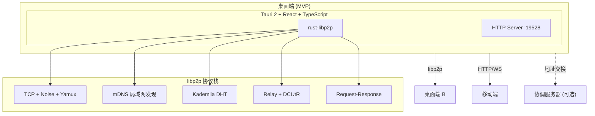
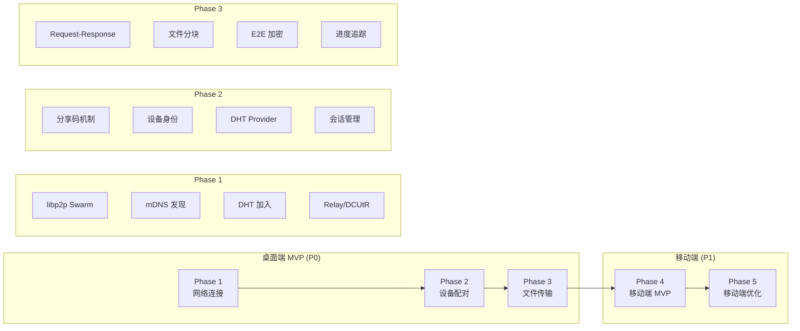
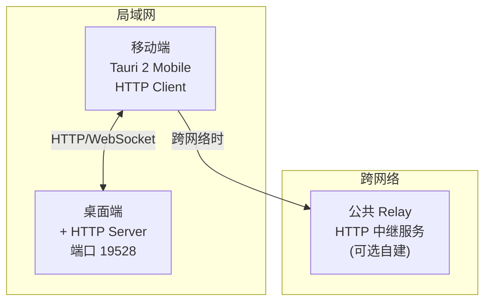

# SwarmDrop 实施路线图

## 总体架构



## 技术决策

### 已确定

| 决策 | 选择 | 原因 |
|------|------|------|
| 桌面端框架 | Tauri 2 + React | 跨平台、性能好、Rust 生态 |
| 桌面端 P2P | rust-libp2p | 功能完整、去中心化 |
| 加密算法 | XChaCha20-Poly1305 | 现代、安全、性能好 |
| 移动端 MVP | HTTP/WebSocket | 简单可靠、快速实现 |

### 待定（移动端方案选择）

**新发现**：[Fungi](https://github.com/enbop/fungi) 项目证明 rust-libp2p 可以在 Android 上运行。

| 选项 | 优点 | 缺点 | 决策时机 |
|------|------|------|----------|
| **libp2p 全平台** | 代码复用高、真 P2P | 需要 PoC 验证 | Phase 3 后做 PoC |
| HTTP 备选 | 简单可靠 | 非 P2P、需桌面中转 | PoC 失败时 |
| boringtun (WireGuard) | 移动端成熟 | 需要 VPN 权限 | 暂不考虑 |

**详见**: [../research/mobile-libp2p-investigation.md](../research/mobile-libp2p-investigation.md)

---

## 实施阶段



---

## Phase 1: 网络连接（桌面端）

**目标**：建立 libp2p 网络基础设施

**范围**：仅桌面端（Windows/macOS/Linux）

### 核心任务

| 任务 | 说明 | 优先级 |
|------|------|--------|
| 1.1 Swarm 初始化 | TCP + Noise + Yamux | P0 |
| 1.2 mDNS 发现 | 局域网设备发现 | P0 |
| 1.3 Identify 协议 | 交换设备信息 | P0 |
| 1.4 Kademlia DHT | 加入 DHT 网络 | P0 |
| 1.5 Relay 协议 | NAT 穿透兜底 | P0 |
| 1.6 DCUtR | NAT 打洞 | P0 |
| 1.7 连接管理 | 连接池、重连 | P0 |

### 验收标准

- [ ] 两台局域网设备能通过 mDNS 互相发现
- [ ] 能成功连接 DHT 引导节点
- [ ] 两台跨网络设备能通过 Relay 连接

---

## Phase 2: 设备配对（桌面端）

**目标**：实现分享码配对机制

**范围**：仅桌面端

### 核心任务

| 任务 | 说明 | 优先级 |
|------|------|--------|
| 2.1 设备身份 | 密钥对生成、持久化 | P0 |
| 2.2 分享码生成 | 6 位码编码 | P0 |
| 2.3 DHT Provider | 发布/查询 | P0 |
| 2.4 分享码连接 | 解析码并连接 | P0 |
| 2.5 局域网直连 | mDNS 设备直接配对 | P0 |
| 2.6 会话管理 | 配对会话状态机 | P0 |
| 2.7 配对 UI | 分享码显示/输入 | P0 |

### 验收标准

- [ ] 能生成 6 位分享码
- [ ] 另一台设备输入分享码能成功连接
- [ ] 局域网设备能直接点击配对

---

## Phase 3: 文件传输（桌面端）

**目标**：实现端到端加密文件传输

**范围**：仅桌面端

### 核心任务

| 任务 | 说明 | 优先级 |
|------|------|--------|
| 3.1 传输协议 | Request-Response | P0 |
| 3.2 文件分块 | 64KB 分块 | P0 |
| 3.3 E2E 加密 | XChaCha20-Poly1305 | P0 |
| 3.4 发送端 | 文件选择、发送流程 | P0 |
| 3.5 接收端 | 确认、保存流程 | P0 |
| 3.6 进度追踪 | 实时进度、速度 | P0 |
| 3.7 错误处理 | 重试、恢复 | P0 |
| 3.8 传输 UI | 进度条、完成提示 | P0 |
| 3.9 断点续传 | 中断恢复 | P1 |

### 验收标准（MVP）

- [ ] 局域网传输 100MB 文件成功
- [ ] 跨网络传输 100MB 文件成功
- [ ] 局域网速度 ≥ 30 MB/s
- [ ] 跨网络速度 ≥ 1 MB/s
- [ ] 传输数据端到端加密

---

## Phase 4: 移动端 MVP

**目标**：移动端能与桌面端互传文件

**范围**：iOS / Android

**技术方案**：HTTP/WebSocket（不使用 libp2p）

### 架构



### 核心任务

| 任务 | 说明 | 优先级 |
|------|------|--------|
| 4.1 桌面端 HTTP Server | axum/warp 实现 | P0 |
| 4.2 HTTP API 设计 | 文件列表、上传、下载 | P0 |
| 4.3 移动端项目搭建 | Tauri 2 Mobile | P0 |
| 4.4 二维码配对 | 扫码获取连接信息 | P0 |
| 4.5 局域网发现 | UDP 广播 / 手动输入 | P0 |
| 4.6 文件传输 | HTTP 分块上传/下载 | P0 |
| 4.7 移动端 UI | 发送/接收界面 | P0 |
| 4.8 公共 Relay | 跨网络 HTTP 中继 | P1 |

### HTTP API 设计

```
桌面端 HTTP Server (端口 19528):

GET  /api/info                    # 获取设备信息
GET  /api/files                   # 获取待发送文件列表
GET  /api/files/:id               # 下载文件（分块）
POST /api/files                   # 上传文件（分块）
WS   /api/ws                      # WebSocket 实时通信

请求头:
  X-Session-Id: <session_id>      # 会话 ID
  X-Encryption-Key: <base64>      # 加密密钥（可选）
```

### 二维码内容

```json
{
  "type": "swarmdrop",
  "version": 1,
  "ip": "192.168.1.100",
  "port": 19528,
  "session_id": "abc123",
  "device_name": "我的电脑",
  "encryption_key": "base64..."
}
```

### 验收标准

- [ ] 移动端扫码能连接桌面端
- [ ] 局域网内能互传文件
- [ ] 传输有进度显示
- [ ] 支持 iOS 和 Android

---

## Phase 5: 移动端优化（可选）

**目标**：提升移动端体验，支持移动端之间 P2P

**前提**：根据用户反馈决定是否实施

### 方案 A：WireGuard (boringtun)


**任务**：
- 集成 boringtun
- 实现 STUN NAT 探测
- 部署协调服务器
- iOS NetworkExtension / Android VpnService

### 方案 B：保持 HTTP + 优化

- 优化 HTTP 传输性能
- 添加更多公共 Relay 节点
- 改进断点续传

---

## 项目结构（最终）

```
swarmdrop/
├── src/                        # React 前端
│   ├── components/
│   │   ├── ShareCodeDisplay.tsx
│   │   ├── ShareCodeInput.tsx
│   │   ├── QRCodeScanner.tsx   # 移动端
│   │   ├── NearbyDevices.tsx
│   │   ├── TransferProgress.tsx
│   │   └── ...
│   ├── hooks/
│   ├── pages/
│   └── ...
│
├── src-tauri/                  # Rust 后端
│   ├── src/
│   │   ├── lib.rs
│   │   ├── main.rs
│   │   ├── network/            # Phase 1: libp2p 网络
│   │   │   ├── mod.rs
│   │   │   ├── swarm.rs
│   │   │   ├── behaviour.rs
│   │   │   ├── discovery.rs
│   │   │   └── ...
│   │   ├── identity/           # Phase 2: 设备身份
│   │   │   ├── mod.rs
│   │   │   └── ...
│   │   ├── pairing/            # Phase 2: 配对
│   │   │   ├── mod.rs
│   │   │   ├── share_code.rs
│   │   │   └── ...
│   │   ├── transfer/           # Phase 3: 文件传输
│   │   │   ├── mod.rs
│   │   │   ├── protocol.rs
│   │   │   ├── crypto.rs
│   │   │   └── ...
│   │   └── http_bridge/        # Phase 4: 移动端桥接
│   │       ├── mod.rs
│   │       ├── server.rs       # HTTP Server
│   │       ├── api.rs          # API 路由
│   │       └── qrcode.rs       # 二维码生成
│   └── Cargo.toml
│
├── src-tauri-mobile/           # 移动端特定代码（如需要）
│
└── docs/                       # 文档站点
```

---

## 里程碑

| 里程碑 | 内容 | 目标 |
|--------|------|------|
| **M1** | Phase 1 完成 | 网络连接可用 |
| **M2** | Phase 2 完成 | 分享码配对可用 |
| **M3** | Phase 3 完成 | **桌面端 MVP 发布** |
| **M4** | Phase 4 完成 | **移动端 MVP 发布** |
| **M5** | Phase 5 完成 | 移动端优化（可选）|

---

## 风险管理

| 风险 | 概率 | 影响 | 对策 |
|------|------|------|------|
| NAT 穿透成功率低 | 中 | 高 | Relay 兜底 |
| 移动端 HTTP 性能不足 | 低 | 中 | 分块传输、WebSocket |
| libp2p 版本升级 | 低 | 中 | 锁定版本、渐进升级 |
| 用户要求移动端 P2P | 中 | 中 | Phase 5 boringtun 方案备选 |

---

## 技术债务追踪

| 项目 | 描述 | 优先级 | 计划解决阶段 |
|------|------|--------|--------------|
| 移动端非 P2P | HTTP 方案非真正 P2P | 低 | Phase 5 |
| 单一引导节点 | DHT 依赖公共节点 | 中 | Phase 3 后 |
| 无断点续传 | 大文件中断需重传 | 中 | Phase 3 P1 |
