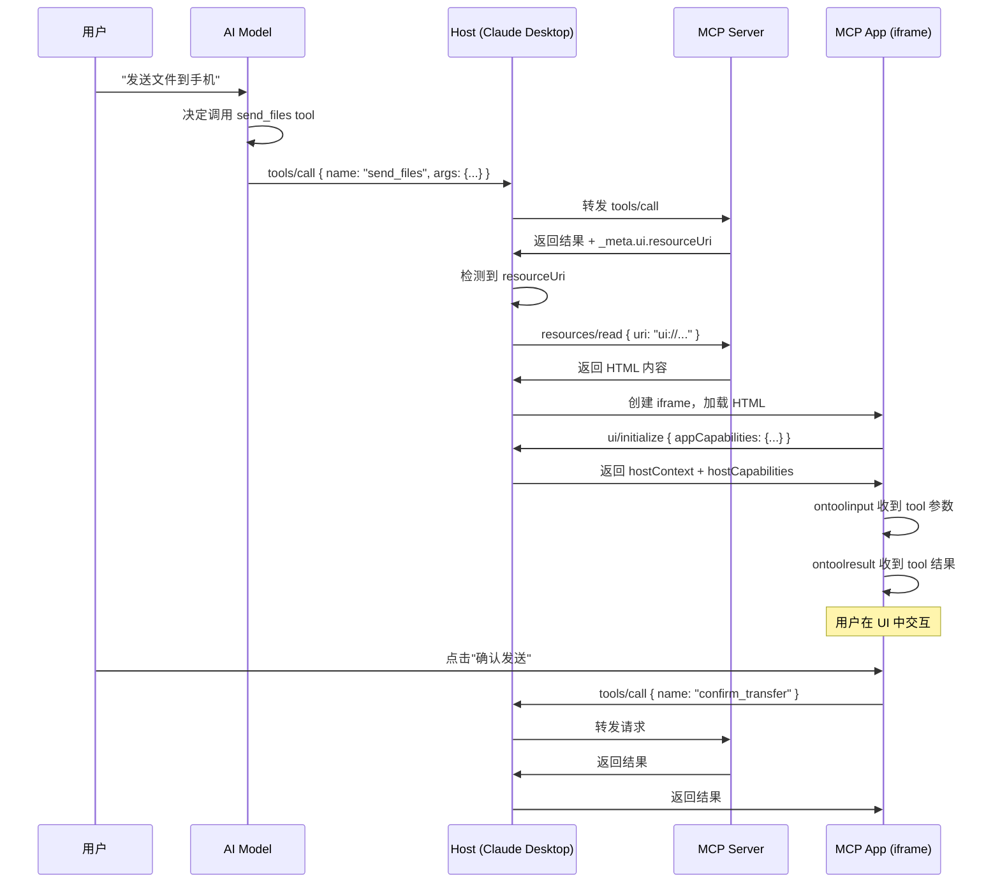
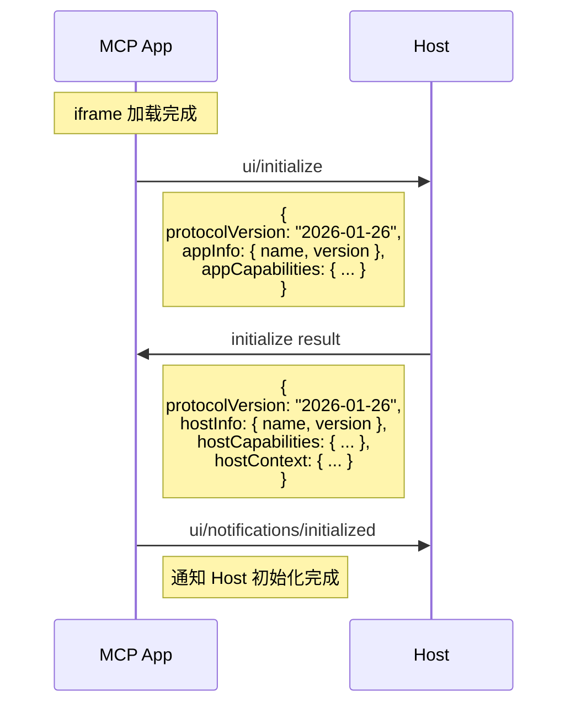
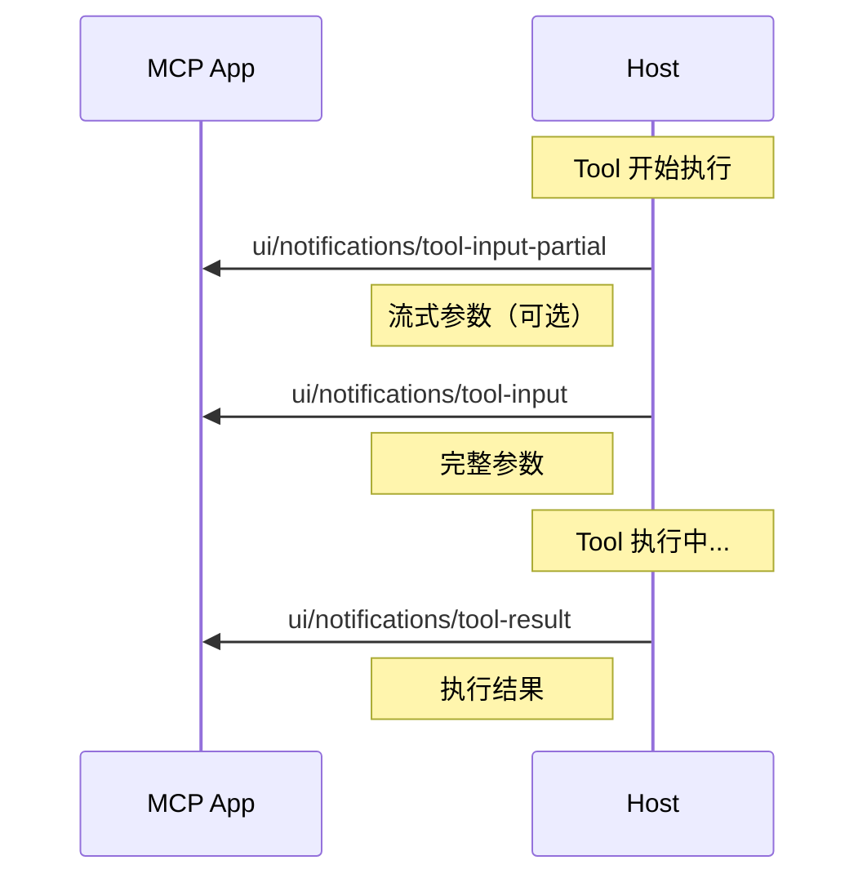
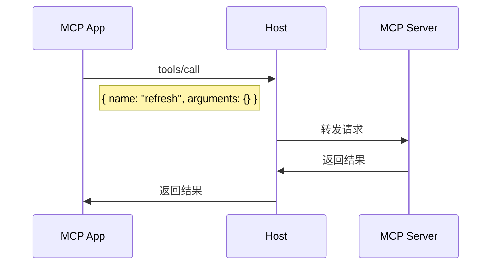

# MCP App 深入解析：原理、通信机制与 React SDK

本教程深入讲解 MCP App 的工作原理、为什么使用 iframe、内部通信机制，以及 React SDK 的完整 API。

## 目录

1. [MCP App 原理](#mcp-app-原理)
2. [为什么使用 iframe](#为什么使用-iframe)
3. [通信机制详解](#通信机制详解)
4. [React SDK 完整 API](#react-sdk-完整-api)
5. [Vanilla JS API](#vanilla-js-api)
6. [Host Context 详解](#host-context-详解)
7. [安全模型](#安全模型)

---

## MCP App 原理

### 核心概念

MCP App 是 **SEP-1865** 规范定义的 MCP 协议扩展，允许 MCP Server 向 Host 提供交互式 UI。

```
传统 MCP:
┌──────────┐    tools/call    ┌──────────┐
│   Host   │ ───────────────> │  Server  │
│ (Claude) │ <─────────────── │          │
└──────────┘   text result    └──────────┘

MCP App:
┌──────────┐    tools/call    ┌──────────┐
│   Host   │ ───────────────> │  Server  │
│ (Claude) │ <─────────────── │          │
└────┬─────┘  result + meta   └──────────┘
     │                              │
     │ resources/read               │
     │ ────────────────────────────>│
     │ <────────────────────────────│
     │        HTML content          │
     │                              │
     ▼
┌──────────┐
│  iframe  │  <── 渲染 UI
│ (MCP App)│
└──────────┘
```

### Tool + Resource 模式

每个 MCP App 由两部分组成：

```typescript
// 1. Tool 定义 - 在 tools/list 中返回
{
  name: "send_files",
  description: "发送文件到设备",
  inputSchema: { ... },
  _meta: {
    ui: {
      resourceUri: "ui://swarmdrop/app.html",  // 关联的 UI
      visibility: ["model", "app"]
    }
  }
}

// 2. Resource 定义 - 在 resources/list 中返回
{
  uri: "ui://swarmdrop/app.html",
  name: "SwarmDrop App",
  mimeType: "text/html;profile=mcp-app"
}

// 3. Resource 内容 - 在 resources/read 中返回
{
  contents: [{
    uri: "ui://swarmdrop/app.html",
    mimeType: "text/html;profile=mcp-app",
    text: "<!DOCTYPE html>..."  // 完整的 HTML
  }]
}
```

### 执行流程



---

## 为什么使用 iframe

### 安全隔离

iframe 提供了**浏览器原生的安全沙箱**：

```
┌─────────────────────────────────────────────┐
│ Host (Claude Desktop)                       │
│ origin: claude.ai                           │
│                                             │
│  ┌───────────────────────────────────────┐  │
│  │ iframe (MCP App)                      │  │
│  │ origin: sandbox.claudemcpcontent.com  │  │
│  │                                       │  │
│  │ - 无法访问 Host 的 DOM               │  │
│  │ - 无法访问 Host 的 cookies           │  │
│  │ - 无法访问 Host 的 localStorage      │  │
│  │ - 只能通过 postMessage 通信          │  │
│  └───────────────────────────────────────┘  │
└─────────────────────────────────────────────┘
```

### 安全优势

| 威胁 | iframe 如何防护 |
|------|----------------|
| **XSS 攻击** | 恶意脚本被限制在 iframe 内，无法影响 Host |
| **数据窃取** | 无法访问 Host 的存储和会话信息 |
| **DOM 篡改** | 无法修改 Host 的界面 |
| **钓鱼攻击** | 独立 origin，用户可识别来源 |

### CSP (Content Security Policy)

Host 根据 Server 声明的 CSP 配置来限制 iframe：

```typescript
// Server 在 resource 中声明需要的权限
{
  _meta: {
    ui: {
      csp: {
        // 允许的网络请求域名
        connectDomains: ["https://api.example.com"],
        // 允许的静态资源域名
        resourceDomains: ["https://cdn.example.com"],
        // 允许嵌套的 iframe
        frameDomains: ["https://youtube.com"],
      }
    }
  }
}

// Host 生成的 CSP header
Content-Security-Policy:
  default-src 'none';
  script-src 'self' 'unsafe-inline';
  style-src 'self' 'unsafe-inline';
  img-src 'self' data: https://cdn.example.com;
  connect-src https://api.example.com;
  frame-src https://youtube.com;
```

### Sandbox Proxy 架构

当 Host 是 Web 页面时，需要额外的 Sandbox Proxy 层：

```
┌─────────────────────────────────────────────────────┐
│ Host Page (claude.ai)                               │
│                                                     │
│  ┌───────────────────────────────────────────────┐  │
│  │ Sandbox Proxy (different origin)              │  │
│  │                                               │  │
│  │  ┌─────────────────────────────────────────┐  │  │
│  │  │ MCP App (innermost iframe)              │  │  │
│  │  │ - 实际的 HTML 内容                      │  │  │
│  │  │ - 受 CSP 限制                           │  │  │
│  │  └─────────────────────────────────────────┘  │  │
│  │                                               │  │
│  │  职责：                                       │  │
│  │  - 加载 HTML 并应用 CSP                      │  │
│  │  - 转发 Host ↔ App 的消息                    │  │
│  └───────────────────────────────────────────────┘  │
└─────────────────────────────────────────────────────┘
```

---

## 通信机制详解

### 传输层：postMessage

MCP App 使用浏览器的 `postMessage` API 与 Host 通信：

```typescript
// App 发送消息给 Host
window.parent.postMessage({
  jsonrpc: "2.0",
  id: 1,
  method: "tools/call",
  params: { name: "my_tool", arguments: {} }
}, "*");

// App 接收 Host 的消息
window.addEventListener("message", (event) => {
  const message = event.data;
  if (message.jsonrpc === "2.0") {
    // 处理 JSON-RPC 消息
  }
});
```

### 协议层：JSON-RPC 2.0

所有通信都遵循 JSON-RPC 2.0 格式：

```typescript
// 请求 (Request)
{
  "jsonrpc": "2.0",
  "id": 1,                    // 请求 ID
  "method": "tools/call",     // 方法名
  "params": { ... }           // 参数
}

// 响应 (Response)
{
  "jsonrpc": "2.0",
  "id": 1,                    // 对应的请求 ID
  "result": { ... }           // 成功结果
}

// 错误响应 (Error Response)
{
  "jsonrpc": "2.0",
  "id": 1,
  "error": {
    "code": -32600,
    "message": "Invalid request"
  }
}

// 通知 (Notification) - 无 id 字段
{
  "jsonrpc": "2.0",
  "method": "ui/notifications/tool-input",
  "params": { ... }
}
```

### 生命周期协议

#### 1. 初始化握手



#### 2. Tool 数据流



#### 3. App 调用 Server Tool



### 消息类型汇总

| 方向 | 方法 | 类型 | 说明 |
|------|------|------|------|
| App → Host | `ui/initialize` | Request | 初始化握手 |
| App → Host | `ui/notifications/initialized` | Notification | 初始化完成 |
| App → Host | `ui/notifications/size-changed` | Notification | 尺寸变化 |
| App → Host | `tools/call` | Request | 调用 Server Tool |
| App → Host | `resources/read` | Request | 读取资源 |
| App → Host | `notifications/message` | Notification | 日志消息 |
| Host → App | `ui/notifications/tool-input` | Notification | Tool 参数 |
| Host → App | `ui/notifications/tool-input-partial` | Notification | 流式参数 |
| Host → App | `ui/notifications/tool-result` | Notification | Tool 结果 |
| Host → App | `ui/notifications/tool-cancelled` | Notification | Tool 取消 |
| Host → App | `ui/notifications/host-context-changed` | Notification | 上下文变化 |
| Host → App | `ui/resource-teardown` | Request | 销毁请求 |

---

## React SDK 完整 API

### 安装

```bash
npm install @modelcontextprotocol/ext-apps
```

### useApp Hook

`useApp` 是 React 应用的核心 hook，管理与 Host 的连接和通信。

```typescript
import { useApp } from "@modelcontextprotocol/ext-apps/react";

interface UseAppOptions {
  // 应用信息（必需）
  appInfo: {
    name: string;
    version: string;
  };

  // 应用能力声明
  capabilities?: {
    // 支持的显示模式
    availableDisplayModes?: Array<"inline" | "fullscreen" | "pip">;
    // 是否支持 tools/list_changed
    tools?: { listChanged?: boolean };
    // 实验性功能
    experimental?: {};
  };

  // App 实例创建后的回调
  onAppCreated?: (app: App) => void;

  // Tool 参数到达时的回调
  onToolInput?: (params: ToolInputParams) => void;

  // 流式 Tool 参数（部分）到达时的回调
  onToolInputPartial?: (params: ToolInputPartialParams) => void;

  // Tool 结果到达时的回调
  onToolResult?: (result: ToolResultParams) => void;

  // Tool 被取消时的回调
  onToolCancelled?: (params: ToolCancelledParams) => void;

  // Host 上下文变化时的回调
  onHostContextChanged?: (context: HostContext) => void;

  // App 即将销毁时的回调
  onTeardown?: () => Promise<TeardownResult> | TeardownResult;
}

interface UseAppReturn {
  // App 实例
  app: App | null;

  // 最近的 Tool 输入参数
  toolInput: ToolInputParams | null;

  // 最近的 Tool 结果
  toolResult: ToolResultParams | null;

  // Host 上下文
  hostContext: HostContext | null;

  // 连接状态
  isConnected: boolean;

  // 错误信息
  error: Error | null;
}
```

#### 使用示例

```tsx
import { useApp, useHostStyles } from "@modelcontextprotocol/ext-apps/react";

function MyApp() {
  const {
    app,
    toolInput,
    toolResult,
    hostContext,
    isConnected,
    error
  } = useApp({
    appInfo: { name: "MyApp", version: "1.0.0" },

    capabilities: {
      availableDisplayModes: ["inline", "fullscreen"],
    },

    onToolInput: (params) => {
      console.log("Tool 名称:", params.toolName);
      console.log("Tool 参数:", params.arguments);
    },

    onToolInputPartial: (params) => {
      // 流式参数 - 用于渐进式渲染
      console.log("部分参数:", params.arguments);
    },

    onToolResult: (result) => {
      console.log("Tool 结果:", result.content);
      if (result.isError) {
        console.error("Tool 执行失败");
      }
    },

    onToolCancelled: (params) => {
      console.log("Tool 被取消:", params.reason);
    },

    onHostContextChanged: (ctx) => {
      console.log("主题:", ctx.theme);
      console.log("显示模式:", ctx.displayMode);
    },

    onTeardown: async () => {
      // 清理资源
      await cleanup();
      return {};
    },
  });

  // 应用 Host 样式
  useHostStyles(app);

  if (error) return <div>错误: {error.message}</div>;
  if (!isConnected) return <div>连接中...</div>;

  return (
    <div>
      <p>Tool: {toolInput?.toolName}</p>
      <p>参数: {JSON.stringify(toolInput?.arguments)}</p>
    </div>
  );
}
```

### useHostStyles Hook

自动应用 Host 的主题样式（颜色、字体、圆角等）。

```typescript
import { useHostStyles } from "@modelcontextprotocol/ext-apps/react";

function MyApp() {
  const { app } = useApp({ ... });

  // 自动注入 CSS 变量到 document
  useHostStyles(app);

  return (
    <div style={{
      // 使用注入的 CSS 变量
      background: "var(--color-background-primary)",
      color: "var(--color-text-primary)",
      fontFamily: "var(--font-sans)",
      borderRadius: "var(--border-radius-md)",
    }}>
      内容
    </div>
  );
}
```

### useHostStyleVariables Hook

只注入 CSS 变量，不自动应用主题。

```typescript
import { useHostStyleVariables } from "@modelcontextprotocol/ext-apps/react";

function MyApp() {
  const { app } = useApp({ ... });

  // 只注入变量，不改变 document 主题
  useHostStyleVariables(app);

  return <div>...</div>;
}
```

### useHostFonts Hook

只加载 Host 的字体。

```typescript
import { useHostFonts } from "@modelcontextprotocol/ext-apps/react";

function MyApp() {
  const { app } = useApp({ ... });

  // 只加载字体
  useHostFonts(app);

  return <div>...</div>;
}
```

### App 实例方法

通过 `useApp` 返回的 `app` 对象，可以调用以下方法：

#### callServerTool

调用 MCP Server 上的 Tool。

```typescript
const result = await app.callServerTool(
  "tool_name",           // Tool 名称
  { key: "value" },      // 参数
  { timeout: 30000 }     // 选项（可选）
);

// result 结构
{
  content: [
    { type: "text", text: "结果文本" }
  ],
  isError?: boolean
}
```

#### readResource

读取 MCP Server 上的资源。

```typescript
const result = await app.readResource("ui://app/data.json");

// result 结构
{
  contents: [
    { uri: "...", mimeType: "...", text: "..." }
  ]
}
```

#### requestDisplayMode

请求切换显示模式（全屏等）。

```typescript
// 请求全屏
const result = await app.requestDisplayMode({ mode: "fullscreen" });

// 退出全屏
const result = await app.requestDisplayMode({ mode: "inline" });

// result 结构
{
  mode: "fullscreen" | "inline" | "pip"
}
```

#### updateModelContext

更新 AI Model 可见的上下文信息。

```typescript
await app.updateModelContext({
  userSelection: "选中的设备",
  currentStep: "confirming",
  // 任意 JSON 可序列化数据
});
```

#### sendMessage

向 AI 发送消息（用户主动触发）。

```typescript
await app.sendMessage({
  content: [
    { type: "text", text: "用户想要取消传输" }
  ]
});
```

#### sendLog

发送日志到 Host。

```typescript
await app.sendLog({
  level: "info",  // "debug" | "info" | "warning" | "error"
  data: "用户点击了按钮"
});

await app.sendLog({
  level: "error",
  data: { error: err.message, stack: err.stack }
});
```

#### openLink

请求 Host 打开链接。

```typescript
await app.openLink({ url: "https://example.com" });
```

#### getHostContext

获取当前 Host 上下文。

```typescript
const context = app.getHostContext();
console.log(context?.theme);  // "light" | "dark"
```

#### getHostCapabilities

获取 Host 能力。

```typescript
const caps = app.getHostCapabilities();
if (caps?.serverTools) {
  // Host 支持调用 Server Tools
}
```

#### getHostVersion

获取 Host 信息。

```typescript
const info = app.getHostVersion();
console.log(info?.name);     // "Claude Desktop"
console.log(info?.version);  // "1.0.0"
```

---

## Vanilla JS API

不使用 React 时，直接使用 `App` 类。

### 基本用法

```typescript
import {
  App,
  applyDocumentTheme,
  applyHostStyleVariables,
  applyHostFonts,
} from "@modelcontextprotocol/ext-apps";

// 创建 App 实例
const app = new App(
  { name: "MyApp", version: "1.0.0" },  // appInfo
  { availableDisplayModes: ["inline", "fullscreen"] },  // capabilities
  { autoResize: true }  // options
);

// 注册 handlers（必须在 connect 之前！）
app.ontoolinput = (params) => {
  console.log("Tool 参数:", params);
  renderUI(params.arguments);
};

app.ontoolinputpartial = (params) => {
  console.log("部分参数:", params);
  renderPreview(params.arguments);
};

app.ontoolresult = (result) => {
  console.log("Tool 结果:", result);
  showResult(result.content);
};

app.ontoolcancelled = (params) => {
  console.log("Tool 取消:", params);
  resetUI();
};

app.onhostcontextchanged = (ctx) => {
  // 应用主题
  if (ctx.theme) {
    applyDocumentTheme(ctx.theme);
  }
  if (ctx.styles?.variables) {
    applyHostStyleVariables(ctx.styles.variables);
  }
  if (ctx.styles?.css?.fonts) {
    applyHostFonts(ctx.styles.css.fonts);
  }

  // 处理安全区域
  if (ctx.safeAreaInsets) {
    const { top, right, bottom, left } = ctx.safeAreaInsets;
    document.body.style.padding = `${top}px ${right}px ${bottom}px ${left}px`;
  }

  // 处理显示模式
  if (ctx.displayMode) {
    document.body.classList.toggle("fullscreen", ctx.displayMode === "fullscreen");
  }
};

app.onteardown = async () => {
  // 清理资源
  await cleanup();
  return {};
};

// 连接到 Host
await app.connect();

// 现在可以调用方法
const result = await app.callServerTool("my_tool", { arg: "value" });
```

### 样式辅助函数

```typescript
import {
  applyDocumentTheme,
  applyHostStyleVariables,
  applyHostFonts,
  getDocumentTheme,
} from "@modelcontextprotocol/ext-apps";

// 应用主题（设置 data-theme 属性）
applyDocumentTheme("dark");  // <html data-theme="dark">

// 获取当前主题
const theme = getDocumentTheme();  // "light" | "dark"

// 注入 CSS 变量
applyHostStyleVariables({
  "color-background-primary": "#ffffff",
  "color-text-primary": "#000000",
  // ...
});

// 加载字体
applyHostFonts(`
  @font-face {
    font-family: "Inter";
    src: url(...);
  }
`);
```

---

## Host Context 详解

Host 通过 `hostContext` 提供环境信息：

```typescript
interface HostContext {
  // Tool 信息（触发此 UI 的 Tool）
  toolInfo?: {
    id?: string | number;  // JSON-RPC 请求 ID
    tool: {
      name: string;
      description?: string;
      inputSchema?: object;
    };
  };

  // 主题
  theme?: "light" | "dark";

  // 样式
  styles?: {
    // CSS 变量
    variables?: Record<string, string>;
    // CSS 内容（字体等）
    css?: {
      fonts?: string;
    };
  };

  // 安全区域（避开刘海、圆角等）
  safeAreaInsets?: {
    top: number;
    right: number;
    bottom: number;
    left: number;
  };

  // 当前显示模式
  displayMode?: "inline" | "fullscreen" | "pip";

  // 可用的显示模式
  availableDisplayModes?: Array<"inline" | "fullscreen" | "pip">;

  // 区域设置
  locale?: string;  // "zh-CN", "en-US"

  // 时区
  timezone?: string;  // "Asia/Shanghai"
}
```

### CSS 变量列表

Host 可能提供的 CSS 变量：

```css
/* 背景色 */
--color-background-primary
--color-background-secondary
--color-background-tertiary

/* 文字色 */
--color-text-primary
--color-text-secondary
--color-text-tertiary
--color-text-disabled

/* 边框色 */
--color-border-primary
--color-border-secondary

/* 强调色 */
--color-accent-primary
--color-accent-secondary

/* 字体 */
--font-sans
--font-mono

/* 字号 */
--font-text-xs-size
--font-text-sm-size
--font-text-md-size
--font-text-lg-size
--font-text-xl-size

--font-heading-sm-size
--font-heading-md-size
--font-heading-lg-size
--font-heading-xl-size

/* 行高 */
--font-text-xs-line-height
--font-text-sm-line-height
/* ... */

/* 字重 */
--font-weight-normal
--font-weight-medium
--font-weight-semibold
--font-weight-bold

/* 圆角 */
--border-radius-sm
--border-radius-md
--border-radius-lg
--border-radius-xl
--border-radius-full
```

---

## 安全模型

### 信任边界

```
┌─────────────────────────────────────────────────────────┐
│ 可信区域 (Host)                                         │
│                                                         │
│  - AI Model                                             │
│  - Host 应用代码                                        │
│  - 用户会话数据                                         │
│                                                         │
│  ┌─────────────────────────────────────────────────┐   │
│  │ 不可信区域 (MCP App iframe)                     │   │
│  │                                                 │   │
│  │  - 第三方 Server 提供的 HTML                   │   │
│  │  - 受 CSP 限制                                 │   │
│  │  - 只能通过 postMessage 通信                   │   │
│  └─────────────────────────────────────────────────┘   │
└─────────────────────────────────────────────────────────┘
```

### Host 的安全职责

1. **验证消息来源**：检查 `event.origin`
2. **过滤敏感操作**：审核 App 的 Tool 调用
3. **应用 CSP**：限制网络访问
4. **用户确认**：敏感操作需用户授权

### App 的安全最佳实践

1. **最小权限原则**：只声明必需的 CSP 域名
2. **输入验证**：不信任 Host 传来的数据
3. **避免 eval**：不执行动态代码
4. **HTTPS only**：只连接 HTTPS 端点

---

## 参考资料

- [MCP Apps 规范 (SEP-1865)](https://github.com/modelcontextprotocol/ext-apps/blob/main/specification/2026-01-26/apps.mdx)
- [ext-apps SDK 源码](https://github.com/modelcontextprotocol/ext-apps)
- [MCP 官方文档](https://modelcontextprotocol.io/)
