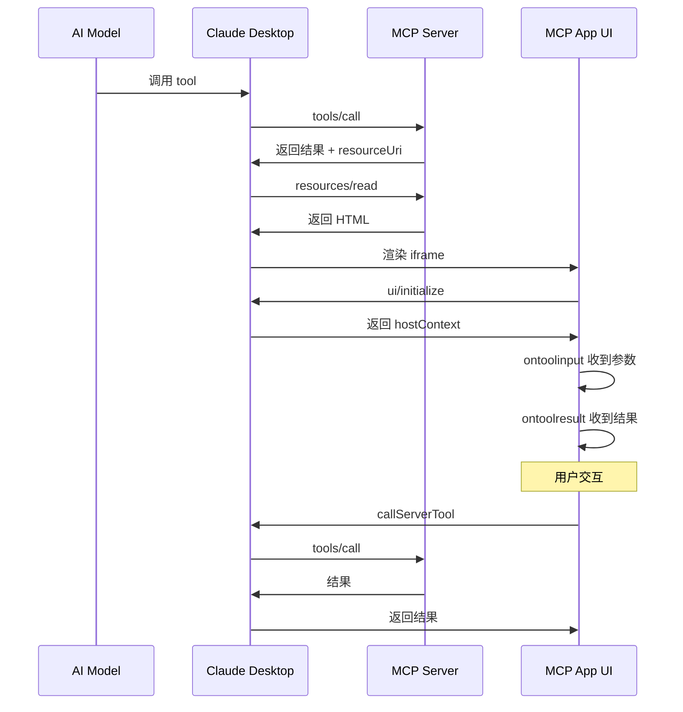
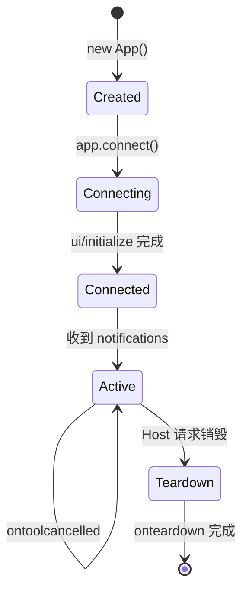

# MCP App 开发教程

本教程详细介绍如何基于官方 [@modelcontextprotocol/ext-apps](https://github.com/modelcontextprotocol/ext-apps) SDK 开发 MCP App，实现在 Claude Desktop 等 MCP 主机中嵌入交互式 UI。

## 目录

1. [MCP App 概念](#mcp-app-概念)
2. [核心架构](#核心架构)
3. [快速开始](#快速开始)
4. [Server 端实现](#server-端实现)
5. [Client 端实现（App UI）](#client-端实现app-ui)
6. [生命周期与通信](#生命周期与通信)
7. [高级特性](#高级特性)
8. [最佳实践](#最佳实践)
9. [SwarmDrop 实战](#swarmdrop-实战)

---

## MCP App 概念

### 什么是 MCP App？

MCP App 是 MCP 协议的扩展（SEP-1865），允许 MCP Server 向 Host（如 Claude Desktop）提供交互式 HTML UI。

```
传统 MCP:  AI 调用 Tool → Server 返回文本 → AI 展示文本

MCP App:   AI 调用 Tool → Server 返回结果 + UI Resource
                       → Host 渲染 UI → 用户交互 → UI 调用 Tool
```

### 核心组成

每个 MCP App 由两部分组成：

| 组件 | 说明 | 示例 |
|------|------|------|
| **Tool** | 被 AI 或 UI 调用的功能 | `send_files`, `get_weather` |
| **Resource** | 提供 HTML UI 内容 | `ui://app/view.html` |

Tool 通过 `_meta.ui.resourceUri` 关联 Resource：

```typescript
// Tool 定义
{
  name: "get_weather",
  description: "获取天气信息",
  _meta: {
    ui: {
      resourceUri: "ui://weather/app.html"  // 关联的 UI
    }
  }
}
```

---

## 核心架构

### 通信流程



### 角色说明

| 角色 | 职责 |
|------|------|
| **AI Model** | 决定调用哪个 tool |
| **Host** | 渲染 UI iframe，桥接通信 |
| **MCP Server** | 提供 tool 和 resource |
| **MCP App UI** | 在 iframe 中运行的交互界面 |

---

## 快速开始

### 1. 创建项目

```bash
mkdir my-mcp-app
cd my-mcp-app
npm init -y
npm install @modelcontextprotocol/ext-apps @modelcontextprotocol/sdk
npm install -D tsx vite vite-plugin-singlefile
```

### 2. 项目结构

```
my-mcp-app/
├── package.json
├── server.ts           # MCP Server
├── src/
│   └── app.tsx         # MCP App UI (React)
├── vite.config.ts      # Vite 配置
└── dist/
    └── app.html        # 打包后的单文件 HTML
```

### 3. package.json

```json
{
  "name": "my-mcp-app",
  "type": "module",
  "scripts": {
    "build": "vite build",
    "serve": "tsx server.ts"
  }
}
```

### 4. vite.config.ts

**关键**：必须使用 `vite-plugin-singlefile` 将所有资源打包到单个 HTML 文件：

```typescript
import { defineConfig } from "vite";
import react from "@vitejs/plugin-react";
import { viteSingleFile } from "vite-plugin-singlefile";

export default defineConfig({
  plugins: [react(), viteSingleFile()],
  build: {
    outDir: "dist",
    rollupOptions: {
      input: "src/app.tsx",
    },
  },
});
```

---

## Server 端实现

MCP Server 可以用 **TypeScript** 或 **Rust** 实现。SwarmDrop 使用 Rust (rmcp)。

### 方案对比

| 方案 | 适用场景 | 优势 |
|------|---------|------|
| **TypeScript** (`@modelcontextprotocol/sdk`) | 独立 Node.js 服务 | 开发快，生态丰富 |
| **Rust** (`rmcp`) | 嵌入 Tauri/原生应用 | 性能好，与 Rust 后端集成 |

---

### Rust 实现 (rmcp)

#### 依赖配置

```toml
# Cargo.toml
[dependencies]
rmcp = { version = "0.13", features = ["server", "macros", "transport-sse-server"] }
tokio = { version = "1", features = ["full"] }
serde = { version = "1", features = ["derive"] }
serde_json = "1"
axum = "0.7"
```

#### 基本结构

```rust
// src/mcp/handler.rs
use rmcp::{
    ServerHandler, tool_handler, tool_router, tool,
    handler::server::tool::ToolRouter,
    model::*,
    ErrorData as McpError,
};
use serde_json::json;

const RESOURCE_URI: &str = "ui://my-app/view.html";
const MCP_APP_HTML: &str = include_str!("../../mcp-app/dist/index.html");

#[derive(Clone)]
pub struct MyHandler {
    tool_router: ToolRouter<Self>,
}

#[tool_router]
impl MyHandler {
    pub fn new() -> Self {
        Self {
            tool_router: Self::tool_router(),
        }
    }

    /// 示例工具
    #[tool(description = "这是一个示例工具")]
    async fn my_tool(
        &self,
        #[arg(description = "消息内容")] message: String,
    ) -> Result<CallToolResult, McpError> {
        Ok(CallToolResult {
            content: vec![Content::text(format!("处理: {}", message))],
            _meta: Some(json!({
                "ui": { "resourceUri": RESOURCE_URI }
            })),
            ..Default::default()
        })
    }

    /// 仅 UI 可调用的工具
    #[tool(description = "刷新数据（仅 UI 调用）")]
    async fn refresh_data(&self) -> Result<CallToolResult, McpError> {
        // visibility 通过 _meta 设置
        Ok(CallToolResult {
            content: vec![Content::text("已刷新")],
            _meta: Some(json!({
                "ui": {
                    "resourceUri": RESOURCE_URI,
                    "visibility": ["app"]  // 仅 UI 可见
                }
            })),
            ..Default::default()
        })
    }
}

#[tool_handler]
impl ServerHandler for MyHandler {
    fn get_info(&self) -> ServerInfo {
        ServerInfo {
            name: "my-mcp-server".into(),
            version: env!("CARGO_PKG_VERSION").into(),
            ..Default::default()
        }
    }

    // 列出 Resources
    async fn list_resources(
        &self,
        _request: Option<PaginatedRequestParam>,
        _context: RequestContext<RoleServer>,
    ) -> Result<ListResourcesResult, McpError> {
        Ok(ListResourcesResult::with_all_items(vec![
            Resource {
                uri: RESOURCE_URI.into(),
                name: "My App".into(),
                description: Some("交互式界面".into()),
                mime_type: Some("text/html;profile=mcp-app".into()),
                ..Default::default()
            }
        ]))
    }

    // 读取 Resource 内容
    async fn read_resource(
        &self,
        request: ReadResourceRequestParam,
        _context: RequestContext<RoleServer>,
    ) -> Result<ReadResourceResult, McpError> {
        if request.uri == RESOURCE_URI {
            Ok(ReadResourceResult {
                contents: vec![ResourceContents::TextResourceContents {
                    uri: request.uri,
                    mime_type: Some("text/html;profile=mcp-app".into()),
                    text: MCP_APP_HTML.into(),
                }],
            })
        } else {
            Err(McpError::resource_not_found(&request.uri))
        }
    }
}
```

#### 启动 HTTP Server

```rust
// src/mcp/server.rs
use axum::{Router, routing::post};
use rmcp::transport::sse_server::SseServer;
use std::net::SocketAddr;

pub async fn start_mcp_server(handler: MyHandler) -> anyhow::Result<()> {
    let addr: SocketAddr = "127.0.0.1:19527".parse()?;

    let sse_server = SseServer::new(move || Ok(handler.clone()));

    let app = Router::new()
        .route("/mcp", post(move |req| async move {
            sse_server.handle(req).await
        }));

    tracing::info!("MCP Server listening on http://{}/mcp", addr);

    let listener = tokio::net::TcpListener::bind(addr).await?;
    axum::serve(listener, app).await?;

    Ok(())
}
```

#### Tool 可见性 (Rust)

```rust
// 默认：AI 和 UI 都可调用
_meta: Some(json!({
    "ui": {
        "resourceUri": "ui://app/view.html",
        "visibility": ["model", "app"]
    }
}))

// 仅 UI 可调用（对 AI 隐藏）
_meta: Some(json!({
    "ui": {
        "resourceUri": "ui://app/view.html",
        "visibility": ["app"]
    }
}))

// 仅 AI 可调用
_meta: Some(json!({
    "ui": {
        "resourceUri": "ui://app/view.html",
        "visibility": ["model"]
    }
}))
```

#### Resource CSP 配置 (Rust)

```rust
async fn read_resource(
    &self,
    request: ReadResourceRequestParam,
    _context: RequestContext<RoleServer>,
) -> Result<ReadResourceResult, McpError> {
    Ok(ReadResourceResult {
        contents: vec![ResourceContents::TextResourceContents {
            uri: request.uri.clone(),
            mime_type: Some("text/html;profile=mcp-app".into()),
            text: MCP_APP_HTML.into(),
        }],
        _meta: Some(json!({
            "ui": {
                "csp": {
                    "connectDomains": ["https://api.example.com"],
                    "resourceDomains": ["https://cdn.example.com"],
                },
                "prefersBorder": true
            }
        })),
    })
}
```

---

### TypeScript 实现 (Node.js)

#### 基本结构

```typescript
// server.ts
import { McpServer } from "@modelcontextprotocol/sdk/server/mcp.js";
import {
  registerAppTool,
  registerAppResource,
  RESOURCE_MIME_TYPE,
} from "@modelcontextprotocol/ext-apps/server";
import fs from "node:fs/promises";

// 创建 Server
const server = new McpServer({
  name: "My MCP App Server",
  version: "1.0.0",
});

const RESOURCE_URI = "ui://my-app/view.html";

// 注册 Tool
registerAppTool(
  server,
  "my_tool",
  {
    title: "My Tool",
    description: "这是一个示例工具",
    inputSchema: {
      type: "object",
      properties: {
        message: { type: "string" },
      },
    },
    _meta: {
      ui: { resourceUri: RESOURCE_URI },
    },
  },
  async (args) => {
    return {
      content: [{ type: "text", text: `处理: ${args.message}` }],
    };
  }
);

// 注册 Resource
registerAppResource(
  server,
  "My App View",
  RESOURCE_URI,
  { mimeType: RESOURCE_MIME_TYPE },
  async () => {
    const html = await fs.readFile("dist/app.html", "utf-8");
    return {
      contents: [
        {
          uri: RESOURCE_URI,
          mimeType: RESOURCE_MIME_TYPE,
          text: html,
        },
      ],
    };
  }
);

// 启动 Server（使用 stdio 或 HTTP）
// ...
```

### Tool 可见性

控制 Tool 对 AI 和 UI 的可见性：

```typescript
// 默认：AI 和 UI 都可调用
_meta: {
  ui: {
    resourceUri: "ui://app/view.html",
    visibility: ["model", "app"]  // 默认值
  }
}

// 仅 AI 可调用（UI 隐藏）
_meta: {
  ui: {
    resourceUri: "ui://app/view.html",
    visibility: ["model"]
  }
}

// 仅 UI 可调用（对 AI 隐藏）
// 适用于：刷新按钮、表单提交等
_meta: {
  ui: {
    resourceUri: "ui://app/view.html",
    visibility: ["app"]
  }
}
```

### Resource CSP 配置

如果 UI 需要访问外部资源：

```typescript
registerAppResource(
  server,
  "My App",
  RESOURCE_URI,
  { mimeType: RESOURCE_MIME_TYPE },
  async () => ({
    contents: [{
      uri: RESOURCE_URI,
      mimeType: RESOURCE_MIME_TYPE,
      text: html,
      _meta: {
        ui: {
          csp: {
            // 允许的 fetch/XHR/WebSocket 域名
            connectDomains: ["https://api.example.com"],
            // 允许的静态资源域名（图片、脚本、样式）
            resourceDomains: ["https://cdn.example.com"],
            // 允许嵌入的 iframe 域名
            frameDomains: ["https://youtube.com"],
          },
          prefersBorder: true,  // 是否显示边框
        },
      },
    }],
  })
);
```

---

## Client 端实现（App UI）

### React 示例

```tsx
// src/app.tsx
import { useApp, useHostStyles } from "@modelcontextprotocol/ext-apps/react";
import { useState, useEffect } from "react";

interface ToolArgs {
  message?: string;
}

function App() {
  const [message, setMessage] = useState("");
  const [result, setResult] = useState("");

  const { app, toolInput, toolResult } = useApp({
    appInfo: { name: "My App", version: "1.0.0" },
    capabilities: {},

    // Tool 参数到达时
    onToolInput: (params) => {
      const args = params.arguments as ToolArgs;
      setMessage(args.message || "");
    },

    // Tool 结果到达时
    onToolResult: (result) => {
      const text = result.content?.[0]?.text;
      setResult(text || "");
    },
  });

  // 应用 Host 主题样式
  useHostStyles(app);

  // 调用 Server Tool
  const handleRefresh = async () => {
    const result = await app.callServerTool("my_tool", {
      message: "从 UI 刷新",
    });
    setResult(result.content?.[0]?.text || "");
  };

  return (
    <div className="app">
      <h1>My MCP App</h1>
      <p>消息: {message}</p>
      <p>结果: {result}</p>
      <button onClick={handleRefresh}>刷新</button>
    </div>
  );
}

export default App;
```

### Vanilla JS 示例

```typescript
// src/app.ts
import {
  App,
  applyDocumentTheme,
  applyHostStyleVariables,
  applyHostFonts,
} from "@modelcontextprotocol/ext-apps";

const app = new App(
  { name: "My App", version: "1.0.0" },
  {} // capabilities
);

// 注册 handlers（必须在 connect 之前！）
app.ontoolinput = (params) => {
  console.log("Tool 参数:", params.arguments);
  document.getElementById("message")!.textContent =
    params.arguments?.message || "";
};

app.ontoolresult = (result) => {
  console.log("Tool 结果:", result);
  document.getElementById("result")!.textContent =
    result.content?.[0]?.text || "";
};

app.onhostcontextchanged = (ctx) => {
  // 应用主题
  if (ctx.theme) applyDocumentTheme(ctx.theme);
  if (ctx.styles?.variables) applyHostStyleVariables(ctx.styles.variables);
  if (ctx.styles?.css?.fonts) applyHostFonts(ctx.styles.css.fonts);

  // 处理安全区域
  if (ctx.safeAreaInsets) {
    const { top, right, bottom, left } = ctx.safeAreaInsets;
    document.body.style.padding = `${top}px ${right}px ${bottom}px ${left}px`;
  }
};

app.onteardown = async () => {
  console.log("App 即将销毁");
  return {};
};

// 连接到 Host
await app.connect();
```

---

## 生命周期与通信

### 生命周期事件



### Handler 说明

| Handler | 触发时机 | 用途 |
|---------|---------|------|
| `ontoolinputpartial` | Tool 参数流式生成中 | 渐进式预览 |
| `ontoolinput` | Tool 参数完整 | 最终参数处理 |
| `ontoolresult` | Tool 执行完成 | 显示结果 |
| `ontoolcancelled` | Tool 被取消 | 清理状态 |
| `onhostcontextchanged` | Host 上下文变化 | 主题、locale 等 |
| `onteardown` | App 即将销毁 | 清理资源 |

### 重要：Handler 注册顺序

**必须在 `connect()` 之前注册所有 handlers**：

```typescript
const app = new App({ name: "My App", version: "1.0.0" });

// ✅ 正确：先注册 handlers
app.ontoolinput = (params) => { /* ... */ };
app.ontoolresult = (result) => { /* ... */ };
app.onhostcontextchanged = (ctx) => { /* ... */ };
app.onteardown = async () => { return {}; };

// 然后连接
await app.connect();

// ❌ 错误：connect 后注册可能丢失事件
```

---

## 高级特性

### 流式输入（Streaming Partial Input）

对于大型输入参数，可以在生成过程中渐进式显示：

```typescript
const codePreview = document.getElementById("code-preview")!;
const canvas = document.getElementById("canvas")!;

// 流式预览（参数还在生成中）
app.ontoolinputpartial = (params) => {
  // 注意：partial 参数是 "healed JSON"，可能不完整
  codePreview.textContent = params.arguments?.code ?? "";
  codePreview.style.display = "block";
  canvas.style.display = "none";
};

// 完整参数到达
app.ontoolinput = (params) => {
  codePreview.style.display = "none";
  canvas.style.display = "block";
  render(params.arguments.code);
};
```

### 全屏模式

```typescript
let currentMode: "inline" | "fullscreen" = "inline";

app.onhostcontextchanged = (ctx) => {
  // 检查是否支持全屏
  if (ctx.availableDisplayModes?.includes("fullscreen")) {
    fullscreenBtn.style.display = "block";
  }

  // 跟踪当前模式
  if (ctx.displayMode) {
    currentMode = ctx.displayMode;
    container.classList.toggle("fullscreen", currentMode === "fullscreen");
  }
};

async function toggleFullscreen() {
  const newMode = currentMode === "fullscreen" ? "inline" : "fullscreen";
  const result = await app.requestDisplayMode({ mode: newMode });
  currentMode = result.mode;
}
```

### 可见性优化

当 UI 滚出视口时暂停昂贵操作：

```typescript
const observer = new IntersectionObserver((entries) => {
  entries.forEach((entry) => {
    if (entry.isIntersecting) {
      animation.play();
      startPolling();
    } else {
      animation.pause();
      stopPolling();
    }
  });
});

observer.observe(document.querySelector(".main")!);
```

### 更新 Model Context

让 AI 知道 UI 状态变化：

```typescript
// 当用户在 UI 中选择了某个选项
async function onUserSelect(selection: string) {
  await app.updateModelContext({
    userSelection: selection,
    lastInteraction: new Date().toISOString(),
  });
}
```

### 发送消息给 AI

用户主动向 AI 发送消息：

```typescript
async function sendQuestion(question: string) {
  await app.sendMessage({
    content: [{ type: "text", text: question }],
  });
}
```

---

## 最佳实践

### 1. 单文件打包

MCP App HTML **必须**是单文件，包含所有 CSS 和 JS：

```typescript
// vite.config.ts
import { viteSingleFile } from "vite-plugin-singlefile";

export default defineConfig({
  plugins: [viteSingleFile()],
});
```

### 2. 主题适配

使用 Host 提供的 CSS 变量：

```css
.container {
  background: var(--color-background-secondary);
  color: var(--color-text-primary);
  font-family: var(--font-sans);
  border-radius: var(--border-radius-md);
}

.code {
  font-family: var(--font-mono);
  font-size: var(--font-text-sm-size);
}
```

### 3. 安全区域处理

始终处理 `safeAreaInsets`：

```typescript
app.onhostcontextchanged = (ctx) => {
  if (ctx.safeAreaInsets) {
    const { top, right, bottom, left } = ctx.safeAreaInsets;
    document.body.style.padding = `${top}px ${right}px ${bottom}px ${left}px`;
  }
};
```

### 4. 文本回退

为不支持 MCP App 的 Host 提供文本：

```typescript
// Server 端
return {
  content: [
    { type: "text", text: "天气: 晴, 25°C" }  // 文本回退
  ],
  _meta: {
    ui: { resourceUri: "ui://weather/app.html" }
  }
};
```

### 5. 调试日志

发送日志到 Host 而非仅 console：

```typescript
await app.sendLog({ level: "info", data: "用户点击了按钮" });
await app.sendLog({ level: "error", data: { error: err.message } });
```

---

## SwarmDrop 实战

### 项目结构

```
src-tauri/
├── src/
│   └── mcp/
│       ├── handler.rs      # rmcp ServerHandler
│       └── resources.rs    # 嵌入 HTML
│
└── mcp-app/                # MCP App UI
    ├── package.json
    ├── vite.config.ts
    ├── src/
    │   ├── main.tsx
    │   ├── App.tsx
    │   └── components/
    │       ├── DeviceSelector.tsx
    │       └── TransferProgress.tsx
    └── dist/
        └── index.html
```

### DeviceSelector 组件

```tsx
// mcp-app/src/components/DeviceSelector.tsx
import { useState, useEffect } from "react";

interface Device {
  id: string;
  name: string;
  type: string;
  status: "online" | "offline";
  connection?: "lan" | "relay";
  latency?: number;
}

interface Props {
  app: any;
  files: string[];
  onTransferStart: (transferId: string) => void;
}

export function DeviceSelector({ app, files, onTransferStart }: Props) {
  const [devices, setDevices] = useState<Device[]>([]);
  const [loading, setLoading] = useState(true);
  const [selected, setSelected] = useState<string | null>(null);

  useEffect(() => {
    loadDevices();
  }, []);

  const loadDevices = async () => {
    setLoading(true);
    const result = await app.callServerTool("list_devices", {});
    const data = JSON.parse(result.content[0].text);
    setDevices(data.devices);
    setLoading(false);
  };

  const handleSend = async () => {
    if (!selected) return;

    const result = await app.callServerTool("confirm_transfer", {
      deviceId: selected,
      files,
    });
    const data = JSON.parse(result.content[0].text);
    onTransferStart(data.transferId);
  };

  if (loading) {
    return <div className="loading">加载设备列表...</div>;
  }

  return (
    <div className="device-selector">
      <h2>选择接收设备</h2>

      <div className="file-info">
        <p>待发送: {files.length} 个文件</p>
      </div>

      <div className="device-list">
        {devices.map((device) => (
          <div
            key={device.id}
            className={`device-item ${selected === device.id ? "selected" : ""} ${device.status}`}
            onClick={() => device.status === "online" && setSelected(device.id)}
          >
            <span className="device-icon">
              {device.type === "phone" ? "📱" : "💻"}
            </span>
            <div className="device-info">
              <span className="device-name">{device.name}</span>
              <span className="device-status">
                {device.status === "online"
                  ? `${device.connection} ${device.latency}ms`
                  : "离线"}
              </span>
            </div>
          </div>
        ))}
      </div>

      <div className="actions">
        <button onClick={loadDevices}>刷新</button>
        <button
          onClick={handleSend}
          disabled={!selected}
          className="primary"
        >
          发送
        </button>
      </div>
    </div>
  );
}
```

### TransferProgress 组件

```tsx
// mcp-app/src/components/TransferProgress.tsx
import { useState, useEffect } from "react";

interface TransferStatus {
  id: string;
  status: "pending" | "transferring" | "completed" | "failed";
  progress: number;
  speed: number;
  currentFile?: string;
  error?: string;
}

interface Props {
  app: any;
  transferId: string;
  onComplete: () => void;
  onCancel: () => void;
}

export function TransferProgress({ app, transferId, onComplete, onCancel }: Props) {
  const [status, setStatus] = useState<TransferStatus | null>(null);

  useEffect(() => {
    const interval = setInterval(async () => {
      const result = await app.callServerTool("get_transfer_status", {
        transferId,
      });
      const data = JSON.parse(result.content[0].text);
      setStatus(data);

      if (data.status === "completed" || data.status === "failed") {
        clearInterval(interval);
        if (data.status === "completed") {
          onComplete();
        }
      }
    }, 500);

    return () => clearInterval(interval);
  }, [transferId]);

  const handleCancel = async () => {
    await app.callServerTool("cancel_transfer", { transferId });
    onCancel();
  };

  if (!status) {
    return <div className="loading">连接中...</div>;
  }

  return (
    <div className="transfer-progress">
      <h2>
        {status.status === "completed" ? "✅ 传输完成" :
         status.status === "failed" ? "❌ 传输失败" :
         "正在传输..."}
      </h2>

      {status.status === "transferring" && (
        <>
          <div className="progress-bar">
            <div
              className="progress-fill"
              style={{ width: `${status.progress}%` }}
            />
          </div>

          <div className="progress-info">
            <span>{status.progress}%</span>
            <span>{formatSpeed(status.speed)}</span>
          </div>

          {status.currentFile && (
            <p className="current-file">{status.currentFile}</p>
          )}

          <button onClick={handleCancel}>取消</button>
        </>
      )}

      {status.status === "failed" && (
        <p className="error">{status.error}</p>
      )}
    </div>
  );
}

function formatSpeed(bytesPerSec: number): string {
  if (bytesPerSec > 1024 * 1024) {
    return `${(bytesPerSec / 1024 / 1024).toFixed(1)} MB/s`;
  }
  return `${(bytesPerSec / 1024).toFixed(1)} KB/s`;
}
```

### 主 App 组件

```tsx
// mcp-app/src/App.tsx
import { useApp, useHostStyles } from "@modelcontextprotocol/ext-apps/react";
import { useState } from "react";
import { DeviceSelector } from "./components/DeviceSelector";
import { TransferProgress } from "./components/TransferProgress";

type View = "loading" | "auth-required" | "select" | "progress" | "done";

export function App() {
  const [view, setView] = useState<View>("loading");
  const [files, setFiles] = useState<string[]>([]);
  const [transferId, setTransferId] = useState<string | null>(null);

  const { app } = useApp({
    appInfo: { name: "SwarmDrop", version: "1.0.0" },
    capabilities: {},

    onToolInput: async (params) => {
      // 检查认证状态
      const authResult = await app.callServerTool("get_auth_status", {});
      const auth = JSON.parse(authResult.content[0].text);

      if (!auth.unlocked) {
        setView("auth-required");
        return;
      }

      // 设置文件并显示选择器
      setFiles(params.arguments?.files || []);
      setView("select");
    },

    onToolResult: (result) => {
      // 处理结果
    },
  });

  useHostStyles(app);

  if (view === "loading") {
    return <div className="loading">初始化...</div>;
  }

  if (view === "auth-required") {
    return (
      <div className="auth-required">
        <h2>🔒 SwarmDrop 已锁定</h2>
        <p>请在 SwarmDrop 应用中解锁后重试</p>
      </div>
    );
  }

  if (view === "select") {
    return (
      <DeviceSelector
        app={app}
        files={files}
        onTransferStart={(id) => {
          setTransferId(id);
          setView("progress");
        }}
      />
    );
  }

  if (view === "progress" && transferId) {
    return (
      <TransferProgress
        app={app}
        transferId={transferId}
        onComplete={() => setView("done")}
        onCancel={() => setView("select")}
      />
    );
  }

  if (view === "done") {
    return (
      <div className="done">
        <h2>✅ 传输完成</h2>
      </div>
    );
  }

  return null;
}
```

---

## 参考资料

- [MCP Apps 官方仓库](https://github.com/modelcontextprotocol/ext-apps)
- [MCP Apps 规范 (SEP-1865)](https://github.com/modelcontextprotocol/ext-apps/blob/main/specification/2026-01-26/apps.mdx)
- [rmcp - Rust MCP SDK](https://github.com/modelcontextprotocol/rust-sdk)
- [MCP 官方文档](https://modelcontextprotocol.io/)
